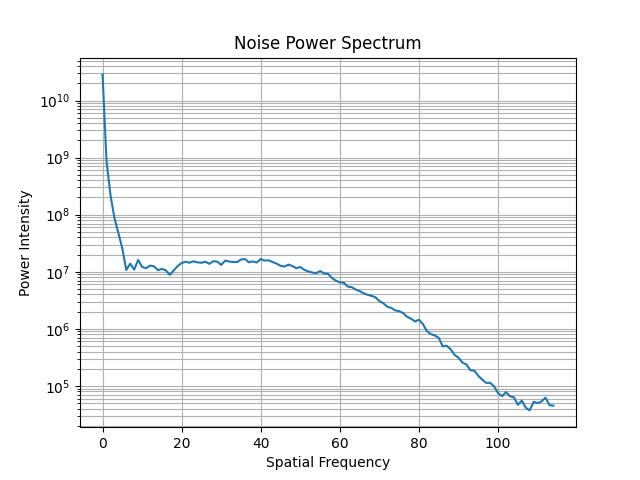

=======
CatPhan
=======

Overview
--------

.. automodule:: pylinac.ct
    :no-members:

Running the Demo
----------------

To run one of the CatPhan demos, create a script or start an interpreter and input:

.. plot::

    from pylinac import CatPhan504
    cbct = CatPhan504.run_demo()  # the demo is a Varian high quality head scan

Results will be also be printed to the console::

    - CatPhan 504 QA Test -
    HU Linearity ROIs: Air: -998.0, PMP: -200.0, LDPE: -102.0, Poly: -45.0, Acrylic: 115.0, Delrin: 340.0, Teflon: 997.0
    HU Passed?: True
    Low contrast visibility: 3.46
    Geometric Line Average (mm): 49.95
    Geometry Passed?: True
    Measured Slice Thickness (mm): 2.499
    Slice Thickness Passed? True
    Uniformity ROIs: Top: 6.0, Right: -1.0, Bottom: 5.0, Left: 10.0, Center: 14.0
    Uniformity index: -1.479
    Integral non-uniformity: 0.0075
    Uniformity Passed?: True
    MTF 50% (lp/mm): 0.56
    Low contrast ROIs "seen": 3

As well, you can plot and save individual pieces of the analysis such as linearity:

.. plot::
    :include-source: false

    from pylinac import CatPhan504

    cbct = CatPhan504.from_demo_images()
    cbct.analyze()
    cbct.plot_analyzed_subimage('linearity')

Or the rMTF:

.. code-block:: python

    cbct.plot_analyzed_subimage("rmtf")

.. plot::
    :include-source: false

    from pylinac import CatPhan504

    cbct = CatPhan504.from_demo_images()
    cbct.analyze()
    cbct.plot_analyzed_subimage('rmtf')

Or generate a PDF report:

.. code-block:: python

    cbct.publish_pdf("mycbct.pdf")

Image Acquisition
-----------------

Acquiring a scan of a CatPhan has a few simple requirements:

#. The field of view must be larger than the phantom diameter + a few cm for clearance.
#. The phantom should not be touching any edge of the FOV.
#. The phantom shouldn't touch the couch or other high-HU objects. This may cause
   localization issues finding the phantom. If the phantom doesn't have an associated cradle,
   setting it on foam or something similar is recommended.
#. All modules must be visible.

   .. warning::

        This can cause strange results if not all modules are scanned. Furthermore, aligning axially to the white dots
        on the side of the catphan will not catch the inferior modules on a typical CBCT scan. We suggest
        aligning to the center of the HU module (the module inferior to the white dots) when acquiring via CBCT.

Typical Use
-----------

CatPhan analysis as done by this module closely follows what is specified in the CatPhan manuals, replacing the need for manual measurements.
There are 4 CatPhan models that pylinac can analyze: :class:`~pylinac.ct.CatPhan504`, :class:`~pylinac.ct.CatPhan503`, & :class:`~pylinac.ct.CatPhan600`, &
:class:`~pylinac.ct.CatPhan604`, each with their own class in
pylinac. Let's assume you have the CatPhan504 for this example. Using the other models/classes is exactly
the same except the class name.

.. code-block:: python

    from pylinac import CatPhan504  # or import the CatPhan503 or CatPhan600

The minimum needed to get going is to:

* **Load images** -- Loading the DICOM images into your CatPhan object is done by passing the images in during construction.
  The most direct way is to pass in the directory where the images are:

  .. code-block:: python

    cbct_folder = r"C:/QA Folder/CBCT/June monthly"
    mycbct = CatPhan504(cbct_folder)

  or load a zip file of the images:

  .. code-block:: python

    zip_file = r"C:/QA Folder/CBCT/June monthly.zip"
    mycbct = CatPhan504.from_zip(zip_file)

  You can also use the demo images provided:

  .. code-block:: python

    mycbct = CatPhan504.from_demo_images()

* **Analyze the images** -- Once the folder/images are loaded, tell pylinac to start analyzing the images. See the
  Algorithm section for details and :meth:`~pylinac.ct.CatPhan504.analyze`` for analysis options:

  .. code-block:: python

    mycbct.analyze()

* **View the results** -- The CatPhan module can print out the summary of results to the console as well as draw a matplotlib image to show where the
  samples were taken and their values:

  .. code-block:: python

      # print results to the console
      print(mycbct.results())
      # view analyzed images
      mycbct.plot_analyzed_image()
      # save the image
      mycbct.save_analyzed_image("mycatphan504.png")
      # generate PDF
      mycbct.publish_pdf(
          "mycatphan.pdf", open_file=True
      )  # open the PDF after saving as well.

.. _custom-hu-values:

Custom HU values
----------------

.. versionadded:: 3.16

By default, expected HU values are drawn from the values stated in the :ref:`manual <cbct_density_list>`.
It's possible to override one or more of the HU values of the CatPhan modules however. This is useful if you have a custom CatPhan or
know the exact HU values of your phantom. To do so, pass in a dictionary of the HU values to the ``expected_hu_values`` parameter.
The keys should be the name of the material and the values should be the HU value.

.. code-block:: python

    from pylinac import CatPhan504

    # overrides the HU values of the Air and PMP regions
    mycbct = CatPhan504(...)
    mycbct.analyze(..., expected_hu_values={"Air": -999, "PMP": -203})
    mycbct.plot_analyzed_image()

.. note::

  Not all materials need to be overridden. Only the ones you want to override need to be passed in.

Keys
^^^^

The keys to override for CatPhan504 and CatPhan503 are listed below along with the default value:

* ``Air: -1000``
* ``PMP: -196``
* ``LDPE: -104``
* ``Poly: -47``
* ``Acrylic: 115``
* ``Delrin: 365``
* ``Teflon: 1000``

The CatPhan600 has the above keys as well as:

* ``Vial: 0``

The CatPhan604 has the original keys as well as:

* ``50% Bone: 725``
* ``20% Bone: 237``

.. _slice-thickness:

Slice Thickness
---------------

.. versionadded:: 3.12

When measuring slice thickness in pylinac, slices are sometimes combined depending on the slice thickness.
Scans with thin slices and low mAs can have very noisy wire ramp measurements. To compensate for this,
pylinac will average over 3 slices (+/-1 from CTP404) if the slice thickness is <3.5mm. This will generally improve the statistics
of the measurement. This is the only part of the algorithm that may use more than one slice.

If you'd like to override this, you can do so by setting the padding (aka straddle) explicitly.
The straddle is the number of extra slices **on each side** of the HU module slice to use for slice thickness determination.
The default is ``auto``; set to an integer to explicitly use a certain amount of straddle slices. Typical
values are 0, 1, and 2. So, a value of 1 averages over 3 slices, 2 => 5 slices, 3 => 7 slices, etc.

.. note::

    This technique can be especially useful when your slices overlap.

.. code-block:: python

    from pylinac import CatPhan504  # applies to all catphans

    ct = CatPhan504(...)
    ct.analyze(..., thickness_slice_straddle=0)
    ...

.. _noise-power-spectrum:

Noise Power Spectrum
--------------------

.. versionadded:: 3.19

The noise power spectrum (NPS) is a measure of the noise in the image using FFTs.
It was added to comply with French regulations. It is calculated on
the uniformity module (CTP486). Pylinac will provide the most populous frequency and
the average power of the NPS.

.. code-block:: python

    from pylinac import CatPhan504

    ct = CatPhan504(...)
    ct.analyze(...)
    ct.ctp486.avg_noise_power
    ct.ctp486.max_noise_power_frequency
    # plot the NPS
    ct.ctp486.plot_noise_power_spectrum()

The resulting plot will look like so:

Advanced Use
------------

Using ``results_data``
^^^^^^^^^^^^^^^^^^^^^^

.. versionchanged:: 3.0

Using the catphan module in your own scripts? While the analysis results can be printed out,
if you intend on using them elsewhere (e.g. in an API), they can be accessed the easiest by using the :meth:`~pylinac.ct.CatphanBase.results_data` method
which returns a :class:`~pylinac.ct.CatPhanResult` instance.

.. note::
    While the pylinac tooling may change under the hood, this object should remain largely the same and/or expand.
    Thus, using this is more stable than accessing attrs directly.

Continuing from above:

.. code-block:: python

    data = mycbct.results_data()
    data.catphan_model
    data.ctp404.measured_slice_thickness_mm
    # and more

    # return as a dict
    data_dict = mycbct.results_data(as_dict=True)
    data_dict["ctp404"]["measured_slice_thickness_mm"]
    ...

Partial scans
^^^^^^^^^^^^^

While the default behavior of pylinac is to analyze all modules in the scan (in fact it will error out if they aren't),
the behavior can be customized. Pylinac **always** has to be aware of the CTP404 module as that's the reference slice
for everything else. Thus, if the 404 is not in the scan you're SOL. However, if one of the other modules is not present
you can remove or adjust its offset by subclassing and overloading the ``modules`` attr:

.. code-block:: python

    from pylinac import CatPhan504  # works for any of the other phantoms too
    from pylinac.ct import CTP515, CTP486

    class PartialCatPhan504(CatPhan504):
        modules = {
            CTP486: {"offset": -65},
            CTP515: {"offset": -30},
            # the CTP528 was omitted
        }

    ct = PartialCatPhan504.from_zip(...)  # use like normal

.. _cbct-mtf:

Examining rMTF
^^^^^^^^^^^^^^

The rMTF can be calculated ad hoc like so. Note that CTP528 must be present (see above):

.. code-block:: python

    ct = ...  # load a dataset like normal
    ct.analyze()
    ct.ctp528.mtf.relative_resolution(x=40)  # get the rMTF (lp/mm) at 40% resolution

Customizing module locations
^^^^^^^^^^^^^^^^^^^^^^^^^^^^

Similar to partial scans, to modify the module location(s), overload the ``modules`` attr and edit the ``offset`` value.
The value is in mm:

.. code-block:: python

    from pylinac import CatPhan504  # works for any of the other phantoms too
    from pylinac.ct import CTP515, CTP486, CTP528

    # create custom catphan with module locations
    class OffsetCatPhan504(CatPhan504):
        modules = {
            CTP486: {"offset": -60},  # normally -65
            CTP528: {"offset": 30},
            CTP515: {"offset": -25},  # normally -30
        }

    ct = OffsetCatPhan504.from_zip(...)  # use like normal

Customizing Modules
^^^^^^^^^^^^^^^^^^^

You can also customize modules themselves in v2.4+. Customization should always be done by subclassing an existing
module and overloading the attributes. Then, pass in the new custom module into the parent CatPhan class. The easiest
way to get started is copy the relevant attributes from the existing code.

As an example, let's override the angles of the ROIs for CTP404.

.. code-block:: python

    from pylinac.ct import CatPhan504, CTP404CP504

    # first, customize the module
    class CustomCTP404(CTP404CP504):
        roi_dist_mm = 58.7  # this is the default value; we repeat here because it's easy to copy from source
        roi_radius_mm = 5  # ditto
        roi_settings = {
            "Air": {
                "value": -1000,
                "angle": -93,  # changed 'angle' from -90 to -93
                "distance": roi_dist_mm,
                "radius": roi_radius_mm,
            },
            "PMP": {
                "value": -196,
                "angle": -122,  # changed 'angle' from -120 to -122
                "distance": roi_dist_mm,
                "radius": roi_radius_mm,
            },
            # add other ROIs as appropriate
        }

    # then, pass to the CatPhan model
    class CustomCP504(CatPhan504):
        modules = {
            CustomCTP404: {"offset": 0}
            # add other modules here as appropriate
        }

    # use like normal
    ct = CustomCP504(...)

.. warning:: If you overload the ``roi_settings`` or ``modules`` attributes, you are responsible for filling it out completely.
             I.e. when you overload it's not partial. In the above example if you want other CTP modules you **must** populate them.

Analysis Parameters
-------------------

This applies to the 503, 504, 600, and 604. Model-specific parameters are called out.

.. tab-set::
   :sync-group: usage

   .. tab-item:: pylinac
      :sync: pylinac

      See :meth:`~pylinac.ct.CatPhan604.analyze` for details.

   .. tab-item:: RadMachine
      :sync: radmachine

      * **HU Tolerance**: The tolerance for the HU linearity of the inserts.
      * **Scaling Tolerance**: The tolerance for the scaling of the phantom in mm. Uses the geometric nodes of the CTP404 module.
      * **Slice Thickness tolerance**: The tolerance for the slice thickness in mm. Uses the ramped wire.
      * **Slice thickness straddle**: The number of slices to combine when measuring slice thickness.If blank, will combine thin slices automatically.
        Combining slices gives a more robust evaluation of the measurement in noisy/thin-slice images.
      * **Minimum low contrast ROIs**: The minimum number of low contrast ROIs that must be "seen" to pass.
      * **Air HU**: The reference HU value of the air ROI.
      * **PMP HU**: The reference HU value of the PMP ROI.
      * **LDPE HU**: The reference HU value of the LDPE ROI.
      * **Poly HU**: The reference HU value of the Polystyrene ROI.
      * **Acrylic HU**: The reference HU value of the Acrylic ROI.
      * **Delrin HU**: The reference HU value of the Delrin ROI.
      * **Teflon HU**: The reference HU value of the Teflon ROI.
      * **Water Vial**: The reference HU value of the water vial ROI.

        .. note::

            Only applicable for the CatPhan 600

      * **Bone 20%**: The reference HU value of the 20% bone ROI.

        .. note::

            Only applicable for the CatPhan 604

     * **Bone 50%**: The reference HU value of the 50% bone ROI.

        .. note::

            Only applicable for the CatPhan 604

      * **Contrast definition**: The method used to calculate the contrast of the low contrast ROIs. See :ref:`contrast`.
      * **Low contrast detection threshold**: The threshold used to determine if a low contrast ROI was "seen". See :ref:`visibility`.

.. _cbct-algorithm:

Algorithm
---------

The CatPhan module is based on the tests and values given in the respective CatPhan manual. The algorithm works like such:

Allowances
^^^^^^^^^^

* The images can be any size.
* The phantom can have significant translation in all 3 directions.
* The phantom can have significant roll and moderate yaw and pitch.

Restrictions
^^^^^^^^^^^^

.. warning:: Analysis can fail or give unreliable results if any Restriction is violated.

* All of the modules defined in the ``modules`` attribute must be within the scan extent.
* Scan slices are not expected to overlap.

  .. warning::

    Overlapping slices are not generally a problem other than the slice thickness measurement. See
    the :ref:`slice-thickness` section for how to override this to get a valid slice thickness
    in such a situation.

.. _cbct_pre-analysis:

Pre-Analysis
^^^^^^^^^^^^

* **Determine image properties** -- Upon load, the image set is analyzed for its DICOM properties to determine mm/pixel
  spacing, rescale intercept and slope, manufacturer, etc.
* **Convert to HU** -- The entire image set is converted from its raw values to HU by applying the rescale intercept
  and slope which is contained in the DICOM properties.
* **Find the phantom z-location** -- Upon loading, all the images are scanned to determine where the HU linearity
  module (CTP404) is located. This is accomplished by examining each image slice and looking for 2 things:

  * **If the CatPhan is in the image.** At the edges of the scan this may not be true.
  * **If a circular profile has characteristics like the CTP404 module.** If the CatPhan is in the image, a circular profile is taken
    at the location where the HU linearity regions of interest are located. If the profile contains low, high, and lots of medium
    values then it is very likely the HU linearity module. All such slices are found and the median slice is set as the
    HU linearity module location. All other modules are located relative to this position.

Analysis
^^^^^^^^

* **Determine phantom roll** -- Precise knowledge of the ROIs to analyze is important, and small changes in rotation
  could invalidate automatic results. The roll of the phantom is determined by examining the HU module and converting to
  a binary image. The air holes are then located and the angle of the two holes determines the phantom roll.

  .. note::
        For each step below, the "module" analyzed is actually the mean, median, or maximum of 3 slices (+/-1 slice around and
        including the nominal slice) to ensure robust measurements. Also, for each step/phantom module, the phantom center is
        determined, which corrects for the phantom pitch and yaw.

        Additionally, values tend to be lazy (computed only when asked for), thus the calculations listed may sometimes
        be performed only when asked for.

.. _cbct_density_list:

* **Determine HU linearity** -- The HU module (CTP404) contains several materials with different HU values. Using
  hardcoded angles (corrected for roll) and radius from the center of the phantom, circular ROIs are sampled which
  correspond to the HU material regions. The median pixel value of the ROI is the stated HU value. Nominal HU values
  are taken as the mean of the range given in the manual(s):

  .. note:: As of v3.16, these can be overriden: :ref:`custom-hu-values`.

  .. image:: images/catphan_densities.png

* **Determine HU uniformity** -- HU uniformity (CTP486) is calculated in a similar manner to HU linearity, but
  within the CTP486 module/slice.
* **Calculate Geometry/Scaling** -- The HU module (CTP404), besides HU materials, also contains several "nodes" which
  have an accurate spacing (50 mm apart). Again, using hardcoded but corrected angles, the area around the 4 nodes are
  sampled and then a threshold is applied which identifies the node within the ROI sample. The center of mass of the node is
  determined and then the space between nodes is calculated.
* **Calculate Spatial Resolution/MTF** -- The Spatial Resolution module (CTP528) contains 21 pairs of aluminum bars
  having varying thickness, which also corresponds to the thickness between the bars. One unique advantage of these
  bars is that they are all focused on and equally distant to the phantom center. This is taken advantage of by extracting
  a :class:`~pylinac.core.profile.CollapsedCircleProfile` about the line pairs. The peaks and valleys of the profile are located;
  peaks and valleys of each line pair are used to calculated the MTF. The relative MTF (i.e. normalized to the first line pair) is then
  calculated from these values. See :ref:`mtf_topic`.
* **Calculate Low Contrast Resolution** -- Low contrast is inherently difficult to determine since detectability of humans
  is not simply contrast based. Pylinac's analysis uses both the contrast value of the ROI as well as the ROI size to compute
  a "detectability" score. ROIs above the score are said to be "seen", while those below are not seen. Only the 1.0% supra-slice ROIs
  are examined. Two background ROIs are sampled on either side of the ROI contrast set. See :ref:`visibility` for equation details.
* **Calculate Slice Thickness** -- Slice thickness is measured by determining the FWHM of the wire ramps in the CTP404 module.
  A profile of the area around each wire ramp is taken, and the FWHM is determined from the profile.
  The profiles are averaged and the value is converted from pixels to mm and multiplied by 0.42 (Catphan manual "Scan Slice Geometry" section).
  Also see :ref:`slice-thickness`.

Post-Analysis
^^^^^^^^^^^^^

* **Test if values are within tolerance** -- For each module, the determined values are compared with the nominal values.
  If the difference between the two is below the specified tolerance then the module passes.

Interpreting Results
--------------------

The results of a CatPhan analysis in RadMachine or from ``results_data`` are:

* ``catphan_model``: The model of CatPhan that was analyzed.
* ``catphan_roll_deg``: The roll of the phantom in degrees.
* ``origin_slice``: The "origin" slice number. For CatPhan, this is the center of the HU module.
* ``num_images``: The number of images in the passed dataset.
* ``ctp404``: The results of the CTP404 module (HU linearity, spacing) with the following items:

  * ``offset``: The offset of the module from the origin slice in mm.
  * ``low_contrast_visibility``: The low contrast visibility score.
  * ``thickness_passed``: Whether the slice thickness passed.
  * ``measured_slice_thickness_mm``: The measured slice thickness in mm.
  * ``thickness_num_slices_combined``: The number of slices combined when measuring slice thickness.
  * ``geometry_passed``: Whether the geometry test passed, using the 4 nodes.
  * ``avg_line_distance_mm``: The average distance between the 4 nodes in mm.
  * ``line_distances_mm``: A list of the individual distances between nodes.
  * ``hu_linearity_passed``: Whether all the HU ROIs were within tolerance.
  * ``hu_tolerance``: The tolerance used for the HU linearity test.
  * ``hu_rois``: A dictionary of the HU ROIs and their values. The keys will be the material
    name such as ``Acrylic``. The values for each ROI will be a dictionary with the following keys:

    * ``name``: The name of the material.
    * ``value``: The measured HU value.
    * ``nominal_value``: The nominal HU value.
    * ``passed``: Whether the ROI passed.
    * ``stdev``: The pixel value standard deviation of the ROI.
    * ``difference``: The difference between the measured and nominal values.

* ``ctp486``: The results of the CTP486 module (HU uniformity) with the following items:

  * ``uniformity_index``: The uniformity index as defined in Equation 2 of `Elstrom et al <https://www.tandfonline.com/doi/pdf/10.3109/0284186X.2011.590525>`__.
  * ``integral_non_uniformity``: The integral non-uniformity as defined in Equation 1 of `Elstrom et al <https://www.tandfonline.com/doi/pdf/10.3109/0284186X.2011.590525>`__.
  * ``nps_avg_power``: The average power of the noise power spectrum. See :ref:`nps`.
  * ``nps_max_freq``: The most populous frequency of the noise power spectrum.
  * ``passed``: Whether the uniformity test passed.
  * ``rois``: A dictionary of the uniformity ROIs and their values. The keys will be the region
    name such as ``Top``. The values for each ROI will be a dictionary with the following keys:

    * ``name``: The region the ROI was sampled from.
    * ``value``: The measured HU value.
    * ``nominal_value``: The nominal HU value.
    * ``passed``: Whether the ROI passed.
    * ``stdev``: The pixel value standard deviation of the ROI.
    * ``difference``: The difference between the measured and nominal values.

* ``ctp528``: A dictionary of results for the CTP528 (spatial resolution) module with the
  following items:

  * ``start_angle_radians``: The angle where the circular profile started.
  * ``mtf_lp_mm``: A dictionary from 10% to 90% resolution in steps of 10 of the MTF in lp/mm. E.g. ``'20': 0.748``.
    To get the MTF at a specific resolution see :ref:`cbct-mtf`.
  * ``roi_settings``: A dictionary of the settings used for each MTF ROI. The key names are ``region_<n>``
    where ``<n>`` is the region number. The values are a dictionary with the following keys:

    * ``start``: The start angle of the ROI in degrees relative to the ``start_angle_radians`` setting.
    * ``end``: The end angle of the ROI in degrees relative to the ``start_angle_radians`` setting.
    * ``num peaks``: The number of peaks found in the profile.
    * ``num valleys``: The number of valleys found in the profile.
    * ``peak spacing``: The spacing between peaks in pixels.
    * ``gap size (cm)``: The size of the gap between the bars in cm.
    * ``lp/mm``: The number of line **pairs** per mm.

* ``ctp515``: A dictionary of results for the CTP515 (Low contrast) module with the following items:

  * ``cnr_threshold``: The contrast-to-noise ratio threshold used to determine if a low contrast ROI was "seen".
  * ``num_rois_seen``: The number of ROIs that were above the threshold; ie. "seen".
  * ``roi_settings``: A dictionary of the settings used for each low contrast ROI. The key names are ``n``
    where ``<n>`` is the size of the ROI. The values are a dictionary with the following keys:

    * ``angle``: The angle of the ROI in degrees.
    * ``distance``: The distance from the phantom center in mm.
    * ``radius``: The radius of the ROI in mm.
    * ``distance_pixels``: The distance from the phantom center in pixels.
    * ``angle_corrected``: The angle of the ROI corrected for phantom roll.
    * ``radius_pixels``: The radius of the ROI in pixels.

  * ``roi_results``: A dictionary of the low contrast ROIs and their values. The keys will be the size
    of the ROI such as ``'9'``. The values for each ROI will be a dictionary with the following keys:

    * ``contrast method``: The method used to calculate the contrast. See :ref:`contrast`.
    * ``visibility``: The visibility score of the ROI.
    * ``visibility threshold``: The threshold used to determine if the ROI was "seen".
    * ``passed visibility``: Whether the ROI was "seen".
    * ``contrast``: The contrast of the ROI.
    * ``cnr``: The contrast-to-noise ratio of the ROI.
    * ``signal to noise``: The signal-to-noise ratio of the ROI.

Troubleshooting
---------------

First, check the general :ref:`general_troubleshooting` section.
Most problems in this module revolve around getting the data loaded.

* If you're having trouble getting your dataset in, make sure you're loading the whole dataset.
  Also make sure you've scanned the whole phantom.
* Make sure there are no external markers on the CatPhan (e.g. BBs), otherwise the localization
  algorithm will not be able to properly locate the phantom within the image.
* Ensure that the FOV is large enough to encompass the entire phantom. If the scan is cutting off the phantom
  in any way it will not identify it.
* The phantom should never touch the edge of an image, see above point.
* Make sure you're loading the right CatPhan class. I.e. using a CatPhan600 class on a CatPhan504
  scan may result in errors or erroneous results.

API Documentation
-----------------

Main classes
^^^^^^^^^^^^

These are the classes a typical user may interface with.

.. autoclass:: pylinac.ct.CatPhan504
    :inherited-members:
    :members:

.. autoclass:: pylinac.ct.CatPhan503
    :inherited-members:
    :members:

.. autoclass:: pylinac.ct.CatPhan600
    :inherited-members:
    :members:

.. autoclass:: pylinac.ct.CatPhan604
    :inherited-members:
    :members:

.. autoclass:: pylinac.ct.CatphanResult
    :members:

.. autoclass:: pylinac.ct.CTP404Result
    :members:

.. autoclass:: pylinac.ct.CTP528Result
    :members:

.. autoclass:: pylinac.ct.CTP515Result
    :members:

.. autoclass:: pylinac.ct.CTP486Result
    :members:

.. autoclass:: pylinac.ct.ROIResult
    :members:

Module classes (CTP404, etc)
^^^^^^^^^^^^^^^^^^^^^^^^^^^^

.. autoclass:: pylinac.ct.Slice
    :members:

.. autoclass:: pylinac.ct.CatPhanModule
    :members:

.. autoclass:: pylinac.ct.CTP404CP503
    :members:

.. autoclass:: pylinac.ct.CTP404CP504
    :members:

.. autoclass:: pylinac.ct.CTP404CP600
    :members:

.. autoclass:: pylinac.ct.CTP404CP604
    :members:

.. autoclass:: pylinac.ct.CTP528CP503
    :members:

.. autoclass:: pylinac.ct.CTP528CP504
    :members:

.. autoclass:: pylinac.ct.CTP528CP600
    :members:

.. autoclass:: pylinac.ct.CTP528CP604
    :members:

.. autoclass:: pylinac.ct.CTP515
    :members:

.. autoclass:: pylinac.ct.CTP486
    :members:

ROI Objects
^^^^^^^^^^^

.. autoclass:: pylinac.ct.HUDiskROI
    :members:

.. autoclass:: pylinac.ct.ThicknessROI
    :members:

.. autoclass:: pylinac.ct.GeometricLine
    :members:

Helper Functions
^^^^^^^^^^^^^^^^

.. autofunction:: combine_surrounding_slices

.. autofunction:: get_regions
