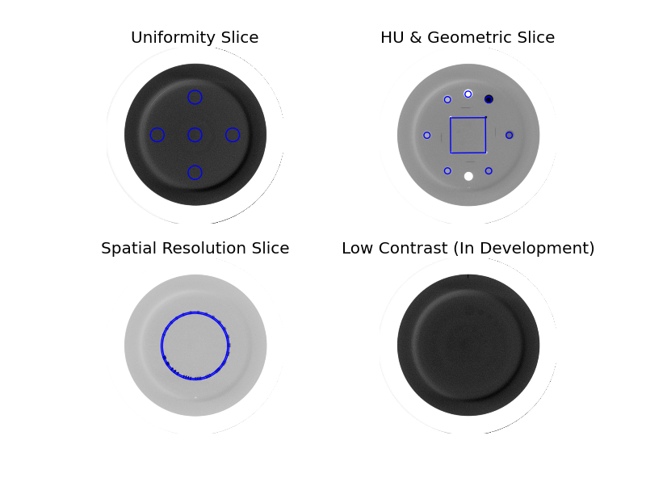

=========================
CBCT module documentation
=========================

Overview
--------

.. automodule:: pylinac.cbct
    :no-members:

Running the Demo
----------------

To run the CBCT demo, create a script or start in interpreter and input::

    from pylinac import CBCT
    CBCT().run_demo() # the demo is a Varian high quality head scan

Results will be printed to the console and a figure showing the slices analyzed will pop up::

    - CBCT QA Test -
    HU Regions: {'LDPE': -102.66666666666667, 'Acrylic': 117.33333333333333, 'Air': -998.66666666666663, 'Teflon': 998.66666666666663, 'Poly': -45.333333333333336, 'PMP': -200.0, 'Delrin': 342.33333333333331}
    HU Passed?: True
    Uniformity: {'Right': 0.0, 'Top': 4.666666666666667, 'Left': 10.666666666666666, 'Center': 16.333333333333332, 'Bottom': 5.333333333333333}
    Uniformity Passed?: True
    MTF 80% (lp/mm): 0.76
    Geometric Line Average (mm): 49.93901922841176
    Geometry Passed?: True
    Low Contrast ROIs visible: 4
    Low Contrast Passed? True
    Slice Thickness (mm): 2.4705078124999997
    Slice Thickeness Passed? True

As well, you can plot and save individual pieces of the analysis::

    cbct = CBCT.from_demo_images()
    cbct.analyze()
    cbct.plot_analyzed_subimage('linearity')
    cbct.save_analyzed_subimage('linearity.png', subimage='linearity')

.. raw:: html
    :file: images/cbct_hu_lin.html

Or::

    cbct.plot_analyzed_subimage('rmtf')

.. raw:: html
    :file: images/cbct_rmtf.html

Typical Use
-----------

CBCT analysis as done by this module closely follows what is specified in the CatPhan manuals, replacing the need for manual measurements.
First, import the class::

    from pylinac import CBCT

The minimum needed to get going is to:

* **Load images** -- Loading the DICOM images into your CBCT object can be done by passing the folder the images are located in.
  This can be done directly, or by using a UI. The code might look like any of the following::

    # set the folder path
    cbct_folder = r"C:/QA Folder/CBCT/June monthly"  # use of 'r' is for raw string; otherwise spaces and backslashes aren't interpreted properly
    # load the images from the folder path
    mycbct = CBCT(cbct_folder)

  or load a zip file of the images::

    zip_file = r"C:/QA Folder/CBCT/June monthly.zip"
    mycbct = CBCT.from_zip_file(zip_file)

  or using a dialog box::

    # Identify the folder using a UI
    mycbct = CBCT.from_folder_UI()

  .. note::
    In previous versions of pylinac, loading images was instance-method based, meaning loading looked like the following::

        mycbct = CBCT()
        mycbct.load_zip_file('cbcts.zip')

    This behavior has been deprecated in favor of class-method constructors (``CBCT.from_X``). The reason for this is that
    certain actions should only be allowed until after the images are loaded. Furthermore, loading the images should always be
    the first action of the analysis sequence. By using class constructors, certain pitfalls and errors can be avoided.
    Don't worry though, the old behavior still works.

* **Analyze the images** -- Once the folder/images are loaded, tell CBCT to start analyzing the images. See the
  Algorithm section for details on how this is done::

    mycbct.analyze()

* **View the results** -- The CBCT module can print out the summary of results to the console as well as draw a matplotlib image to show where the
  samples were taken and their values::

      # print results to the console
      print(mycbct.return_results())
      # view analyzed images
      mycbct.plot_analyzed_image()
      # save the image
      mycbct.save_analyzed_image('mycbct.png')

Algorithm
---------

The CBCT module is based on the tests and values given in the CatPhan 504 Manual. The algorithm works like such:

**Allowances**

* The images can be any size.
* The phantom can have significant translation in all 3 directions.
* The phantom can have significant roll and moderate yaw and pitch.

**Restrictions**

    .. warning:: Analysis can fail or give unreliable results if any Restriction is violated.

* The phantom used must be an unmodified CatPhan 504.
* All 4 of the relevant modules must be within the scan extent; i.e. one can't scan only part of the phantom.

**Pre-Analysis**

* **Determine image properties** -- Upon load, the image set is analyzed for its DICOM properties to determine mm/pixel
  spacing, rescale intercept and slope, manufacturer, etc.
* **Convert to HU** -- The entire image set is converted from its raw values to HU by applying the rescale intercept
  and slope which is contained in the DICOM properties.
* **Find the phantom z-location** -- Upon loading, all the images are scanned to determine where the HU linearity
  module (CTP404) is located. This is accomplished by examining each image slice and looking for 2 things:

    * *If the CatPhan is in the image.* At the edges of the scan this may not be true.
    * *If a circular profile has characteristics like the CTP404 module*. If the CatPhan is in the image, a circular profile is taken
      at the location where the HU linearity regions of interest are located. If the profile contains low, high, and lots of medium
      values then it is very likely the HU linearity module. All such slices are found and the median slice is set as the
      HU linearity module location. All other modules are located relative to this position.

**Analysis**

* **Determine phantom roll** -- Precise knowledge of the ROIs to analyze is important, and small changes in rotation
  could invalidate automatic results. The roll of the phantom is determined by examining the HU module and converting to
  a binary image. The air holes are then located and the angle of the two holes determines the phantom roll.

  .. note::
        For each step below, the "module" analyzed is actually the mean, median, or maximum of 3 slices (+/-1 slice around and
        including the nominal slice) to ensure robust measurements. Also, for each step/phantom module, the phantom center is
        determined, which corrects for the phantom pitch and yaw.

        Additionally, values tend to be lazy (computed only when asked for), thus the calculations listed may sometimes
        be performed only when asked for.

* **Determine HU linearity** -- The HU module (CTP404) contains several materials with different HU values. Using
  hardcoded angles (corrected for roll) and radius from the center of the phantom, circular ROIs are sampled which
  correspond to the HU material regions. The mean pixel value of the ROI is the stated HU value.
* **Determine HU uniformity** -- HU uniformity (CTP486) is calculated in a similar manner to HU linearity, but
  within the CTP486 module/slice.
* **Calculate Geometry/Scaling** -- The HU module (CTP404), besides HU materials, also contains several "nodes" which
  have an accurate spacing (50 mm apart). Again, using hardcoded but corrected angles, the area around the 4 nodes are
  sampled and then a threshold is applied which identifies the node within the ROI sample. The center of mass of the node is
  determined and then the space between nodes is calculated.
* **Calculate Spatial Resolution/MTF** -- The Spatial Resolution module (CTP528) contains 21 pairs of aluminum bars
  having varying thickness, which also corresponds to the thickness between the bars. One unique advantage of these
  bars is that they are all focused on and equally distant to the phantom center. This is taken advantage of by extracting
  a :class:`~pylinac.core.profile.CollapsedCircleProfile` about the line pairs. The peaks and valleys of the profile are located;
  peaks and valleys of each line pair are used to calculated the MTF. The relative MTF (i.e. normalized to the first line pair) is then
  calculated from these values.
* **Calculate Low Contrast Resolution** -- Low contrast is inherently difficult to determine since detectability of humans
  is not simply contrast based. Pylinac's analysis uses both the contrast value of the ROI as well as the ROI size to compute
  a "detectability" score. ROIs above the score are said to be "seen", while those below are not seen. Only the 1.0% supra-slice ROIs
  are examined. Two background ROIs are sampled on either side of the ROI contrast set. The score for a given ROI is
  calculated like so :math:`\frac{ROI_{pixel} - background}{ROI_{stdev}} * ROI_{diameter}`, where :math:`ROI_{pixel}` is the
  mean pixel value of the ROI, :math:`background` is the mean pixel value of the two background ROIs, and :math:`ROI_{diameter}`
  is the diamter of the ROI in mm. The default detectability score is 10.
* **Calculate Slice Thickness** -- Slice thickness is measured by determining the FWHM of the wire ramps in the CTP404 module.
  A profile of the area around each wire ramp is taken, and the FWHM is determined from the profile. Based on testing, the FWHM
  is not always perfectly detected and may not "catch" the profile, giving an undervalued representation. Thus, the
  two longest profiles are averaged and the value is converted from pixels to mm and multiplied by 0.42.

**Post-Analysis**

* **Test if values are within tolerance** -- For each module, the determined values are compared with the nominal values.
  If the difference between the two is below the specified tolerance then the module passes.

Troubleshooting
---------------

First, check the general :ref:`general_troubleshooting` section.
Most problems in this module revolve around getting the data loaded.

* If you're having trouble getting your dataset in, make sure you're loading the whole dataset.
  Also make sure you've scanned the whole phantom.

API Documentation
-----------------

The CBCT class uses several other classes. There are several Slices of Interest (SOI), most of which contain Regions of Interest (ROI).

.. autoclass:: pylinac.cbct.CBCT

Supporting Data Structure

.. autoclass:: pylinac.cbct.Settings

Slice Objects

.. autoclass:: pylinac.cbct.Slice

.. autoclass:: pylinac.cbct.HUSlice

.. autoclass:: pylinac.cbct.UniformitySlice

.. autoclass:: pylinac.cbct.GeometrySlice

.. autoclass:: pylinac.cbct.SpatialResolutionSlice

.. autoclass:: pylinac.cbct.LowContrastSlice

.. autoclass:: pylinac.cbct.ThicknessSlice

ROI Objects

.. autoclass:: pylinac.cbct.ROIManagerMixin

.. autoclass:: pylinac.cbct.DiskROI

.. autoclass:: pylinac.cbct.HUDiskROI

.. autoclass:: pylinac.cbct.GeoDiskROI

.. autoclass:: pylinac.cbct.LowContrastDiskROI

.. autoclass:: pylinac.cbct.RectangleROI

.. autoclass:: pylinac.cbct.ThicknessROI

.. autoclass:: pylinac.cbct.GeometricLine
