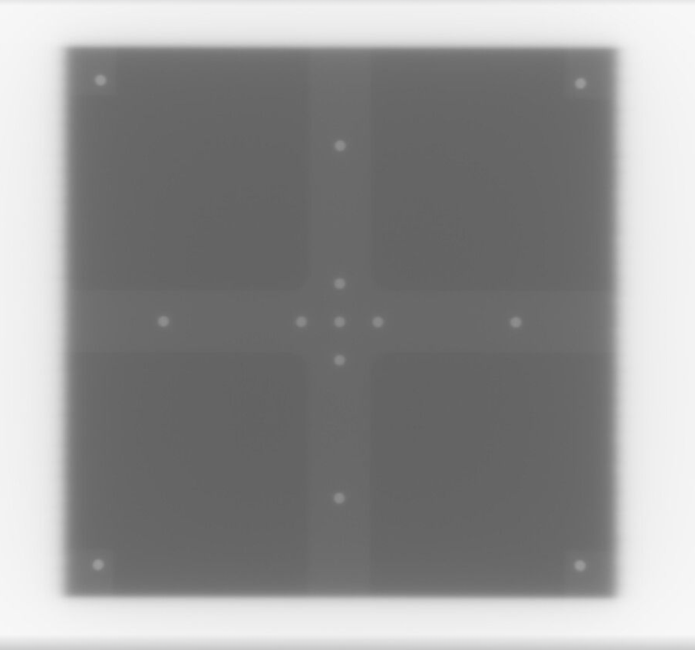
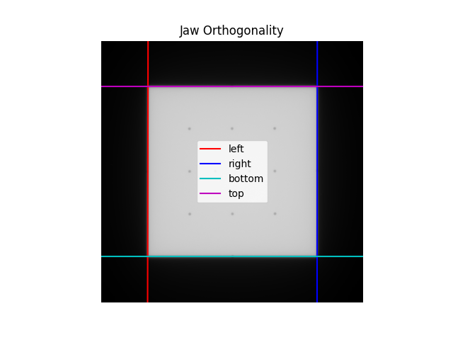

.. _contrib:

========
One-Offs
========

Over time, many people have asked for analyses or
changes that are not part of the core library.
The philosophy of pylinac has always been to provide modules
that match widely-used phantoms and protocols. That hasn't
changed. However, there are many one-off analyses that
might be useful to a small subset of users. This has occurred
several times with RadMachine users. The code is useful
enough that it should be shared, but not useful enough to
be included in the core library. Thus, the ``contrib`` module.

.. warning::

  This module might not be tested. It is not guaranteed to work. It may break in future versions.
  I (James) cannot guarantee support for it. It does not have comprehensive documentation. It is provided as-is.

Quasar eQA
==========

Use Case
--------

The customer has a special light/rad phantom with disk jigs that are set at the edge of the light field corners.
The BBs are offset by 11 mm from the corners. There is also a set of BBs in the center of the field used for scaling.

The field sizes used by the clinic are 6x6 and 18x18cm. The customer wants to use the center BBs for scaling
and the corner BBs for the light field.

Example image:

Usage
-----

.. code-block:: python

  from pylinac.contrib.quasar import QuasarLightRadScaling

  path = r"C:\path\to\image.dcm"
  q = QuasarLightRadScaling(path)
  q.analyze()
  q.plot_analyzed_image()
  print(q.results())

.. autoclass:: pylinac.contrib.quasar.QuasarLightRadScaling
   :members:

Jaw Orthogonality
=================

Use Case
--------

French sites desired a way to test the jaw orthogonality of their linacs. This uses a standard open field.

Usage
-----

.. code-block:: python

  from pylinac.contrib.orthogonality import JawOrthogonality

  p = r"C:\path\to\image.dcm"
  j = JawOrthogonality(p)
  j.analyze()
  print(j.results())
  j.plot_analyzed_image()

Which will produce an image like so:

.. autoclass:: pylinac.contrib.orthogonality.JawOrthogonality
   :members:
