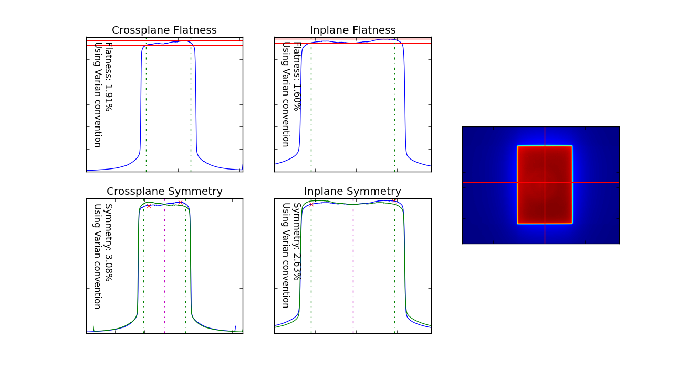
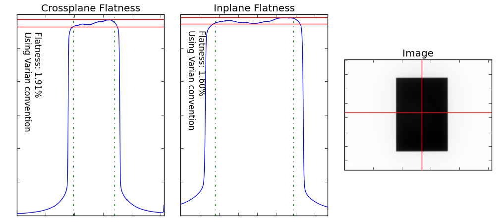

======================================
Flatness/Symmetry module documentation
======================================

Overview
--------

The Flatness & Symmetry module (``flatsym``) allows a physicist to check their linac's beam profile
against well-known flatness/symmetry calculation standards, reporting absolute values. Film or EPID images
can be loaded in and analyzed.

Running the Demo
----------------

To run the demo of the ``flatsym`` module, import the main class from it and run the demo method::

    from pylinac.flatsym import BeamImage

    my_img = BeamImage()
    my_img.run_demo()

Which will result in the following plot:

Typical Use
-----------

In most instances, a physicist is interested in quickly calculating the flatness, symmetry, or both of the
image in question. The ``flatsym`` module allows you to do this easily, using any of multiple definitions of flatness
or symmetry.

To get started, import the ``BeamImage`` class from the ``flatsym`` module::

    from pylinac.flatsym import BeamImage

Loading images is easy and just like any other module::

    # from a file
    my_file = r"C:/my/QA/folder/img.dcm"
    my_img = BeamImage(my_file)

    # or using a UI
    my_img = BeamImage.open_UI()

You can calculate the flatness or symmetry directly, e.g.::

    my_img.flatness()
    1.91  # or whatever it is
    my_img.symmetry()
    3.08

Any physicist worth their salt will want to check that the right profile has been taken however.
This is easily done with similar methods::

    my_img.plot_flatness()

Default behavior is to analyze both planes at the calculated center of the field, but other options exist:

* Individual planes can be analyzed instead of both.
* The position of the profile can be directly passed.
* Multiple :ref:`analysis_definitions` exist.

.. seealso:: :meth:`~pylinac.flatsym.BeamImage.run_demo` parameter info for more details

.. _analysis_definitions:

Analysis Definitions
--------------------

.. warning:: The following definitions are for **photons** only.

There are multiple definitions for both flatness and symmetry. Your machine vendor uses certain equations,
or your clinic may use a specific definition. Pylinac has a number of built-in definitions which you can use.

Symmetry:

* -- Name, Vendors that use it -- Equation
* -- **Point Difference, Varian** -- :math:`100 * max(|L_{pt} - R_{pt}|)/ D_{CAX}` over 80%FW, where L_pt and R_pt are equal distance from CAX.
* -- **Point Difference Quotient (IEC), Elekta** -- :math:`100 * max(|L_{pt}/R_{pt}|, |R_{pt}/L_{pt}|)` over 80%FW if 10<FW<30cm [#elekta]_.

Flatness

* -- Name, Vendors that use it -- Equation
* -- **Variation over mean (80%), Varian** -- :math:`100 * |D_{max} - D_{min}| / (D_{max} + D_{min})` within 80%FW.
* -- **Dmax/Dmin (IEC), Elekta** -- :math:`100 * D_{max}/D_{min}` within 80%FW for 10<FW<30cm [#elekta]_.

.. note:: Siemens and other definitions (e.g. Area, Area/2) will be added if the community `asks <https://github.com/jrkerns/pylinac/issues>`_ for it.

.. [#elekta] The region calculated over actually varies by the following: for 5<FW<10cm, FW - 2*1cm; for 10<FW<30cm, FW - 2*0.1*FW (i.e. 80%FW); for 30cm<FW, FW - 2*6cm. Pylinac currently only uses the 80%FW no matter the FW.

API Documentation
-----------------

.. autoclass:: pylinac.flatsym.BeamImage
    :no-show-inheritance:

