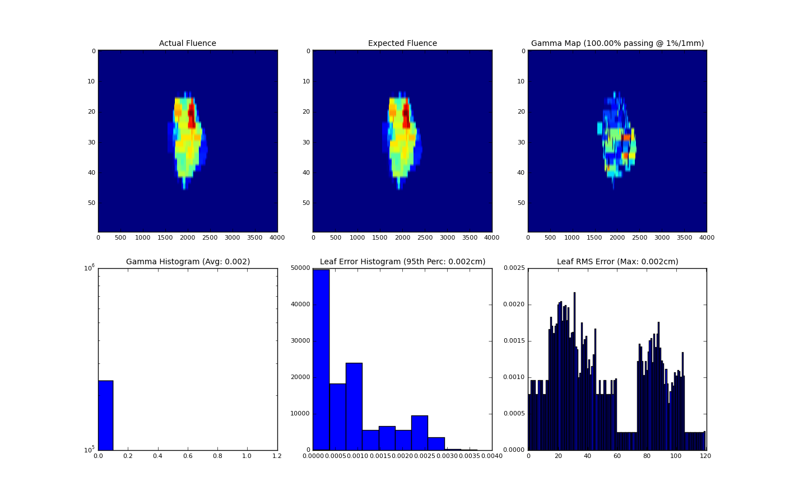
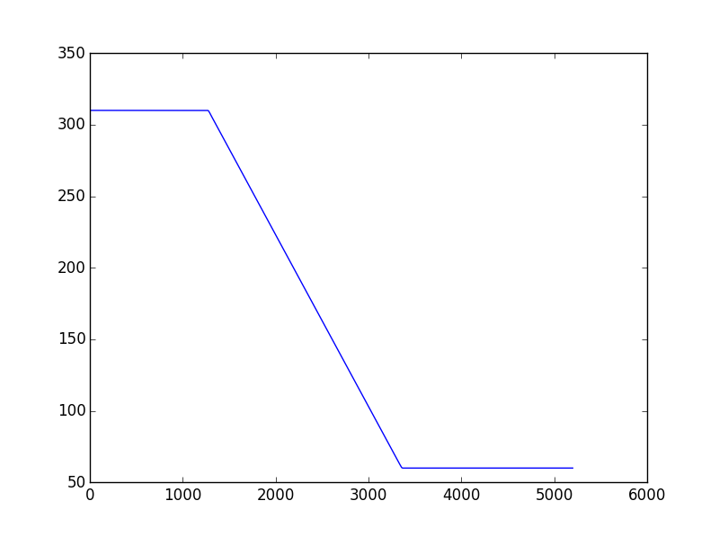
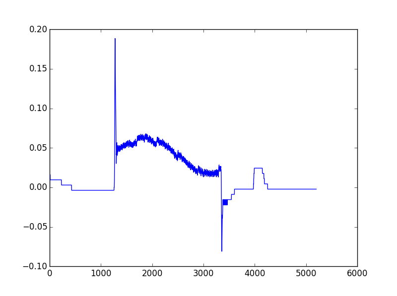
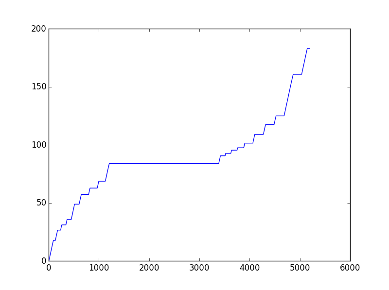
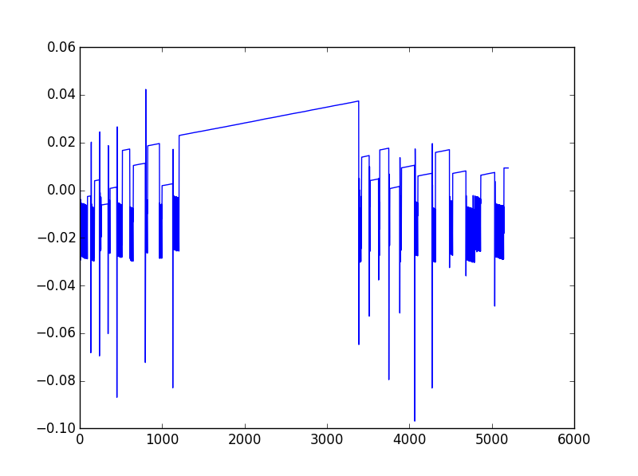
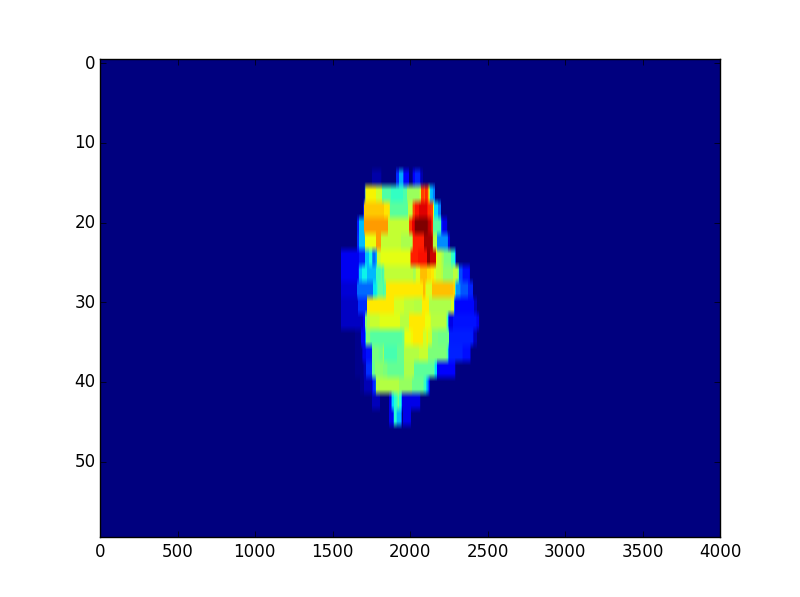
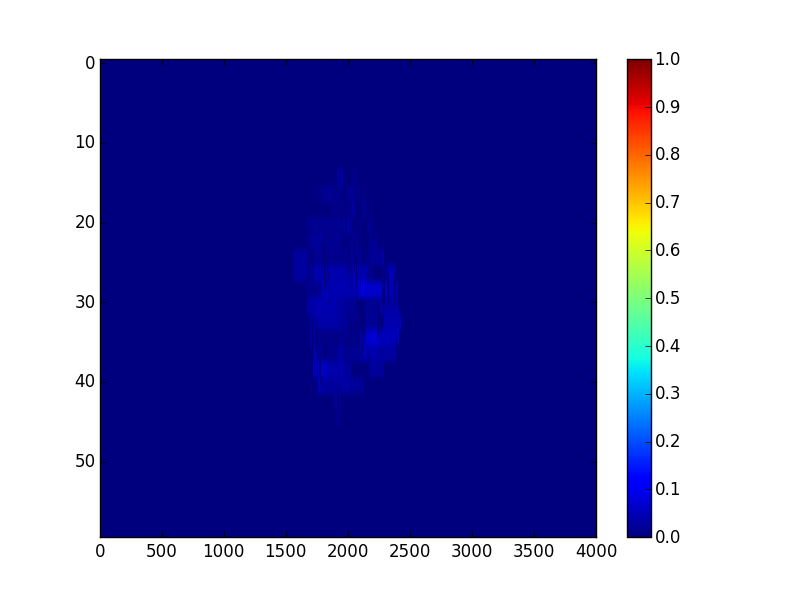

.. _log_analyzer_module:

=================================
Log Analyzer module documentation
=================================

Overview
--------

.. automodule:: pylinac.log_analyzer
    :no-members:

.. _log_concepts:

Concepts
--------

Because the ``log_analyzer`` module functions without an end goal, the data has been formatted for easy exploration. However, there are a
few concepts that should be grasped before diving in.

* **Log Sections** - Upon log parsing, all data is placed into data structures. Varian has designated 4 sections for Trajectory logs:
  *Header*, *Axis Data*, *Subbeams*, and *CRC*. The *Subbeams* are only applicable for auto-sequenced beams, and the *CRC* is specific to
  the Trajectory log. The *Header* and *Axis Data* however, are common to both Trajectory logs and Dynalogs.

   .. note::
    Dynalogs do not have explicit sections like the Trajectory logs,
    but pylinac formats them to have these two data structures for consistency.

* **Leaf Indexing & Positions** - Varian leaf identification is 1-index based, over against Python's 0-based indexing.

    .. warning:: When slicing or analyzing leaf data, keep the Varian 1-index base in mind.

  Leaf data is stored in a dictionary, with the leaf number as the key, from 1 up to the number of MLC leaves. E.g. if the machine has a
  Millennium 120 standard MLC model, leaf data will have 120 dictionary items from 1 to 120. Leaf numbers have an offset of half the
  number of leaves. I.e. leaves 1 and 120 are a pair, as are 2 and 119, on up to leaves 60 and 61. In such a case, leaves 61-120 correspond
  to the B-bank, while leaves 1-60 correspond to the A-bank. This can be described by a function
  :math:`(A_{leaf}, B_{leaf}) = (n, N_{leaves} + 1 - n)`, where :math:`n` is the leaf number and :math:`N_{leaves}` is the number of leaves.

* **Units** - Units follow the Trajectory log specification: linear axes are in cm, rotational axes in degrees, and MU for dose.

  .. note::
    Dynalog files are inherently in mm for collimator and gantry axes, tenths of degrees for rotational axes, and
    MLC positions are not at isoplane. For consistency, Dynalog values are converted to Trajectory log specs, meaning
    linear axes, both collimator and MLCs are in cm at isoplane, and rotational axes are in degrees. Dynalog MU is always
    from 0 to 25000 no matter the delivered MU (i.e. it's relative).

* **All Data Axes are similar** - Log files capture machine data in "control cycles", aka "snapshots" or "heartbeats". Let's assume a
  log has captured 100 control cycles. Axis data that was captured will all be similar. They will all have an *actual* and sometimes an
  *expected* value for each cycle. Pylinac formats these as 1D numpy arrays along with a difference array if applicable. Each of these
  arrays can be quickly plotted for visual analysis. See :class:`~pylinac.log_analyzer.Axis` for more info.

Running the Demo
----------------

As usual, the module comes with demo files and methods::

    >>> from pylinac import MachineLog
    >>> MachineLog().run_dlg_demo()

Which will output the following::

    MLC log type: Dynalog
    Average RMS of all leaves: 0.074 cm
    Max RMS error of all leaves: 0.076 cm
    95th percentile error: 0.088 cm
    Number of beam holdoffs: 20
    Gamma pass %: 99.83
    Gamma average: 0.021

.. image:: images/dlog_results.png

The same can be done using the demo Trajectory log::

    >>> MachineLog().run_tlog_demo()
    MLC log type: Trajectory log
    Average RMS of all leaves: 0.001 cm
    Max RMS error of all leaves: 0.002 cm
    95th percentile error: 0.002 cm
    Number of beam holdoffs: 0
    Gamma pass %: 100.00
    Gamma average: 0.002

Loading Data
------------

Logs can be loaded one of two ways: upon class initialization and through the load method::

    from pylinac import MachineLog

    log_path = "C:/path/to/tlog.bin"
    log = MachineLog(log_path)

Or::

    log2 = MachineLog()
    log2.load(log_path)

Or load a log from a UI dialog box::

    log = MachineLog.from_UI()

Pylinac will automatically infer the log type and load it into data structures for analysis.

Working with the Data
---------------------

Working with the log data is straightforward once the data structures and Axes are understood
(See :ref:`log_concepts` for more info). Pylinac follows the data structures specified by Varian for
trajectory logs, with a *Header* and *Axis Data* structure, and possibly a *Subbeams* structure if
the log is a Trajectory log and was autosequenced. For accessible attributes, see :class:`MachineLog`.
Let's get started by loading a log and looking at some info::

    >>> from pylinac import MachineLog
    >>> log = MachineLog()
    >>> log.is_loaded  # is a log loaded?
    False
    >>> log.load_demo_dynalog() # better load one then
    >>> log.log_type
    'Dynalog'

    >>> log.report_basic_parameters()
    MLC log type: Dynalog
    Average RMS of all leaves: 0.074 cm
    Max RMS error of all leaves: 0.076 cm
    95th percentile error: 0.088 cm
    Number of beam holdoffs: 20
    Gamma pass %: 99.83
    Gamma average: 0.021

Let's explore the header::

    >>> log.header
    <__main__.Dlog_Header at 0x8fba450>
    >>> log.header.num_mlc_leaves
    120
    >>> log.header.clinac_scale  # 0-> Varian; 1-> IEC 60601-2-1
    ['1']

Now, the axis data (see :class:`~pylinac.log_analyzer.Axis` for more info on methods & properties)::

    >>> log.axis_data.gantry.moved  # did the gantry move during delivery?
    False
    >>> log.axis_data.gantry.actual[0]  # actual gantry angle of the first snapshot in degrees
    180.0
    >>> log.axis_data.jaws.x2.moved  # jaw data are under the 'jaws' structure
    False

MLC data is within the axis data::

    >>> log.axis_data.mlc.num_leaves  # specified in header, but also a property here
    120
    >>> log.axis_data.mlc.num_moving_leaves
    60
    >>> log.axis_data.mlc.leaf_axes[1]
    <__main__.Leaf_Axis at 0x8fba710>
    >>> log.axis_data.num_snapshots  # number of snapshots recorded
    99
    >>> log.axis_data.mlc.num_snapshots  # the snapshots used for MLC RMS & Fluence calcs (where beam was on)
    21
    >>> log.axis_data.mlc.hdmlc
    False

Trust but Verify
----------------

Log data is meant to be easily extracted and easy to use with other scripts or programs you may have. However, a good physicist
always wants to verify that their data is correct, and pylinac is no different. Virtually every data unit recorded is an
:class:`~pylinac.log_analyzer.Axis`, which means it is plottable. Furthermore, fluences are also able to be calculated and viewed for
verification. Let's load the trajectory log demo file and start exploring further::

    >>> log = MachineLog()
    >>> log.load_demo_trajectorylog()

Let's look at the gantry actual value::

    >>> log.axis_data.gantry.plot_actual()

That's not particularly interesting; perhaps we should check that there was no difference between the actual and expected value::

    >>> log.axis_data.gantry.plot_difference()

Here's something interesting. The difference between expected and actual is greatest when the gantry starts and stops moving. But,
notice that the difference is *positive* when the gantry starts moving--until right at the end, the gantry is leading rather than
lagging! [#leadlag]_

Let's now take a look at MU::

    >>> log.axis_data.mu.plot_actual()

Now, the difference::

    >>> log.axis_data.mu.plot_difference()

As you can see, pylinac could be very helpful in diagnosing errors or problems with various axes. E.g. based on questionable RMS
performance, a loose MLC leaf could be examined by examining the difference using the methods shown.

Let's move on and look at/calculate fluences::

    >>> log.fluence.actual  # actual, expected, and gamma are all under the 'fluence' structure
    <__main__.ActualFluence at 0x8fbaef0>
    >>> log.fluence.actual.map_calced  # Is the map calculated yet?
    False
    >>> log.fluence.actual.calc_map(resolution=0.1)  # let's calculate it
    >>> log.fluence.actual.plot_map()  # and then plot it

The same can be done for the expected fluence.

The gamma map can be calculated without having to calculate the actual and expected maps beforehand; however, if they have been and the
conditions are the same, they will not be recalculated. The maps are semi-lazy properties, and will not recalculate if passed the same
conditions, thus saving calculation some time::

    >>> log.fluence.gamma.calc_map(resolution=0.1)  # won't recalc ``actual`` since resolution is the same (see above); will automatically
    calc
    expected at 0.1mm
    >>> log.fluence.gamma.calc_map(resolution=0.2)  # will recalculate both at given resolution
    >>> log.fluence.gamma.calc_map(resolution=0.2, doseTA=2)  # will recalc because dose-to-agreement is different
    >>> log.fluence.gamma.calc_map()  # let's go back to the default
    >>> log.fluence.gamma.avg_gamma
    0.0016321959397489856
    >>> log.fluence.gamma.pass_prcnt
    100.0
    >>> log.fluence.gamma.doseTA  # see gamma.calc_map() parameters
    1
    >>> log.fluence.gamma.threshold  # the threshold dose percent value not included in the gamma calculation
    10

Finally, let's take a look at that gamma map::

    >>> log.fluence.gamma.plot_map()

.. [#leadlag] The beam isn't on during the gantry movement, so it's not as interesting as it could be, but it's still noteworthy.

Converting Trajectory logs
--------------------------

If you already have the log files, you obviously have a record of treatment. However, trajectory logs are in binary
format and are not easily readable without tools like pylinac. You can save trajectory logs in a more readable format
through the :meth:`~pylinac.log_analyzer.MachineLog.to_csv()` method. This will write the log to a comma-separated
variable (CSV) file, which can be read with Excel and many other programs. You can do further or specialized analysis
with the CSV files if you wish, without having to use pylinac.

Batch Processing
----------------

Batch processing/loading of log files is helpful when dealing with one file at a time is too cumbersome. Pylinac allows you
to load logs of an entire directory via :class:`~pylinac.log_analyzer.MachineLogs`; individual log files can be accessed, and a handful of
batch methods are included.

.. rubric:: Example

Let's assume all of your logs for the past week are in a folder. You'd like to quickly see what the average gamma is of the files::

    >>> from pylinac import MachineLogs
    >>> log_dir = r"C:\path\to\log\directory"
    >>> logs = MachineLogs(log_dir)
    >>> logs.avg_gamma(resolution=0.2)
    0.03  # or whatever

You can also append to :class:`~pylinac.log_analyzer.MachineLogs` to have two or more different folders combined::

    >>> other_log_dir = r"C:\different\path"
    >>> logs.append(other_log_dir)

Trajectory logs in a MachineLogs instance can also be converted to CSV, just as for a MachineLog::

    >>> logs.to_csv()  # only converts trajectory logs; dynalogs are already basically CSV files

.. note::
    Batch processing methods (like :meth:`~pylinac.log_analyzer.MachineLogs.avg_gamma` can take a while if numerous logs have been
    loaded, so be patient. You can also
    use the ``verbose=True`` argument in batch methods to see how the process is going.

API Documentation
-----------------

.. autoclass:: pylinac.log_analyzer.MachineLogs

.. autoclass:: pylinac.log_analyzer.MachineLog

.. autoclass:: pylinac.log_analyzer.Axis

.. autoclass:: pylinac.log_analyzer.MLC

.. autoclass:: pylinac.log_analyzer.Dlog_Header

.. autoclass:: pylinac.log_analyzer.Dlog_Axis_Data

.. autoclass:: pylinac.log_analyzer.Tlog_Header

.. autoclass:: pylinac.log_analyzer.Tlog_Axis_Data

.. autoclass:: pylinac.log_analyzer.SubbeamHandler

.. autoclass:: pylinac.log_analyzer.Subbeam

.. autoclass:: pylinac.log_analyzer.Fluence_Struct

.. autoclass:: pylinac.log_analyzer.Fluence

.. autoclass:: pylinac.log_analyzer.GammaFluence

.. autoclass:: pylinac.log_analyzer.Jaw_Struct

.. autoclass:: pylinac.log_analyzer.Couch_Struct

