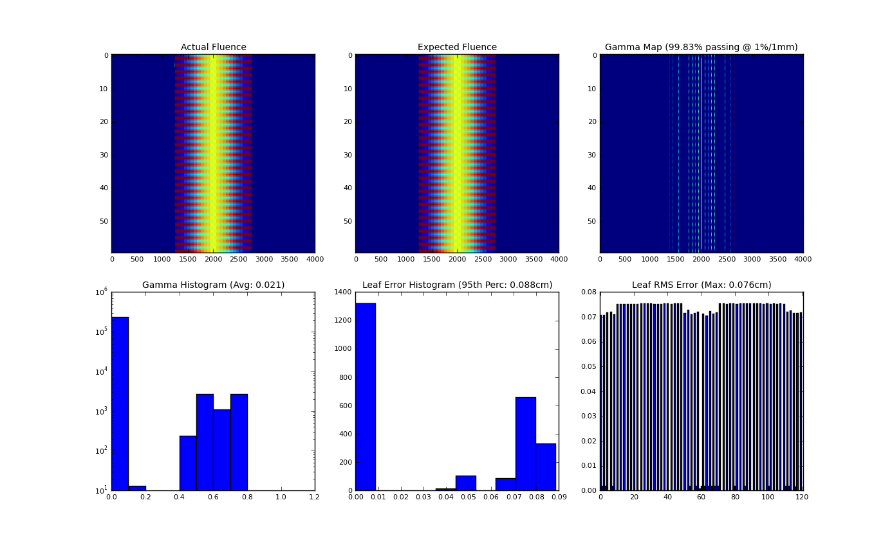

=================================
Log Analyzer module documentation
=================================

Overview
--------

The log analyzer module reads and parses Varian linear accelerator machine logs, both Dynalogs and Trajectory logs. The module also
calculates actual and expected fluences as well as performing gamma evaluations. Data is structured to be easily accessible and
easily plottable.

Unlike most other modules of pylinac, the log analyzer module has no end goal. Data is parsed from the logs, but what is done with that
info, and which info is analyzed is up to the user.

.. _log_concepts:

Concepts
--------

Because the log_analyzer module functions without an end goal, the data has been formatted for easy exploration. However, there are a
few concepts that should be grasped before diving in.

* **Log Sections** - Upon log parsing, all data is placed into data structures. Varian has designated 4 sections for Trajectory logs:
  *Header*, *Axis Data*, *Subbeams*, and *CRC*. The *Subbeams* are only applicable for auto-sequenced beams, and the *CRC* is specific to
  the Trajectory log. The *Header* and *Axis Data* however, are common to both Trajectory logs and Dynalogs.

   .. note::
    Dynalogs do not have explicit sections like the Trajectory logs,
    but they are formatted to have these two data structures for consistency.

* **Leaf Indexing & Positions** - Varian leaf identification is 1-index based, over against Python's 0-based indexing.

    .. warning:: When slicing or analyzing leaf data, keep the Varian 1-index base in mind.

  Leaf data is stored in a dictionary, with the leaf number as the key, from 1 up to the number of MLC leaves. E.g. if the machine has a
  Millennium 120 standard MLC model, leaf data will have 120 dictionary items from 1 to 120. Leaf numbers have an offset of half the
  number of leaves. I.e. leaves 1 and 120 are a pair, as are 2 and 119, on up to leaves 60 and 61. In such a case, leaves 61-120 correspond
  to the B-bank, while leaves 1-60 correspond to the A-bank.

* **Units** - Units follow the Trajectory log specification: linear axes are in cm, rotational axes in degrees, and MU for dose.

  .. note::
    Dynalog files are inherently in mm for collimator and gantry axes, tenths of degrees for rotational axes, and
    MLC positions are not at isoplane. For consistency, Dynalog values are converted to Trajectory log specs, meaning
    linear axes, both collimator and MLCs are in cm at isoplane, and rotational axes are in degrees. Dynalog MU is always
    from 0 to 25000 no matter the delivered MU (i.e. it's relative).

* **All Data Axes are similar** - Log files capture machine data in "control cycles", aka "snapshots" or "heartbeats". Let us assume a
  log has captured 100 control cycles. Axis data that was captured will all be similar. They will all have an *actual* and sometimes an
  *expected* value for each cycle. Pylinac formats these as 1D numpy arrays along with a difference array if applicable. Each of these
  arrays can be quickly plotted for visual analysis. See :class:`Axis` for more info.

Running the Demo
----------------

As usual, the module comes with demo files and methods::

    >>> from pylinac.log_analyzer import MachineLog
    >>> MachineLog().run_dlg_demo()

Which will output the following::

    >>> MLC log type: Dynalog
    >>> Average RMS of all leaves: 0.074 cm
    >>> Max RMS error of all leaves: 0.076 cm
    >>> 95th percentile error: 0.088 cm
    >>> Number of beam holdoffs: 20
    >>> Gamma pass %: 99.83
    >>> Gamma average: 0.021

Loading Data
------------

Logs can be loaded one of two ways: upon class initialization and through the load method::

    from pylinac.log_analyzer import MachineLog

    log_path = "C:/path/to/tlog.bin"
    log = MachineLog(log_path)

    # OR

    log2 = MachineLog()
    log2.load(log_path)

Pylinac will automatically infer the log type and load it into data structures for analysis.

Working with the Data
---------------------

Working with the log data is straightforward once the data structures and Axes are understood
(See :ref:`log_concepts` for more info). Pylinac follows the data structures specified by Varian for
trajectory logs, with a *Header* and *Axis Data* structure, and possibly a *Subbeams* structure if
the log is a Trajectory log and was autosequenced. For accessible attributes, see :class:`MachineLog`.
Let's get started by loading a log and looking at some info::

    >>> from pylinac.log_analyzer import MachineLog
    >>> log = MachineLog()

    >>> log.is_loaded  # is a log loaded?
    False
    >>> log.load_demo_dynalog() # better load one then
    >>> log.log_type
    'Dynalog'

    >>> log.report_basic_parameters()
    MLC log type: Dynalog
    Average RMS of all leaves: 0.074 cm
    Max RMS error of all leaves: 0.076 cm
    95th percentile error: 0.088 cm
    Number of beam holdoffs: 20
    Gamma pass %: 99.83
    Gamma average: 0.021

Let's explore the header::

    >>> log.header
    <__main__.Dlog_Header at 0x8fba450>
    >>> log.header.num_mlc_leaves
    120
    >>> log.header.clinac_scale
    ['1']

Now, the axis data::

    >>> log.axis_data.gantry.moved  # did the gantry move during delivery?
    False
    >>> log.axis_data.gantry.actual[0]  # actual gantry angle in degrees
    180.0
    >>> log.axis_data.jaws.x2.moved  # jaw data are under the 'jaws' structure
    False

MLC data is within the axis data::

    >>> log.axis_data.mlc.num_leaves  # specified in header, but also a property here
    120
    >>> log.axis_data.mlc.num_moving_leaves
    60
    >>> log.axis_data.mlc.leaf_axes[1]
    <__main__.Leaf_Axis at 0x8fba710>
    >>> log.axis_data.num_snapshots  # number of snapshots recorded
    99
    >>> log.axis_data.mlc.num_snapshots  # the snapshots used for MLC RMS & Fluence calcs (where beam was on)
    21
    >>> log.axis_data.mlc.hdmlc
    False

Let's look at/calculate fluences::

    >>> log.fluence.actual  # actual, expected, and gamma are all under the 'fluence' structure
    <__main__.ActualFluence at 0x8fbaef0>
    >>> log.fluence.actual.map_calced
    False
    >>> log.fluence.actual.calc_map(resolution=0.1)  # let's calculate it

.. image:: images/actual_fluence.png

The gamma map can be calculated with or without calculating the actual and expected maps. The maps are lazy
properties, and will not recalculate if given the same conditions::

    >>> log.fluence.gamma.calc_map(resolution=0.1)  # won't recalc actual since resolution is the same; will automatically calc expected at 0.1mm
    >>> log.fluence.gamma.calc_map(resolution=0.2)  # will recalculate both at given resolution
    >>> log.fluence.gamma.calc_map(resolution=0.2, doseTA=2)  # will recalc because dose-to-agreement is different
    >>> log.fluence.gamma.calc_map()  # let's go back to the default
    >>> log.fluence.gamma.avg_gamma
    0.020705503187174894
    >>> log.fluence.gamma.pass_prcnt
    99.825000000000003
    >>> log.fluence.gamma.doseTA  # see gamma.calc_map() parameters
    1
    >>> log.fluence.gamma.threshold  # threshold dose percent value not included in gamma calculation
    10

API Documentation
-----------------

.. autoclass:: pylinac.log_analyzer.MachineLog
    :no-show-inheritance:

.. autoclass:: pylinac.log_analyzer.Axis
    :no-show-inheritance:

.. autoclass:: pylinac.log_analyzer.MLC
    :no-show-inheritance:

.. autoclass:: pylinac.log_analyzer.Dlog_Header
    :no-show-inheritance:

.. autoclass:: pylinac.log_analyzer.Dlog_Axis_Data
    :no-show-inheritance:

.. autoclass:: pylinac.log_analyzer.Tlog_Header
    :no-show-inheritance:

.. autoclass:: pylinac.log_analyzer.Tlog_Axis_Data
    :no-show-inheritance:

.. autoclass:: pylinac.log_analyzer.Subbeam
    :no-show-inheritance:

.. autoclass:: pylinac.log_analyzer.Fluence_Struct
    :no-show-inheritance:

.. autoclass:: pylinac.log_analyzer.Fluence
    :no-show-inheritance:

.. autoclass:: pylinac.log_analyzer.GammaFluence
    :no-show-inheritance:

.. autoclass:: pylinac.log_analyzer.Jaw_Struct
    :no-show-inheritance:

.. autoclass:: pylinac.log_analyzer.Couch_Struct
    :no-show-inheritance:
