.. nuclear::

=======
Nuclear
=======

This module is a re-implementation of the IAEA NMQC toolkit that was written for ImageJ [1]_, [2]_.
The toolkit itself appears to be based on the IAEA No. 6 QA for SPECT systems publication [3]_.

The module is designed as a near drop-in replacement for the ImageJ plugin. The algorithms
have been duplicated as closely as possible.

.. note::

    This is not designed to compete or replace the ImageJ plugin. It was designed for
    RadMachine customers, where Python is available. This should be considered an
    alternative for those who prefer Python over ImageJ.

In the following examples, the sample images given by the NMQC toolkit are used [4]_.

Max Count Rate
--------------

This test is based on the NMQC toolkit and IAEA test 2.3.11.4.
The max count rate will examine each frame of a SPECT image and determine the maximum
count rate, which is the sum of the pixel values. The maximum count rate and max frame
can then be reported. A plot of the count rate vs frame number is also generated.

.. code-block:: python

  from pylinac.nuclear import MaxCountRate

  path = r"C:\path\to\image.dcm"
  mcr = MaxCountRate(path)
  mcr.analyze(frame_resolution=0.5)  # or whatever resolution it was acquired at
  results = mcr.results_data()
  print(results)
  mcr.max_countrate  # the maximum count rate
  mcr.max_frame  # the frame number of the maximum count rate
  mcr.max_time  # the time of the maximum count rate
  # plot the count rate vs frame number
  mcr.plot()

The plot will look like similar to this:

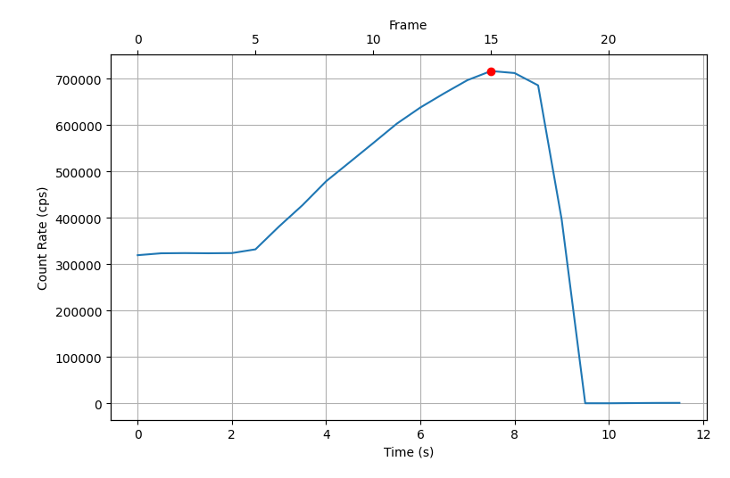

Planar Uniformity
-----------------

The planar uniformity test is based on test 2.3.3 of the IAEA publication. It will
examine each frame of the image and analyze the usable field of view (UFOV) and
center field of view (CFOV). Each frame can be plotted to show the UFOV and CFOV,
the max points of each, and the sliding window that resulted in the
maximum differential uniformity.

Integral Uniformity
^^^^^^^^^^^^^^^^^^^

The integral uniformity uses the same equation as the IAEA, which is the
same as the :ref:`michelson` equation but multiplied by 100. That is:

.. math:: \frac{I_{max} - I_{min}}{I_{max} + I_{min}} \times 100

Differential Uniformity
^^^^^^^^^^^^^^^^^^^^^^^

The differential uniformity is the same as the IAEA, which is the same as the
integral uniformity, but applied to a 5x1 subslice of pixels. The equation is the same as
above.

Example Usage
^^^^^^^^^^^^^

.. code-block:: python

    from pylinac.nuclear import PlanarUniformity

    path = r"C:\path\to\image.dcm"
    pu = PlanarUniformity(path)
    pu.analyze(ufov_ratio=0.95, cfov_ratio=0.75, window_size=5, threshold=0.75)
    results = pu.results_data()
    print(results)
    pu.plot()  # plot the UFOV and CFOV of each frame

This will result in an image like so:

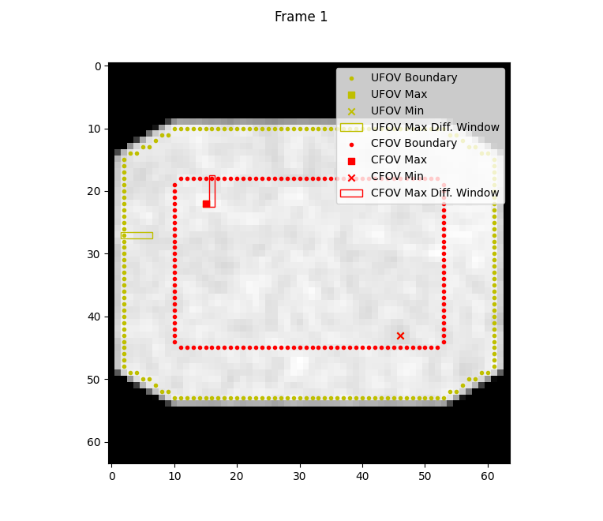

Note the UFOV and CFOV, the min and max pixel values of each FOV, and a rectangle
showing the sliding window that resulted in the maximum differential uniformity.

Algorithm
^^^^^^^^^

The algorithm is largely the same as the NMQC toolkit but there are a few key differences
which will be noted in the steps below.

Each step listed here is applied to each frame of the image:

#. The image is binned to have a pixel size > 4.48mm. I.e. if the pixel size is 1mm,
   the image will be binned together in a block of 4x4 pixels. The pixels are summed
   when binned together.
#. The image is smoothed using a smoothing kernel. The kernel is described on page 59
   of the IAEA QC document:

   .. math::

      \begin{equation}
      \begin{bmatrix}
      1 & 2 & 1 \\
      2 & 4 & 2 \\
      1 & 2 & 1
      \end{bmatrix}
      \end{equation}

   The kernel is normalized by dividing each value by the sum of all values in the kernel.

#. The edge pixels of the image are set to 0.
#. The image is thresholded. The threshold is the threshold ratio (input parameter; default of 0.75)
   multiplied by the mean of all non-zero pixels.

   .. note::

     This appears to be up for interpretation. The text says "set
     any pixels at the edge of the UFOV that contain less than 75% of the
     mean counts per pixel to zero". A value of 75% of the mean could mean the
     entire image; the UFOV is not yet determined at this point.
     If so, the mean depends on the total FOV. We interpret this to
     mean a value of 75% of the mean of all pixels **that are non-zero**.

     In practice, this won't make a big difference this this only affects edge pixels.

#. Stray pixels are removed from the image. A stray pixel is defined as a pixel that is surrounded
   by a pixel values of 0. The stray pixels are set to 0.
#. The UFOV is determined. The size of the total FOV is found in each dimension (x, y).
   The UFOV ratio is then multiplied by the total FOV size. This value is then used to
   "erode" the edge pixel values of the image into a smaller sub-image.
   E.g. if the total FOV is 22.5cm x 15cm, the UFOV will erode (1-0.95) * 22.5cm = 1.125cm (half of that from each edge).

   .. note::

      This appears to be an NMQC-specific implementation. We cannot find anything
      in the IAEA document that describes this step. The IAEA document only describes
      the UFOV as the "usable field of view". The NMQC toolkit appears to differentiate between
      the total FOV and the UFOV.

#. The CFOV is determined. The size of the CFOV will be a ratio of the UFOV.
   E.g. if the UFOV is 20x20cm, the CFOV will be 0.75 * 20cm = 15cm.
   This difference (5cm in this case) will be "eroded" from the UFOV.
#. The integral uniformity is calculated for the UFOV and CFOV.
#. The differential uniformity is calculated for the UFOV and CFOV. The differential uniformity
   is calculated using a sliding window. The window size is determined by the input parameter
   ``window_size``. The window size is the number of pixels in the dimension of interest. E.g. if the window
   size is 5, the window will be 1x5 pixels along the x and y dimensions each. The window is slid across each dimension in 1 pixel increments.
   The differential uniformity is calculated for each window position. The window position that
   results in the maximum differential uniformity is recorded.

.. note::

   The NMQC toolkit creates a perfect rectangle for rectangular images. Pylinac will
   "erode" the image equally in all directions. This will result in images where the corners
   take on the same shape as the total FOV. Note the clipped corners of the image above for the CFOV.
   In the case of pylinac, the image shape does not matter and this makes the algorithm easier.

Center of Rotation
------------------

The center of rotation test measures the deviation of the SPECT panel from the center of rotation.
I.e. it measures the deviation from an expected orbit. The test is based on the IAEA test 4.3.6, pg 174.

.. code-block:: python

    from pylinac.nuclear import CenterOfRotation

    path = r"C:\path\to\image.dcm"
    cor = CenterOfRotation(path)
    cor.analyze()
    results = cor.results_data()
    print(results)
    cor.plot()  # plot the fitted sine x-values, residuals for x and y axis

This will produce a set of plots like so:

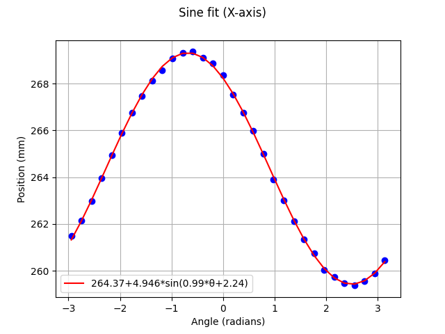

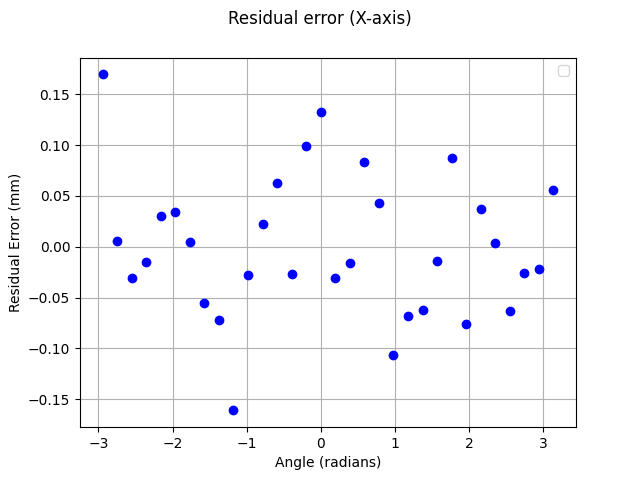

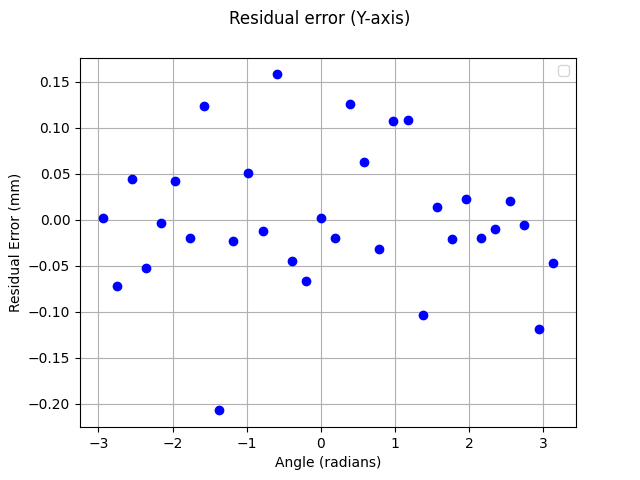

Tomographic Resolution
----------------------

The tomographic resolution test measures the resolution of the SPECT system. The test is based on the IAEA test 4.3.4, pg 169.

.. code-block:: python

    from pylinac.nuclear import TomographicResolution

    path = r"C:\path\to\image.dcm"
    tr = TomographicResolution(path)
    tr.analyze()
    results = tr.results_data()
    print(results)
    tr.plot()  # plot the 3 axis profiles and the fitted gaussians

This will produce 3 figures, one for each axis that look like so:

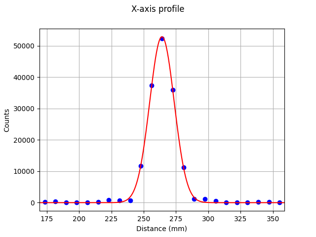

Algorithm
^^^^^^^^^

* The weighted centroid of the entire 3D image stack of frames is calculated.
* A 1D profile is created for each axis (x, y, z) at the location of the centroid.
* A gaussian is fitted to each profile.
* The FWHM and FWTM of each gaussian is calculated.

.. note::

   The FWHM/FWTM is not empirical like it is in the rest of pylinac. It is
   calculated directly from the gaussian fit per the IAEA publication.

Simple Sensitivity
------------------

The simple sensitivity test measures the sensitivity of the SPECT system. The test is based on the IAEA test 2.3.8, pg 73.
The equations are from the IAEA NMQC toolkit with minor modifications.

.. warning::

    The IAEA NMQC toolkit appears to use the counts of the *first* frame of the background
    image only. In the test dataset, the background has 2 frames. Pylinac will use the
    mean background value of all frames. This will give very small differences
    in the results if there are multiple frames in the background image.

No background
^^^^^^^^^^^^^

.. code-block:: python

    from pylinac.nuclear import SimpleSensitivity, Nuclide

    phantom_path = r"C:\path\to\image.dcm"
    ss = SimpleSensitivity(path)
    ss.analyze(activity_mbq=10, nuclide=Nuclide.Tc99m)
    results = ss.results_data()
    print(results)

With background
^^^^^^^^^^^^^^^

.. code-block:: python

    from pylinac.nuclear import SimpleSensitivity, Nuclide

    phantom_path = r"C:\path\to\image.dcm"
    background_path = r"C:\path\to\background.dcm"
    ss = SimpleSensitivity(path, background_path=background_path)
    ss.analyze(activity_mbq=10, nuclide=Nuclide.Tc99m)
    results = ss.results_data()
    print(results)

Four-Bar Spatial Resolution
---------------------------

The four-bar spatial resolution test measures the spatial resolution of the SPECT system. The test is based on the IAEA test 2.3.8, Method 2, pg 75
and on the NMQC toolkit manual 4.5.3.

.. code-block:: python

    from pylinac.nuclear import FourBarResolution

    path = r"C:\path\to\image.dcm"
    fbr = FourBarResolution(path)
    fbr.analyze(separation_mm=100, roi_width_mm=10)
    results = fbr.results_data()
    print(results)
    fbr.plot()  # plot the image and 2 axis profiles with fitted gaussians

This will produce a set of plots like so:

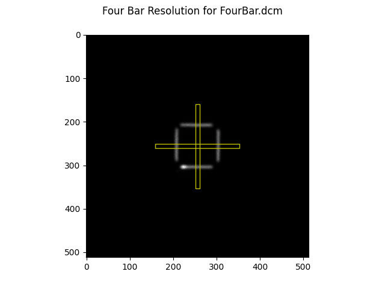

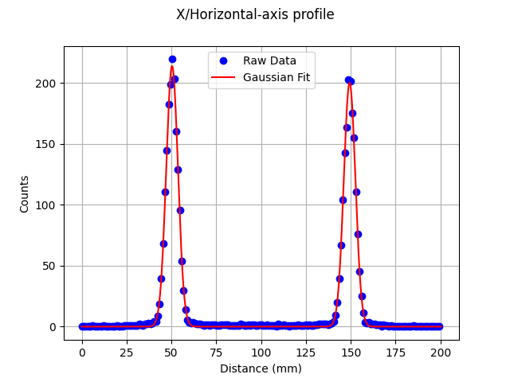

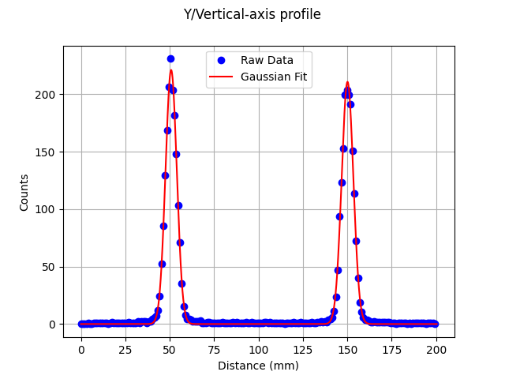

Algorithm
^^^^^^^^^

.. warning::

  The 4 lines are assumed to be centered about the image center.

.. note::

  The image is assumed to only have 1 frame. If there are multiple frames, only the first frame will be used.

* 2 Rectangular ROIs are sampled. The ROIs are centered at the image center. The longest
  dimention of the ROI is twice the passed ``separation_mm``. The shortest dimension is the
  ``roi_width_mm`` parameter.
* The mean of the profile along the axis of interest is calculated. E.g. for a 100px x 5px
  this will take a mean across the 5px to give a 100px x 1px profile.
* For each axis profile, an initial simple peak search is done to create initial guesses for the gaussian fits.
* Each profile is fitted to two gaussian peaks using the initial guesses from the peak search.
* The FWHM and FWTM of each gaussian is calculated.
* Pixel size (mm/px) is determined by:

  .. math::

      \frac{Stated Separation}{|G2_{peak} - G1_{peak}|}

  where :math:`Stated Separation` is the ``separation_mm`` parameter, :math:`G1_{peak}` is the peak position of the first gaussian fit,
  and :math:`G2_{peak}` is the peak position of the second gaussian fit, both in pixels.

Four-Quadrant Spatial Resolution
--------------------------------

The four-quadrant spatial resolution test measures the spatial resolution of the SPECT system. The test is based on the IAEA test 2.3.8, Method 2, pg 75
and the NMQC toolkit section 4.5.5.

.. code-block:: python

    from pylinac.nuclear import QuadrantResolution

    path = r"C:\path\to\image.dcm"
    qr = QuadrantResolution(path)
    qr.analyze(
        bar_widths=(4.23, 3.18, 2.54, 2.12), roi_diameter_mm=70, distance_from_center_mm=130
    )
    results = qr.results_data()
    print(results)
    qr.plot()  # plot the image with quadrant ROIs, the MTF, and the FWHMs.

This will produce a set of plots like so:

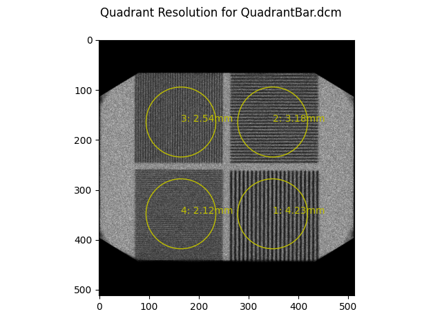

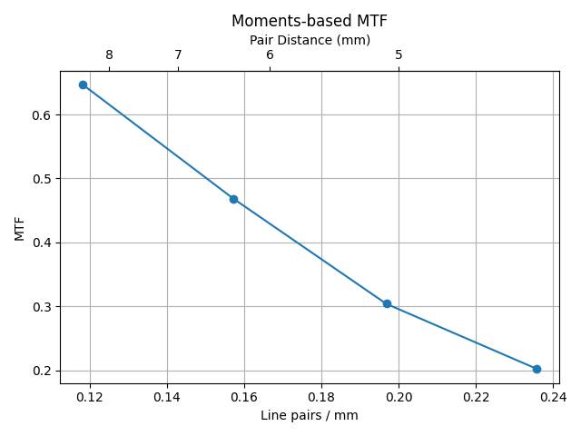

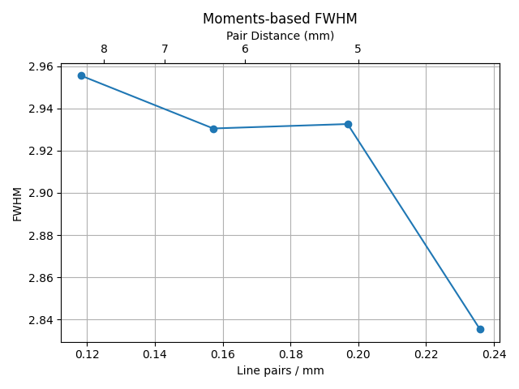

Algorithm
^^^^^^^^^

.. warning::

  The line pair quadrants are assumed to be equidistant from the image center.

* 4 circular ROIs are sampled. The ROIs are offset from the image center by ``distance_from_center_mm``. The diameter
  of the ROI is the ``roi_diameter_mm`` parameter. The ROIs start at -45 and go CCW to match the NMQC toolkit.
* The mean and standard deviation of each ROI is calculated.
* For each ROI, the MTF and FWHM are calculated from Equation 8 and A8 of Hander et al [5]_:

  .. math::
     :label: mtf

     MTF = \frac{\sqrt{2 * (\sigma^{2} - \mu)}}{\mu}

  .. math::
     :label: fwhm

     FWHM = 1.058 \times width \times \sqrt{\ln\left(\frac{\mu}{\sqrt{2 \times (\sigma^{2} - \mu)}}\right)}

  where :math:`\mu` is the mean pixel value of the ROI and :math:`\sigma` is the standard deviation of the ROI pixel values.

Tomographic Uniformity
----------------------

The tomographic uniformity test measures the uniformity of the SPECT system. The test is based on the IAEA test 4.3.3, pg 165.
It is very similar to the Planar Uniformity test.

.. code-block:: python

    from pylinac.nuclear import TomographicUniformity

    path = r"C:\path\to\image.dcm"
    tu = TomographicUniformity(path)
    tu.analyze(
        ufov_ratio=0.95,
        cfov_ratio=0.75,
        center_ratio=0.4,
        window_size=5,
        threshold=0.75,
        window_size=5,
    )
    results = tu.results_data()
    print(results)
    tu.plot()  # plot the uniformity image, the UFOV, CFOV, and Center ROI, and the sliding windows that resulted in the maximum differential uniformity.

This will result in a plot like so:

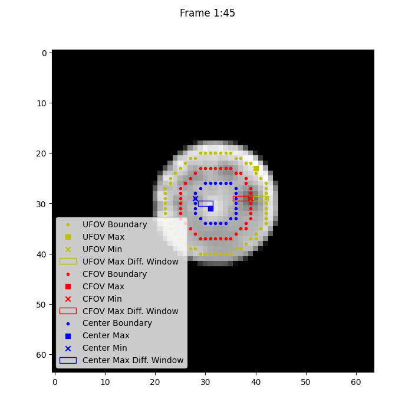

Algorithm
^^^^^^^^^

.. note::

  Compared to the NMQC toolkit, the UFOV, CFOV, and Center ROI are based on ratios of the phantom size and
  are not absolute. E.g. in the NMQC manual the UFOV is the phantom radius - 2cm and the center ROI is
  a 6cm circle. These absolute values are not used in pylinac. Instead, ratios are used as
  are done in the Planar Uniformity test. To get the same results as the NMQC toolkit,
  basic math from the known phantom size can be used. Further, the default ratios are
  close to the NMQC toolkit values for the Jaszczak phantom.

* The 3D array is sliced to the frames passed by the user.
* The mean of the frames of interest are taken along the z-axis (in/out of viewing plane) to create
  a single 2D image.
* From here, the algorithm is the same as the Planar Uniformity test.
* In addition to the UFOV and CFOV, a "center" FOV is also sampled based on the ``center_ratio``.
* The integral and differential uniformity are calculated for the UFOV, CFOV, and Center ROI.
* The center-to-edge ratio is calculated by dividing the mean of the center ROI by the
  mean value of the pixels between the UFOV and CFOV.

Tomographic Contrast
--------------------

The tomographic contrast test measures the contrast of the SPECT system. The test is based on the IAEA test 4.3.9, pg 182.

.. code-block:: python

    from pylinac.nuclear import TomographicContrast

    path = r"C:\path\to\image.dcm"
    tc = TomographicContrast(path)
    tc.analyze(
        sphere_diameters_mm=(38, 31.8, ...),
        sphere_angles=(-10, -70, ...),
        ufov_ratio=0.95,
        search_window_px=5,
        search_slices=3,
    )
    results = tc.results_data()
    print(results)
    tc.plot()  # plot the image with the ROIs and the contrast values.

This will result in a set of plots like so:

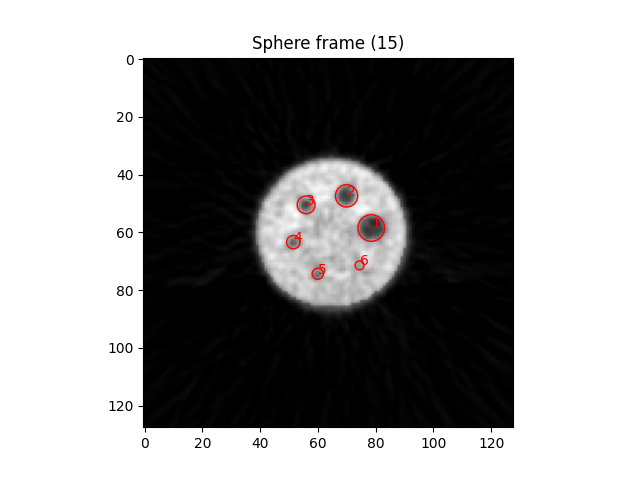

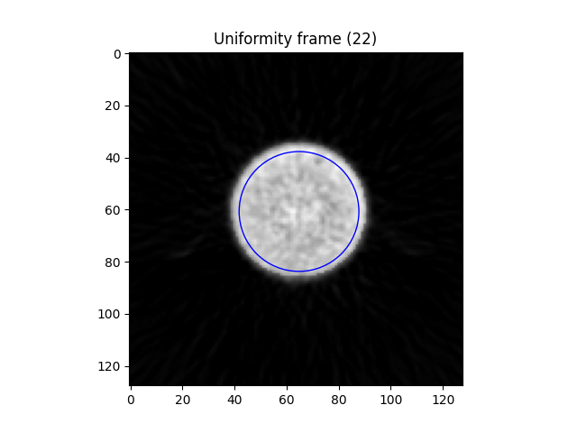

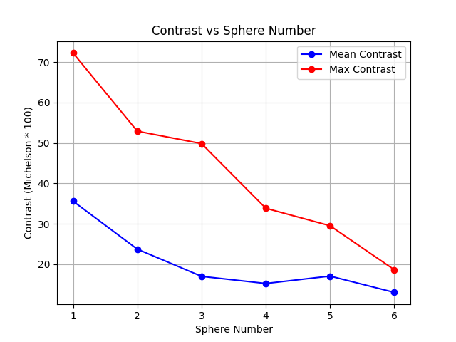

Algorithm
^^^^^^^^^

.. note::

  Pylinac will automatically identify the uniformity slice and the "sphere" slice. There is no manual option.

Uniformity Frame
################

* The uniformity frame is found by iterating over each frame:

  * The frame is thresholded to 10% of the global max pixel value.
  * The largest remaining ROI is selected.
  * The ROI is eroded by the ``ufov_ratio`` parameter (this is similar to what is done for the Planar Uniformity test).
  * The uniformity is evaluated for this ROI as well as the ROI diameter, center point, and mean pixel value.

* Any frame with an ROI size less than the median - std of all ROI sizes is rejected; this mostly means
  edge frames are rejected.
* The frame with the lowest uniformity is selected as the uniformity frame.

Sphere Frame
############

The **initial** sphere frame is selected by finding the frame with the highest uniformity (i.e. non-uniformity).
This will usually find the slice at or near the spheres as the cold sphere will create non-uniformity.

From this initial sphere frame, each ROI is found by:

* Starting at the position indicated by the ``sphere_angles`` and ``sphere_diameters_mm`` parameters,
  a minimization is performed to find the best x,y,z coordinates that maximizes the contrast. The
  search is bounded from the initial position to the ``search_window_px`` and ``search_slices`` parameters.

  .. note::

      The search is in 3D space. However, for ease of plotting, all the sphere ROIs will be shown
      on one plot when running ``.plot()``. The slice shown will be the most common slice the
      final sphere locations are determined upon.

References
----------

.. [1] `NMQC Toolkit <https://humanhealth.iaea.org/HHW/MedicalPhysics/NuclearMedicine/QualityAssurance/NMQC-Plugins/index.html>`__
.. [2] `NMQC User Manual <https://humanhealth.iaea.org/HHW/MedicalPhysics/NuclearMedicine/QualityAssurance/NMQC-Plugins/OperatorManual-2017-10-20.pdf>`__
.. [3] `IAEA No. 6 QA for SPECT systems <https://www-pub.iaea.org/MTCD/Publications/PDF/Pub1394_web.pdf>`__
.. [4] `NMQC Sample Images <https://humanhealth.iaea.org/HHW/MedicalPhysics/NuclearMedicine/QualityAssurance/NMQC-Plugins/Simulated_images.zip>`__
.. [5] `Hander et al. <https://aapm.onlinelibrary.wiley.com/doi/abs/10.1118/1.597928>`__ "Rapid objective measurement of gamma camera resolution using statistical moments" (1998).

API
---

.. autoclass:: pylinac.nuclear.MaxCountRate
   :members:

.. autoclass:: pylinac.nuclear.MaxCountRateResults
   :members:

.. autoclass:: pylinac.nuclear.PlanarUniformity
   :members:

.. autoclass:: pylinac.nuclear.PlanarUniformityResults
   :members:
