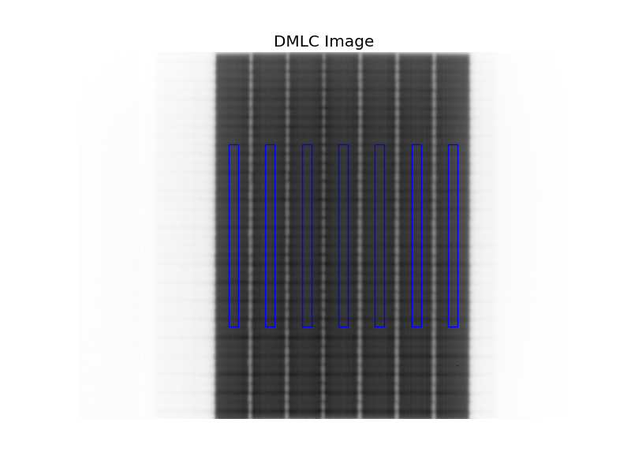

========================
Pylinac General Overview
========================

What is pylinac?
----------------

Pylinac (pr. "pie-linac") is a Python library to analyze the images and datasets commonly used by therapy medical physicists
in the course of their routine linac QA. These data usually follow tests outlined by AAPM TG-142. An example would be the
"picket fence" test of MLCs done weekly or monthly.

Pylinac will take in the image/data and can output numeric results, plots showing the analysis, or a PDF including both the
numerical and plot data.

- Pylinac consumes raw data to compute meaningful output related to common physics tests
- Pylinac consumes raw data to present meaningful data types for further exploration

What is pylinac NOT?
--------------------

.. role:: strike

- Pylinac is not a database. Data outputs should be placed onto your clinic's data repository. You should use a high-quality
  specialty application like `QAtrack+ <http://qatrackplus.com/>`_, an open source application taylor-made (bah-dum-ch) for routine physics QA.
- Pylinac is not liable for incorrect outputs. Either by inputting incorrect data, or the algorithm being incorrect,
  you should **always** validate pylinac against a known methodology (automatic or manual), just as you should
  do for any software used in your clinic.
- Pylinac is not commercial software. It is open-source with a very lenient `MIT license <https://github.com/jrkerns/pylinac/blob/master/LICENSE.txt>`_
  which means it can be used publicly, privately, or even used in commercial applications royalty-free.

Intended Audience
-----------------

Pylinac is intended to be used by physicists who know at least a bit of programming.

Philosophy
----------

Pylinac runs on a few philosophical principles:

* A given module should only address 1 overarching task.
* Using pylinac should require a minimal amount of code.
* The user should have to supply as little information as necessary to run an analysis.
* The underlying code of pylinac should be easy to understand.

.. epigraph::

    The joy of coding Python should be in seeing short, concise, readable classes that express
    a lot of action in a small amount of clear code -- not in reams of trivial code that bores
    the reader to death.

    -- Guido van Rossum

Algorithm Design Overview
-------------------------

Generally speaking, the design of algorithms should all follow the same guidelines and appear as similar as possible. Each module will
outline its own specific algorithm in its documentation.

* Descriptions of algorithms are sorted into steps of the following:

  * **Allowances** -- These describe what the pylinac algorithm *can* account for.
  * **Restrictions** -- These are the things pylinac *cannot* do and must be addressed before the module can be properly used.
  * **Pre-Analysis** -- Algorithm steps that prepare for the main algorithm sequence.
  * **Analysis** -- The steps pylinac takes to analyze the image or data.
  * **Post-Analysis** -- What pylinac does or can do after analysis, like showing the data or checking against tolerances.

* Algorithm steps should be expressible in a word or short phrase.
* Algorithm method names should be as similar as possible from module to module.

.. _module_design:

Module Design
-------------

Pylinac has a handful of modules, but most of them work somewhat the same, so here we describe the general patterns you'll see when using
pylinac.

* **Each module has its own demonstration method(s)** -- If you don't yet have an image or data and want to see how a module works
  you can run and inspect the code of the demo to get an idea. Most demo methods have a name like or starts with ``.run_demo()``.
* **Each module has its own demo image/dataset(s)** -- Want to test the analysis but are having trouble with your image? Use the provided
  demo images. All major classes have a demo image or dataset and are usually similar to ``.from_demo_image()``.
* **Each module has similar load, analyze, and show methods and behavior** -- The normal flow of a pylinac module use is to 1) Load the data in,
  2) Analyze the data, and 3) Show the results.
* **Most modules can be fully utilized in a few lines** -- The whole point of pylinac is to automate and simplify the process of
  analyzing routine QA data. Thus, most routines can be written in a few lines. Each module gives a starting script
  in its documentation.