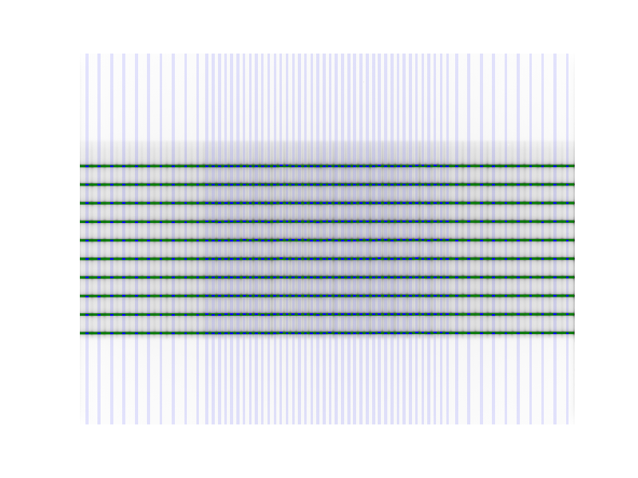

=================================
Picket Fence module documentation
=================================

Overview
--------

The picket fence module is meant for analyzing EPID images where a "picket fence" MLC pattern has been made.
Physicists regularly check MLC positioning through this test. This test can be done using film and one can
"eyeball" it, but this is the 21st century and we have numerous ways of quantifying such data. This module
attains to be one of them. It will load in an EPID dicom image and determine the MLC peaks, error of each MLC
pair to the picket, and give a few visual indicators for passing/warning/failing.

Concepts
--------

Although most terminology will be familiar to a clinical physicist, it is still helpful to be clear about what means what.
A "picket" is the line formed by several MLC pairs all at the same position. There is usually some ideal gap between
the MLCs, such as 0.5, 1, or 2 mm. An "MLC position" is, for pylinac's purposes, the center of the FWHM of the peak
formed by one MLC pair at one picket. Thus, one picket fence image may have anywhere between a few to a dozen pickets,
formed by as few as 10 MLC pairs up to all 60 pairs.

Pylinac presents the analyzed image in such a way that allows for quick assessment; additionally, all elements atop
the image can optionally be turned off. Pylinac by default will plot the image, the determined MLC positions, two
"guard rails", and a semi-transparent overlay over the entire MLC pair region. The guard rails are two lines parallel
to the fitted picket, offset by the tolerance passed to :func:`~pylinac.picketfence.PicketFence.analyze`. Thus, if a tolerance of 0.5 mm is passed, each
guard rail is 0.5 mm to the left and right of the invisible picket. Ideally, MLC positions will all be within these guard rails,
i.e. within tolerance, and will be colored blue. If they are outside the tolerance they are turned red.
If an "action tolerance" is also passed to :func:`~pylinac.picketfence.PicketFence.analyze`, MLC positions that are below tolerance but above the action
tolerance are turned magenta.

Additionally, pylinac provides a semi-transparent colored overlay so that an "all clear"
or a "pair(s) failed" status is easily seen and not inadvertently overlooked. If any MLC position is outside the action
tolerance or the absolute tolerance, the entire MLC pair area is colored the corresponding color. In this way, not
every position needs be looked at. If all rows are green, then all positions passed.

Running the Demo
----------------

To run the picketfence demo, create a script or start in interpreter and input::

    from pylinac.picketfence import PicketFence
    PicketFence().run_demo()

Results will be printed to the console and a figure showing the analyzed picket fence image will pop up::

    Picket Fence Results:
    100.0% Passed
    Median Error: 0.067mm
    Max Error: 0.214mm on Picket: 1, Leaf: 21

If you just want to use the demo image without doing analysis::

    mypf = PicketFence.from_demo_image()

Typical Use
-----------

Picket Fence tests are recommended to be done weekly. With automatic software analysis, this can be a trivial task.
Once the test is delivered, retrieve the DICOM image and save it to a known location. Then import the class::

    from pylinac.picketfence import PicketFence

The minimum needed to get going is to:

* **Load the PF image** -- As with most other pylinac modules, loading images can be done by passing the image string
  directly, or by using a UI dialog box to retrieve the image manually. The code might look like either of the following::

    pf_img = r"C:/QA Folder/June/PF_6_21.dcm"
    mypf = PicketFence(pf_img)

  Or, load using a UI dialog box::

    mypf = PicketFence.from_image_UI()  # UI dialog will pop up

  .. note::
    In previous versions of pylinac, loading images was instance-method based. This behavior has been simplified in favor
    of initialization normalization and adding class-method constructors (``PicketFence.from_X``). The reason for this is that
    certain actions should only be allowed until after the image is loaded. Furthermore, loading the image should always be
    the first action of the analysis sequence. By using class constructors, certain pitfalls and errors can be avoided.
    Don't worry though, the old behavior still works.

* **Analyze the images** -- Once the image is loaded, tell PicketFence to start analyzing the image. See the
  Algorithm section for details on how this is done. While defaults exist, you may pass in a tolerance as well as
  an "action" tolerance (meaning that while passing, action should be required above this tolerance)::

    mypf.analyze(tolerance=0.5, action_tolerance=0.3)

* **View the results** -- The PicketFence class can print out the summary of results to the console as well as
  draw a matplotlib image to show the image, MLC peaks, guard rails, and a color overlay for quick assessment::

      # print results to the console
      print(mypf.return_results())
      # view analyzed image
      mypf.plot_analyzed_image()

Algorithm
---------

The picket fence algorithm works like such:

**Allowances**

* The image can be any size.
* Both leaf sizes can be analyzed (i.e. 5 and 10mm leaves for standard Millennium)
* The image can be either orientation (pickets going up-down or left-right).
* The image can be at any clinical SSD.

**Restrictions**

    .. warning:: Analysis can fail or give unreliable results if any Restriction is violated.

* The image must be an EPID dicom image.
* Only Varian MLC models are supported (5/10mm or 2.5/5mm leaf combinations).
* The delivery must be parallel to an image edge; i.e. the collimator should be 0, 90, or -90 degrees.

**Pre-Analysis**

* **Check image inversion** -- Upon loading, the image is sampled near all 4 corners for pixel values. If it
  is greater than the mean pixel value of the entire image the image is inverted.

* **Threshold image** -- Profiles of the median value along each axis are created. Peaks are found along each axis
  profile. The minimum pixel value of the image between the peak pixel ranges of both axes is determined.
  A new analysis array is created, setting all pixel values lower than the minimum pixel value determined above to that
  pixel value. The idea is to eliminate spurious edge pixels.

* **Determine orientation** -- The image is summed along each axis. Pixel percentile values of each axis sum are
  sampled. The axis with a greater difference in percentile values is chosen as the orientation (The picket axis, it is
  argued, will have more pixel value deviation than the axis parallel to leaf motion.)

**Analysis**

* **Find leaf pair centers perpendicular to leaf motion** -- A profile along the axis parallel to leaf motion is created.
  Trending is removed from the profile to eliminate uneven signal along the EPID panel. Peaks are found
  from the axis profile, which correspond to the tongue-and-groove radiation peak between leaves.
  The pixel range of the peaks determines if just the smaller MLCs have been used, or if the larger
  MLCs have also been included. If they have been included, separate peak searches are performed
  for the small and large leaf peaks, otherwise just a small MLC peak search is performed. Peak values, because
  they correspond to the point *between* leaves, are then shifted by half an MLC width to align with the MLC center.
* **Determine MLC picket positions** -- Once the leaf centers perpendicular to leaf motion are found, the positions
  where the MLCs stopped to deliver a "picket" are determined. For each MLC pair, a profile from the analysis array
  (thresheld image array) is created, composed of all the pixels along the axis of leaf motion and several pixels wide
  (corresponding to ~1/2 a leaf width). From here, centers of the FWHM of each peak are found which correspond to
  the positions of that MLC pair.
* **Fit the picket to the positions & calculate error** -- Once all the MLC positions are determined, the positions from
  each peak of a picket are fitted to a 1D polynomial which is considered the ideal picket. Differences of each MLC position to the picket
  polynomial fit at that position are determined, which is the error. When plotted, errors are tested against the tolerance
  and action tolerance as appropriate.

API Documentation
-----------------

.. autoclass:: pylinac.picketfence.PicketFence
    :no-show-inheritance:

Supporting Data Structures

.. autoclass:: pylinac.picketfence.Picket
    :no-show-inheritance:

.. autoclass:: pylinac.picketfence.MLC_Meas
    :no-show-inheritance:

