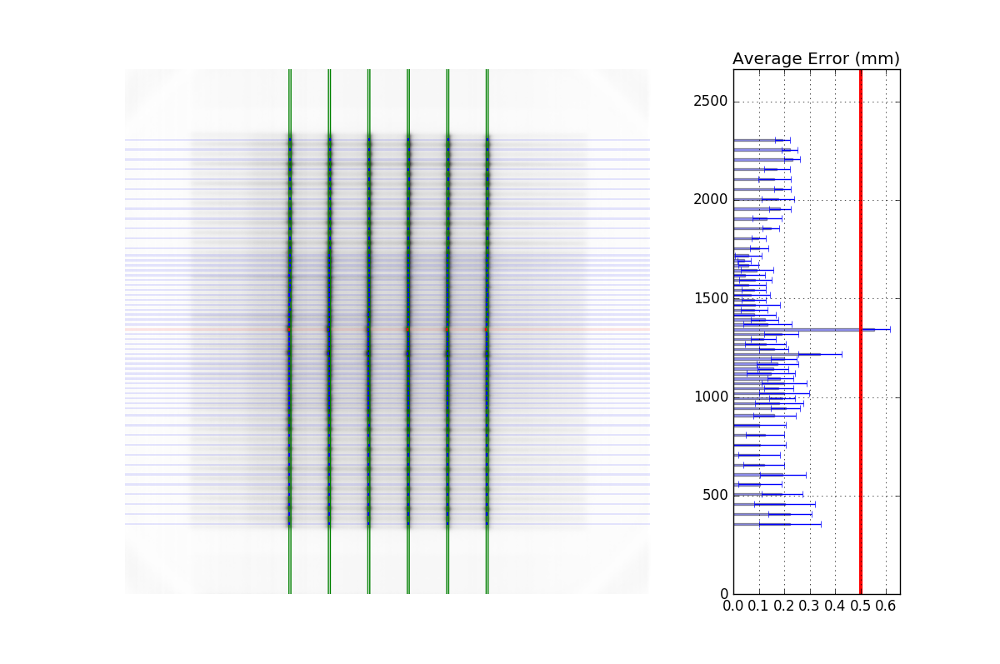

=================================
Picket Fence module documentation
=================================

Overview
--------

.. automodule:: pylinac.picketfence
    :no-members:

Concepts
--------

Although most terminology will be familiar to a clinical physicist, it is still helpful to be clear about what means what.
A "picket" is the line formed by several MLC pairs all at the same position. There is usually some ideal gap between
the MLCs, such as 0.5, 1, or 2 mm. An "MLC position" is, for pylinac's purposes, the center of the FWHM of the peak
formed by one MLC pair at one picket. Thus, one picket fence image may have anywhere between a few to a dozen pickets,
formed by as few as 10 MLC pairs up to all 60 pairs.

Pylinac presents the analyzed image in such a way that allows for quick assessment; additionally, all elements atop
the image can optionally be turned off. Pylinac by default will plot the image, the determined MLC positions, two
"guard rails", and a semi-transparent overlay over the entire MLC pair region. The guard rails are two lines parallel
to the fitted picket, offset by the tolerance passed to :func:`~pylinac.picketfence.PicketFence.analyze`. Thus, if a tolerance of 0.5 mm is passed, each
guard rail is 0.5 mm to the left and right of the invisible picket. Ideally, MLC positions will all be within these guard rails,
i.e. within tolerance, and will be colored blue. If they are outside the tolerance they are turned red.
If an "action tolerance" is also passed to :func:`~pylinac.picketfence.PicketFence.analyze`, MLC positions that are below tolerance but above the action
tolerance are turned magenta.

Additionally, pylinac provides a semi-transparent colored overlay so that an "all clear"
or a "pair(s) failed" status is easily seen and not inadvertently overlooked. If any MLC position is outside the action
tolerance or the absolute tolerance, the entire MLC pair area is colored the corresponding color. In this way, not
every position needs be looked at. If all rows are green, then all positions passed.

Running the Demo
----------------

To run the picketfence demo, create a script or start in interpreter and input:

.. code-block:: python

    from pylinac import PicketFence

    PicketFence.run_demo()

Results will be printed to the console and a figure showing the analyzed picket fence image will pop up::

    Picket Fence Results:
    100.0% Passed
    Median Error: 0.062mm
    Max Error: 0.208mm on Picket: 3, Leaf: 22

.. plot::
    :include-source: false

    from pylinac import PicketFence
    PicketFence.run_demo()

Finally, you can save the results to a PDF report:

.. code-block:: python

    pf = PicketFence.from_demo()
    pf.analyze()
    pf.publish_pdf(filename='PF Oct-2018.pdf')

Acquiring the Image
-------------------

The easiest way to acquire a picket fence image is using the EPID. In fact, pylinac will only analyze images
acquired via an EPID, as the DICOM image it produces carries important information about the SID, pixel/mm conversion, etc.
Depending on the EPID type and physicist, either the entire array of MLCs can be imaged at once, or only the middle
leaves are acquired. Changing the SID can also change how many leaves are imaged. For analysis by pylinac,
the SID does not matter, nor EPID type, nor panel translation.

Typical Use
-----------

Picket Fence tests are recommended to be done weekly. With automatic software analysis, this can be a trivial task.
Once the test is delivered to the EPID, retrieve the DICOM image and save it to a known location. Then import the class:

.. code-block:: python

    from pylinac import PicketFence

The minimum needed to get going is to:

* **Load the image** -- As with most other pylinac modules, loading images can be done by passing the image string
  directly, or by using a UI dialog box to retrieve the image manually. The code might look like either of the following:

  .. code-block:: python

    pf_img = r"C:/QA Folder/June/PF_6_21.dcm"
    pf = PicketFence(pf_img)

  You may also load multiple images that become superimposed (e.g. an MLC & Jaw irradiation):

  .. code-block:: python

    img1 = r'path/to/image1.dcm'
    img2 = r'path/to/image2.dcm'
    pf = PicketFence.from_multiple_images([img1, img2])

  As well, you can use the demo image provided:

  .. code-block:: python

     pf = PicketFence.from_demo_image()

* **Analyze the image** -- Once the image is loaded, tell PicketFence to start analyzing the image. See the
  Algorithm section for details on how this is done. While defaults exist, you may pass in a tolerance as well as
  an "action" tolerance (meaning that while passing, action should be required above this tolerance):

  .. code-block:: python

    pf.analyze(tolerance=0.15, action_tolerance=0.03)  # tight tolerance to demo fail & warning overlay

* **View the results** -- The PicketFence class can print out the summary of results to the console as well as
  draw a matplotlib image to show the image, MLC peaks, guard rails, and a color overlay for quick assessment:

  .. code-block:: python

      # print results to the console
      print(pf.results())
      # view analyzed image
      pf.plot_analyzed_image()

  which results in:

  .. plot::
      :include-source: false

      from pylinac import PicketFence
      pf = PicketFence.from_demo_image()
      pf.analyze(tolerance=0.15, action_tolerance=0.03)
      pf.plot_analyzed_image()

  The plot is also able to be saved to PNG:

  .. code-block:: python

      pf.save_analyzed_image('mypf.png')

  Or you may save to PDF:

  .. code-block:: python

      pf.publish_pdf('mypf.pdf')

Using a Machine Log
-------------------

As of v1.4, you can load a machine log along with your picket fence image. The algorithm will use the expected
fluence of the log to determine where the pickets should be instead of fitting to the MLC peaks. Usage looks like this:

.. code-block:: python

    from pylinac import PicketFence

    pf = PicketFence('my/pf.dcm', log='my/pf_log.bin')
    ...

Everything else is the same except the measurements are **absolute**.

.. warning::
    While using a machine log makes the MLC peak error absolute, there may be EPID twist or sag that
    will exaggerate differences that may or may not be real. Be sure to understand how your imager moves
    during your picket fence delivery. Even TrueBeams are not immune to EPID twist.

Results will look similar. Here's an example of the results of using a log:

Tips & Tricks
-------------

Using the picketfence module in your own scripts? While the analysis results can be printed out,
if you intend on using them elsewhere, they can be accessed through properties. Continuing from
above:

.. code-block:: python

    pf.max_error  # max error in mm
    pf.max_error_picket  # which picket contained the max error
    pf.max_error_leaf  # which leaf contained the maximum error
    pf.abs_median_error  # the absolute median error of all the leaves
    pf.num_pickets  # how many pickets were found
    pf.percent_passing  # the percent of MLC measurements below tolerance

The EPID can also sag at certain angles. Because pylinac assumes a perfect panel, sometimes the analysis will
not be centered exactly on the MLC leaves. If you want to correct for this, simply pass the EPID sag in mm:

.. code-block:: python

    pf = PicketFence(r'C:/path/saggyPF.dcm')
    pf.analyze(sag_adjustment=0.6)

Algorithm
---------

The picket fence algorithm uses expected lateral positions of the MLCs and samples those regions for the center
of the FWHM to determine the MLC positions:

**Allowances**

* The image can be any size.
* Various leaf sizes can be analyzed (e.g. 5 and 10mm leaves for standard Millennium).
* Either standard or HD MLCs can be analyzed.
* The image can be either orientation (pickets going up-down or left-right).
* The image can be at any SSD.
* Any EPID type can be used (aS500, aS1000, aS1200).
* The EPID panel can have an x or y offset (i.e. translation).

**Restrictions**

    .. warning:: Analysis can fail or give unreliable results if any Restriction is violated.

* The image must be a DICOM image acquired via the EPID.
* Only Varian MLC models are supported (5/10mm or 2.5/5mm leaf combinations).
* The delivery must be parallel to an image edge; i.e. the collimator should be at 0, 90, or 270 degrees.

**Pre-Analysis**

* **Check for noise** -- Dead pixels can cause wild values in an otherwise well-behaved image. These values can
  disrupt analysis, but pylinac will try to detect the presence of noise and will apply a median filter if detected.

* **Check image inversion** -- Upon loading, the image is sampled near all 4 corners for pixel values. If it
  is greater than the mean pixel value of the entire image the image is inverted.

* **Determine orientation** -- The image is summed along each axis. Pixel percentile values of each axis sum are
  sampled. The axis with a greater difference in percentile values is chosen as the orientation (The picket axis, it is
  argued, will have more pixel value variation than the axis parallel to leaf motion.)

* **Adjust for EPID sag** -- If a nonzero value is passed for the sag adjustment, the image is shifted along the axis of
  the pickets; i.e. a +1 mm adjustment for an Up-Down picket image will move expected MLC positions up 1 mm.

**Analysis**

* **Find the pickets** -- The mean profile of the image perpendicular to the MLC travel direction is taken. Major
  peaks are assumed to be pickets.
* **Find FWHM at each MLC position** -- For each picket, a sample of the image in the MLC travel direction is taken at each MLC position.
  The center of the FWHM of the picket for that MLC position is recorded.
* **Fit the picket to the positions & calculate error** -- Once all the MLC positions are determined, the positions from
  each peak of a picket are fitted to a 1D polynomial which is considered the ideal picket. Differences of each MLC position to the picket
  polynomial fit at that position are determined, which is the error. When plotted, errors are tested against the tolerance
  and action tolerance as appropriate.

Troubleshooting
---------------

First, check the general :ref:`general_troubleshooting` section. Specific to the picket fence
analysis, there are a few things you can do.

* **Ensure the HDMLC status** - If your image is from an HD MLC, you need to set the ``hdmlc`` parameter in
  :meth:`~pylinac.picketfence.PicketFence.analyze` to True, and vic versa.
* **Apply a filter upon load** - While pylinac tries to correct for unreasonable noise in
  the image before analysis, there may still be noise that causes analysis to fail. A way to check
  this is by applying a median filter upon loading the image:

  .. code-block:: python

     pf = PicketFence('mypf.dcm', filter=5)  # vary the filter size depending on the image

  Then try performing the analysis.
* **Check for streak artifacts** - It is possible in certain scenarios (e.g. TrueBeam dosimetry mode)
  to have noteworthy artifacts in the image like so:

  .. image:: images/pf_with_streak.png

  If the artifacts are in the same direction as the pickets
  then it is possible pylinac is tripping on these artifacts. You can reacquire the image in another mode or
  simply try again in the same mode. You may also try cropping the image to exclude the artifact:

  .. code-block:: python

     pf = PicketFence('mypf.dcm')
     pf.image.array = mypf.image.array[200:400, 150:450]  # or whatever values you want

* **Set the number of pickets** - If pylinac is catching too many pickets you can set
  the number of pickets to find with :meth:`~pylinac.picketfence.PicketFence.analyze`.
* **Set the image inversion** - If you get an error like this: ``ValueError: max() arg is an empty sequence``,
  one issue may be that the image has the wrong inversion (negative values are positive, etc). Set the analyze flag ``invert``
  to ``True`` to invert the image from the automatic detection.
* **Crop the image** - For Elekta images, the 0th column is often an extreme value. For any Elekta image, it is suggested
  to crop the image. You can crop the image like so:

  .. code-block:: python

      pf = PicketFence(r'my/pf.dcm')
      pf.image.crop(pixels=3)
      pf.analyze()
      ...

API Documentation
-----------------

.. autoclass:: pylinac.picketfence.PicketFence

Supporting Data Structures

.. autoclass:: pylinac.picketfence.PicketManager

.. autoclass:: pylinac.picketfence.Settings

.. autoclass:: pylinac.picketfence.Picket

.. autoclass:: pylinac.picketfence.MLCMeas

.. autoclass:: pylinac.picketfence.Overlay
