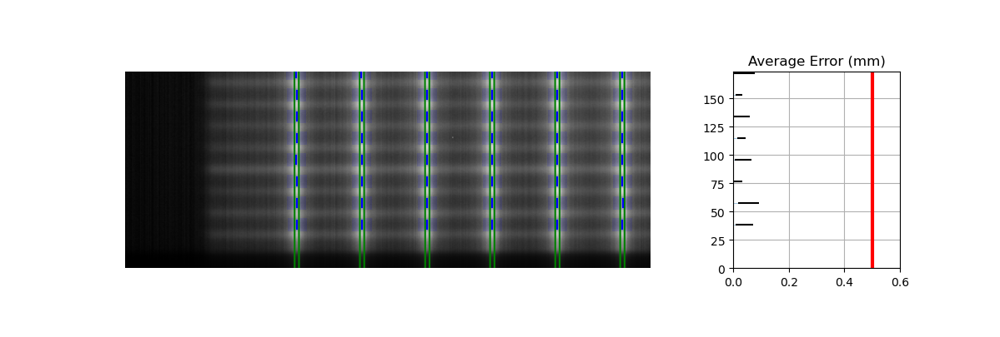
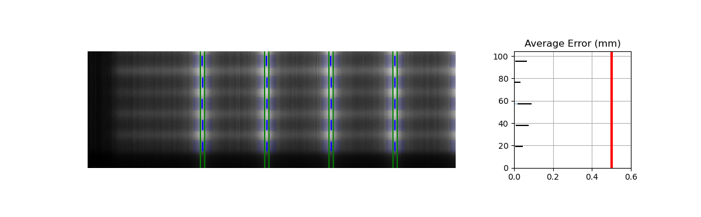

.. _picket-fence:

============
Picket Fence
============

Overview
--------

.. automodule:: pylinac.picketfence
    :no-members:

Concepts
--------

Although most terminology will be familiar to a clinical physicist, it is still helpful to be clear about what means what.
A "picket" is the line formed by several MLC pairs all at the same position. There is usually some ideal gap between
the MLCs, such as 0.5, 1, or 2 mm. An "MLC position" is, for pylinac's purposes, the center of the FWHM of the peak
formed by one MLC pair at one picket. Thus, one picket fence image may have anywhere between a few to a dozen pickets,
formed by as few as 10 MLC pairs up to all 60 pairs.

Pylinac presents the analyzed image in such a way that allows for quick assessment; additionally, all elements atop
the image can optionally be turned off. Pylinac by default will plot the image, the determined MLC positions,
"guard rails", and a semi-transparent overlay of the MLC error magnitude and translucent boxes over failed leaves. The guard rails are two lines parallel
to the fitted picket or side of the picket, offset by the tolerance passed to :func:`~pylinac.picketfence.PicketFence.analyze`. Thus, if a tolerance of 0.5 mm is passed, each
guard rail is 0.5 mm to the left and right of the invisible picket. Ideally, MLC positions will all be within these guard rails,
i.e. within tolerance, and will be colored blue. If they are outside the tolerance they are turned red with a larger box overlaid for easy identification.
If an "action tolerance" is also passed to :func:`~pylinac.picketfence.PicketFence.analyze`, MLC positions that are below tolerance but above the action
tolerance are turned magenta.

Additionally, pylinac provides a semi-transparent colored overlay so that an "all clear"
or a "pair(s) failed" status is easily seen and not inadvertently overlooked. If any MLC position is outside the action
tolerance or the absolute tolerance, the MLC pair/leaf area is colored the corresponding color. In this way, not
every position needs be looked at.

Running the Demo
----------------

To run the picketfence demo, create a script or start in interpreter and input:

.. code-block:: python

    from pylinac import PicketFence

    PicketFence.run_demo()

Results will be printed to the console and a figure showing the analyzed picket fence image will pop up::

    Picket Fence Results:
    100.0% Passed
    Median Error: 0.062mm
    Max Error: 0.208mm on Picket: 3, Leaf: 22

.. plot::
    :include-source: false

    from pylinac import PicketFence
    PicketFence.run_demo()

Finally, you can save the results to a PDF report:

.. code-block:: python

    pf = PicketFence.from_demo()
    pf.analyze()
    pf.publish_pdf(filename="PF Oct-2018.pdf")

Acquiring the Image
-------------------

The easiest way to acquire a picket fence image is using the EPID. In fact, pylinac will only analyze images
acquired via an EPID, as the DICOM image it produces carries important information about the SID, pixel/mm conversion, etc.
Depending on the EPID type and physicist, either the entire array of MLCs can be imaged at once, or only the middle
leaves are acquired. Changing the SID can also change how many leaves are imaged. For analysis by pylinac,
the SID does not matter, nor EPID type, nor panel translation.

Typical Use
-----------

Picket Fence tests are recommended to be done weekly. With automatic software analysis, this can be a trivial task.
Once the test is delivered to the EPID, retrieve the DICOM image and save it to a known location. Then import the class:

.. code-block:: python

    from pylinac import PicketFence

The minimum needed to get going is to:

* **Load the image** -- As with most other pylinac modules, loading images can be done by passing the image string
  directly, or by using a UI dialog box to retrieve the image manually. The code might look like either of the following:

  .. code-block:: python

    pf_img = r"C:/QA Folder/June/PF_6_21.dcm"
    pf = PicketFence(pf_img)

  You may also load multiple images that become superimposed (e.g. an MLC & Jaw irradiation):

  .. code-block:: python

    img1 = r"path/to/image1.dcm"
    img2 = r"path/to/image2.dcm"
    pf = PicketFence.from_multiple_images([img1, img2])

  As well, you can use the demo image provided:

  .. code-block:: python

     pf = PicketFence.from_demo_image()

  You can also change the MLC type:

  .. code-block:: python

    pf = PicketFence(pf_img, mlc="HD")

  In this case, we've set the MLCs to be HD Millennium. For more options and to customize the MLC configuration,
  see :ref:`customizing_pf_mlcs`.

* **Analyze the image** -- Once the image is loaded, tell PicketFence to start analyzing the image. See the
  Algorithm section for details on how this is done. While defaults exist, you may pass in a tolerance as well as
  an "action" tolerance (meaning that while passing, action should be required above this tolerance):

  .. code-block:: python

    pf.analyze(
        tolerance=0.15, action_tolerance=0.03
    )  # tight tolerance to demo fail & warning overlay

* **View the results** -- The PicketFence class can print out the summary of results to the console as well as
  draw a matplotlib image to show the image, MLC peaks, guard rails, and a color overlay for quick assessment:

  .. code-block:: python

      # print results to the console
      print(pf.results())
      # view analyzed image
      pf.plot_analyzed_image(show_text=True)

  which results in:

  .. plot::
      :include-source: false

      from pylinac import PicketFence
      pf = PicketFence.from_demo_image()
      pf.analyze(tolerance=0.15, action_tolerance=0.03)
      pf.plot_analyzed_image(show_text=True)

  The plot is also able to be saved to PNG:

  .. code-block:: python

      pf.save_analyzed_image("mypf.png")

  Or you may save to PDF:

  .. code-block:: python

      pf.publish_pdf("mypf.pdf")

Analyzing individual leaves
---------------------------

Historically, MLC pairs were evaluated together; i.e. the center of the picket was determined and compared to the idealized picket.
In v3.0+, an option to analyze each leaf of the MLC kiss was added. This will create 2 pickets per gap, one on either side and compare
the measurements of each leaf. For backwards compatibility, this option is opt-in. This option also requires a nominal gap value
to be passed. To analyze individual leaves:

.. code-block:: python

    from pylinac import PicketFence

    pf = PicketFence(...)
    pf.analyze(..., separate_leaves=True, nominal_gap_mm=2)
    ...

.. note::

    Don't forget that you will always need to pass a correct ``nominal_gap_mm`` value when analyzing separated leaves.
    A good starting point is the nominal gap (e.g. 2mm in the DICOM plan) + DLG.

The gap value is the combined values of the planned gap, MLC DLG, and EPID scatter effects. This is required since the expected position is no longer at the center of the MLC kiss, but
offset to the side and depends on the above effects. You will likely have to determine this for yourself given the
different MLCs and EPID combinations make a dynamic computation difficult.

Individual leaf detection vs combined
-------------------------------------

Despite the above, I personally (JK) don't like the individual leaf analysis approach. I have found the combined method
more robust (in terms of analysis). The biggest problem with individual leaf analysis
is that the expected leaf width is not just simply the DICOM separation and must be empirically determined.
I will describe some of the issues the PF test is meant to or can solve w/r/t
individual analysis vs combined.

* **One leaf error**: When one single leaf has an error. This is the quintessential example for PF.

  .. figure:: images/oneleaferror.png
    :class: with-shadow

    Combined analysis

  .. figure:: images/oneleafseparate.png
    :class: with-shadow

    Separate analysis

  Assuming the opposite leaf has no error (see other issues below), the error of a combined analysis is half of the error of the leaf.
  Over against the argument that it is important to test each leaf, the simple answer is that using a tolerance of
  half the acceptable error will catch this. I.e. a tolerance of 0.1mm will catch an erroneous leaf up of 0.2mm or more.

* **Both leaves offset (unilateral)**: When both leaves are offset to one side.

  .. figure:: images/offset_leaves_combined.png
    :class: with-shadow

    Combined analysis

  .. figure:: images/offset_leaves_separate.png
    :class: with-shadow

    Separate analysis with the same tolerance

  As the images show, both analyses detect the problem. This makes sense given that the error was the same direction for both leaves.

* **Both leaves offset (mirrored)**: When both leaves have an offset error, but in opposite directions.
  This is the only drawback to the combined method.

  .. figure:: images/mirrored_offset_combined.png
    :class: with-shadow

    Combined analysis

  .. figure:: images/mirrored_offset_separate.png
    :class: with-shadow

    Separate analysis

  Clearly, the separate analysis is advantageous here in terms of detecting the error. The chance of MLC
  leaves being off by the same amount in opposite directions seems extraordinarily rare. The more likely
  error would be that the picket width for all leaves is too wide or too narrow. Such a scenario would be easily
  caught with a DLG test.

  To be clear, I'm not against individual leaf analysis, but my anecdotal experience leans toward combined analysis
  being more robust. Combined with other QA typically performed, I don't think the medical physics community is
  all out of whack because they use the combined method vs individual analysis. Use what works for you but realize
  the strengths of each. Finally, remember that physician contours vary a lot, sometimes by a factor or more. This
  dwarfs any 0.1mm error of the leaf that we might squabble about. For the scenarios you actually need that 0.1mm,
  such as SRS, the patient plan QA is the most important factor in determining whether a problem exists.

Plotting a histogram
--------------------

As of v3.0, you may plot a histogram of the error data like so:

.. plot::
  :include-source: true

  from pylinac import PicketFence
  pf = PicketFence.from_demo_image()
  pf.analyze()
  pf.plot_histogram()

Plotting a leaf profile
-----------------------

As of v3.0, you may plot an individual leaf profile like so:

.. plot::
  :include-source: true

  from pylinac import PicketFence
  pf = PicketFence.from_demo_image()
  pf.analyze()
  pf.plot_leaf_profile(leaf=15, picket=2)

Using a Machine Log
-------------------

As of v1.4, you can load a machine log along with your picket fence image. The algorithm will use the expected
fluence of the log to determine where the pickets should be instead of fitting to the MLC peaks. Usage looks like this:

.. code-block:: python

    from pylinac import PicketFence

    pf = PicketFence("my/pf.dcm", log="my/pf_log.bin")
    ...

Everything else is the same except the measurements are **absolute**.

.. warning::
    While using a machine log makes the MLC peak error absolute, there may be EPID twist or sag that
    will exaggerate differences that may or may not be real. Be sure to understand how your imager moves
    during your picket fence delivery. Even TrueBeams are not immune to EPID twist.

Results will look similar. Here's an example of the results of using a log:

.. image:: images/PF_with_log.png

.. _customizing_pf_mlcs:

Customizing MLCs
----------------

.. versionadded:: 2.5

MLC configuration is set a priori (vs empirical determination in 2.4 and below) and the user can also create
custom MLC types.

Preset configurations
^^^^^^^^^^^^^^^^^^^^^^

Use a specific preset config:

.. code-block:: python

    from pylinac.picketfence import PicketFence, MLC

    pf = PicketFence(pf_img, mlc=MLC.MILLENNIUM)

The built-in presets can be seen in attrs of the :class:`~pylinac.picketfence.MLC` class.

Creating and using a custom configuration
^^^^^^^^^^^^^^^^^^^^^^^^^^^^^^^^^^^^^^^^^

Using a custom configuration is very easy. You must create and then pass in a custom :class:`~pylinac.picketfence.MLCArrangement`.
Leaf arrangements are sets of tuples with the leaf number and leaf width. An example will make this clear:

.. code-block:: python

    from pylinac.picketfence import PicketFence, MLCArrangement

    # recreate a standard Millennium MLC with 10 leaves of 10mm width, then 40 leaves of 5mm, then 10 of 10mm again.
    mlc_setup = MLCArrangement(leaf_arrangement=[(10, 10), (40, 5), (10, 10)])
    # add an offset for Halcyon-style or odd-numbered leaf setups
    mlc_setup_offset = MLCArrangement(leaf_arrangement=..., offset=2.5)  # offset is in mm

    # pass it in to the mlc parameter
    pf = PicketFence("path/to/img", mlc=mlc_setup)

    # proceed as normal
    pf.analyze(...)
    ...

.. _acquiring_good_pf_images:

Acquiring good images
---------------------

The following are general tips on getting good images that pylinac will analyze easily. These are
in addition to the algorithm allowances and restrictions:

* Keep your pickets away from the edges. That is, in the direction parallel to leaf motion keep the pickets at least 1-2cm from the edge.
* If you use wide-gap pickets, give a reasonable amount of space between the pickets and keep the gap wider than the picket. I.e. don't have 5mm spacing between 20mm pickets.
* If you use Y-jaws, leave them open 1-2 leaves more than the leaves you want to measure. For example. if you just want to analyze the "central"
  leaves and set Y-jaws to +/-10cm, the leaves at the edge may not be caught by the algorithm
  (although see the ``edge_threshold`` parameter of ``analyze``). To avoid having to tweak the algorithm, just open the jaws a bit more.
* Don't put anything else in the beam path. This might sound obvious, but I'm continually surprised at the types of images people try to use/take.
  No, pylinac cannot account for the MV phantom you left on the couch when you took your PF image.
* Keep the leaves parallel to an edge. I.e. as close to 0, 90, 270 as possible.

Tips & Tricks
-------------

Use ``results_data``
^^^^^^^^^^^^^^^^^^^^

Using the picketfence module in your own scripts? While the analysis results can be printed out,
if you intend on using them elsewhere (e.g. in an API), they can be accessed the easiest by using the :meth:`~pylinac.picketfence.PicketFence.analyze` method
which returns a :class:`~pylinac.picketfence.PFResult` instance.

.. note::
    While the pylinac tooling may change under the hood, this object should remain largely the same and/or expand.
    Thus, using this is more stable than accessing attrs directly.

Continuing from above:

.. code-block:: python

    data = pf.results_data()
    data.max_error_mm
    data.tolerance_mm
    # and more

    # return as a dict
    data_dict = pf.results_data(as_dict=True)
    data_dict["max_error_mm"]
    ...

EPID sag
^^^^^^^^

For older linacs, the EPID can also sag at certain angles. Because pylinac assumes a perfect panel, sometimes the analysis will
not be centered exactly on the MLC leaves. If you want to correct for this, simply pass the EPID sag in mm:

.. code-block:: python

    pf = PicketFence(r"C:/path/saggyPF.dcm")
    pf.analyze(sag_adjustment=0.6)

Edge leaves
^^^^^^^^^^^

For some images, the leaves at the edge of the image or adjacent to the jaws may not be detected. See the image below:

This is caused by the algorithm filtering and can be changed through an analysis parameter. Increase the number to catch more
edge leaves:

.. code-block:: python

    pf = PicketFence(...)
    pf.analyze(..., edge_threshold=3)
    ...

This results with the edge leaves now being caught in this case. You may need to experiment with this number a few times:

.. _individual_leaf_positions:

Individual leaf positions & errors
^^^^^^^^^^^^^^^^^^^^^^^^^^^^^^^^^^

Individual leaf positions and errors can be found in the ``results_data`` object under the ``mlc_positions_by_leaf`` and ``mlc_errors_by_leaf`` attribute. This will be a dictionary
where the key is the leaf number (as a string) and the value is a list of positions in mm. The length of the list will be number of pickets. This is useful for further analysis as desired.
For combined analysis mode, the result will look something like::

    {
        '11': [110.2, 140.1, 170.0, ...],
        '12': [110.1, 140.2, 169.9, ...],
        ...
    }

For separate analysis, the result will be similar to::

    {
        'A11': [110.2, 140.1, 170.0, ...],
        'A12': [110.2, 140.1, 170.0, ...],
        ...
        'B11': [112.1, 142.2, 172.2, ...],
        ...
    }

Benchmarking the algorithm
--------------------------

With the image generator module we can create test images to test the picket fence algorithm on known results. This is useful to isolate what is or isn't working
if the algorithm doesn't work on a given image and when commissioning pylinac.

.. note::

    Some results here are not perfect. This is because the image generator module cannot necessarily generate pickets of exactly a given gap.
    The pickets are simulated by setting the pixel values. A gap is rounded to the closest pixel equivalent of the desired gap size; this may not be perfectly symmetric.
    This affects the error when doing separate leaf analysis and also when evaluating the distance from the CAX.
    Further, many of these have small amounts of random noise applied on purpose.

Perfect Up-Down Image
^^^^^^^^^^^^^^^^^^^^^

Below, we generate a DICOM image with slits representing pickets. Several realistic side-effects are not here (such as tongue and groove),
but this is perfect for testing. Think of this as the equivalent of measuring a 10x10cm field on the linac vs TPS dose before moving on to VMAT plans.

The script will generate the file, but you can also download it here: :download:`perfect_up_down.dcm <files/perfect_up_down.dcm>`.

.. plot::
   :include-source: true

    import pylinac
    from pylinac.core.image_generator import generate_picketfence, GaussianFilterLayer, PerfectFieldLayer, RandomNoiseLayer, AS1200Image
    from pylinac.picketfence import Orientation

    # the file name to write the DICOM image to disk to
    pf_file = "perfect_.dcm"
    # create a PF image with 5 pickets with 40mm spacing between them and 3mm gap. Also applies a gaussian filter to simulate the leaf edges.
    generate_picketfence(
        simulator=AS1200Image(sid=1000),
        field_layer=PerfectFieldLayer,
        file_out=pf_file,
        final_layers=[
            GaussianFilterLayer(sigma_mm=1),
        ],
        pickets=5,
        picket_spacing_mm=40,
        picket_width_mm=3,
        orientation=Orientation.UP_DOWN,
    )
    # load it just like any other
    pf = pylinac.PicketFence(pf_file)
    pf.analyze(separate_leaves=False, nominal_gap_mm=4)
    print(pf.results_data())
    pf.plot_analyzed_image()

As you can see, the error is zero, the pickets are perfectly straight up and down, and everything looks good.

Perfect Left-Right
^^^^^^^^^^^^^^^^^^

Generated file: :download:`perfect_left_right.dcm <files/perfect_left_right.dcm>`.

.. plot::
   :include-source: true

    import pylinac
    from pylinac.core.image_generator import generate_picketfence, GaussianFilterLayer, PerfectFieldLayer, RandomNoiseLayer, AS1200Image
    from pylinac.picketfence import Orientation

    pf_file = "perfect_left_right.dcm"
    generate_picketfence(
        simulator=AS1200Image(sid=1000),
        field_layer=PerfectFieldLayer,
        file_out=pf_file,
        final_layers=[
            GaussianFilterLayer(sigma_mm=1),
        ],
        pickets=5,
        picket_spacing_mm=40,
        picket_width_mm=3,
        orientation=Orientation.LEFT_RIGHT,
    )

    pf = pylinac.PicketFence(pf_file)
    pf.analyze(separate_leaves=False, nominal_gap_mm=4)
    print(pf.results_data())
    pf.plot_analyzed_image()

Noisy, Wide-gap Image
^^^^^^^^^^^^^^^^^^^^^

Generated file: :download:`noisy_wide_gap_up_down.dcm <files/noisy_wide_gap_up_down.dcm>`.

.. plot::
   :include-source: true

    import pylinac
    from pylinac.core.image_generator import generate_picketfence, GaussianFilterLayer, PerfectFieldLayer, RandomNoiseLayer, AS1200Image
    from pylinac.picketfence import Orientation

    pf_file = "noisy_wide_gap_up_down.dcm"
    generate_picketfence(
        simulator=AS1200Image(sid=1500),
        field_layer=PerfectFieldLayer,  # this applies a non-uniform intensity about the CAX, simulating the horn effect
        file_out=pf_file,
        final_layers=[
            GaussianFilterLayer(sigma_mm=1),
            RandomNoiseLayer(sigma=0.03)  # add salt & pepper noise
        ],
        pickets=10,
        picket_spacing_mm=20,
        picket_width_mm=10,  # wide-ish gap
        orientation=Orientation.UP_DOWN,
    )

    pf = pylinac.PicketFence(pf_file)
    pf.analyze()
    print(pf.results_data())
    pf.plot_analyzed_image()

Individual Leaf Analysis
^^^^^^^^^^^^^^^^^^^^^^^^

Let's now analyze individual leaves using the ``separate_leaves`` parameter. This uses the same image base as
above; note that the analysis is different.

Generated file: :download:`separated_wide_gap_up_down.dcm <files/separated_wide_gap_up_down.dcm>`.

.. plot::
    :include-source: true

    import pylinac
    from pylinac.core.image_generator import generate_picketfence, GaussianFilterLayer, PerfectFieldLayer, RandomNoiseLayer, AS1200Image
    from pylinac.picketfence import Orientation

    pf_file = "separated_wide_gap_up_down.dcm"
    generate_picketfence(
        simulator=AS1200Image(sid=1500),
        field_layer=PerfectFieldLayer,  # this applies a non-uniform intensity about the CAX, simulating the horn effect
        file_out=pf_file,
        final_layers=[
            GaussianFilterLayer(sigma_mm=1),
            RandomNoiseLayer(sigma=0.03)  # add salt & pepper noise
        ],
        pickets=10,
        picket_spacing_mm=20,
        picket_width_mm=10,  # wide-ish gap
        orientation=Orientation.UP_DOWN,
    )

    pf = pylinac.PicketFence(pf_file)
    pf.analyze(separate_leaves=True, nominal_gap_mm=10)
    print(pf.results())
    print(pf.results_data())
    pf.plot_analyzed_image()

Note that this image has an error of ~0.1mm. This is due to the rounding of pixel values when generating the picket.
I.e. it's not always possible to generate an exactly 10mm gap, but instead is rounded to the nearest pixel equivalent of 10mm.

Rotated
^^^^^^^

Let's analyze a slightly rotated image of 2 degrees. Recall that pylinac is limited to ~5 degrees of rotation (depending on picket size).

The image generator doesn't do the rotation, but is applied later after loading.

Generated file: :download:`rotated_up_down.dcm <files/rotated_up_down.dcm>`.

.. plot::
    :include-source: true

    from scipy import ndimage

    import pylinac
    from pylinac.core.image_generator import generate_picketfence, GaussianFilterLayer, PerfectFieldLayer, RandomNoiseLayer, AS1200Image
    from pylinac.picketfence import Orientation

    pf_file = "rotated_up_down.dcm"
    generate_picketfence(
        simulator=AS1200Image(sid=1500),
        field_layer=PerfectFieldLayer,  # this applies a non-uniform intensity about the CAX, simulating the horn effect
        file_out=pf_file,
        final_layers=[
            GaussianFilterLayer(sigma_mm=1),
            RandomNoiseLayer(sigma=0.01)  # add salt & pepper noise
        ],
        pickets=10,
        picket_spacing_mm=20,
        picket_width_mm=5,
        orientation=Orientation.UP_DOWN,
    )

    pf = pylinac.PicketFence(pf_file)
    # here's where we rotate
    pf.image.array = ndimage.rotate(pf.image, -2, reshape=False, mode='nearest')
    pf.analyze(separate_leaves=False, nominal_gap_mm=5)
    print(pf.results())
    print(pf.results_data())
    pf.plot_analyzed_image()

Offset pickets
^^^^^^^^^^^^^^

In this example, we offset the pickets to simulate an error where the picket was delivered at the wrong x-distance.
Lots of physicists cite this as a possibility (or expect their QA software to catch it) but I've never seen it.
If you have let me know!

Generated file: :download:`offset_picket.dcm <files/offset_picket.dcm>`.

.. plot::
   :include-source: true

    import pylinac
    from pylinac.core.image_generator import generate_picketfence, GaussianFilterLayer, PerfectFieldLayer, RandomNoiseLayer, AS1200Image
    from pylinac.picketfence import Orientation

    pf_file = "offsetpicket.dcm"
    generate_picketfence(
        simulator=AS1200Image(sid=1500),
        field_layer=PerfectFieldLayer,  # this applies a non-uniform intensity about the CAX, simulating the horn effect
        file_out=pf_file,
        final_layers=[
            GaussianFilterLayer(sigma_mm=1),
            RandomNoiseLayer(sigma=0.01)  # add salt & pepper noise
        ],
        pickets=5,
        picket_spacing_mm=20,
        picket_width_mm=5,
        picket_offset_error=[-5, 0, 0, 2, 0],  # array of errors; length must match the number of pickets
        orientation=Orientation.UP_DOWN,
    )

    pf = pylinac.PicketFence(pf_file)
    pf.analyze()
    print(pf.results())
    print(pf.results_data())
    pf.plot_analyzed_image()

Which produces the following output::

    ...
    Picket offsets from CAX (mm): 45.0 19.9 0.0 -22.0 -40.1
    ...

The results still show passing. However, note the printed picket offsets from the CAX. The first picket is off by 5mm
and the 4th is off by 2mm (as we introduced).

Erroneous leaves
^^^^^^^^^^^^^^^^

In this example we introduce errors simulating leaves opening farther than they should.

Generated file: :download:`erroneous_leaves.dcm <files/erroneous_leaves.dcm>`.

.. plot::
    :include-source: true

    import pylinac
    from pylinac.core.image_generator import generate_picketfence, GaussianFilterLayer, PerfectFieldLayer, RandomNoiseLayer, AS1200Image
    from pylinac.picketfence import Orientation

    pf_file = "erroneous_leaves.dcm"
    generate_picketfence(
            simulator=AS1200Image(sid=1000),
            field_layer=PerfectFieldLayer,  # this applies a non-uniform intensity about the CAX, simulating the horn effect
            file_out=pf_file,
            final_layers=[
                PerfectFieldLayer(field_size_mm=(5, 10), cax_offset_mm=(2.5, 90)),  # a 10mm gap centered over the picket
                PerfectFieldLayer(field_size_mm=(5, 5), cax_offset_mm=(12.5, -87.5)),  # a 2.5mm extra opening of one leaf
                PerfectFieldLayer(field_size_mm=(5, 5), cax_offset_mm=(22.5, -49)),  # a 1mm extra opening of one leaf
                GaussianFilterLayer(sigma_mm=1),
                RandomNoiseLayer(sigma=0.03)  # add salt & pepper noise
            ],
            pickets=10,
            picket_spacing_mm=20,
            picket_width_mm=5,  # wide-ish gap
            orientation=Orientation.UP_DOWN,
    )

    pf = pylinac.PicketFence(pf_file)
    pf.analyze(separate_leaves=True, nominal_gap_mm=5)
    print(pf.results())
    print(pf.results_data())
    pf.plot_analyzed_image()

Algorithm
---------

The picket fence algorithm uses expected lateral positions of the MLCs and samples those regions for the center
of the FWHM to determine the MLC positions:

**Allowances**

* The image can be any size.
* Various leaf sizes can be analyzed (e.g. 5 and 10mm leaves for standard Millennium).
* Any MLC can be analyzed. See :ref:`customizing_pf_mlcs`
* The image can be either orientation (pickets going up-down or left-right).
* The image can be at any SSD.
* Any EPID type can be used (aS500, aS1000, aS1200).
* The EPID panel can have an x or y offset (i.e. translation).

**Restrictions**

.. warning:: Analysis can fail or give unreliable results if any Restriction is violated.

* The image must be a DICOM image acquired via the EPID.
* The delivery must be parallel or nearly-parallel (<~5°) to an image edge; i.e. the collimator should be at 0, 90, or 270 degrees.

**Pre-Analysis**

* **Check for noise** -- Dead pixels can cause wild values in an otherwise well-behaved image. These values can
  disrupt analysis, but pylinac will try to detect the presence of noise and will apply a median filter if detected.

* **Check image inversion** -- Upon loading, the image is sampled near all 4 corners for pixel values. If it
  is greater than the mean pixel value of the entire image the image is inverted.

* **Determine orientation** -- The image is summed along each axis. Pixel percentile values of each axis sum are
  sampled. The axis with a greater difference in percentile values is chosen as the orientation (The picket axis, it is
  argued, will have more pixel value variation than the axis parallel to leaf motion.)

* **Adjust for EPID sag** -- If a nonzero value is passed for the sag adjustment, the image is shifted along the axis of
  the pickets; i.e. a +1 mm adjustment for an Up-Down picket image will move expected MLC positions up 1 mm.

**Analysis**

* **Find the pickets** -- The mean profile of the image perpendicular to the MLC travel direction is taken. Major
  peaks are assumed to be pickets.
* **Find FWHM at each MLC position** -- For each picket, a sample of the image in the MLC travel direction is taken at each MLC position.
  The center of the FWHM of the picket for that MLC position is recorded.
* **Fit the picket to the positions & calculate error** -- Once all the MLC positions are determined, the positions from
  each peak of a picket are fitted to a 1D polynomial which is considered the ideal picket. Differences of each MLC position to the picket
  polynomial fit at that position are determined, which is the error. When plotted, errors are tested against the tolerance
  and action tolerance as appropriate.

.. _interpreting_pf_results:

Interpreting Results
--------------------

This section explains what is returned in the ``results_data`` object.
This is also the same information that is given in the RadMachine results
section.

* ``tolerance_mm`` -- The tolerance used to determine if the picket is passing or failing in mm.
* ``action_tolerance_mm`` -- The tolerance used to determine if the picket is failing and requires action in mm.
* ``percent_leaves_passing`` -- The percentage of leaves that pass the tolerance.
* ``number_of_pickets`` -- The number of pickets found in the image.
* ``absolute_median_error_mm`` -- The median of the absolute errors across all MLC leaves from the ideal picket line in mm.
* ``max_error_mm`` -- The maximum error across all MLC leaves from the ideal picket line in mm.
* ``max_error_picket`` -- The picket number that had the maximum error. This is 0-index based, meaning the 0th picket is the left/topmost.
* ``max_error_leaf`` -- The leaf number that had the maximum error.
* ``mean_picket_spacing_mm`` -- The mean spacing between pickets in mm.
* ``offsets_from_cax_mm`` -- The offsets of each picket from the central axis in mm.
* ``passed`` -- Whether all the MLC positions were within tolerance.
* ``failed_leaves`` -- A list of leaf numbers that failed. If using ``separate_leaves=False``, this will be the leaf pairs (10, 22, etc). If using ``separate_leaves=True`` this will be the bank-specific leaves; A10, B22, A22, etc.
* ``mlc_skew`` -- The skew of the MLC stack in degrees. This is the angle of the MLCs from the nearest cardinal direction.
* ``picket_widths`` -- The widths of the pickets in mm.
* ``mlc_positions_by_leaf`` -- A dictionary where the key is the leaf number and the value is a list of positions in mm **from the left or top of the image**.
* ``mlc_errors_by_leaf`` -- A dictionary where the key is the leaf number and the value is a list of errors in mm.

Troubleshooting
---------------

First, check the general :ref:`general_troubleshooting` section. Specific to the picket fence
analysis, there are a few things you can do.

* **Set the image inversion** - If you get an error like this: ``ValueError: max() arg is an empty sequence``,
  one issue may be that the image has the wrong inversion (negative values are positive, etc). Set the analyze flag ``invert``
  to ``True`` to invert the image from the automatic detection.
  Additionally, if you're using wide pickets, the image inversion could be wrong. If the pickets are wider than the "valleys" between the pickets
  this will almost always result in a wrong inversion.
* **Crop the edges** - This is far and away the most common problem. Elekta is notorious for having
  noisy/bad edges. Pass a larger value into the constructor:

  .. code-block:: python

    pf = PicketFence(..., crop_mm=7)

* **Apply a filter upon load** - While pylinac tries to correct for unreasonable noise in
  the image before analysis, there may still be noise that causes analysis to fail. A way to check
  this is by applying a median filter upon loading the image:

  .. code-block:: python

     pf = PicketFence("mypf.dcm", filter=5)  # vary the filter size depending on the image

  Then try performing the analysis.
* **Check for streak artifacts** - It is possible in certain scenarios (e.g. TrueBeam dosimetry mode)
  to have noteworthy artifacts in the image like so:

  .. image:: images/pf_with_streak.png

  If the artifacts are in the same direction as the pickets
  then it is possible pylinac is tripping on these artifacts. You can reacquire the image in another mode or
  simply try again in the same mode. You may also try cropping the image to exclude the artifact:

  .. code-block:: python

     pf = PicketFence("mypf.dcm")
     pf.image.array = mypf.image.array[200:400, 150:450]  # or whatever values you want

* **Set the number of pickets** - If pylinac is catching too many pickets you can set
  the number of pickets to find with :meth:`~pylinac.picketfence.PicketFence.analyze`.
* **Crop the image** - For Elekta images, the 0th column is often an extreme value. For any Elekta image, it is suggested
  to crop the image. You can crop the image like so:

  .. code-block:: python

      pf = PicketFence(r"my/pf.dcm")
      pf.image.crop(pixels=3)
      pf.analyze()
      ...

API Documentation
-----------------

Main classes
^^^^^^^^^^^^

These are the classes a typical user may interface with.

.. autoclass:: pylinac.picketfence.PicketFence
    :members:

.. autoclass:: pylinac.picketfence.MLCArrangement
    :members:

.. autoclass:: pylinac.picketfence.Orientation
    :members:

.. autoclass:: pylinac.picketfence.MLC
    :members:

.. autoclass:: pylinac.picketfence.PFResult
    :members:

Supporting Classes
^^^^^^^^^^^^^^^^^^

You generally won't have to interface with these unless you're doing advanced behavior.

.. autoclass:: pylinac.picketfence.PFDicomImage
    :members:

.. autoclass:: pylinac.picketfence.Picket
    :members:

.. autoclass:: pylinac.picketfence.MLCValue
    :members:
