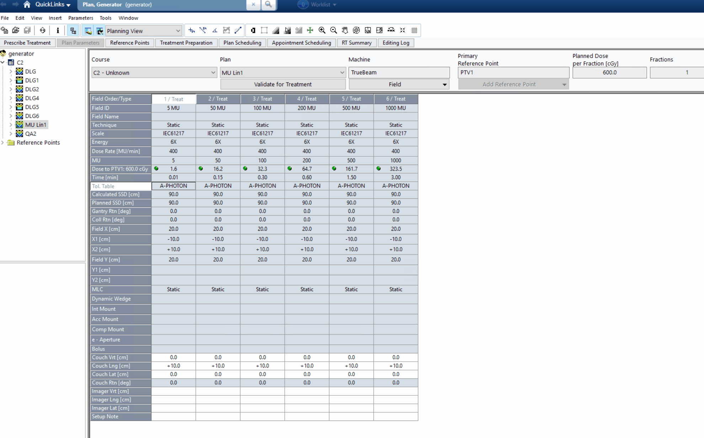
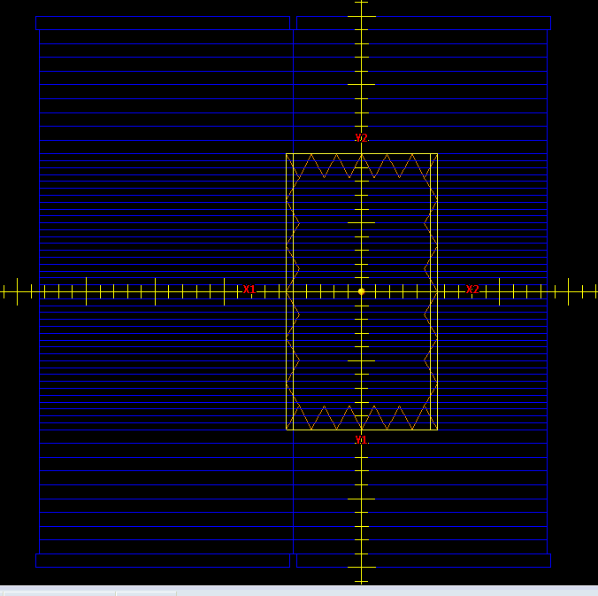
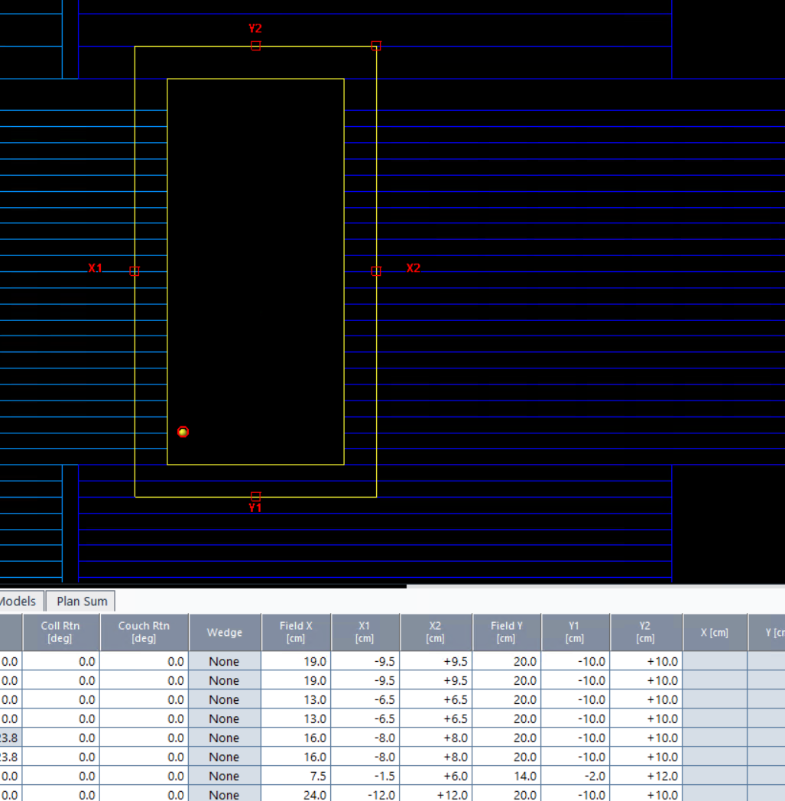

.. _plan-generator:

==============
Plan Generator
==============

The plan generator is a tool for generating QA plans customized for user needs.
It can create typical plans like picket fence, open fields, gantry speed, MLC speed, Winston-Lutz, dose rate constancy tests and more.

.. warning::

    This tool is meant for research and QA activities. It is not meant for actual patient treatment or use.
    Do not use this in conjunction with a patient plan.

.. warning::

    The module is still experimental. It will take a few releases to work out the kinks. It's also
    primarily designed for Varian machines and the Eclipse TPS (the defaults are set for such a configuration).

.. note::

    Units of parameters are always in mm and degrees unless otherwise specified. Parameter names are usually explicit
    for non-standard terms but are sometimes assumed for common terms/parameters.

Prerequisites
-------------

To use the plan generator a base RT Plan file (or dataset) is required from the machine and institution
it will be generating for. This is easy to do in Eclipse (and likely other TPSs) by creating/using a QA
patient and creating a simple plan on the machine of interest. The plan should have at least 1 field and
the field must contain MLCs. The MLCs don't have to do anything; it doesn't need to be dynamic plan.
The point is that a plan like this, regardless of what the MLCs are doing, simply contains the MLC setup information.
In list form, the plan should:

* Be based on a QA/research patient in your R&V (no real patients)
* Have a field with MLCs (static or dynamic)
* Be set to the machine of interest
* Set the tolerance table to the desired table

Once the plan is created and saved, export it to a DICOM file. This file will be used as the base plan for the generator.

This entire process can be done in the Plan Parameters of Eclipse
as shown below:

Use DICOM Import/Export to export the plan to a file.

Typical Use
-----------

.. note::

    There is a `Google Colab notebook <https://colab.research.google.com/drive/19tHHXUt1sZ2AgkEm3ZPLCxpkQjpeA5fK?usp=sharing>`__ you can also use to generate plans without needing a local
    setup.

Once a DICOM plan is generated and downloaded, it can be passed to the Plan Generator.
The plan generator can then add QA fields into the plan.

.. code-block:: python

    from pylinac.plan_generator.dicom import PlanGenerator

    rt_plan_file = r"C:\path\to\plan.dcm"
    generator = PlanGenerator.from_rt_plan_file(
        rt_plan_file, plan_name="New QA Plan", plan_label="New QA"
    )

    # add a picket fence beam
    generator.add_picketfence_beam(
        strip_width_mm=3,
        strip_positions_mm=(-100, -50, 20, 80),  # 4 pickets
        mu=100,
        beam_name="PF 3mm",
        y1=-150,
        y2=150,  # set y-jaws so we can leave the EPID at 1500
        gantry_angle=90,
        coll_angle=0,
    )

    # add a simple open field
    pg.add_open_field_beam(
        x1=-5,
        x2=5,
        y1=-10,
        y2=110,
        defined_by_mlcs=True,
        padding_mm=10,
    )

    # when done, export
    generator.to_file("new_plan.dcm")

You may add as many fields as desired to the plan. The generator will update the plan with the new fields in the order they are
added. You can also create multiple separate plans this way by just adding 1 field or set of fields
at a time if multiple plans is more akin to your workflow.

Plotting Fluence
----------------

Separate, but related, we can plot the generated fluences to ensure they are as expected before re-importing.
See the :ref:`plan_fluence` section for more information.

.. code-block:: python

    generator.plot_fluences(width_mm=300, resolution_mm=0.3)

Once the plan is generated, we can import it back into our TPS.

.. _plan_generator_dicom_fluence:

DICOM Images of Fluence
-----------------------

.. versionadded:: 3.27

The plan generator can also export the fluence of the generated plan as DICOM images. This can be useful for
simulating the full end-to-end process of the plan, including imaging and image analysis. In
contrast to plotting the fluence, which is useful for visual inspection, the DICOM images can be used for
image analysis. Of course, fluence is not the same as the actual dose delivered but it can
be useful nonetheless.

.. tip::

    To make the fluence images more realistic, you can apply filters such as a Gaussian filter to the image when saving.

To export the fluences to DICOM datasets, use the :meth:`~pylinac.plan_generator.dicom.PlanGenerator.to_dicom_images` method:

.. note::

    If the simulator image is not the same size as the fluence, the fluence will be centered on the simulator image.
    If the fluence is too large, it will be centered and then cropped to fit the simulator image. The DICOM
    images will always be set to SID=1000mm.

.. code-block:: python

    from pylinac.plan_generator.dicom import PlanGenerator
    from pylinac.core.image_generator import AS1200Image

    generator = PlanGenerator.from_rt_plan_file(...)

    # add fields; generator.add_...

    # export to DICOM datasets
    datasets = generator.to_dicom_images(
        simulator=AS1200Image,
    )

``datasets`` will be a list of DICOM datasets. You can then save these datasets to disk or use them in your image analysis software.

.. code-block:: python

    for i, ds in enumerate(datasets):
        ds.save_as(f"fluence_{i}.dcm")

Alternatively, you can apply a Gaussian filter to add some realism from fluence->dose:

.. code-block:: python

   for i, ds in enumerate(datasets):
       img = DicomImage.from_dataset(ds)
       img.filter(size=0.01, "gaussian")
       img.save(f"fluence_{i}.dcm")

These files can then be used in your image analysis software to simulate the delivery of the plan.

.. code-block:: python

   from pylinac import PicketFence

   pf = PicketFence("fluence_0.dcm")
   ...

Delivering the Plan
-------------------

While the generated RT plan is nearly complete,
it still needs to be plan approved, scheduled, etc. Also, when delivering the plan,
you will have to add imaging on the fly to capture images. Depending on how
you set the y-jaws and the size of your ROIs, you may need to adjust the EPID
distance.

.. _prefab-rt-plans:

Pre-Generated Plans
-------------------

If you're too "busy" to generate your own plans, you can use the following generated plans.

.. note::

  These plans are not customized to your machine or institution like they would
  be if you used the plan generator itself. On a Varian machine you will need to
  perform a machine override authorization every time.

These plans contain the following fields:

* "PF 3mm G0": Picket fence, Gantry 0, 3mm strips, 100 MU
* "PF 3mm G90": Picket fence, Gantry 90, 3mm strips, 100 MU
* "PF 3mm G180": Picket fence, Gantry 180, 3mm strips, 100 MU
* "PF 3mm G270": Picket fence, Gantry 270, 3mm strips, 100 MU
* "G0C0P0": Winston-Lutz, Gantry 0, Collimator 0, Couch 0, 2x2cm, 5 MU, MLC-defined
* "G90C0P0": Winston-Lutz, Gantry 90, Collimator 0, Couch 0, 2x2cm, 5 MU, MLC-defined
* "G180C0P0": Winston-Lutz, Gantry 180, Collimator 0, Couch 0, 2x2cm, 5 MU, MLC-defined
* "G270C0P0": Winston-Lutz, Gantry 270, Collimator 0, Couch 0, 2x2cm, 5 MU, MLC-defined
* "G0C270P0": Winston-Lutz, Gantry 0, Collimator 270, Couch 0, 2x2cm, 5 MU, MLC-defined
* "G0C90P0": Winston-Lutz, Gantry 0, Collimator 90, Couch 0, 2x2cm, 5 MU, MLC-defined
* "G0C315P0": Winston-Lutz, Gantry 0, Collimator 315, Couch 0, 2x2cm, 5 MU, MLC-defined
* "G0C45P0": Winston-Lutz, Gantry 0, Collimator 45, Couch 0, 2x2cm, 5 MU, MLC-defined
* "G0C0P45": Winston-Lutz, Gantry 0, Collimator 0, Couch 45, 2x2cm, 5 MU, MLC-defined
* "G0C0P90": Winston-Lutz, Gantry 0, Collimator 0, Couch 90, 2x2cm, 5 MU, MLC-defined
* "G0C0P315": Winston-Lutz, Gantry 0, Collimator 0, Couch 315, 2x2cm, 5 MU, MLC-defined
* "G0C0P270": Winston-Lutz, Gantry 0, Collimator 0, Couch 270, 2x2cm, 5 MU, MLC-defined
* "G45C15P15": Winston-Lutz, Gantry 45, Collimator 15, Couch 15, 2x2cm, 5 MU, MLC-defined
* "G5C330P60": Winston-Lutz, Gantry 5, Collimator 330, Couch 60, 2x2cm, 5 MU, MLC-defined
* "G330C350P350": Winston-Lutz, Gantry 330, Collimator 350, Couch 350, 2x2cm, 5 MU, MLC-defined
* "DR100-600": Dose Rate Constancy, 4 ROIs, 100, 200, 400, 600 MU/min
* "DR Ref": Dose Rate Constancy, Reference Field
* "MLC Speed": MLC Speed, 4 ROIs, 5, 10, 15, 20 mm/s
* "MLC Speed Ref": MLC Speed, Reference Field
* "GS": Gantry Speed, 4 ROIs, 1, 2, 3, 4 deg/s
* "GS Ref": Gantry Speed, Reference Field

.. tab-set::
   :sync-group: mlc-type

   .. tab-item:: Millennium
      :sync: millennium

      * `6 MV <https://storage.googleapis.com/pylinac_demo_files/rtplans/R1_6MV_M120_prefab.dcm>`__
      * `6 MV FFF <https://storage.googleapis.com/pylinac_demo_files/rtplans/R1_6MVFFF_M120_prefab.dcm>`__
      * `10 MV <https://storage.googleapis.com/pylinac_demo_files/rtplans/R1_10MV_M120_prefab.dcm>`__
      * `10 MV FFF <https://storage.googleapis.com/pylinac_demo_files/rtplans/R1_10MVFFF_M120_prefab.dcm>`__
      * `15 MV <https://storage.googleapis.com/pylinac_demo_files/rtplans/R1_15MV_M120_prefab.dcm>`__
      * `18 MV <https://storage.googleapis.com/pylinac_demo_files/rtplans/R1_18MV_M120_prefab.dcm>`__

   .. tab-item:: HD Millennium
      :sync: hd-millennium

      * `6 MV <https://storage.googleapis.com/pylinac_demo_files/rtplans/R1_6MV_HD120_prefab.dcm>`__
      * `6 MV FFF <https://storage.googleapis.com/pylinac_demo_files/rtplans/R1_6MVFFF_HD120_prefab.dcm>`__
      * `10 MV <https://storage.googleapis.com/pylinac_demo_files/rtplans/R1_10MV_HD120_prefab.dcm>`__
      * `10 MV FFF <https://storage.googleapis.com/pylinac_demo_files/rtplans/R1_10MVFFF_HD120_prefab.dcm>`__
      * `15 MV <https://storage.googleapis.com/pylinac_demo_files/rtplans/R1_15MV_HD120_prefab.dcm>`__
      * `18 MV <https://storage.googleapis.com/pylinac_demo_files/rtplans/R1_18MV_HD120_prefab.dcm>`__

Models
------

Overview
^^^^^^^^

To generate new QA customized plans, we start with a base QA plan that must contain a few key tags.
A new ``PlanGenerator`` instance is created. As the user adds fields, the generator will update the plan.
It updates this by generating an ``MLCShaper`` "shape" for each beam by generating control points and leaf positions.
This shape is then passed to a ``Beam``, which is a wrapper for a DICOM ``BeamSequence``. The beam is then added to the plan.

Plan Generator
^^^^^^^^^^^^^^

The plan generator works by starting with an existing RTPlan. The plan itself does not need to be
advanced. It only requires 1 field and the MLC configuration. The need for this is to know the machine
name, machine SN, MLC model, and tolerance table (by way of the DICOM tags).

The required tags are:

* Patient Name (0010, 0010) - This isn't changed, just referenced so that the exported plan has the same patient name.
* Patient ID (0010, 0020) - This isn't changed, just referenced so that the exported plan has the same patient ID.
* Machine Name (300A, 00B2) - This isn't changed, just referenced so that the exported plan has the same machine name.
* BeamSequence (300A, 00B0) - This is used to determine the MLC configuration. Specifically, the ``LeafPositionBoundaries``
  of the last ``BeamLimitingDeviceSequence`` of the first beam.

  .. note::

      Only the first beam is considered. Extra beams are ignored.

* Tolerance Table Sequence (300A, 0046) - This is required and will be reference by the generated beams. Only
  the first tolerance table is considered. This is not changed by the generator.

The generator will use this information skeleton to then create new fields as desired by the users.

The tags changed are:

* RT Plan Label (300A, 0003) - This is changed to reflect the new plan label.
* RT Plan Name (300A, 0002) - This is changed to reflect the new plan name.
* Instance Creation Time (0008, 0013) - This is changed to reflect the new plan creation time (now).
* Instance Creation Date (0008, 0012) - This is changed to reflect the new plan creation date (now).
* SOP Instance UID (0008, 0018) - A new, random UID is generated so it doesn't conflict with the original plan.
* Patient Setup Sequence (300A, 0180) - This is overwritten to a new, single setup.
* Dose Reference Sequence (300A, 0016) - This is overwritten to a new, single dose reference.
* Fraction Group Sequence (300A, 0070) - This is overwritten to a new, single fraction group and
  is dynamically updated based on the fields added by the user.
* Beam Sequence (300A, 00B0) - This is overwritten and is dynamically updated based on the
  fields added by the user.
* Referenced Beam Sequence (300C, 0006) - This is overwritten and is dynamically updated based on the
  fields added by the user.

Other than these, the generator does not change the tags. E.g. patient birth date, etc are all left alone.

MLC Shaper
^^^^^^^^^^

The ``MLCShaper`` class is an homage to the Varian MLC Shaper application, perhaps the greatest application
Varian has created aside from MPC. It is a tool for creating basic shapes defined by the MLCs, as well as the
required control points and leaf positions for those shape. The shaper can then export these items as
DICOM control points and meterset values

There are two concepts with the shaper:

* Static dose - This is the relative dose given after the MLCs reach their target. An example is an open field or
  a picket fence. There are two control points: the start and end position. The MLC positions are the same but the meterset value
  changes. In the case of a picket fence with 10 pickets, there are at least 20 control points since each picket has a
  start and end position.
* Dose in transition - This is the relative dose given when moving from one shape to another. This is how a sweeping
  pattern can be created. The meterset value is incremented as desired for the transitional move.

These concepts can be combined to create combinations of sweeps and static shapes. E.g. if a transition dose is
given as well as the static dose, this will create 2 control points. The MLC positions will be the same, but
the meterset will increment first by the transition dose, then the static dose.

Beam
^^^^

The ``Beam`` class is a wrapper for a DICOM ``BeamSequence``. It is used to construct a proper Dataset
for a beam. It will take in a few parameters such as the Plan Dataset, jaw positions, energy, control points, etc. It will then
properly create the Beam Dataset including the control points, references to the tolerance table and more.
The difference between this and the ``MLCShaper`` is that the ``Beam`` also contains the other DICOM tags
such as couch position, MU, gantry angle, etc.

Sacrifices
^^^^^^^^^^

The generator can generate beams that modulate the dose rate. This is done through "sacrifices", or "throws", of
MLC movement. Given that (for Varian at least) all axes move as fast as they can, the beam will not
use a slower dose rate unless something else is slowing it down. For the concept of understanding
the generator, the axes are slowed down by moving the first and last MLC pair by a certain distance.
Given a max leaf speed, the movement will take a known amount of time. This time is then used to calculate
the dose rate. By constraining the desired MU of a given ROI with the sacrificial movements, the dose rate
can be modulated to a target value.

As an example, in the case of MLC speed, 4 ROIs delivered at different speeds would require different MU values
for each ROI. Lowering the MU would increase the speed of the MLCs to reach the target by the time the MU is delivered.
However, changing the MU would change the dose delivered. To keep the dose to each ROI constant, the generator will
use the sacrificial movements. Although it might be simpler to scale the ROIs after the fact in the image analysis
software, having an image where the dose is constant across all ROIs is more intuitive, but comes at the expense of
these sacrificial movements.

Fields
------

For each of the following examples, assume a setup like the following:

.. code-block:: python

    from pylinac.plan_generator.dicom import PlanGenerator

    path = r"path/to/my/rtplan.dcm"
    pg = PlanGenerator.from_rt_plan_file(path, plan_label="MyQA", plan_name="QA")

For context about jaw positions, the following convention is assumed:

Finally, remember to plot the fluence after generating the plan to ensure it looks as expected. See the :ref:`plan_fluence` section for more information.

Open Field
^^^^^^^^^^

Adding an open field can be done like so:

.. code-block:: python

  pg.add_open_field_beam(
      x1=-5,
      x2=50,
      y1=-10,
      y2=110,
      defined_by_mlcs=True,
      padding=10,
      beam_name="Open Field",
  )

See the :meth:`~pylinac.plan_generator.dicom.PlanGenerator.add_open_field_beam` method for more information.
A jaw-defined field can be created by setting ``defined_by_mlcs=False``. The MLCs will be opened up
by the ``padding`` value behind the jaws.

Winston-Lutz
^^^^^^^^^^^^

Winston-Lutz images are open fields, but can be created at given gantry, collimator, and couch angles
more efficiently. Adding a Winston-Lutz field can be done like so:

.. code-block:: python

    pg.add_winston_lutz_beams(
        axes_positions=(
            {"gantry": 0, "collimator": 0, "couch": 0},
            {"gantry": 90, "collimator": 15, "couch": 0},
            {"gantry": 180, "collimator": 0, "couch": 90},
            {"gantry": 270, "collimator": 0, "couch": 0},
        ),
        x1=-5,
        x2=5,
        y1=-5,
        y2=5,
        defined_by_mlcs=True,
        mu=5,
    )

This will create 4 open fields of a 1x1cm, MLC-defined WL fields. See the :meth:`~pylinac.plan_generator.dicom.PlanGenerator.add_winston_lutz_beams` method for more information.

.. versionadded:: 3.27

You can pass your own beam name for a given axes position by adding a ``name`` key to the dictionary. If no name
key is passed the beam name will be of the form "G<gantry>C<collimator>P<couch>".

.. code-block:: python

    pg.add_winston_lutz_beams(
        axes_positions=(
            {"gantry": 0, "collimator": 0, "couch": 0, "name": "Ref"},
            {"gantry": 90, "collimator": 15, "couch": 0},  # auto-name: G90C15P0
            {"gantry": 180, "collimator": 0, "couch": 90},  # auto-name: G180C0P90
            {"gantry": 270, "collimator": 0, "couch": 0},  # auto-name: G270C0P0
        ),
        ...,
    )

Picket Fence
^^^^^^^^^^^^

Adding a picket fence field can be done like so:

.. code-block:: python

    pg.add_picketfence_beam(
        strip_width=3,
        strip_positions=(-50, -25, 25, 50),  # 4 pickets
        mu=100,
        beam_name="PF 3mm",
        y1=-130,
        y2=130,  # set y-jaws so we can leave the EPID at 1500
        gantry_angle=90,
        coll_angle=0,
    )

This will create 4 pickets 3mm wide. The X-jaws will be opened up just wider than the pickets. See the :meth:`~pylinac.plan_generator.dicom.PlanGenerator.add_picketfence_beam` method for more information.

.. note::

    Setting positions too wide can cause an MLC tail exposure, which can cause an issue of deliverability at the
    Machine. Don't make the picket positions super far apart. If you want to deliver pickets far away from 0,
    shift all the pickets over. E.g. ``(-180, -160, -140, -120)``.

Dose Rate
^^^^^^^^^

Adding a single-image dose rate linearity field can be done like so:

.. code-block:: python

    pg.add_dose_rate_beams(
        dose_rates=(100, 200, 400, 600),
        y1=-50,
        y2=50,
        default_dose_rate=600,
        desired_mu=100,
    )

This will create 4 ROIs centered about the CAX at different dose rates.
A second reference field will also be created. This second field will deliver
the same plan but at the default dose rate for all ROIs. This makes the
comparison of the ROIs easier than an simple open field.

See the :meth:`~pylinac.plan_generator.dicom.PlanGenerator.add_dose_rate_beams` method for more information.

MLC Speed
^^^^^^^^^

Adding an MLC speed field can be done like so:

.. code-block:: python

    pg.add_mlc_speed_beams(
        speeds=(5, 10, 15, 20),
        roi_size_mm=20,
        y1=-50,
        y2=50,
        mu=100,
        default_dose_rate=600,
    )

This is similar to the dose rate beams, except the modulation occurs to target the MLC speed.
A second field is also created where the speed is the maximum speed of the MLCs.
See the :meth:`~pylinac.plan_generator.dicom.PlanGenerator.add_mlc_speed_beams` method for more information.

.. note::

    The typical VMAT plan from Varian that tests gantry-speed/MLC-speed is just that: VMAT.
    The two variables are intertwined. This test isolates those variables so that *just*
    the MLC speed can be tested.

Gantry Speed
^^^^^^^^^^^^

Adding a gantry speed field can be done like so:

.. code-block:: python

    pg.add_gantry_speed_beams(
        speeds=(1, 2, 3, 4),
        max_dose_rate=600,
        start_gantry_angle=179,
        roi_size_mm=20,
        y1=-50,
        y2=50,
        mu=100,
    )

This will create multiple ROIs at different gantry speeds. The ROIs themselves
are simple, open deliveries. The point here is to *only* test the gantry speed.
The MLCs are not moving during beam-on.

.. note::

    The typical VMAT plan from Varian that tests gantry-speed/dose rate is just that: VMAT.
    The two variables are intertwined. This test isolates those variables so that *just*
    the gantry speed can be tested.

.. _halcyon-plan-generator:

Halcyon
--------

The Halcyon plan generator is a subclass of the PlanGenerator. It is specially made to handle
plans for the Halcyon machine. The Halcyon machine has a double stack of MLCs, which complicate matters.

Currently, only picket fence fields are supported but more will be added in the future to
match the normal plan generator.

Picket Fence
^^^^^^^^^^^^

Adding a picket fence field can be done like so:

.. code-block:: python

    from pylinac.plan_generator.dicom import HalcyonPlanGenerator, STACK

    path = r"path/to/my/rtplan.dcm"
    pg = HalcyonPlanGenerator.from_rt_plan_file(path, plan_label="MyQA", plan_name="QA")
    pg.add_picketfence_beam(
        stack=STACK.DISTAL,
        strip_width=3,
        strip_positions=(-50, -25, 25, 50),  # 4 pickets
        mu=100,
        beam_name="PF 3mm",
        gantry_angle=90,
        coll_angle=0,
    )

API Documentation
------------------

.. autoclass:: pylinac.plan_generator.dicom.PlanGenerator

.. autoclass:: pylinac.plan_generator.dicom.HalcyonPlanGenerator

.. autoclass:: pylinac.plan_generator.dicom.STACK

.. autoclass:: pylinac.plan_generator.dicom.Beam

.. autoclass:: pylinac.plan_generator.dicom.HalcyonBeam

.. autoclass:: pylinac.plan_generator.mlc.MLCShaper
