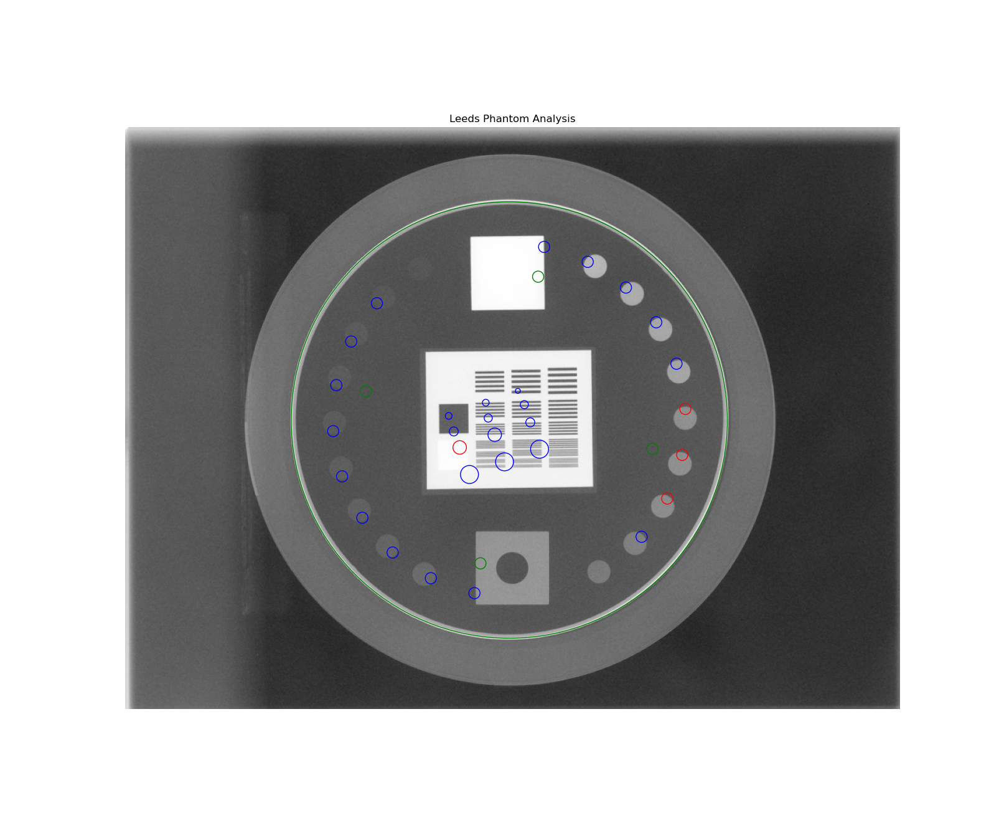
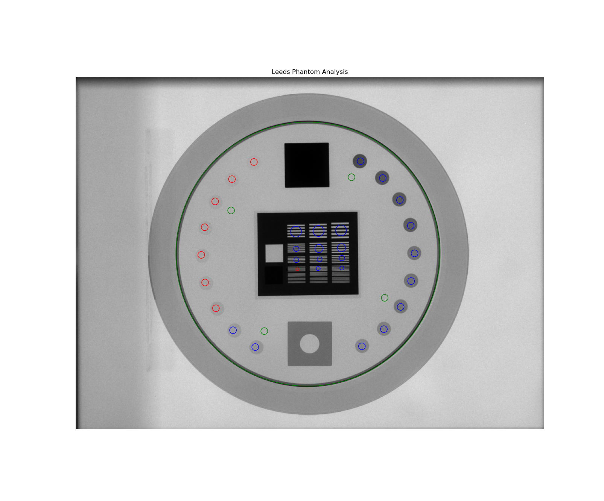
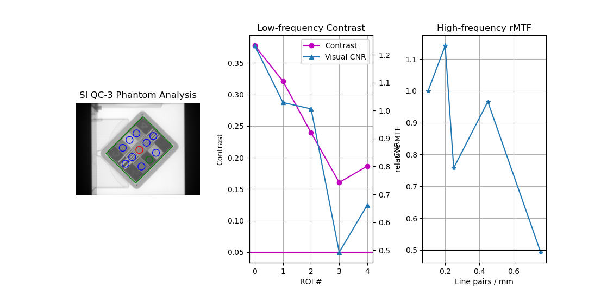

.. _planar_imaging:

==============
Planar Imaging
==============

Overview
--------

.. automodule:: pylinac.planar_imaging
    :no-members:

.. _typical_planar_usage:

Typical module usage
--------------------

The following snippets can be used with any of the phantoms in this module; they all have the same or very similar
methods. We will use the LeedsTOR for the example, but plug in any phantom from this module.

Running the Demo
^^^^^^^^^^^^^^^^

To run the demo of any phantom, create a script or start an interpreter session and input:

.. code-block:: python

    from pylinac import LeedsTOR  # or LasVegas, DoselabMC2kV, etc

    LeedsTOR.run_demo()

A figure showing the phantom, low contrast plot, and RMTF will be generated:

.. plot::
    :include-source: false

    from pylinac import LeedsTOR
    LeedsTOR.run_demo()

Typical Use
^^^^^^^^^^^

Import the class:

.. code-block:: python

    from pylinac import LeedsTOR  # or whatever phantom you like from the planar imaging module

The minimum needed to get going is to:

* **Load image** -- Load the planar image as you would any other class: by passing the path directly to the constructor:

  .. code-block:: python

      leeds = LeedsTOR('my/leeds.dcm')

  Alternatively, a URL can be passed:

  .. code-block:: python

      leeds = LeedsTOR.from_url('http://myserver.com/leeds')

  You may also use the demo image:

  .. code-block:: python

      leeds = LeedsTOR.from_demo_image()

* **Analyze the images** -- Analyze the image using the :meth:`~pylinac.planar_imaging.LeedsTOR.analyze` method. The
  low and high contrast thresholds can be specified:

  .. code-block:: python

     leeds.analyze(low_contrast_threshold=0.01, high_contrast_threshold=0.5)

  Additionally, you may specify the SSD of the phantom if it is not at iso (e.g. sitting on the panel):

  .. code-block:: python

     leeds.analyze(..., ssd=1400)

* **View the results** -- The results of analysis can be viewed with the :meth:`~pylinac.planar_imaging.LeedsTOR.plot_analyzed_image`
  method.

  .. code-block:: python

      leeds.plot_analyzed_image()

  .. plot::
      :include-source: false

        from pylinac import LeedsTOR
        lt = LeedsTOR.from_demo_image()
        lt.analyze(low_contrast_threshold=0.01, high_contrast_threshold=0.5)
        lt.plot_analyzed_image()

  Note that each subimage can be turned on or off.

  .. code-block:: python

      # don't show the low contrast plot
      leeds.plot_analyzed_image(low_contrast=False)

  The figure can also be saved:

  .. code-block:: python

      leeds.save_analyzed_image('myprofile.png')

  A PDF report can also be generated:

  .. code-block:: python

      leeds.publish_pdf('leeds_october16.pdf')

Leeds TOR Phantom
-----------------

The Leeds phantom is used to measure image quality metrics for the kV imager of a linac. It contains both
high and low contrast ROIs.

Image Acquisition
^^^^^^^^^^^^^^^^^

You can acquire the images any way you like. Just ensure that the phantom is not touching a field edge. It
is also recommended by the manufacturer to rotate the phantom to a non-cardinal angle so that pixel aliasing does not occur for the
high-contrast line pairs.

Algorithm
^^^^^^^^^

Leeds phantom analysis is straightforward: find the phantom in the image, then sample ROIs at the appropriate
locations.

The algorithm works like such:

**Allowances**

* The images can be acquired at any SID.
* The images can be acquired with any size kV imager.
* The phantom can be at any distance.
* The phantom can be at any angle.
* The phantom can be flipped either way.

**Restrictions**

    .. warning:: Analysis can fail or give unreliable results if any Restriction is violated.

* The phantom must not be touching or close to any image edges.
* The blades should be fully or mostly open to correctly invert the image. This may not result in a complete failure,
  but you may have to force-invert the analysis if this case isn't true (i.e. ``myleeds.analyze(invert=True)``).
* The phantom should be centered near the CAX (<1-2cm).

**Pre-Analysis**

* **Determine phantom location** -- The Leeds phantom is found by performing a canny edge detection
  algorithm to the image. The thin structures found are sifted by finding appropriately-sized ROIs.
  This may include the outer phantom edge and the metal ring just inside. The average central position
  of the circular ROIs is set as the phantom center.
* **Determine phantom angle** -- To find the rotational angle of the phantom, a similar process is employed,
  but square-like features are searched for in the edge detection image. Because there are two square areas,
  the ROI with the highest attenuation (lead) is chosen. The angle between the phantom center and the lead
  square center is set as the angle.
* **Determine rotation direction** -- The phantom might be placed upside down. To keep analysis consistent,
  a circular profile is sampled at the radius of the low contrast ROIs starting at the lead square. Peaks are
  searched for on each semicircle. The side with the most peaks is the side with the higher contrast ROIs.
  Analysis is always done counter-clockwise. If the ROIs happen to be clockwise, the image is flipped
  left-right and angle/center inverted.

**Analysis**

* **Calculate low contrast** -- Because the phantom center and angle are known, the angles to the ROIs can also
  be known. From here, the contrast can be known; see :ref:`contrast`.
* **Calculate high contrast** -- Again, because the phantom position and angle are known, offsets are applied
  to sample the high contrast line pair regions. For each sample, the relative MTF is calculated. See :ref:`mtf_topic`.

**Post-Analysis**

* **Determine passing low and high contrast ROIs** -- For each low and high contrast region, the determined
  value is compared to the threshold. The plot colors correspond to the pass/fail status.

Troubleshooting
^^^^^^^^^^^^^^^

If you're having trouble getting the Leeds phantom analysis to work, first check out the :ref:`general_troubleshooting`
section. If the issue is not listed there, then it may be one of the issues below.

The most common reason for failing is having the phantom near an image edge. The resulting
error is usually that the phantom angle cannot be determined. For example, this image would throw an
error:

.. image:: images/bad_leeds.jpg

The below image also fails. Technically, the phantom is in the image, but the top blade skews the pixel
values such that the phantom edge cannot be properly found at the top. This fails to identify the true phantom
edge, causing the angle to also not be found:

.. image:: images/bad_leeds2.jpg

Another problem is that the image may have a non-uniform background. This can cause pylinac's automatic
inversion correction to incorrectly invert the image. For example, this image falsely inverts:

.. image:: images/leeds_uneven.jpg

When analyzed, the angle is 180 degrees opposite the lead square, causing the ROIs to be
flipped 180 degrees. To correct this problem, pass ``invert=True`` to :meth:`~pylinac.planar_imaging.LeedsTOR.analyze`.
This will force pylinac to invert the image the opposite way and correctly identify the lead square.

Another common problem is an offset analysis, as shown below:

This is caused by a wrong inversion.

.. note::

    If the image flash is dark, then the image inversion is very likely wrong.

Again, pass ``invert=True`` to the ``analyze`` method. This is the same image but with invert=True:

Standard Imaging QC-3 Phantom
-----------------------------

The Standard Imaging phantom is an MV imaging quality assurance phantom and has high and low contrast regions,
just as the Leeds phantom, but with different geometric configurations.

.. _qc3_image_acquisition:

Image Acquisition
^^^^^^^^^^^^^^^^^

The Standard Imaging phantom has a specific setup as recommended by the manufacturer. The phantom should be angled 45
degrees, with the "1" pointed toward the gantry stand and centered along the CAX. For best results when using pylinac,
open the jaws to fully cover the EPID, or at least give 1-2cm flash around the phantom edges.

.. warning::

    If using the acrylic jig that comes with the phantom, place a spacer of at least a few mm between the jig and the phantom.
    E.g. a slice of foam on each angled edge. This is because the edge detection of the phantom may fail at certain
    energies with the phantom abutted to the acrylic jig.

Algorithm
^^^^^^^^^

The algorithm works like such:

**Allowances**

* The images can be acquired at any SID.
* The images can be acquired with any EPID.
* The images can be acquired with the phantom at any SSD.

**Restrictions**

    .. warning:: Analysis can fail or give unreliable results if any Restriction is violated.

* The phantom must be at 45 degrees.
* The phantom must not be touching any image edges.
* The phantom should have the "1" pointing toward the gantry stand.
* The phantom should be centered near the CAX (<1-2cm).

**Pre-Analysis**

* **Determine phantom location** -- A canny edge search is performed on the image. Connected edges that
  are semi-round and angled are thought to possibly be the phantom. Of the ROIs, the one with the longest
  axis is said to be the phantom edge. The center of the bounding box of the ROI is set as the phantom center.
* **Determine phantom radius and angle** -- The major axis length of the ROI determined above serves as the
  phantom radius. The orientation of the edge ROI serves as the phantom angle.

**Analysis**

* **Calculate low contrast** -- Because the phantom center and angle are known, the angles to the ROIs can also
  be known. From here, the contrast can be known; see :ref:`contrast`.
* **Calculate high contrast** -- Again, because the phantom position and angle are known, offsets are applied
  to sample the high contrast line pair regions. For each sample, the relative MTF is calculated. See :ref:`mtf_topic`.

**Post-Analysis**

* **Determine passing low and high contrast ROIs** -- For each low and high contrast region, the determined
  value is compared to the threshold. The plot colors correspond to the pass/fail status.

Troubleshooting
^^^^^^^^^^^^^^^

If you're having issues with the StandardImaging class, make sure you have correctly positioned the phantom as per
the manufacturer's instructions (also see :ref:`qc3_image_acquisition`). One issue that may arise is incorrect
inversion. If the jaws are closed tightly around the phantom, the automatic inversion correction may falsely
invert the image, just as for the Leeds phantom. If you have an image that looks inverted or just plain weird, add ``invert=True``
to :meth:`~pylinac.planar_imaging.StandardImagingQC3.analyze`. If this doesn't help, reshoot the phantom with the jaws open.

Las Vegas Phantom
-----------------

The Las Vegas phantom is for MV image quality testing and includes low contrast regions of varying contrast and size.

Image Acquisition
^^^^^^^^^^^^^^^^^

The Las Vegas phantom has a recommended position as stated on the phantom. Pylinac will however account for angles,
shifts, and inversions. Best practices for the Las Vegas phantom:

* Keep the phantom from a couch edge or any rails.

Algorithm
^^^^^^^^^

The algorithm works like such:

**Allowances**

* The images can be acquired at any SID.
* The images can be acquired with any EPID.

**Restrictions**

    .. warning:: Analysis can fail or give unreliable results if any Restriction is violated.

* The phantom must not be touching any image edges.
* The phantom should be at a cardinal angle (0, 90, 180, or 270 degrees) relative to the EPID.
* The phantom should be centered near the CAX (<1-2cm).

**Pre-Analysis**

* **Determine phantom location** -- A canny edge search is performed on the image. Connected edges that
  are semi-round and angled are thought to possibly be the phantom. Of the ROIs, the one with the longest
  axis is said to be the phantom edge. The center of the bounding box of the ROI is set as the phantom center.
* **Determine phantom radius and angle** -- The major axis length of the ROI determined above serves as the
  phantom radius. The orientation of the edge ROI serves as the phantom angle.

**Analysis**

* **Calculate low contrast** -- Because the phantom center and angle are known, the angles to the ROIs can also
  be known. From here, the contrast can be known; see :ref:`contrast`.

**Post-Analysis**

* **Determine passing low and high contrast ROIs** -- For each low and high contrast region, the determined
  value is compared to the threshold. The plot colors correspond to the pass/fail status.

Doselab MC2 MV & kV
-------------------

The Doselab MC2 phantom is for both kV & MV image quality testing and includes low and high contrast regions of varying contrast.
There are two high contrast sections, one intended for kV and one for MV.

Image Acquisition
^^^^^^^^^^^^^^^^^

The Doselab phantom has a recommended position as stated on the phantom. Pylinac will however account for
shifts and inversions. Best practices for the Doselab phantom:

* Keep the phantom away from a couch edge or any rails.
* Center the phantom along the CAX.

Algorithm
^^^^^^^^^

The algorithm works like such:

**Allowances**

* The images can be acquired at any SID.
* The images can be acquired with any EPID.

**Restrictions**

    .. warning:: Analysis can fail or give unreliable results if any Restriction is violated.

* The phantom must not be touching any image edges.
* The phantom should be at 45 degrees relative to the EPID.
* The phantom should be centered near the CAX (<1-2cm).

Standard Imaging FC-2
---------------------

The FC-2 phantom is for testing light/radiation coincidence.

.. note:: A phantom is not actually needed for light/radiation coincidence. Just use your graph paper after doing mechanicals to do an open image. 😉

Image Acquisition
^^^^^^^^^^^^^^^^^

The FC-2 phantom should be placed on the couch at 100cm SSD.

* Keep the phantom away from a couch edge or any rails.

Algorithm
^^^^^^^^^

The algorithm works like such:

**Allowances**

* The images can be acquired at any SID.
* The images can be acquired with any EPID.

**Restrictions**

    .. warning:: Analysis can fail or give unreliable results if any Restriction is violated.

* The phantom should be at a cardinal angle (0, 90, 180, or 270 degrees) relative to the EPID.
* The phantom should be centered near the CAX (<1cm).
* The phantom should be +/- 1cm from 100cm SSD.

**Pre-Analysis**

* **Determine BB set to use** -- There are two sets of BBs, one for 10x10cm and another for 15x15cm. To
  get the maximum accuracy, the larger set is used if a 15x15cm field is irradiated. The field size is
  determined and if it's >14cm then the algorithm will look for the larger set. Otherwise, it will look for the smaller 4.

**Analysis**

* **Get BB centroid** -- Once the BB set is chosen, image windows look for the BBs in a 1x1cm square. Once it finds them,
  the centroid of all 4 BBs is calculated.
* **Determine field center** -- The field size is measured along the center of the image in the inplane and crossplane direction.
  A 5mm strip is averaged and used to reduce noise.

**Post-Analysis**

* **Comparing centroids** -- The irradiated field centroid is compared to the EPID/image center as well as the the BB centroid.
  The field size is also reported.

Customizing behavior
^^^^^^^^^^^^^^^^^^^^

The BB window as well as the expected BB positions, and field strip size can be overridden like so:

.. code-block:: python

    from pylinac import StandardImagingFC2

    class MySIFC2(StandardImagingFC2):
        bb_sampling_box_size_mm = 20  # look at a 20x20mm window for the BB at the expected position
        # change the 10x10 BB expected positions. This is in mm relative to the CAX.
        bb_positions_10x10 = {'TL': [-30, -30], 'BL': [-30, 30], 'TR': [30, -30], 'BR': [30, 30]}
        bb_positions_15x15 = ... # same as above
        field_strip_width_mm = 10  # 10mm strip in x and y to determine field size

    # use as normal
    fc2 = MySIFC2(...)

.. _creating_a_custom_phantom:

Creating a custom phantom
-------------------------

In the event you would like to analyze a phantom that pylinac does not analyze out of the box,
the pylinac planar imaging module structure allows for generating new phantom analysis types quickly and easily.
The benefit of this design is that with a few simple definitions you inherit a strong base of methods
(e.g. plotting and PDF reports come for free).

Creating a new class involves a few different steps but can be done in a few minutes. The following is a guide for custom
phantoms:

1. Subclass the `ImagePhantomBase` class:

    .. code-block:: python

        from pylinac.planar_imaging import ImagePhantomBase

        class CustomPhantom(ImagePhantomBase):
            pass

2. Define the `common_name`. This is the name shown in plots and PDF reports.

    .. code-block:: python

        class CustomPhantom(ImagePhantomBase):
            common_name = 'Custom Phantom v2.0'

3. If the phantom has a high-contrast measurement object, define the ROI locations.

    .. code-block:: python

        class CustomPhantom(ImagePhantomBase):
            ...
            high_contrast_roi_settings = {
                'roi 1': {'distance from center': 0.5, 'angle': 30, 'roi radius': 0.05, 'lp/mm': 0.2},
                ...  # add as many ROIs as are needed
            }

    .. note::

        The exact values of your ROIs will need to be empirically determined. This usually involves an iterative process of
        adjusting the values until the values are satisfactory based on the ROI sample alignment to the actual ROIs.

4. If the phantom has a low-contrast measurement object, define the sample ROI and background ROI locations.

    .. code-block:: python

        class CustomPhantom(ImagePhantomBase):
            ...
            low_contrast_roi_settings = {
                'roi 1': {'distance from center': 0.5, 'angle': 30, 'roi radius': 0.05},  # no lp/mm key
                ...  # add as many ROIs as are needed
            }
            low_contrast_background_roi_settings = {
                'roi 1': {'distance from center': 0.3, 'angle': -45, 'roi radius': 0.02},
                ...  # add as many ROIs as are needed
            }

    .. note::

        The exact values of your ROIs will need to be empirically determined. This usually involves an iterative process of
        adjusting the values until the values are satisfactory based on the ROI sample alignment to the actual ROIs.

5. Set the "detection conditions", which is the list of rules that must be true to properly detect the phantom ROI.
   E.g. the phantom should be near the center of the image.
   Detection conditions must always have a specific signature as shown below:

    .. code-block:: python

        def my_special_detection_condition(region: RegionProperties, instance: object, rtol: float) -> bool:
            # region is a scikit regionprop (https://scikit-image.org/docs/dev/api/skimage.measure.html#skimage.measure.regionprops)
            # instance == self of the phantom
            # rtol is relative tolerance of agreement. Don't have to use this.
            do_stuff  # e.g. is the region size and position correct?
            return bool(result)  # must always return a boolean

        class CustomPhantom(ImagePhantomBase):
            detection_conditions = [my_special_detection_condition,]  # list of conditions; add as many as you want.

6. Optionally, add a phantom outline object. This helps visualize the algorithm's determination of the size, center, and angle.
   If no object is defined, then no outline will be shown. This step is optional.

    .. code-block:: python

        class CustomPhantom(ImagePhantomBase):
            ...
            phantom_outline_object = {'Circle': {'radius ratio': 0.5}}  # to create a circular outline
            # or...
            phantom_outline_object = {'Rectangle': {'width ratio': 0.5, 'height ratio': 0.3}}  # to create a rectangular outline

At this point you could technically call it done. You would need to always override the angle, center, and size values in the analyze method however.
To automate this part you will need to fill in the associated logic. You can use whatever method you like. What I have
found most useful is to use an edge detection algorithm and find the outline of the phantom.

    .. code-block:: python

        class CustomPhantom(ImagePhantomBase):
            ...

            def _phantom_center_calc(self) -> Point:
                # do stuff in here to determine the center point location.
                # don't forget to return as a Point item (pylinac.core.geometry.Point).

            def _phantom_radius_calc(self) -> float:
                # do stuff in here to return a float that represents the phantom radius value.
                # This value does not have to relate to a physical measure. It simply defines a value that the ROIs scale by.

            def _phantom_angle_calc(self) -> float:
                # do stuff in here to return a float that represents the angle of the phantom.
                # Again, this value does not have to correspond to reality; it simply offsets the ROIs.
                # You may also return a constant if you like for any of these.

Congratulations! You now have a fully-functioning custom phantom. By using the base class and the predefined attributes
and methods, the plotting and PDF report functionality comes for free.

Usage tips, tweaks, & troubleshooting
-------------------------------------

Set the SSD of your phantom
^^^^^^^^^^^^^^^^^^^^^^^^^^^

If your phantom is at a non-standard distance (!= 1000mm), e.g. sitting on the EPID panel, you can specify its
distance via the ``ssd`` parameter.

.. warning::

    The ``ssd`` should be in mm, not cm. Pylinac is moving toward consistent units on everything and it will be mm for distance.

.. code-block:: python

    from pylinac import StandardImagingQC3

    qc = StandardImagingQC3(...)
    qc.analyze(..., ssd=1500)  # distance to the phantom in mm.

Adjust an ROI on an existing phantom
^^^^^^^^^^^^^^^^^^^^^^^^^^^^^^^^^^^^

To adjust an ROI, override the relevant attribute or create a subclass. E.g. to move the 2nd ROI of the high-contrast ROI set of the QC-3 phantom:

.. code-block:: python

    from pylinac import StandardImagingQC3

    StandardImagingQC3.high_contrast_roi_settings['roi 1']['distance from center'] = 0.05  # overrides that one setting
    qc3 = StandardImagingQC3(...)

    # or

    class TweakedStandardImagingQC3(StandardImagingQC3):
        high_contrast_roi_settings = {
            'roi 1': ...
        }  # note that you must replace ALL the values

    qc3 = TweakedStandardImagingQC3(...)

Calculate a specific MTF
^^^^^^^^^^^^^^^^^^^^^^^^

To calculate a specific MTF value, i.e. the frequency at a given MTF%:

.. code-block:: python

    dl = DoselabMC2kV(...)
    dl.analyze(...)
    print(dl.mtf.relative_resolution(x=50))  # 50% rMTF

Get/View the contrast of a low-contrast ROI
^^^^^^^^^^^^^^^^^^^^^^^^^^^^^^^^^^^^^^^^^^^

.. code-block:: python

    leeds = LeedsTOR(...)
    leeds.analyze(...)
    print(leeds.low_contrast_rois[1].contrast)  # get the 2nd ROI contrast value

Loosen the ROI finding conditions
^^^^^^^^^^^^^^^^^^^^^^^^^^^^^^^^^

If for some reason you have a need to loosen the existing phantom-finding algorithm conditions you can
do so fairly easily by overloading the current tooling:

.. code-block:: python

    from pylinac.planar_imaging import is_right_size, is_centered, LeedsTOR

    def is_right_size_loose(region, instance, rtol=0.3):  # rtol default is 0.1
        return is_right_size(region, instance, rtol)

    # set the new condition for whatever
    LeedsTOR.detection_conditions = [is_right_size_loose, is_centered]
    # proceed as normal
    myleeds = LeedsTOR(...)

Wrong phantom angle
-------------------

It may sometimes be that the angle of the phantom appears incorrect, or the results appear incorrect. E.g. here
is a QC-3 phantom:

The ROIs appear correct, the but the contrast and MTF do not monotonically decrease, indicating a problem. In
this case, it is because the image acquisition rules were not followed. For the QC-3, the "1" should always point
toward the gantry, as per the manual. When oriented this way, the results will be correct.

API Documentation
-----------------

.. autoclass:: pylinac.planar_imaging.LeedsTOR
    :inherited-members:

.. autoclass:: pylinac.planar_imaging.StandardImagingQC3
    :inherited-members:

.. autoclass:: pylinac.planar_imaging.StandardImagingQCkV
    :inherited-members:

.. autoclass:: pylinac.planar_imaging.LasVegas
    :inherited-members:

.. autoclass:: pylinac.planar_imaging.DoselabMC2MV
    :inherited-members:

.. autoclass:: pylinac.planar_imaging.DoselabMC2kV
    :inherited-members:

.. autoclass:: pylinac.planar_imaging.SNCMV
    :inherited-members:

.. autoclass:: pylinac.planar_imaging.SNCkV
    :inherited-members:

.. autoclass:: pylinac.planar_imaging.PTWEPIDQC
    :inherited-members:

.. autoclass:: pylinac.planar_imaging.StandardImagingFC2
    :inherited-members:
