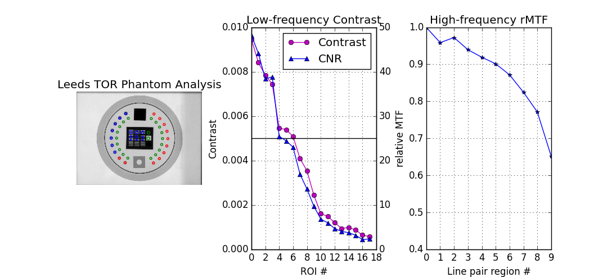
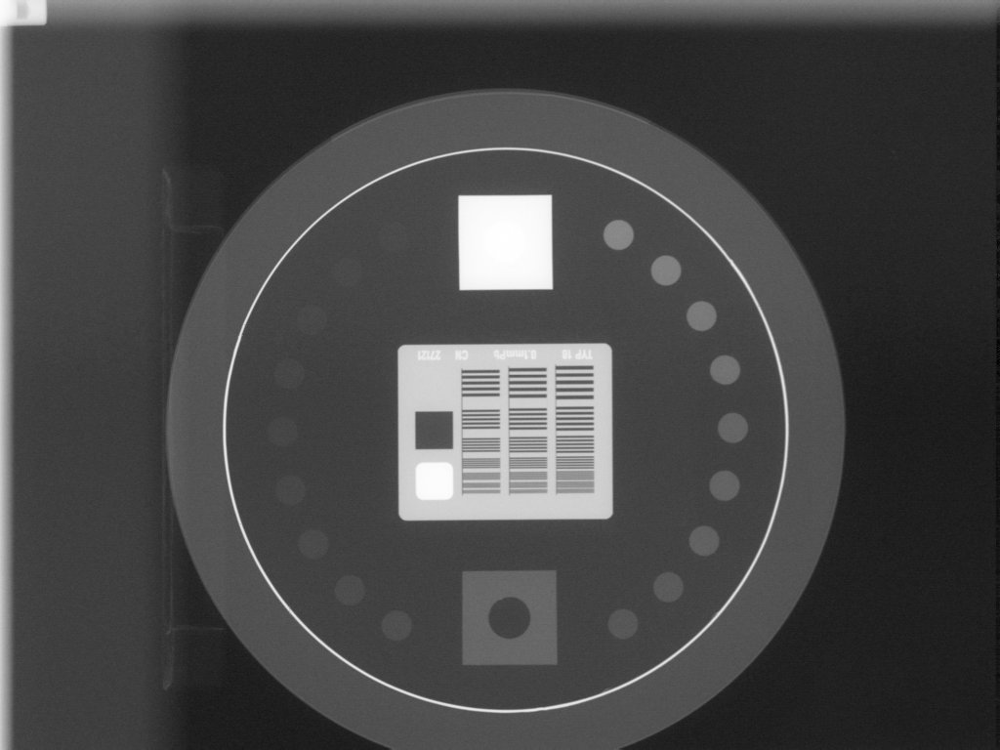
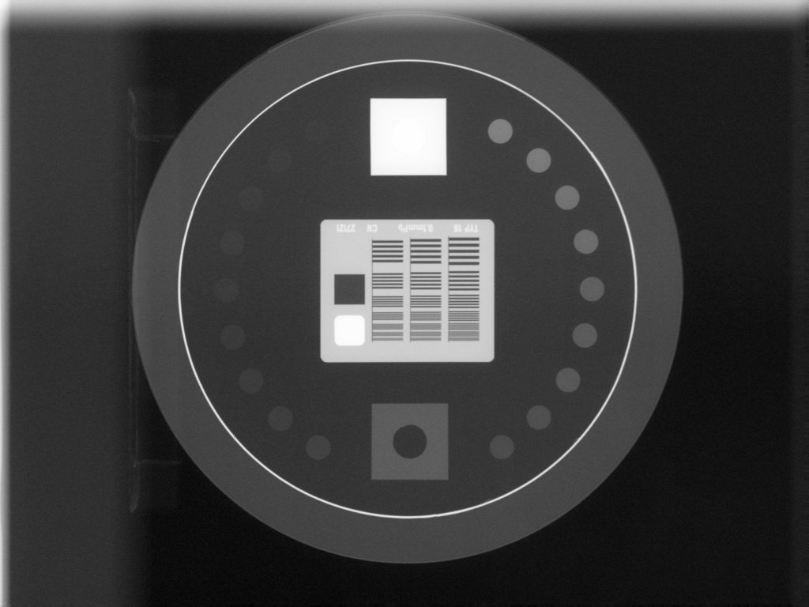
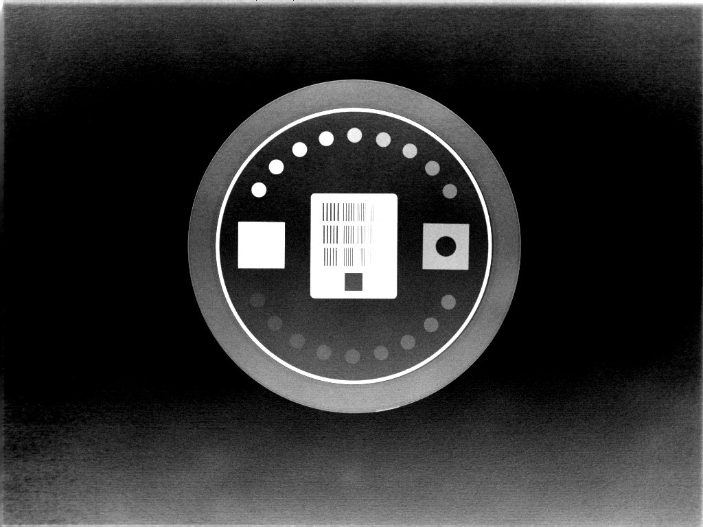
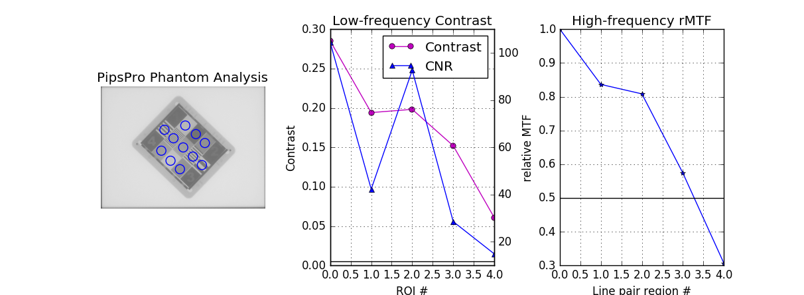
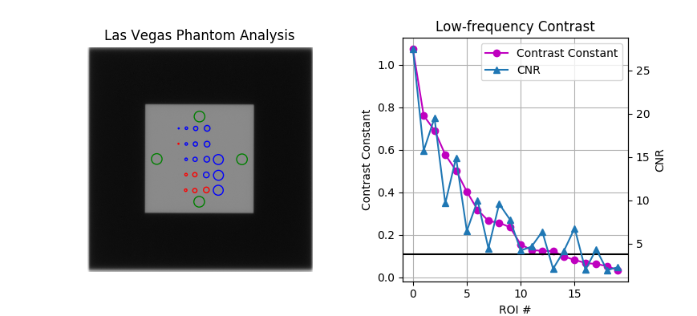
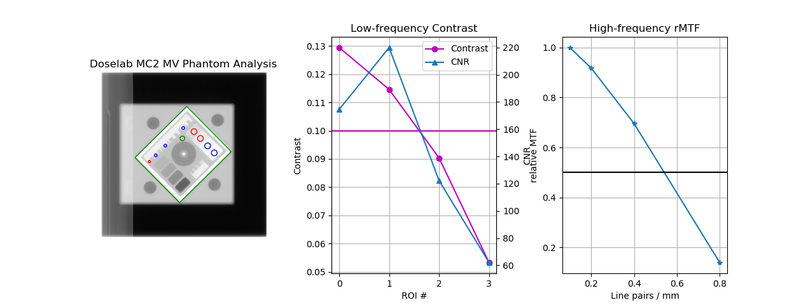

.. _planar_imaging:

===================================
Planar Imaging module documentation
===================================

Overview
--------

.. automodule:: pylinac.planar_imaging
    :no-members:

Leeds TOR Phantom
-----------------

The Leeds phantom is used to measure image quality metrics for the kV imager of a linac. It contains both
high and low contrast ROIs.

Running the Leeds Demo
^^^^^^^^^^^^^^^^^^^^^^

To run the Leeds TOR demo, create a script or start an interpreter session and input::

    from pylinac import LeedsTOR

    LeedsTOR.run_demo()

A figure showing the phantom, low contrast plot, and RMTF will be generated:

Image Acquisition
^^^^^^^^^^^^^^^^^

You can acquire the images any way you like. Just ensure that the phantom is not touching a field edge. It
is also recommended by the manufacturer to rotate the phantom to a non-cardinal angle so that pixel aliasing does not occur for the
high-contrast line pairs.

Typical Use
^^^^^^^^^^^

Import the class::

    from pylinac import LeedsTOR

The minimum needed to get going is to:

* **Load image** -- Load the planar image as you would any other class: by passing the path directly to the constructor::

      leeds = LeedsTOR('my/leeds.dcm')

  Alternatively, a URL can be passed::

      leeds = LeedsTOR.from_url('http://myserver.com/leeds')

  You may also use the demo image::

      leeds = LeedsTOR.from_demo_image()

* **Analyze the images** -- Analyze the image using the :meth:`~pylinac.planar_imaging.LeedsTOR.analyze` method. The
  low and high contrast thresholds can be specified::

      leeds.analyze(low_contrast_threshold=0.01, hi_contrast_threshold=0.5)

* **View the results** -- The results of analysis can be viewed with the :meth:`~pylinac.planar_imaging.LeedsTOR.plot_analyzed_image`
  method.

    .. code-block:: python

      leeds.plot_analyzed_image()

  .. image:: images/leeds_analysis.png

  Note that each subimage can be turned on or off.

  .. code-block:: python

      # don't show the low contrast plot
      leeds.plot_analyzed_image(low_contrast=False)

  The figure can also be saved::

      leeds.save_analyzed_image('myprofile.png')

 A PDF report can also be generated::

      leeds.publish_pdf('leeds_october16.pdf')

Algorithm
^^^^^^^^^

Leeds phantom analysis is straightforward: find the phantom in the image, then sample ROIs at the appropriate
locations.

The algorithm works like such:

**Allowances**

* The images can be acquired at any SID.
* The images can be acquired with any size kV imager.
* The phantom can be at any distance.
* The phantom can be at any angle.
* The phantom can be flipped either way.

**Restrictions**

    .. warning:: Analysis can fail or give unreliable results if any Restriction is violated.

* The phantom must not be touching or close to any image edges.

**Pre-Analysis**

* **Determine phantom location** -- The Leeds phantom is found by performing a canny edge detection
  algorithm to the image. The thin structures found are sifted by finding appropriately-sized ROIs.
  This may include the outer phantom edge and the metal ring just inside. The average central position
  of the circular ROIs is set as the phantom center.
* **Determine phantom angle** -- To find the rotational angle of the phantom, a similar process is employed,
  but square-like features are searched for in the edge detection image. Because there are two square areas,
  the ROI with the highest attenuation (lead) is chosen. The angle between the phantom center and the lead
  square center is set as the angle.
* **Determine rotation direction** -- The phantom might be placed upside down. To keep analysis consistent,
  a circular profile is sampled at the radius of the low contrast ROIs starting at the lead square. Peaks are
  searched for on each semicircle. The side with the most peaks is the side with the higher contrast ROIs.
  Analysis is always done counter-clockwise. If the ROIs happen to be clockwise, the image is flipped
  left-right and angle/center inverted.

**Analysis**

* **Calculate low contrast** -- Because the phantom center and angle are known, the angles to the ROIs can also
  be known. For each contrast ROI, both it and a background ROI are sampled. From here, the contrast can be known:
  :math:`Contrast_{ROI} = \frac{ROI_{val} - ROI_{background}}{ROI_{val} + ROI_{background}}`.
* **Calculate high contrast** -- Again, because the phantom position and angle are known, offsets are applied
  to sample the high contrast line pair regions. For each sample, the relative MTF is calculated:
  :math:`MTF_{ROI} = \frac{ROI_{max} - ROI_{min}}{ROI_{max} + ROI_{min}}`.

**Post-Analysis**

* **Determine passing low and high contrast ROIs** -- For each low and high contrast region, the determined
  value is compared to the threshold. The plot colors correspond to the pass/fail status.

Troubleshooting
^^^^^^^^^^^^^^^

If you're having trouble getting the Leeds phantom analysis to work, first check out the :ref:`general_troubleshooting`
section. If the issue is not listed there, then it may be one of the issues below.

The most common reason for failing is having the phantom near an image edge. The resulting
error is usually that the phantom angle cannot be determined. For example, this image would throw an
error:

The below image also fails. Technically, the phantom is in the image, but the top blade skews the pixel
values such that the phantom edge cannot be properly found at the top. This fails to identify the true phantom
edge, causing the angle to also not be found:

Another problem is that the image may have a non-uniform background. This can cause pylinac's automatic
inversion correction to incorrectly invert the image. For example, this image falsely inverts:

When analyzed, the angle is 180 degrees opposite the lead square, causing the ROIs to be
flipped 180 degrees. To correct this problem, pass ``invert=True`` to :meth:`~pylinac.planar_imaging.LeedsTOR.analyze`.
This will force pylinac to invert the image the opposite way and correctly identify the lead square.

Standard Imaging QC-3 Phantom
-----------------------------

The Standard Imaging phantom is an MV imaging quality assurance phantom and has high and low contrast regions,
just as the Leeds phantom, but with different geometric configurations.

Running the StandardImagingQC3 Demo
^^^^^^^^^^^^^^^^^^^^^^^^^^^^^^^^^^^

To run the Standard Imaging demo, create a script or start an interpreter session and input::

    from pylinac import StandardImagingQC3

    StandardImagingQC3.run_demo()

A figure showing the phantom, low contrast plot, and RMTF will be generated:

.. _pipspro_image_acquisition:

Image Acquisition
^^^^^^^^^^^^^^^^^

The Standard Imaging phantom has a specific setup as recommended by the manufacturer. The phantom should be angled 45
degrees, with the "1" pointed toward the gantry stand and centered along the CAX. For best results when using pylinac,
open the jaws to fully cover the EPID.

Typical Use
^^^^^^^^^^^

Import the class::

    from pylinac import StandardImagingQC3

The minimum needed to get going is to:

* **Load image** -- Load the planar image as you would any other class: by passing the path directly to the constructor::

      qc3 = StandardImagingQC3('path/to/qc3.dcm')

  Alternatively, a URL can be passed::

      qc3 = StandardImagingQC3.from_url('http://myserver.com/myQC3image.dcm')

  You may also use the demo image::

      qc3 = StandardImagingQC3.from_demo_image()

* **Analyze the images** -- Analyze the image using the :meth:`~pylinac.planar_imaging.StandardImagingQC3.analyze` method. The
  low and high contrast thresholds can be specified::

      qc3.analyze(low_contrast_threshold=0.01, high_contrast_threshold=0.5)

* **View the results** -- The results of analysis can be viewed with the :meth:`~pylinac.planar_imaging.StandardImagingQC3.plot_analyzed_image`
  method. Note that each subimage can be turned on or off.::

      # don't show the low contrast plot
      qc3.plot_analyzed_image(low_contrast=False)

  .. image:: images/pipspro_no_lc.png

  The figure can also be saved::

      qc3.save_analyzed_image('myqc3.png')

 A PDF report can also be generated::

      qc3.publish_pdf('myqc3-june.pdf')

Algorithm
^^^^^^^^^

The algorithm works like such:

**Allowances**

* The images can be acquired at any SID.
* The phantom can be at any distance.
* The images can be acquired with any EPID.
* The phantom can be somewhat offset from the ideal 45 degree orientation.

**Restrictions**

    .. warning:: Analysis can fail or give unreliable results if any Restriction is violated.

* The phantom must not be touching any image edges.
* The phantom should have the "1" pointing toward the gantry stand.
* The phantom should be at 100cm or 140cm.

**Pre-Analysis**

* **Determine phantom location** -- A canny edge search is performed on the image. Connected edges that
  are semi-round and angled are thought to possibly be the phantom. Of the ROIs, the one with the longest
  axis is said to be the phantom edge. The center of the bounding box of the ROI is set as the phantom center.
* **Determine phantom radius and angle** -- The major axis length of the ROI determined above serves as the
  phantom radius. The orientation of the edge ROI serves as the phantom angle.

**Analysis**

* **Calculate low contrast** -- Because the phantom center and angle are known, the angles to the ROIs can also
  be known. For each contrast ROI, both it and a background ROI are sampled. From here, the contrast can be known:
  :math:`Contrast_{ROI} = \frac{ROI_{val} - ROI_{background}}{ROI_{val} + ROI_{background}}`.
* **Calculate high contrast** -- Again, because the phantom position and angle are known, offsets are applied
  to sample the high contrast line pair regions. For each sample, the relative MTF is calculated:
  :math:`MTF_{ROI} = \frac{ROI_{max} - ROI_{min}}{ROI_{max} + ROI_{min}}`.

**Post-Analysis**

* **Determine passing low and high contrast ROIs** -- For each low and high contrast region, the determined
  value is compared to the threshold. The plot colors correspond to the pass/fail status.

Troubleshooting
^^^^^^^^^^^^^^^

If you're having issues with the StandardImaging class, make sure you have correctly positioned the phantom as per
the manufacturer's instructions (also see :ref:`pipspro_image_acquisition`). One issue that may arise is incorrect
inversion. If the jaws are closed tightly around the phantom, the automatic inversion correction may falsely
invert the image, just as for the Leeds phantom. If you have an image that looks inverted or just plain weird, add ``invert=True``
to :meth:`~pylinac.planar_imaging.StandardImagingQC3.analyze`. If this doesn't help, reshoot the phantom with the jaws open.

Las Vegas Phantom
-----------------

The Las Vegas phantom is for MV image quality testing and includes low contrast regions of varying contrast and size.

Running the LasVegas Demo
^^^^^^^^^^^^^^^^^^^^^^^^^

To run the Las Vegas demo, create a script or start an interpreter session and input:

.. code-block:: python

    from pylinac import LasVegas

    LasVegas.run_demo()

A figure showing the phantom and low contrast plot will be generated:

Image Acquisition
^^^^^^^^^^^^^^^^^

The Las Vegas phantom has a recommended position as stated on the phantom. Pylinac will however account for angles,
shifts, and inversions. Best practices for the Las Vegas phantom:

* Keep the phantom from a couch edge or any rails.
* Close the jaws around the phantom (i.e. not 30x30cm)
* Place the phantom at approximately 100cm SSD.

Typical Use
^^^^^^^^^^^

Import the class::

    from pylinac import LasVegas

The minimum needed to get going is to:

* **Load image** -- Load the planar image as you would any other class: by passing the path directly to the constructor::

      lv = LasVegas('path/to/lasvegasphan.dcm')

  Alternatively, a URL can be passed::

      lv = LasVegas.from_url('http://myserver.com/myLVimage.dcm')

  You may also use the demo image::

      lv = LasVegas.from_demo_image()

* **Analyze the images** -- Analyze the image using the :meth:`~pylinac.planar_imaging.LasVegas.analyze` method. The
  low and high contrast thresholds can be specified::

      lv.analyze(low_contrast_threshold=0.01)

* **View the results** -- The results of analysis can be viewed with the :meth:`~pylinac.planar_imaging.LasVegas.plot_analyzed_image`
  method. Note that each subimage can be turned on or off.::

      # don't show the low contrast plot
      lv.plot_analyzed_image(low_contrast=False)

  The figure can also be saved::

      lv.save_analyzed_image('mylvplot.png')

 A PDF report can also be generated::

      lv.publish_pdf('lv-3-10-17.pdf')

Algorithm
^^^^^^^^^

The algorithm works like such:

**Allowances**

* The images can be acquired at any SID.
* The images can be acquired with any EPID.

**Restrictions**

    .. warning:: Analysis can fail or give unreliable results if any Restriction is violated.

* The phantom must not be touching any image edges.
* The phantom should be at 0, 90, 180, or 270 degrees relative to the EPID.

**Pre-Analysis**

* **Determine phantom location** -- A canny edge search is performed on the image. Connected edges that
  are semi-round and angled are thought to possibly be the phantom. Of the ROIs, the one with the longest
  axis is said to be the phantom edge. The center of the bounding box of the ROI is set as the phantom center.
* **Determine phantom radius and angle** -- The major axis length of the ROI determined above serves as the
  phantom radius. The orientation of the edge ROI serves as the phantom angle.

**Analysis**

* **Calculate low contrast** -- Because the phantom center and angle are known, the angles to the ROIs can also
  be known. For each contrast ROI, both it and a background ROI are sampled. From here, the contrast can be known:
  :math:`Contrast_{ROI} = \frac{ROI_{val} - ROI_{background}}{ROI_{val} + ROI_{background}}`.

**Post-Analysis**

* **Determine passing low and high contrast ROIs** -- For each low and high contrast region, the determined
  value is compared to the threshold. The plot colors correspond to the pass/fail status.

Doselab MC2 MV & kV
-------------------

The Doselab MC2 phantom is for kV & MV image quality testing and includes low and high contrast regions of varying contrast.

Running the Doselab MC2 Demo
^^^^^^^^^^^^^^^^^^^^^^^^^^^^

To run the MC2 demo, create a script or start an interpreter session and input:

.. code-block:: python

    from pylinac import DoselabMC2MV, DoselabMC2kV

    DoselabMC2MV.run_demo()
    DoselabMC2kV.run_demo()  # kv works the same

A figure showing the phantom and contrast ROIs and graphs will be generated:

Image Acquisition
^^^^^^^^^^^^^^^^^

The Doselab phantom has a recommended position as stated on the phantom. Pylinac will however account for
shifts and inversions. Best practices for the Doselab phantom:

* Keep the phantom from a couch edge or any rails.
* Close the jaws around the phantom (i.e. not 30x30cm)
* Place the phantom at approximately isocenter.

Typical Use
^^^^^^^^^^^

Import the class::

    from pylinac import DoselabMC2MV, DoselabMC2kV

For the following examples the kV and MV class can be used interchangeably.
The minimum needed to get going is to:

* **Load image** -- Load the planar image as you would any other class: by passing the path directly to the constructor::

      dl = DoselabMC2MV('path/to/doselabmv_phan.dcm')

  Alternatively, a URL can be passed::

      dl = DoselabMC2MV.from_url('http://myserver.com/myDLimage.dcm')

  You may also use the demo image::

      dl = DoselabMC2MV.from_demo_image()

* **Analyze the images** -- Analyze the image using the :meth:`~pylinac.planar_imaging.DoselabMC2MV.analyze` method. The
  low and high contrast thresholds can be specified::

      dl.analyze(low_contrast_threshold=0.01, high_contrast_threshold=0.4)

* **View the results** -- The results of analysis can be viewed with the :meth:`~pylinac.planar_imaging.DoselabMC2MV.plot_analyzed_image`
  method. Note that each subimage can be turned on or off.::

      # don't show the low contrast plot
      dl.plot_analyzed_image(low_contrast=False, high_contrast=False)

  The figure can also be saved::

      dl.save_analyzed_image('mydlplot.png')

 A PDF report can also be generated::

      dl.publish_pdf('dl-3-10-17.pdf')

Algorithm
^^^^^^^^^

The algorithm works like such:

**Allowances**

* The images can be acquired at any SID.
* The images can be acquired with any EPID.

**Restrictions**

    .. warning:: Analysis can fail or give unreliable results if any Restriction is violated.

* The phantom must not be touching any image edges.
* The phantom should be at 45 degrees relative to the EPID.

Creating a custom phantom
-------------------------

In the event you would like to analyze a phantom that pylinac does not analyze out of the box,
the pylinac planar imaging module structure allows for generating new phantom analysis types quickly and easily.
The benefit of this design is that with a few simple definitions you inherit a strong base of methods
(e.g. plotting and PDF reports come for free).

Creating a new class involves a few different steps but can be done in a few minutes. The following is a guide for custom
phantoms:

1. Subclass the `ImagePhantomBase` class:

    .. python::

        from pylinac.planar_imaging import ImagePhantomBase

        class CustomPhantom(ImagePhantomBase):
            pass

2. Define the `common_name`. This is the name shown in plots and PDF reports.

    .. python::

        class CustomPhantom(ImagePhantomBase):
            common_name = 'Custom Phantom v2.0'

3. If the phantom has a high-contrast measurement object, define the ROI locations.

    .. python::

        class CustomPhantom(ImagePhantomBase):
            ...
            high_contrast_roi_settings = {
                'roi 1': {'distance from center': 0.5, 'angle': 30, 'roi radius': 0.05, 'lp/mm': 0.2},
                ...  # add as many ROIs as are needed
            }

    .. note::

        The exact values of your ROIs will need to be empirically determined. This usually involves an iterative process of
        adjusting the values until the values are satisfactory based on the ROI sample alignment to the actual ROIs.

4. If the phantom has a low-contrast measurement object, define the sample ROI and background ROI locations.

    .. python::

        class CustomPhantom(ImagePhantomBase):
            ...
            low_contrast_roi_settings = {
                'roi 1': {'distance from center': 0.5, 'angle': 30, 'roi radius': 0.05},  # no lp/mm key
                ...  # add as many ROIs as are needed
            }
            low_contrast_background_roi_settings = {
                'roi 1': {'distance from center': 0.3, 'angle': -45, 'roi radius': 0.02},
                ...  # add as many ROIs as are needed
            }

    .. note::

        The exact values of your ROIs will need to be empirically determined. This usually involves an iterative process of
        adjusting the values until the values are satisfactory based on the ROI sample alignment to the actual ROIs.

5. Optionally, add a phantom outline object. This helps visualize the algorithm's determination of the size, center, and angle.
   If no object is defined, then no outline will be shown. This step is optional.

    .. python::

        class CustomPhantom(ImagePhantomBase):
            ...
            phantom_outline_object = {'Circle': {'radius ratio': 0.5}}  # to create a circular outline
            # or...
            phantom_outline_object = {'Rectangle': {'width ratio': 0.5, 'height ratio': 0.3}}  # to create a rectangular outline

At this point you could technically call it done. You would need to always override the angle, center, and size values in the analyze method however.
To automate this part you will need to fill in the associated logic. You can use whatever method you like. What I have
found most useful is to use an edge detection algorithm and find the outline of the phantom.

    .. python::

        class CustomPhantom(ImagePhantomBase):
            ...

            def _phantom_center_calc(self) -> Point:
                # do stuff in here to determine the center point location.
                # don't forget to return as a Point item (pylinac.core.geometry.Point).

            def _phantom_radius_calc(self) -> float:
                # do stuff in here to return a float that represents the phantom radius value.
                # This value does not have to relate to a physical measure. It simply defines a value that the ROIs scale by.

            def _phantom_angle_calc(self) -> float:
                # do stuff in here to return a float that represents the angle of the phantom.
                # Again, this value does not have to correspond to reality; it simply offsets the ROIs.

Congratulations! You now have a fully-functioning custom phantom. By using the base class and the predefined attributes
and methods, the plotting and PDF report functionality comes for free.

Usage tips & tweaks
-------------------

Adjust an ROI on an existing phantom
^^^^^^^^^^^^^^^^^^^^^^^^^^^^^^^^^^^^

To adjust an ROI, override the relevant attribute or create a subclass. E.g. to move the 2nd ROI of the high-contrast ROI set of the QC-3 phantom:

.. python::

    from pylinac import StandardImagingQC3

    StandardImagingQC3.high_contrast_roi_settings['roi 1']['distance from center'] = 0.05  # overrides that one setting
    qc3 = StandardImagingQC3(...)

    # or

    class TweakedStandardImagingQC3(StandardImagingQC3):
        high_contrast_roi_settings = {
            'roi 1': ...
        }  # note that you must replace ALL the values

    qc3 = TweakedStandardImagingQC3(...)

Calculate a specific MTF
^^^^^^^^^^^^^^^^^^^^^^^^

To calculate a specific MTF value, i.e. the frequency at a given MTF%:

.. python::

    dl = DoselabMC2kV(...)
    dl.analyze(...)
    print(dl.mtf.relative_resolution_at(x=50))  # 50% rMTF

Get/View the contrast of a low-contrast ROI
^^^^^^^^^^^^^^^^^^^^^^^^^^^^^^^^^^^^^^^^^^^

.. python::

    leeds = LeedsTOR(...)
    leeds.analyze(...)
    print(leeds.low_contrast_rois[1].contrast)  # get the 2nd ROI contrast value

API Documentation
-----------------

.. autoclass:: pylinac.planar_imaging.LeedsTOR
    :inherited-members:

.. autoclass:: pylinac.planar_imaging.StandardImagingQC3
    :inherited-members:

.. autoclass:: pylinac.planar_imaging.LasVegas
    :inherited-members:

.. autoclass:: pylinac.planar_imaging.DoselabMC2MV
    :inherited-members:

.. autoclass:: pylinac.planar_imaging.DoselabMC2kV
    :inherited-members:
