===================================
Hacking your own tools with Pylinac
===================================

Pylinac's main purpose is to make doing routine quality assurance easier
and as automatic as possible. The main modules can be utilized in only a
few lines of code and does a complete analysis of your QA images.
However, when researching new tools, comparing specific algorithms, or
doing custom testing, the default tools aren't appropriate. Pylinac's
modules are built on simpler tools that can be used directly or easily
extended. In this tutorial, we'll introduce some of pylinac's potential
as a toolkit for customizing or creating new tests.

.. note::
   This is also viewable as a `Jupyter notebook <http://nbviewer.ipython.org/github/jrkerns/pylinac/blob/master/docs/source/pylinac_core_hacking.ipynb>`_.

The ``image`` Module
--------------------

In many applications of QA, the physicist has images acquired via the
EPID, kV imager, or scanned films. The ``image`` module provides easy
tools for loading, manipulating, and converting these images. For this
tutorial we'll use a few demo images and showcase the various methods
available.

There are a few simple tips for using the ``image`` module:

-  The ``Image`` class is a swiss-army knife for loading images
-  There are 3 related image classes to handle the given image types:
   Dicom, File, and Array

The docs for the image API are
`here <http://pylinac.readthedocs.org/en/latest/core_modules.html#module-pylinac.core.image>`__.

First, our imports for the whole tutorial:

.. code:: python

    %matplotlib inline
    
    from urllib.request import urlretrieve
    
    import matplotlib.pyplot as plt
    import numpy as np
    
    from pylinac.core.image import Image, DicomImage, FileImage, ArrayImage
    
    # pylinac demo images' URL
    PF_URL = 'https://github.com/jrkerns/pylinac/blob/master/pylinac/demo_files/picket_fence/EPID-PF-LR.dcm?raw=true'
    STAR_URL = 'https://github.com/jrkerns/pylinac/blob/master/pylinac/demo_files/starshot/starshot.tif?raw=true'
    
    # local downloaded images
    PF_FILE, _ = urlretrieve(PF_URL)
    STAR_FILE, _ = urlretrieve(STAR_URL)
    
    # sample numpy array
    ARR = np.arange(36).reshape((6,6))

Loading images
~~~~~~~~~~~~~~

Let's load the picket fence demo image:

.. code:: python

    pfimg = Image.load_url(PF_URL)
    type(pfimg)

.. parsed-literal::

    pylinac.core.image.DicomImage

We can load the local file just as easily:

.. code:: python

    pfimg = Image.load(PF_FILE)

The ``load()`` and ``load_url()`` methods do not return an ``Image``
instance, but rather infers the type of image and returns one of the
related Image types listed above.

.. code:: python

    type(pfimg)

.. parsed-literal::

    pylinac.core.image.DicomImage

The ``load()`` method can take an string pointing to a file, a data
stream, or a numpy array:

.. code:: python

    arr = np.arange(36).reshape((6,6))
    img2 = Image.load(arr)  # .pixel_array is a numpy array of DICOM file
    type(img2)

.. parsed-literal::

    pylinac.core.image.ArrayImage

Additionally, multiple images can be loaded and superimposed. For
example multiple collimator star shots. Just pass a list of the images:

.. code:: python

    star1, _ = urlretrieve('https://github.com/jrkerns/pylinac/blob/master/tests/test_files/Starshot/set/0%20deg%20coll.dcm?raw=true')
    star2, _ = urlretrieve('https://github.com/jrkerns/pylinac/blob/master/tests/test_files/Starshot/set/120%20deg%20coll.dcm?raw=true')
    
    superimposed_img = Image.load_multiples([star1, star2])

While the ``load()`` method will always do smart image inference for
you, if you already know the file type you can instantiate directly.
Furthermore, 2 keyword arguments can be passed to FileImage and
ArrayImage if they are known: the DPI (dots-per-inch) and SID
(source-to-image distance).

.. code:: python

    dcm_img = DicomImage(PF_FILE)
    arr_img = ArrayImage(ARR, dpi=30, sid=500)
    file_img = FileImage(STAR_FILE, dpi=50, sid=1000)
    
    file_img2 = Image.load(STAR_FILE, dpi=30, sid=500)
    
    type(file_img) == type(file_img2)

.. parsed-literal::

    True

For memory's sake we need to clean up a little.

.. code:: python

    del file_img2, arr_img, superimposed_img, pfimg

Plotting
~~~~~~~~

Images can be easily plotted using the ``plot()`` method:

.. code:: python

    dcm_img.plot()

.. image:: pylinac_core_hacking_files/pylinac_core_hacking_24_0.png

.. parsed-literal::

    <matplotlib.axes._subplots.AxesSubplot at 0xdca4290>

The plot can also be passed to an existing matplotlib axes:

.. code:: python

    fig, ax = plt.subplots()
    dcm_img.plot(ax=ax)

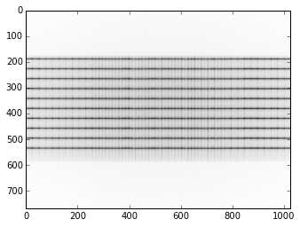

.. parsed-literal::

    <matplotlib.axes._subplots.AxesSubplot at 0xb8aaf0>

Attributes
~~~~~~~~~~

The image classes contain a number of useful attributes for analyzing
and describing the data:

.. code:: python

    dcm_img.dpi

.. parsed-literal::

    64.79591836734693

.. code:: python

    dcm_img.dpmm

.. parsed-literal::

    2.5510204081632653

.. code:: python

    dcm_img.sid

.. parsed-literal::

    1000.0

.. code:: python

    dcm_img.shape

.. parsed-literal::

    (768, 1024)

There are also attributes that are useful in radiation therapy:

.. code:: python

    dcm_img.cax  # the beam CAX

.. parsed-literal::

    Point(x=512.00, y=384.00, z=0.00)

.. code:: python

    dcm_img.center  # the center location of the image

.. parsed-literal::

    Point(x=512.00, y=384.00, z=0.00)

Above, the values are the same because the EPID was not translated,
which would move the CAX but not the image center.

The image values can also be sampled by slicing and indexing:

.. code:: python

    dcm_img[12, 60]

.. parsed-literal::

    2124

.. code:: python

    dcm_img[:100, 82]

.. parsed-literal::

    array([1898, 1997, 1912, 2123, 1976, 2044, 2014, 1975, 1946, 1930, 1939,
           2006, 2091, 1979, 2136, 2028, 1996, 2044, 2047, 2195, 2026, 2198,
           2018, 2241, 2050, 2127, 2152, 2076, 2037, 2173, 2058, 2055, 2058,
           2079, 2201, 2278, 2227, 2273, 2155, 2173, 2225, 2123, 2253, 2148,
           2196, 2168, 2129, 2267, 2226, 2306, 2313, 2198, 2254, 2228, 2277,
           2312, 2270, 2213, 2303, 2372, 2365, 2307, 2320, 2317, 2405, 2341,
           2435, 2390, 2334, 2411, 2339, 2332, 2405, 2467, 2362, 2445, 2423,
           2371, 2414, 2370, 2449, 2373, 2493, 2477, 2548, 2525, 2468, 2462,
           2552, 2516, 2603, 2550, 2529, 2557, 2468, 2586, 2535, 2582, 2559,
           2635], dtype=uint16)

.. code:: python

    del dcm_img

Data manipulation
~~~~~~~~~~~~~~~~~

Now the really fun stuff! There are many methods available to manipulate
the data.

First, let's smooth the data:

.. code:: python

    file_img.median_filter(size=3)
    file_img.plot()

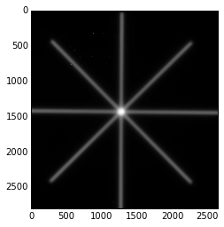

.. parsed-literal::

    <matplotlib.axes._subplots.AxesSubplot at 0x1215330>

Sometimes starshots from scanned film have edges that are very high or
low value (corners of the film can be bent or rounded). We can easily
trim the edges:

.. code:: python

    file_img.remove_edges(pixels=100)
    file_img.plot()

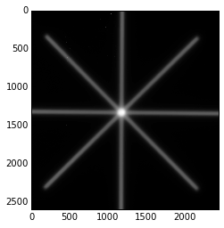

.. parsed-literal::

    <matplotlib.axes._subplots.AxesSubplot at 0xe460ff0>

The data can also be explicitly inverted (EPID images oftentimes need
this), or rolled on an axis:

.. code:: python

    file_img.invert()
    file_img.plot()

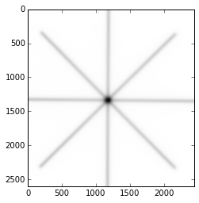

.. parsed-literal::

    <matplotlib.axes._subplots.AxesSubplot at 0xd4bdf0>

.. code:: python

    file_img.roll(direction='y', amount=200)
    file_img.plot()

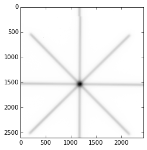

.. parsed-literal::

    <matplotlib.axes._subplots.AxesSubplot at 0xd6aed0>

We can also rotate and resize the image:

.. code:: python

    file_img.rot90(n=1)
    file_img.plot()

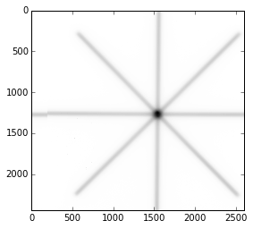

.. parsed-literal::

    <matplotlib.axes._subplots.AxesSubplot at 0xde1a50>

.. code:: python

    file_img.resize(size=(1000, 1100))
    file_img.plot()

.. image:: pylinac_core_hacking_files/pylinac_core_hacking_50_0.png

.. parsed-literal::

    <matplotlib.axes._subplots.AxesSubplot at 0xdf5090>

Scanned film values can be very high, even in low dose areas. We can
thus "ground" the image so that the lowest value is zero; this will help
us later on when detecting profiles.

.. code:: python

    np.min(file_img)

.. parsed-literal::

    77.999969

.. code:: python

    file_img.ground()
    np.min(file_img)

.. parsed-literal::

    0.0

.. code:: python

    file_img.plot()

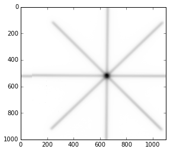

.. parsed-literal::

    <matplotlib.axes._subplots.AxesSubplot at 0xe54670>

We can also apply a high-pass filter to the image:

.. code:: python

    thresh_val = np.percentile(file_img, 95)
    file_img.threshold(thresh_val)
    file_img.plot()

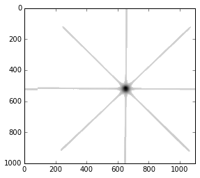

.. parsed-literal::

    <matplotlib.axes._subplots.AxesSubplot at 0xe89130>

The image can also be converted to binary, which can be used later for
ROI detection. Note that unlike any other method, this returns a new
ArrayImage (hinted by the ``as_``)...

.. code:: python

    new_img = file_img.as_binary(thresh_val)
    new_img.plot()

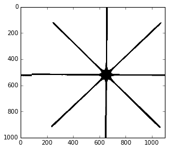

.. parsed-literal::

    <matplotlib.axes._subplots.AxesSubplot at 0xe9c070>

...and leaves the original unchanged.

.. code:: python

    file_img.plot()

.. image:: pylinac_core_hacking_files/pylinac_core_hacking_60_0.png

.. parsed-literal::

    <matplotlib.axes._subplots.AxesSubplot at 0xe4dcef0>

The ``profile`` Module
----------------------

Physicists often need to evalute a profile, perhaps from a linac beam
EPID image, or some fluence profile. The ``profile`` module allows the
physicist to find peaks in a 1D array and determine beam profile
information (FWHM, penumbra, etc). There are two main profile classes:

-  SingleProfile - This class is for profiles with a single peak; e.g.
   an open beam delivered to a film or EPID. The main goal of this class
   is to describe the profile (FWHM, penumbra, etc).
-  MultiProfile - This class is for profiles with multiple peaks. The
   main goal of this class is to find the peak or valley locations. A
   MultiProfile can be broken down into SingleProfiles.
-  CircleProfile - A MultiProfile, but in the shape of a circle.
-  CollapsedCircleProfile - A CircleProfile that "collapses" a thick
   ring of pixel data to create a 1D profile.

The profile API docs are
`here <http://pylinac.readthedocs.org/en/latest/core_modules.html#module-pylinac.core.profile>`__.

For this demonstration we'll find some peaks and then determine profile
information about one of those peaks. Let's use the starshot demo image
since it contains all the types of profiles:

.. code:: python

    from pylinac.core.profile import SingleProfile, MultiProfile, CircleProfile, CollapsedCircleProfile
    
    STAR_URL = 'https://github.com/jrkerns/pylinac/blob/master/pylinac/demo_files/starshot/starshot.tif?raw=true'
    
    star_img = Image.load_url(STAR_URL)

Using a ``MultiProfile``
~~~~~~~~~~~~~~~~~~~~~~~~

Let's start by sampling one row from the starshot image:

.. code:: python

    row = star_img[800, :]
    plt.plot(row)

.. parsed-literal::

    [<matplotlib.lines.Line2D at 0xe53acd0>]

.. image:: pylinac_core_hacking_files/pylinac_core_hacking_66_1.png

So, judging by the profile, it needs to be filtered for the spurious
signals, it has multiple peaks, and it's upside down.

Let's make a MultiProfile and clean up the data.

.. code:: python

    mprof = MultiProfile(row)
    mprof.plot()

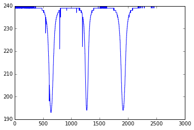

First, let's invert it so that pixel value increases with dose.

.. code:: python

    mprof.invert()
    mprof.plot()

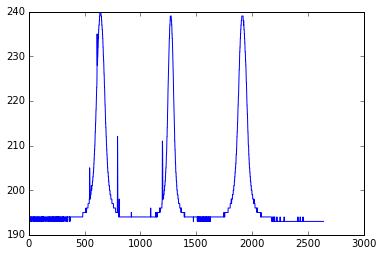

We've loaded the profile and inverted it; let's run a filter over it.

.. code:: python

    mprof.filter(size=6)
    mprof.plot()

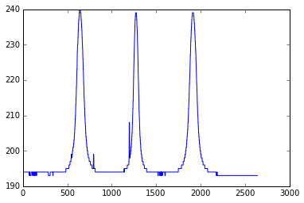

The profile could probably be filtered more since there's still a few
spurious signals, but this will work nicely for our demonstration.

First, we want to find the peak locations:

.. code:: python

    mprof.find_peaks()

.. parsed-literal::

    array([  642.,  1272.,  1914.])

The method has found the 3 major peaks of the profile. Note that there
are actually 5 peaks if we count the spurious signals near indices 800
and 1200.

For fun, let's see if we can detect these peaks. We can change the
parameters to ``find_peaks()`` to optimize our search.

.. code:: python

    mprof.find_peaks(threshold=0.1)

.. parsed-literal::

    array([  642.,   796.,  1272.,  1914.])

By lowering the peak height threshold we've found another peak; but the
peak near 1200 wasn't found. What gives?

The ``find_peaks()`` method also eliminates peaks that are too close to
one another. We can change that:

.. code:: python

    mprof.find_peaks(threshold=0.1, min_distance=0.02)

.. parsed-literal::

    array([  546.,   642.,   796.,  1199.,  1272.,  1914.])

By changing the minimum distance peaks must be from each other, we've
found the other peak.

But, let's say we need to use these settings for whatever reason. We can
additionally limit the number of peaks using ``max_number``.

.. code:: python

    mprof.find_peaks(threshold=0.1, min_distance=0.02, max_number=3)

.. parsed-literal::

    array([ 1272.,  1914.,   642.])

Now, we can visualize where these peaks are by using the ``plot()``
method, which shows the peaks if we've searched for them; note the green
dots at the detected peak locations.

.. code:: python

    mprof.plot()

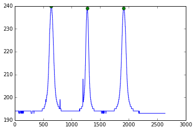

We can also search a given portion of the region; for example if we only
wanted to detect peaks in the first half of the profile we can easily
add a ``search_region``. Note that the last peak was not detected.

.. code:: python

    mprof.find_peaks(search_region=(0, 0.6))  # search the left 60% of the profile

.. parsed-literal::

    array([  642.,  1272.])

We can search not simply for the max value peaks, but for the FWHM
peaks. Note that these values are slightly different than the max value
peaks we found earlier.

.. code:: python

    mprof.find_fwxm_peaks(x=50)  # 50 is 50% height

.. parsed-literal::

    [644.0, 1273.0, 1916.5]

Finally, we can subdivide the profile into SingleProfile's to further
describe single peaks:

.. code:: python

    single_profiles = mprof.subdivide()  # returns a list of SingleProfile's

Using a ``SingleProfile``
~~~~~~~~~~~~~~~~~~~~~~~~~

``SingleProfile``\ s are useful to describe profiles with a single peak.
It can describe the FWXM (X=any height), penumbra on each side, field
width, and calculations of the field. Continuing from above:

.. code:: python

    sprof = single_profiles[0]
    sprof.plot()

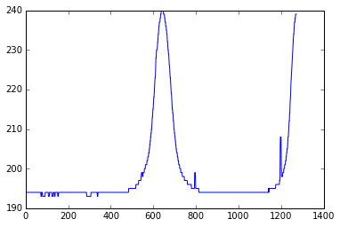

The multiprofile has been cut into multiple single profiles, of which
this is the first.

Let's first find the FWHM, and the center of the FWHM:

.. code:: python

    sprof.fwxm(x=50)

.. parsed-literal::

    88

.. code:: python

    sprof.fwxm_center(x=50)

.. parsed-literal::

    644.0

Note that this is the same value as the first FWHM peak value we found
in the MultiProfile.

We can now find the penumbra values:

.. code:: python

    sprof.penumbra_width(side='left', upper=80, lower=20)

.. parsed-literal::

    45

.. code:: python

    sprof.penumbra_width(upper=90, lower=10)  # default is average of both sides

.. parsed-literal::

    84

The careful reader will notice that the profiles, since we created them,
has not had a minimum value of 0. Normally, this would cause problems
and sometimes it does, but pylinac normalizes the FWXM and penumbra
search. However, just to make sure all is well we can easily shift the
values so that the lower bound is 0:

.. code:: python

    sprof.ground()
    sprof.plot()

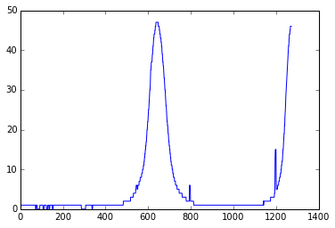

.. code:: python

    sprof.penumbra_width(upper=90, lower=10)

.. parsed-literal::

    84

The average penumbra is the same as we found earlier.

We can also normalize and stretch the profile values. Let's first get
the original maximum value so we know what we need to restore the
profile:

.. code:: python

    np.max(sprof)

.. parsed-literal::

    47.0

.. code:: python

    sprof.normalize()
    sprof.plot()

.. image:: pylinac_core_hacking_files/pylinac_core_hacking_103_0.png

We can also stretch the values to be bounded by any values we please:

.. code:: python

    sprof.stretch(min=30, max=284)
    sprof.plot()

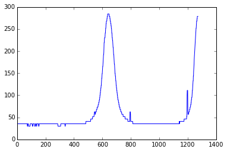

Let's restore our profile based on the earlier max and min values:

.. code:: python

    sprof.stretch(max=47, min=0)
    sprof.plot()

.. image:: pylinac_core_hacking_files/pylinac_core_hacking_107_0.png

Using ``CircleProfile`` and ``CollapsedCircleProfile``
~~~~~~~~~~~~~~~~~~~~~~~~~~~~~~~~~~~~~~~~~~~~~~~~~~~~~~

Circular profiles are useful for concentric profiles; starshots are
great examples. Let's explore the two circular profiles as they relate
to a starshot image.

Let's once again load the starshot demo image:

.. code:: python

    star_img.plot()

.. parsed-literal::

    <matplotlib.axes._subplots.AxesSubplot at 0xf656250>

We saw above from the profile that the image is actually inverted (pixel
value decreases with dose), so we need to invert the image:

.. code:: python

    star_img.invert()

To use a ``CircleProfile`` we need to specify the center and radius of
the circle, as well as the array to operate over. The approximate center
of the starshot is (1450, 1250). Let's also use a radius of 300 pixels.

.. code:: python

    cprof = CircleProfile(center=(1250, 1450), radius=300, image_array=star_img)  #  center is given as (x, y)
    cprof.plot()

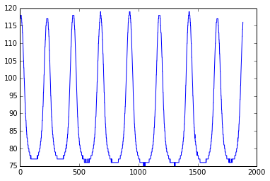

We have a nice profile showing the starshot peaks. It appears we've cut
one of the peaks in half though; this is because the profile starts at 0
radians on the unit circle (directly to the right) and there is a
starshot line right at 0. We can also change the direction of the
profile from the default of counter-clockwise to clockwise:

.. code:: python

    cprof = CircleProfile(center=(1250, 1450), radius=300, image_array=star_img, start_angle=0.2, ccw=False)
    cprof.plot()

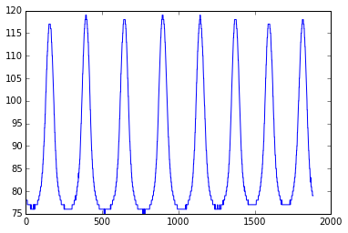

Alternatively, we can roll the profile directly:

.. code:: python

    cprof.roll(amount=50)
    cprof.plot()

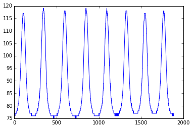

Now, because ``CircleProfile`` is a subclass of ``MultiProfile`` we can
search for the peaks:

.. code:: python

    cprof.find_peaks()
    cprof.plot()

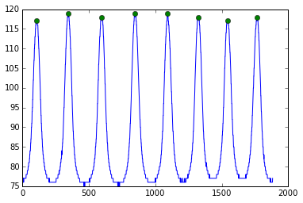

The profile is 1D, but was derived from a circular sampling. How do we
know what the locations of the sampling is? We have x and y attributes:

.. code:: python

    cprof.x_locations

.. parsed-literal::

    array([ 1530.05826457,  1529.69820368,  1529.33503504, ...,  1531.11976086,
            1530.7690471 ,  1530.4152137 ])

.. code:: python

    cprof.y_locations

.. parsed-literal::

    array([ 1557.55170128,  1558.48462959,  1559.41635252, ...,  1554.74578777,
            1555.68226998,  1556.61757795])

We can also add this profile to a plot to show where it is:

.. code:: python

    ax = star_img.plot(show=False)
    cprof.plot2axes(ax)

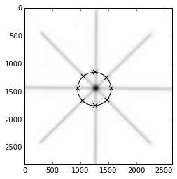

Looks good! Now let's take a ``CollapsedCircleProfile``. The advantage
of this class is that a thick ring is sampled, which averages the pixel
values. Thus, noise and spurious signals are reduced. Beyond
``CircleProfile`` there are 2 more keyword arguments:

.. code:: python

    ccprof = CollapsedCircleProfile(center=(1250, 1450), radius=300, image_array=star_img, width_ratio=0.2, num_profiles=10)
    ccprof.plot()

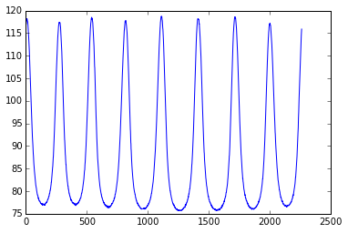

Note that this profile looks smoothed; this comes from averaging over
the ``num_profiles`` within the ring. The ``width_ratio`` is a function
of the radius, so in this case the actual ring width is 300\*0.2 = 60
pixels, and 10 equally distributed profiles are taken within that ring.

Let's find the peaks and then plot the ring to the starshot image:

.. code:: python

    ccprof.find_peaks()
    ccprof.plot()

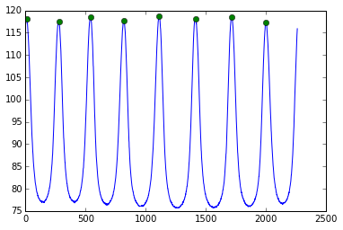

.. code:: python

    ax = star_img.plot(show=False)
    ccprof.plot2axes(ax)

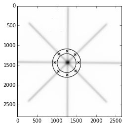

We now have a good start on a starshot algorithm!

