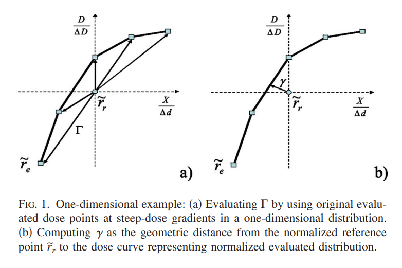

.. _gamma:

Gamma
=====

Overview
--------

Gamma :math:`\gamma` is the famous dose distribution calculation tool introduced by Low et al [1]_ [2]_.

Within pylinac, gamma can be calculated for 1D dose distributions reliably.
While there is a gamma function for 2D gamma, it is in the stages of being refactored for
easier use; it is thus not get documented fully here yet.

.. note::

  This discussion is for 1D gamma only.

As it relates to pylinac, the gamma is focused on comparing QA data measurements.

.. danger::

    The gamma functions in pylinac are not meant to be used for patient dose distributions.
    They are meant for machine QA data comparisons.

Other libraries out there also calculate gamma; e.g.
``pymedphys.gamma`` `here <https://docs.pymedphys.com/en/latest/users/howto/gamma/index.html>`__.

Assumptions
-----------

There is discussion in the literature about the assumptions of gamma and also assumptions
about the types of data to be evaluated. The following are a list of assumptions in pylinac:

#. The reference distribution is the ground truth distribution.
#. The reference distribution has more or equal resolution to the evaluated distribution.
#. We want to compute the gamma over each evaluation point within the context of a more
   dense reference distribution.
   E.g. comparing an IC Profiler to a finely-sampled water tank scan where the tank data is the commissioning data.
#. The evaluation distribution is within the physical bounds of the reference distribution.
   E.g. comparing a 10x10 field to a 20x20 reference field.

.. note::

    At least according to earlier references and the original Low paper, this is opposite to the
    explanation where the evaluation is the ground truth and the reference is the evaluated data.
    We make a distinction here primarily because of point 2 above.

Explanation
------------

Original Implementation
^^^^^^^^^^^^^^^^^^^^^^^

Below is the original implementation of gamma, which is considerably slower than follow-up implementations in the
literature. However, it's a good reference for understanding the gamma calculation.

Gamma function
~~~~~~~~~~~~~~

The gamma function of Table 1 in Low et al [2]_ is used. The generalized gamma function is defined as:

.. math::

    \Gamma(\vec{r}_{e},\vec{r}_{r}) = \sqrt{ \frac{r^2(\vec{r}_{e},\vec{r}_{r})}{\Delta d^{2}} + \frac{ \delta(\vec{r}_{e},\vec{r}_{r}) }{\Delta D^2} }

computed for each evaluation point and reference point.

The final gamma value for a given evaluation point is the minimum gamma value of the above function
for all reference points within the search radius:

.. math::

    \gamma(\vec{r}_{e}) = \min \{ \Gamma(\vec{r}_{e},\vec{r}_{r}) \} \forall \{ \vec{r}_{r} \}

.. important::

    Per assumption #3, we will perform the gamma on each **evaluation** point, not the reference point
    based on the other assumptions which is the inverse of Low.

For any residual definitions, see Table I of Low et al [2]_.

Logic
^^^^^

.. note::

    The actual gamma calculation is relatively straightforward. However, the implementation
    when the reference and evaluation data are not the same resolution or at the same physical
    locations are where the details matter.

#. The threshold for computing gamma is set as :math:`\max \{ \text{reference} \} \cdot \text{threshold parameter} \cdot 100` . 5-10% is a common value under which the gamma is not calculated.
#. If using global dose: The dose-to-agreement :math:`\Delta D` is computed as: :math:`\max \{ \text{reference} \} \cdot \text{DTA parameter} \cdot 100`. E.g. 3% is a common value.
#. If using local dose: The dose-to-agreement :math:`\Delta D` is computed as: :math:`\vec{r}_{r} \cdot \text{DTA parameter} \cdot 100`.
#. The reference distribution is mapped to an linear interpolator. This is so that the reference data can be evaluated at any desired point, not just the discrete points passed.
#. For each evaluation point :math:`D_{e}(\vec{r}_{e})`:

   #. The reference points to evaluate over are extracted. This will be from :math:`-\Delta d` to :math:`+\Delta d` from the evaluation point.
      The number of reference points depend on the ``resolution_factor`` parameter.
      E.g. a factor of 3 will result in 7 reference points sitting about the evaluation point. E.g. (-3, -2, -1, 0, 1, 2, 3).
   #. For each reference point in the array above above :math:`D_{r}(\vec{r}_{r})`, the gamma function is computed :math:`\Gamma(\vec{r}_{e},\vec{r}_{r})`.
   #. The minimum gamma is taken as the gamma value :math:`\gamma(\vec{r}_{e})` for that evaluation point. If the minimum gamma
      is larger than ``gamma_cap_value``, the ``gamma_cap_value`` is used instead.

The resulting gamma array will be the same size as the evaluation distribution. I.e. gamma is calculated at each evaluation point.

Geometric Gamma
^^^^^^^^^^^^^^^

Later, Ju et al (Low was the PI) [3]_ introduced a geometric gamma function that is more accurate by using geometric
minimization using simplexes. The easiest way to explain the geometric gamma is by way of
Figure 1 of the paper:

Figure 1a shows the original implementation. Improving on this by increasing interpolation resolution
can help with the accuracy of the gamma calculation. However, this improvement is traded for calculation
time. The geometric gamma function, shown in Figure 1b, uses a simplex to find the minimum gamma value
**without** interpolation. This results in an improvement in calculation time as well as complexity
when the interpolation resolution is medium/high.
This also comes at the cost of some more complex math.

Gamma function
~~~~~~~~~~~~~~

The gamma function is defined as Equation 4 of the paper:

.. math::

    \gamma(r_{e}) = \min_{S \in G_{r}} D(\widetilde{r}_{e}, S)

along with equation 6:

.. math::

    \overline{D}(p,S) = \min_{\{w_{1},...,w_{k + 1}\}} \left| p - \sum_{i=1}^{k+1} w_{i}v_{i} \right|

where :math:`\{w_{1},...,w_{k + 1}\}` are the weights of the simplex, :math:`v_{i}` are the vertices of the simplex, and :math:`p` is the point to evaluate, i.e. :math:`p = r_{e}`.

The weights are calculated via equation 7:

.. math::

    \{w_{1},...,w_{k + 1}\} = (V^{T}V)^{-1}V^{T}P, w_{k+1} = 1 - \sum_{i=1}^{k}w_{i}

where :math:`V` and :math:`P` are calculated via equation 8:

.. math::

    V = \begin{Bmatrix} c_{1}(p) - c_{1}(v_{k+1}) \\ \vdots \\ c_{n}(p) - c_{n}(v_{k+1}) \end{Bmatrix}

.. math::

    P = \begin{Bmatrix} c_{1}(v_{1}) - c_{1}(v_{k+1}) & \vdots & c_{1}(v_{k}) - c_{1}(v_{k+1})
    \\ \vdots & \ddots & \vdots \\ c_{n}(v_{1}) - c_{n}(v_{k+1}) & \vdots & c_{n}(v_{k}) - c_{n}(v_{k+1}) \end{Bmatrix}

Also, as stated in the paper, the projection of the point onto the simplex may not be within the bounds
of the simplex support. In the case, for 1D, we can simply take the minimum distance to the closest vertex.

Logic
~~~~~

#. The reference and evaluation distributions are normalized both by the maximum reference value * the dose to agreement parameter.
#. For each evaluation point :math:`p`:

   #. The vertices of each simplex are found. In the 1D scenario these will always be line segments defined by 2 points. All the points that are within and just beyond
      the geometric range of the DTA parameter. E.g. if the DTA is 3mm and the evaluation point is at 10mm,
      the vertices of the reference distribution are found that are within and just beyond 7-13mm. The next-furthest-away
      reference point away on either side is the first vertex. If the reference distribution was every 0.3mm
      then the first and last vertices sets would be 6.9-7.2mm, ..., 129.9-130.2mm.
   #. The distance from :math:`p` to each contained simplex is calculated.
   #. The minimum distance across simplex evaluations is the gamma value for that point.

Usage
-----

We will use the H&N 1mm, DD example from `Agnew & McGarry <https://www.sciencedirect.com/science/article/abs/pii/S0167814015006660>`__.
Although their data is 2D, we can extract a 1D profile from their data.
Below we use the original Low gamma function to calculate gamma for a 1D profile.

.. plot::

  import matplotlib.pyplot as plt

  from pylinac.core.io import retrieve_demo_file
  from pylinac.core.gamma import gamma_1d
  from pylinac.core.image import DicomImage

  # get the files from the cloud
  ref_file = retrieve_demo_file(name='gamma/HN_VMAT_Reference_1mmPx.dcm')
  eval_file = retrieve_demo_file(name='gamma/HN_VMAT_Evaluated_1mmPx.dcm')
  # load them as DICOM images; we want to use the raw pixels
  ref_img = DicomImage(ref_file, raw_pixels=True)
  eval_img = DicomImage(eval_file, raw_pixels=True)
  # convert the images to float arrays; uints can result in overflow errors
  ref_array = ref_img.array.astype(float)
  eval_array = eval_img.array.astype(float)
  # take a random sample profile through the middle of the images
  ref_prof = ref_img[:, 90]
  eval_prof = eval_img[:, 90]

  # compute the gamma
  gamma_map, ref_vals, ref_x_vals = gamma_1d(ref_prof, eval_prof, resolution_factor=7, dose_threshold_percent=0)

  # plot the results
  fig, ax = plt.subplots(figsize=(10, 7))
  ax.plot(ref_prof, 'k+', label='Original Reference', )
  ax.plot(ref_x_vals, ref_vals, 'cx', label='Reference Interpolated',)
  ax.plot(eval_prof, 'bo', label='Evaluation')
  ax.set_ylabel('Pixel Value')
  ax.set_xlabel('Pixel Position')
  ax.legend(loc='upper left')
  g_ax = ax.twinx()
  g_ax.plot(gamma_map, 'rx', label='Gamma')
  g_ax.legend(loc='upper right')
  g_ax.set_ylabel('Gamma')
  fig.suptitle(f'1D Gamma Analysis; max \N{Greek Small Letter Gamma}:{gamma_map.max():.2f}; avg \N{Greek Small Letter Gamma}: {gamma_map.mean():.2f}; pass rate: {100*gamma_map[gamma_map <= 1].size/gamma_map.size:.2f}%')
  plt.show()

Next, let's also calculate the geometric gamma for the same data:

.. plot::

  import matplotlib.pyplot as plt

  from pylinac.core.io import retrieve_demo_file
  from pylinac.core.gamma import gamma_geometric
  from pylinac.core.image import DicomImage

  # get the files from the cloud
  ref_file = retrieve_demo_file(name='gamma/HN_VMAT_Reference_1mmPx.dcm')
  eval_file = retrieve_demo_file(name='gamma/HN_VMAT_Evaluated_1mmPx.dcm')
  # load them as DICOM images; we want to use the raw pixels
  ref_img = DicomImage(ref_file, raw_pixels=True)
  eval_img = DicomImage(eval_file, raw_pixels=True)
  # convert the images to float arrays; uints can result in overflow errors
  ref_array = ref_img.array.astype(float)
  eval_array = eval_img.array.astype(float)
  # take a random sample profile through the middle of the images
  ref_prof = ref_img[:, 90]
  eval_prof = eval_img[:, 90]

  # compute the gamma
  gamma_map = gamma_geometric(ref_prof, eval_prof, dose_threshold_percent=0)

  # plot the results
  fig, ax = plt.subplots(figsize=(10, 7))
  ax.plot(ref_prof, 'k+', label='Original Reference')
  ax.plot(eval_prof, 'bo', label='Evaluation')
  ax.set_ylabel('Pixel Value')
  ax.set_xlabel('Pixel Position')
  ax.legend(loc='upper left')
  g_ax = ax.twinx()
  g_ax.plot(gamma_map, 'rx', label='Gamma')
  g_ax.legend(loc='upper right')
  g_ax.set_ylabel('Gamma')
  fig.suptitle(f'1D Gamma Analysis; max \N{Greek Small Letter Gamma}:{gamma_map.max():.2f}; avg \N{Greek Small Letter Gamma}: {gamma_map.mean():.2f}; pass rate: {100*gamma_map[gamma_map <= 1].size/gamma_map.size:.2f}%')
  plt.show()

Finally, let's plot both against each other:

.. plot::

  import matplotlib.pyplot as plt

  from pylinac.core.io import retrieve_demo_file
  from pylinac.core.gamma import gamma_geometric, gamma_1d
  from pylinac.core.image import DicomImage

  # get the files from the cloud
  ref_file = retrieve_demo_file(name='gamma/HN_VMAT_Reference_1mmPx.dcm')
  eval_file = retrieve_demo_file(name='gamma/HN_VMAT_Evaluated_1mmPx.dcm')
  # load them as DICOM images; we want to use the raw pixels
  ref_img = DicomImage(ref_file, raw_pixels=True)
  eval_img = DicomImage(eval_file, raw_pixels=True)
  # convert the images to float arrays; uints can result in overflow errors
  ref_array = ref_img.array.astype(float)
  eval_array = eval_img.array.astype(float)
  # take a random sample profile through the middle of the images
  ref_prof = ref_img[:, 90]
  eval_prof = eval_img[:, 90]

  # compute the gamma
  geometric_gamma_map = gamma_geometric(ref_prof, eval_prof, dose_threshold_percent=0)
  gamma_map, _, _ = gamma_1d(ref_prof, eval_prof, resolution_factor=2, dose_threshold_percent=0)

  # plot the results
  fig, ax = plt.subplots(figsize=(10, 7))
  ax.plot(ref_prof, 'k+', label='Original Reference')
  ax.plot(eval_prof, 'bo', label='Evaluation')
  ax.set_ylabel('Pixel Value')
  ax.set_xlabel('Pixel Position')
  ax.legend(loc='upper left')
  g_ax = ax.twinx()
  g_ax.plot(geometric_gamma_map, 'r+', label='Geometric Gamma')
  g_ax.plot(gamma_map, 'cx', label='Original Gamma')
  g_ax.legend(loc='upper right')
  g_ax.set_ylabel('Gamma')
  fig.suptitle('1D Gamma algorithm comparison')
  plt.show()

Note that the original gamma is slightly higher than the geometric gamma. This is due to the interpolation.
Higher interpolation factors will get closer to the geometric gamma value, but at the cost of calculation time.

.. [1] Low, Harms, Mutic, Purdy. A technique for the quantitative evaluation of dose distributions. Med Phys. 1998;25(5):656-61.

.. [2] Low, Dempsey. Evaluation of the gamma dose distribution comparison method. Med Phys. 2003;30(9):2455-64.

.. [3] `Ju, Simpson, Deasy, Low. Geometric interpretation of the gamma dose distribution comparison technique: Interpolation-free calculation <https://aapm.onlinelibrary.wiley.com/doi/abs/10.1118/1.2836952>`__

API
---

.. automodule:: pylinac.core.gamma
   :members:
