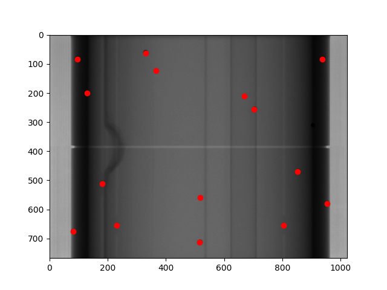
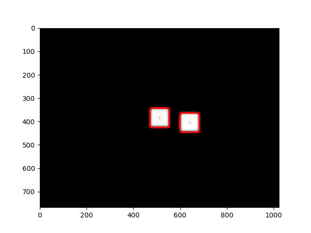
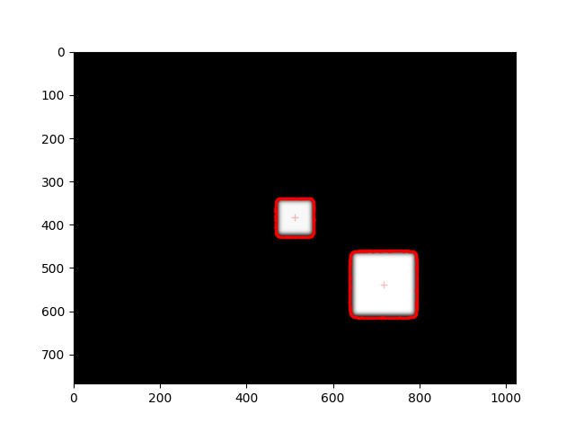
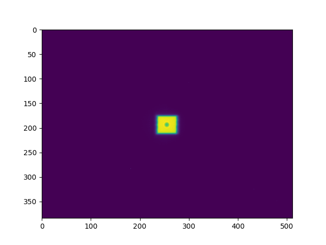
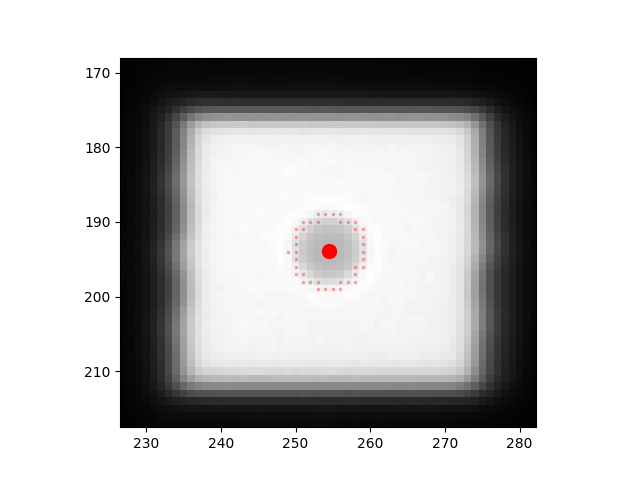

.. _image-metrics:

Images & 2D Metrics
===================

.. versionadded:: 3.16

Pylinac images can now have arbitrary metrics calculated on them, similar to profiles.
This can be useful for calculating and finding values and regions of interest in images.
The system is quite flexible and allows for any number of metrics to be calculated on an image.
Furthermore, this allows for re-usability of metrics, as they can be applied to any image.

Use Cases
---------

* Calculate the mean pixel value of an area of an image.
* Finding an object in the image.
* Calculating the distance between two objects in an image.

Tool Legend
-----------

+---------------------------------------------------------+------------------------------------------------------------------+------------------------------------------------------------------------------+
| Use Case                                                | Constraint                                                       | Class                                                                        |
+=========================================================+==================================================================+==============================================================================+
| Find the location of a single BB in the image           | The BB size and location is known approximately                  | :class:`~pylinac.metrics.image.SizedDiskLocator`                             |
+---------------------------------------------------------+------------------------------------------------------------------+------------------------------------------------------------------------------+
| Find the locations of *N* BBs in the image              | The BB sizes are all similar and location is known approximately | :class:`~pylinac.metrics.image.SizedDiskLocator` (``max_number=<n>``)        |
+---------------------------------------------------------+------------------------------------------------------------------+------------------------------------------------------------------------------+
| Find the ROI properties of a single BB in the image     | The BB size and location is known approximately                  | :class:`~pylinac.metrics.image.SizedDiskRegion`                              |
+---------------------------------------------------------+------------------------------------------------------------------+------------------------------------------------------------------------------+
| Find the ROI properties of *N* BBs in the image         | The BB size and location is known approximately                  | :class:`~pylinac.metrics.image.SizedDiskRegion` (``max_number=<n>``)         |
+---------------------------------------------------------+------------------------------------------------------------------+------------------------------------------------------------------------------+
| Find the location of a single BB anywhere in the image  | The BB size is known approximately                               | :class:`~pylinac.metrics.image.GlobalSizedDiskLocator` (``max_number=1``)    |
+---------------------------------------------------------+------------------------------------------------------------------+------------------------------------------------------------------------------+
| Find the locations of *N* BBs anywhere in the image     | The BB size is known approximately                               | :class:`~pylinac.metrics.image.GlobalSizedDiskLocator` (``max_number=<n>``)  |
+---------------------------------------------------------+------------------------------------------------------------------+------------------------------------------------------------------------------+
| Find the location of a square field in an image         | The field size is known approximately                            | :class:`~pylinac.metrics.image.GlobalSizedFieldLocator`                      |
+---------------------------------------------------------+------------------------------------------------------------------+------------------------------------------------------------------------------+
| Find the locations of *N* square fields in an image     | The field size is known approximately                            | :class:`~pylinac.metrics.image.GlobalSizedFieldLocator` (``max_number=<n>``) |
+---------------------------------------------------------+------------------------------------------------------------------+------------------------------------------------------------------------------+
| Find the locations of *N* square fields in an image     | The field size is not known                                      | :class:`~pylinac.metrics.image.GlobalFieldLocator` (``max_number=<n>``)      |
+---------------------------------------------------------+------------------------------------------------------------------+------------------------------------------------------------------------------+
| Find the location of a circular field in an image       | The field size and location are known approximately              | :class:`~pylinac.metrics.image.SizedDiskLocator` (``invert=False``)          |
+---------------------------------------------------------+------------------------------------------------------------------+------------------------------------------------------------------------------+
| Find the ROI properties of a circular field in an image | The field size and location are known approximately              | :class:`~pylinac.metrics.image.SizedDiskRegion` (``invert=False``)           |
+---------------------------------------------------------+------------------------------------------------------------------+------------------------------------------------------------------------------+

Basic Usage
-----------

To calculate metrics on an image, simply pass the metric(s) to the ``compute`` method of the image:

.. code-block:: python

  from pylinac.core.image import DicomImage
  from pylinac.metrics.image import DiskLocator, DiskRegion

  img = DicomImage("my_image.dcm")
  metric = img.compute(
      metrics=DiskLocator(
          expected_position=(100, 100),
          search_window=(30, 30),
          radius=10,
          radius_tolerance=2,
      )
  )
  print(metric)

You may compute multiple metrics by passing a list of metrics:

.. code-block:: python

  from pylinac.core.image import DicomImage
  from pylinac.metrics.image import DiskLocator, DiskRegion

  img = DicomImage("my_image.dcm")
  metrics = img.compute(
      metrics=[
          # disk 1
          DiskLocator(
              expected_position=(100, 100),
              search_window=(30, 30),
              radius=10,
              radius_tolerance=2,
          ),
          # disk 2
          DiskLocator(
              expected_position=(200, 200),
              search_window=(30, 30),
              radius=10,
              radius_tolerance=2,
          ),
      ]
  )
  print(metrics)

Metrics might have something to plot on the image. If so, the ``plot`` method of the image will plot the metric(s) on the image:

.. code-block:: python

  from pylinac.core.image import DicomImage
  from pylinac.metrics.image import DiskLocator, DiskRegion

  img = DicomImage("my_image.dcm")
  metrics = img.compute(
      metrics=[
          # disk 1
          DiskLocator(
              expected_position=(100, 100),
              search_window=(30, 30),
              radius=10,
              radius_tolerance=2,
          ),
          # disk 2
          DiskLocator(
              expected_position=(200, 200),
              search_window=(30, 30),
              radius=10,
              radius_tolerance=2,
          ),
      ]
  )
  img.plot()  # plots the image with the BB positions overlaid

Built-in Metrics
----------------

Sized Disk Locator
^^^^^^^^^^^^^^^^^^

.. note::

  The values provided below are in pixels. The following sections show how variants of how to use the metrics
  using physical units and relative to the center of the image.

Here's an example of using the :class:`~pylinac.metrics.image.SizedDiskLocator`:

.. code-block:: python
  :caption: Search for a disk 100 pixels right and 100 pixels down from the top left of the image

  from pylinac.core.image import DicomImage
  from pylinac.metrics.image import DiskLocator, DiskRegion

  img = DicomImage("my_image.dcm")
  img.compute(
      metrics=[
          DiskLocator(
              expected_position=(100, 100),
              search_window=(30, 30),
              radius=10,
              radius_tolerance=2,
          )
      ]
  )
  img.plot()

This will search for a disk (BB) in the image at the expected position and window size for a disk of a given radius and tolerance.
If the disk is found, the location will be returned as a :class:`~pylinac.core.geometry.Point` object.
If the disk is not found, a ``ValueError`` will be raised.

Using physical units
####################

While pixels are useful, it is sometimes easier to use physical units.

To perform the same Disk/BB location using mm instead of pixels:

.. code-block:: python
  :caption: Search for a disk 30mm right and 30mm down from the top left of the image

  from pylinac.core.image import DicomImage
  from pylinac.metrics.image import DiskLocator, DiskRegion

  img = DicomImage("my_image.dcm")
  img.compute(
      metrics=[
          # these are all in mm
          DiskLocator.from_physical(
              expected_position_mm=(30, 30),
              search_window_mm=(10, 10),
              radius_mm=4,
              radius_tolerance_mm=2,
          )
      ]
  )
  img.plot()

Relative to center
##################

We can also specify the expected position relative to the center of the image.

.. important::

  We can do this using pixels OR physical units.

This will look for the disk/BB 30 pixels right and 30 pixels down from the center of the image:

.. code-block:: python
  :caption: Relative to center using pixels

  from pylinac.core.image import DicomImage
  from pylinac.metrics.image import DiskLocator, DiskRegion

  img = DicomImage("my_image.dcm")
  img.compute(
      metrics=[
          # these are all in pixels
          DiskLocator.from_center(
              expected_position=(30, 30),
              search_window=(10, 10),
              radius=4,
              radius_tolerance=2,
          )
      ]
  )
  img.plot()

This will look for the disk/BB 30mm right and 30mm down from the center of the image:

.. code-block:: python
  :caption: Relative to center using physical units

  img.compute(
      metrics=[
          # these are all in mm
          DiskLocator.from_center_physical(
              expected_position_mm=(30, 30),
              search_window_mm=(10, 10),
              radius_mm=4,
              radius_tolerance_mm=2,
          )
      ]
  )
  img.plot()

Sized Disk Region
^^^^^^^^^^^^^^^^^

The :class:`~pylinac.metrics.image.SizedDiskRegion` metric is the same as the :class:`~pylinac.metrics.image.SizedDiskLocator`, but instead of returning the location, it returns a
`scikit-image regionprops <https://scikit-image.org/docs/stable/api/skimage.measure.html#skimage.measure.regionprops>`__ object that is the region of the disk.
This allows one to then calculate things like the weighted centroid, area, etc.

It also supports the same class methods as the :class:`~pylinac.metrics.image.SizedDiskLocator` metric.

Global Sized Disk Locator
^^^^^^^^^^^^^^^^^^^^^^^^^

.. versionadded:: 3.17

The :class:`~pylinac.metrics.image.GlobalSizedDiskLocator` metric is similar to the :class:`~pylinac.metrics.image.SizedDiskLocator` metric
except that it searches the entire image for disks/BB, not just a small window. This is useful for finding the BB in images
where the BB is not in the expected location or unknown. This is also efficient for finding BBs in images,
even if the locations are known.

For example, here is an example analysis of an MPC image:

.. code-block:: python

  from pylinac.core.image import XIM
  from pylinac.metrics.image import GlobalDiskLocator

  img = XIM("my_image.xim")
  bbs = img.compute(
      metrics=GlobalDiskLocator(
          radius_mm=3.5,
          radius_tolerance_mm=1.5,
          min_number=10,
      )
  )
  img.plot()

This will result in an image like so:

.. _global_sized_field_locator:

Global Sized Field Locator
^^^^^^^^^^^^^^^^^^^^^^^^^^

.. versionadded:: 3.17

The :class:`~pylinac.metrics.image.GlobalSizedFieldLocator` metric is similar to the :class:`~pylinac.metrics.image.GlobalSizedDiskLocator` metric.
This is useful for finding one or more fields in images
where the field is not in the expected location or unknown. This is also efficient when multiple fields are present in the image.

The locator will find the weighted center of the field(s) and return the location(s) as a :class:`~pylinac.core.geometry.Point` objects.
The boundary of the detected field(s) will be plotted on the image in addition to the center.

The locator will use pixels by default, but also has a ``from_physical`` class method to use physical units.

An example plot of finding multiple fields can be seen below:

For example:

.. code-block:: python
   :caption: Search for at least 2 fields of size 30x30 pixels with a tolerance of 4 pixels & plot

   img = DicomImage("my_image.dcm")
   img.compute(
       metrics=GlobalSizedFieldLocator(
           field_width_px=30, field_height_px=30, field_tolerance_px=4, max_number=2
       )
   )
   img.plot()  # this will plot the image with the fields overlaid

Constraints
###########

* The field is expected to be mostly rectangular. I.e. not a cone.
* The field must not be touching an edge of the image. Such fields will be ignored.
* The field must be at least 10% of the maximum pixel value. This is to avoid finding artifacts. I.e.
  If the maximum pixel value is 10,000, then the pixels within the field must be at least 1,000 to be
  detected. Anything under 10% will be ignored.

Using physical units
####################

To perform a similar field location using mm instead of pixels:

.. code-block:: python
   :caption: Search for at least 2 fields of size 30x30mm with a tolerance of 4mm

   img = DicomImage("my_image.dcm")
   img.compute(
       metrics=GlobalSizedFieldLocator.from_physical(
           field_width_mm=30, field_height_mm=30, field_tolerance_mm=4, max_number=2
       )
   )

Usage tips
##########

* Whenever possible, set the ``max_number`` parameter. This can **greatly** speed up the computation for several reasons.
  First, it will stop searching once the number of fields is found. Second, the thresholding algorithm will have a much
  better initial guess and also a better step size. This is because the approximate area of the field is known relative
  to the total image size.
* The ``field_tolerance_<mm|px>`` parameter can be relatively tight if the ``max_number`` parameter is set. Without a
  ``max_number`` parameter, you may have to increase the field tolerance to find all fields.

Global Field Locator
^^^^^^^^^^^^^^^^^^^^

.. versionadded:: 3.17

The :class:`GlobalFieldLocator` metric will find fields within an image, but does not require the field to be a specific size.
It will find anything field-like in the image. The logic is similar to the :class:`GlobalSizedFieldLocator` metric otherwise.

For example:

.. code-block:: python
   :caption: Search for any fields within the image, regardless of size

   img = DicomImage("my_image.dcm")
   img.compute(metrics=GlobalFieldLocator(max_number=2))
   img.plot()  # this will plot the image with the fields overlaid

Writing Custom Plugins
----------------------

The power of the plugin architecture is that you can write your own metrics and use them on any image
as well as reuse them where needed.

To write a custom plugin, you must

* Inherit from the :class:`~pylinac.metrics.image.MetricBase` class
* Specify a ``name`` attribute.
* Implement the ``calculate`` method.
* (Optional) Implement the ``plot`` method if you want the metric to plot on the image.

.. warning::

    Do not modify the image in the ``calculate`` method as this will affect the image for other metrics and/or plotting.

For example, let's built a simple plugin that finds and plots an "X" at the center of the image:

.. plot::

    from pylinac.core.image_generator import AS1000Image, FilteredFieldLayer, GaussianFilterLayer
    from pylinac.core.image import DicomImage
    from pylinac.metrics.image import MetricBase

    class ImageCenterMetric(MetricBase):
        name = "Image Center"

        def calculate(self):
            return self.image.center

        def plot(self, axis: plt.Axes):
            axis.plot(self.image.center.x, self.image.center.y, 'rx', markersize=10)

    # now we create an image to compute over
    as1000 = AS1000Image(sid=1000)  # this will set the pixel size and shape automatically
    as1000.add_layer(
        FilteredFieldLayer(field_size_mm=(100, 100))
    )  # create a 100x100mm square field
    as1000.add_layer(
        GaussianFilterLayer(sigma_mm=2)
    )  # add an image-wide gaussian to simulate penumbra/scatter
    ds = as1000.as_dicom()

    # now we can compute the metric on the image
    img = DicomImage.from_dataset(ds)
    center = img.compute(metrics=ImageCenterMetric())
    print(center)
    img.plot()

.. _image_metric_algorithm:

Algorithm
---------

The algorithms for the metrics are similar to each other. They all use a thresholding algorithm to find the object(s) of interest.
For the example below, we will be using the first image from the Winston Lutz demo dataset:

  Original image to be analyzed.

#. The image is cropped if needed. This applies to metrics that have an expected position. I.e. non-``Global`` variants of the metrics. This cropped
   section is called the "sample".

   .. important::

       Image analyses using the :class:`~pylinac.winston_lutz.WinstonLutz` class are always cropped like this.

   .. image:: ../images/metric_algo_cropped.png
      :width: 600
      :align: center

#. The sample might be inverted depending on the ``invert`` parameter. This applies to disk/BB metrics. The reason for inversion is that in the case of a BB within
   an open field, the pixel values within the BB ROI will be lower than the field surrounding it. Because pylinac uses weighted pixel
   values to find the center of the object, the pixel values need to be proportional to the "impact" of the object.

   .. image:: ../images/metric_algo_inverted.png
      :width: 600
      :align: center

   To make this clear, the profiles are plotted below with and without inversion.
   Because pylinac uses the weighted centroid of the pixels, we want the BB to "weigh" more
   at the center than the edges of the BB.

   .. image:: ../images/metric_algo_profile_inversion.png
      :width: 600
      :align: center

#. The sample is normalized to a range of 0-1. This is done because sometimes the attenuation
   of a BB can be relatively small compared to the surrounding field. Doing so ensures the central pixels' weighting
   is large and the BB edge pixel values is relatively small.

   .. note::

    For ``Global`` metrics, this often won't change the image very much since the entire image is searched.

   The image below shows why normalization is helpful. When not normalized,
   the BB pixel values can be very similar to the region outside the BB. E.g.
   the value at index 20 (outside the BB in the field area) is ~2502 while the
   peak BB value at index 27 is ~2509. With such a small difference, the
   weighted centroid will be very similar to a simple centroid, which is not
   as accurate as it's sensitive to "edge" pixels of the blob.

   .. image:: ../images/metric_algo_profile_normalized.png
      :width: 600
      :align: center

#. The image is then converted to binary using a threshold. The threshold
   starts at 0.02. E.g. for this threshold value any pixel below 0.02 is set to 0 and everything above it is set to 1.
   The resulting binary image is analyzed to see if
   each "blob" passed all of the ``detection_conditions``.

   .. image:: ../images/metric_algo_0.02_binary.png
      :width: 600
      :align: center

   The detection conditions can be anything and generally measure
   blob properties such as area, eccentricity, etc. Each blob is a `regionprops <https://scikit-image.org/docs/stable/api/skimage.measure.html#skimage.measure.regionprops>`__
   . The blob has a vast number of properties that are calculated and can be measured.
   E.g. the disk detection conditions are that the blob is 1) round, 2) has an area within the expected range given the BB size, and 3) has a circumference within the expected range given the BB size.

   The image above isn't very helpful because the BB isn't really visible here.

   If no blob passes all the detection conditions, the threshold is increased by 0.02 and the process is repeated.

   Here is the image when the detection conditions pass:

   .. image:: ../images/metric_algo_final_binary.png
    :width: 600
    :align: center

   Clearly, this threshold works well and the BB is identifiable.

#. If there is a ``max_number`` parameter, the thresholding algorithm will stop once that number is reached.
   This is because the thresholding algorithm can be slow, and once the expected number of objects is found there
   is no need to continue.

   .. important::

      Setting a ``max_number`` does not guarantee that **only** that number of objects will be found. It only guarantees
      that once that number is found, the thresholding algorithm will stop. This is because the thresholding algorithm
      could find multiple objects at a given threshold value.

   If the ``max_number`` parameter is not set, the thresholding algorithm will continue until the threshold reaches 1.0.

#. If the ``min_number`` parameter is set and the thresholding algorithm stops (i.e. reaches 1.0), a ``ValueError`` is raised.

   .. note::

    The ``min_number`` and ``max_number`` parameters are only available for the ``Global`` variants of the metrics. They are both fixed to 1 for
    single object metrics.

#. If no blobs are found that match all the detection conditions after the threshold reaches 1.0, a ``ValueError`` is raised.

#. For each blob that is detected, the `boundary <https://scikit-image.org/docs/stable/api/skimage.measure.html#skimage.measure.regionprops>`__
   of the binary threshold of that blob is tracked. This is solely used for plotting.

#. At each pass of the threshold, if more objects are detected, they are compared and potentially de-duplicated.
   This is because if, e.g., we are looking for two objects and one is found at a given threshold,
   it will likely continue to be found again and again at higher thresholds while we are searching for the second
   object.

   This comparison is done by comparing the centroids of the blobs. If the centroids are within the ``min_separation_mm``,
   the first blob is retained and the subsequent blob is discarded. If the centroid is
   sufficiently far away, the blob is retained.

   Note that it's also possible the original blob is no longer seen at higher thresholds. E.g. multiple
   small fields each delivering different MUs. In all cases, regions/points are always kept even if it is no longer detected at
   higher thresholds. I.e. the regions/points are add-only.

#. For ``Locator`` metrics, the weighted centroid of the blob is returned as a :class:`~pylinac.core.geometry.Point` object.
   For ``Region`` metrics, the scikit-image regionprops object is returned.

   .. important::

      I can't stress this enough: **the weighted centroid is not the same as the simple centroid**. The weighted centroid
      is the centroid of the blob *accounting for the pixel value itself*. This will not be nearly as sensitive to "edge" pixels being included as a simple centroid.
      The simple centroid is the average of the pixel locations *not accounting for the pixel value*.
      You will find some other commercial software uses only the simple centroid, which is not as accurate as
      it's far more sensitive to edge pixels being included in the threshold.

Here is the plot of the final image with the BB location and threshold boundary overlaid:

.. note::

  Note the single pixel on the left side boundary of the BB. A different threshold
  may or may not have included that pixel. The benefit of the weighted centroid is that the normalized,
  inverted sample value at that pixel is ~0 whereas the pixels at the center of the BB are ~1. The weighted centroid
  thus is hardly affected by that pixel, so it's robust to a change in threshold.

API
---

.. autoclass:: pylinac.metrics.image.MetricBase
    :inherited-members:
    :members:

.. autoclass:: pylinac.metrics.image.SizedDiskLocator
    :inherited-members:
    :members:

.. autoclass:: pylinac.metrics.image.SizedDiskRegion
    :inherited-members:
    :members:

.. autoclass:: pylinac.metrics.image.GlobalSizedDiskLocator
    :inherited-members:
    :members:

.. autoclass:: pylinac.metrics.image.GlobalSizedFieldLocator
    :inherited-members:
    :members:

.. autoclass:: pylinac.metrics.image.GlobalFieldLocator
    :inherited-members:
    :members:
