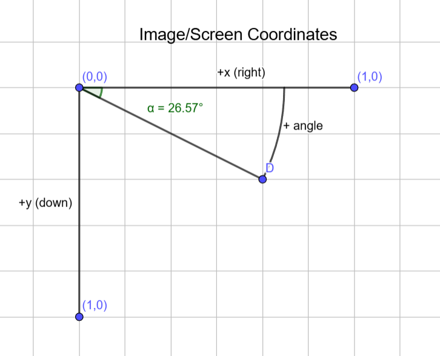

.. _image_loading:

Images
------

Pylinac deals nearly exclusively with DICOM image data. Film has been actively avoided where possible because of 1)
the increased use and technological advances of EPIDs. EPID data also contains useful tags that give contextual information
about the acquisition (unless you use Elekta). And 2) film images tend to be much messier in general; they often have
markings on them such as a pin prick, marker writing to identify the image, or flash on the edges of the image where
the scanner and film edge did not line up. That being said, pylinac can generally handle DICOM images and general
images (PNG, JPG, etc) relatively well.

The ``image`` module within pylinac is quite powerful and flexible to do arbitrary operations
for use in custom algorithms. For example, images can be loaded easily, filters applied, cropped,
rotated, and more with straightforward methods.

.. _how-image-data-is-loaded:

How data is loaded
^^^^^^^^^^^^^^^^^^

Pylinac uses the excellent ``pydicom`` library to load DICOM images. The pydicom dataset is stored in pylinac images
under the ``metadata`` attribute.

For non-DICOM images (JPG, PNG, TIFF, etc), the ``Pillow`` library is used.

To load an image, the easiest way is like so:

.. code-block:: python

    from pylinac import image

    my_dcm = image.load("path/to/my/image.dcm")
    my_dcm.metadata.GantryAngle  # the GantryAngle tag of the DICOM file
    # these won't have the metadata property as they aren't DICOM
    my_tiff = image.load("path/to/my/image.tiff")
    my_jpg = image.load("path/to/my/image.jpg")

See the :func:`~pylinac.core.image.load` function for details. This will return an image-like
object ready for plotting or manipulation. Note that :ref:`XIM <xim-images>` images are handled separately.

We can also test whether a file is image-like without causing an error if it's not:

.. code-block:: python

    from pylinac import image

    is_image = image.is_image("path/to/questionable.file")  # True or False

Coordinate System
^^^^^^^^^^^^^^^^^

.. note::

    Do not confuse this with linac coordinate systems, aka "machine scales", which are different. See :ref:`scale`.

Images in pylinac are oriented in "image" or "screen" coordinates.
This means that the origin (0, 0) is at the top-left corner of the image, with the x-axis increasing to the right and the y-axis increasing downwards.
This is also how DICOM images are oriented, so pylinac images are consistent with DICOM standards.

This is in contrast to "Cartesian" coordinates, where the origin is at the bottom-left corner of the image,
and +x is to the right while +y is up.

Using right-hand rule conventions, positive angle is clockwise. Aka "x goes to y".

.. warning::

    This can sometimes be confusing when dealing with the y-axis, as what is viewed as the "top" of the image
    has the lowest y index values.

This can also be visualized `here <https://www.slicer.org/wiki/Coordinate_systems#Image_coordinate_system>`__.

Image Manipulation
^^^^^^^^^^^^^^^^^^

To manipulate an image, such as cropping, simply run the method. Some examples:

.. code-block:: python

    from pylinac import image

    my_dcm = image.load(...)
    my_dcm.filter(size=0.01, kind="median")
    my_dcm.fliplr()  # flip the image left-right
    my_dcm.ground()  # set minimum value to 0; useful for images with short dynamic range
    my_dcm.crop(pixels=30, edges=("top", "left"))
    my_dcm.normalize()  # normalize values to 1.0
    my_dcm.rot90(n=1)  # rotate the image by 90 degrees
    my_dcm.bit_invert()  # flip the image so that dark is light and light is dark. Useful for EPID images.
    my_dcm.plot()  # plot the image for visualization

These and similar methods are available to all types of images. However, some image types
have additional properties and methods. For a DICOM that is from a linac EPID, we have
a few extras. We need to load it specifically:

.. code-block:: python

    from pylinac import image

    my_linac_dcm = image.LinacDicomImage("path/to/image.dcm")
    my_linac_dcm.cax()  # a Point instance. E.g. (x=550, y=550)
    my_linac_dcm.dpmm()  # the dots/mm at isocenter. Will account for the SID.

.. _tiff-to-dicom:

TIFF to DICOM
^^^^^^^^^^^^^

Pylinac will often internally convert TIFF images to pseudo-DICOM files so that
the same methods are available as a DICOM. To do so:

.. code-block:: python

    from pylinac import image

    image.tiff_to_dicom(
        tiff_file="path/to/image.tiff",
        dicom_file="my_new_dicom.dcm",
        sid=1000,
        gantry=0,
        coll=0,
        couch=0,
        dpi=280,
    )

We will now have a file in our working directory named ``my_new_dicom.dcm`` that is, for all intents and purposes,
a DICOM file. It can be loaded with ``image.load()`` or ``pydicom`` like any normal DICOM.

.. _loading-raw-images:

RAW Images (CyberKnife, VisionRT)
^^^^^^^^^^^^^^^^^^^^^^^^^^^^^^^^^

Pylinac can open .raw images generated from CyberKnife and VisionRT images. These are usually .raw files
that follow simple metadata+pixel information format.

There are 3 functions available: :func:`~pylinac.core.image.load_raw`, :func:`~pylinac.core.image.load_raw_cyberknife`, and :func:`~pylinac.core.image.load_raw_visionrt`.
The first is a general function that can open any .raw file. The latter two are specialized for CyberKnife and VisionRT images, respectively and use the general function.
These will generate an :class:`~pylinac.core.image.ArrayImage` object that can be manipulated like any other image.

To open these VisionRT:

.. code-block:: python

    from pylinac import image

    my_raw = image.load_raw_visionrt("path/to/my/image.raw", shape=(600, 960))
    # OR
    my_raw = image.load_raw("path/to/my/image.raw", shape=(600, 960), dtype=np.uint32)

To load CyberKnife images:

.. code-block:: python

    from pylinac import image

    my_raw = image.load_raw_cyberknife("path/to/my/image.raw", shape=(512, 512))
    # OR
    my_raw = image.load_raw("path/to/my/image.raw", shape=(512, 512), dtype=np.uint16)

Gamma
^^^^^

We can compute the gamma between two arrays or images using :func:`~pylinac.core.image.gamma_2d`:

.. code-block:: python

    import matplotlib.pyplot as plt
    from pylinac import image

    ref = image.load("reference_dicom.dcm")
    eval = image.load("eval_dicom.dcm")

    gamma = image.gamma_2d(
        reference=ref,
        evaluation=eval,
        dose_to_agreement=2,
        distance_to_agreement=3,
        global_dose=True,
        ...,
    )

    # gamma is a numpy array the same size as the reference/eval image
    plt.imshow(gamma)

Pixel Data Rescaling
^^^^^^^^^^^^^^^^^^^^

In DICOM the pixel data is stored as a data stream and needs to be converted into meaningful values — commonly referred to as modality-specific units (e.g., Hounsfield Units in CT).
This is done by applying a lookup table or a linear transformation (e.g. :math:`P_{corrected} = Slope * P_{raw} + Intercept`). Both cases are handled by `pydicom.pixels.apply_rescale <https://pydicom.github.io/pydicom/dev/reference/generated/pydicom.pixels.apply_rescale.html>`_.

.. note:: This behavior can be overridden by setting the ``raw_pixels`` parameter to ``True``:

  .. code-block:: python

    from pylinac.core import image

    dcm = image.load("my_dcm_file.dcm")  # Default, returns rescaled data
    dcm = image.load("my_dcm_file.dcm", raw_pixels=False)  # Same as above
    dcm = image.load("my_dcm_file.dcm", raw_pixels=True)  # Override, returns raw pixel data

  .. versionadded:: 3.13

.. _pixel_inversion:

Pixel Data Inversion
^^^^^^^^^^^^^^^^^^^^

.. note:: In this context inversion means flipping the min/max values.

DICOM provides different tags to handle how an image should be displayed with respect to light/dark values and low/high intensity values.

* `PixelIntensityRelationshipSign (0028,1041) <https://dicom.innolitics.com/ciods/rt-image/rt-image/00281041>`_
    *The sign of the relationship between the Pixel sample values stored in Pixel Data and the X-Ray beam intensity*
     | *+1: Lower pixel values correspond to less X-Ray beam intensity*
     | *-1: Higher pixel values correspond to less X-Ray beam intensity*
* `PhotometricInterpretation (0028,0004) <https://dicom.innolitics.com/ciods/computed-radiography-image/image-pixel/00280004>`_
    *Specifies the intended interpretation of the pixel data*
     | *MONOCHROME1: ...The minimum sample value is intended to be displayed as white...*
     | *MONOCHROME2: ...The minimum sample value is intended to be displayed as black...*

.. note:: The axiom for pylinac (for v3.0+) is that higher pixel values == more radiation == lighter/whiter display

This is the most common issue when dealing with image analysis.
E.g. when displaying a square field (x-rays in the middle, no irradiation on the sides) we can have these combinations:

.. plot::
   :include-source: False

   import matplotlib.pyplot as plt
   import numpy as np

   x = np.zeros((3, 3), dtype=np.uint8)
   x[1, 1] = 1

   fig, axs = plt.subplots(2,2, constrained_layout=True)

   ax = axs[0,0]
   ax.imshow(x, cmap='gray')
   ax.set_title('RelationshipSign = -1\nMonochrome1')
   for row in range(3):
       for col in range(3):
           text = ax.text(row, col, 1-x[row, col], ha="center", va="center", color="r")

   ax = axs[0,1]
   ax.imshow(1 - x, cmap='gray')
   ax.set_title('RelationshipSign = -1\nMonochrome2')
   for row in range(3):
       for col in range(3):
           text = ax.text(row, col, 1-x[row, col], ha="center", va="center", color="r")

   ax = axs[1,0]
   ax.imshow(1 - x, cmap='gray')
   ax.set_title('RelationshipSign = 1\nMonochrome1')
   for row in range(3):
       for col in range(3):
           text = ax.text(row, col, x[row, col], ha="center", va="center", color="r")

   ax = axs[1,1]
   ax.imshow(x, cmap='gray')
   ax.set_title('RelationshipSign = 1\nMonochrome2')
   for row in range(3):
       for col in range(3):
           text = ax.text(row, col, x[row, col], ha="center", va="center", color="r")

   for ax in axs.flat:
       ax.set_xticks([])
       ax.set_yticks([])

   plt.show()

As a convention pylinac uses ``MONOCHROME2`` to display the images (regardless of the ``PhotometricInterpretation`` value).
Film images have negative ``PixelIntensityRelationshipSign``, whereas EPID images have positive ``PixelIntensityRelationshipSign``.
Since most RT images these days are EPID images, pylinac processes images as EPID therefore the pixels are inverted when ``PixelIntensityRelationshipSign = -1``:
:math:`P_{inverted} = max(P_{original}) + min(P_{original}) - P_{original}`.

.. note:: this behavior can be overridden by setting the ``invert_pixels`` parameter to ``False``, ``True``, ``None`` (auto):

  .. code-block:: python

    from pylinac.core import image

    dcm = image.load(
        "my_dcm_file.dcm"
    )  # Default, returns inverted pixels if PixelIntensityRelationshipSign = -1
    dcm = image.load("my_dcm_file.dcm", invert_pixels=None)  # Same as above
    dcm = image.load(
        "my_dcm_file.dcm", invert_pixels=True
    )  # Force inversion, returns inverted pixels
    dcm = image.load(
        "my_dcm_file.dcm", invert_pixels=False
    )  # Do not invert, returns original pixels

  .. versionadded:: 3.35
