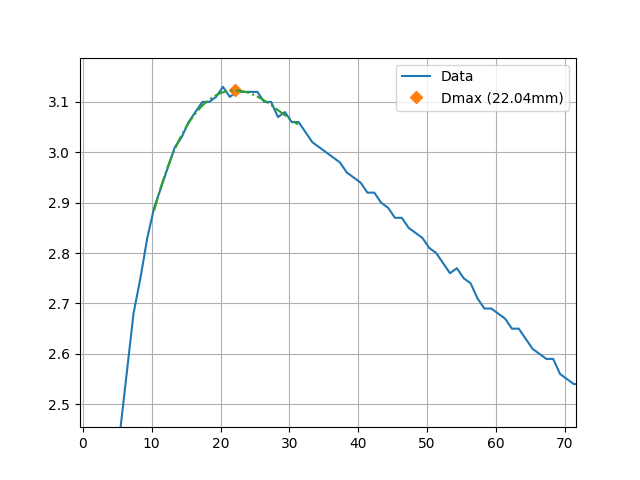
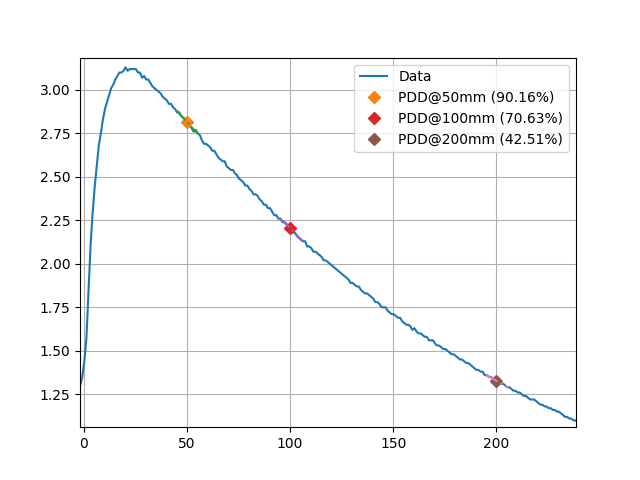

.. _profiles:

Profiles & 1D Metrics
=====================

Profiles, in the context of pylinac, are 1D arrays of data that
contain a single radiation field. Colloquially, these are what
physicists might call an "inplane profile" or "crossplane profile"
although the usage here is not restricted to those orientations.

Use Cases
---------

Typical use cases for profiles are:

* Calculating a metric such as flatness, symmetry, penumbra, etc.
* Finding the center of the field.
* Finding the field edges.

Assumptions & Constraints
-------------------------

* There is one single, large radiation field in the profile.
* The radiation field should not be at the edge of the array.
* The radiation field should have a higher pixel value than the background. I.e. it should not be inverted.

* The field does not have to be normalized, but generally it should be. Plugins may assume normalized data.
* The field can be "horned" (i.e. have a dip in the middle) and/or contain a peak from an FFF field.
* The field can be off-center, but the penumbra should be fully contained in the array.
* The field can be skewed (e.g. a wedge field).
* The field can have any resolution or no resolution.

Basic Usage
-----------

Out of the box, the profile classes can be used to find the center of the field, field width,
and the field edges.

.. code-block:: python

    from pylinac.core.profile import FWXMProfile

    profile = FWXMProfile(..., fwxm_height=50)
    print(profile.center_idx)  # print the center of the field position
    print(profile.field_edge_idx(side="left"))  # print the left field edge position
    print(profile.field_width_px)  # print the field width in pixels
    profile.plot()  # plot the profile

However, the real power of the profile classes is in the plugins that can be used to calculate
custom metrics. See the :ref:`plugins <profile_plugins>` section for more information.

Legacy vs New Classes
---------------------

The legacy class for analyzing profiles is :class:`~pylinac.core.profile.SingleProfile`.
This class is frozen and will not receive updates.

The modern classes for analyzing profiles are :class:`~pylinac.core.profile.FWXMProfile`,
:class:`~pylinac.core.profile.InflectionDerivativeProfile`, :class:`~pylinac.core.profile.HillProfile`.
These classes deal with **arrays only**.

For physical profiles, i.e. something where the values have a physical size or location like an EPID profile
or water tank scan, use the following classes: :class:`~pylinac.core.profile.FWXMProfilePhysical`,
:class:`~pylinac.core.profile.InflectionDerivativeProfilePhysical`, :class:`~pylinac.core.profile.HillProfilePhysical`.

.. important::

    You will almost always want the ``...Physical`` variants of the classes as most profiles are
    from physical sources. Furthermore, some plugins will not work with the non-physical classes.

The difference between ``SingleProfile`` and the other classes
is that ``SingleProfile`` is a swiss army knife. It can
do almost everything the other classes can do and considerably more. However,
the other classes are more specialized and thus more robust
as well as a lot clearer and focused.
Internally, pylinac uses the new specialized classes.
The new classes also allow for :ref:`plugins <profile_plugins>` to be written and used much easier than
with ``SingleProfile``.

The ``SingleProfile`` class is more complicated to both read and use
than the specialized classes. It's also harder to test and maintain.
Thus, the specialized classes have come about as a response.

What class to use
-----------------

.. note::

    Throughout the documentation examples, the FWXM variety is used, but all examples
    can be replaced with the other variants.

The following list is a guide to what class to use:

* PDDs, TPRs, and similar depth-focused scans:

  * Use any of the classes.

* :class:`~pylinac.core.profile.FWXMProfile`/:class:`~pylinac.core.profile.FWXMProfilePhysical`

  * Use when the beam is "flat"; no FFF beams.
  * Can handle somewhat noisy data.
  * Robust to background noise and asymmetric background data.

* :class:`~pylinac.core.profile.InflectionDerivativeProfile`/:class:`~pylinac.core.profile.InflectionDerivativeProfilePhysical`:

  * Use either when the beam is flat or peaked.
  * Is not robust to salt and pepper noise or gently-sloping data.
  * The profile should have relatively sharp slopes compared to the background and central region.
  * This is a good default *ceteris parabus*.

* :class:`~pylinac.core.profile.HillProfile`/:class:`~pylinac.core.profile.HillProfilePhysical`:

  * Use either when the beam is flat or peaked.
  * It is robust to salt and pepper noise.
  * Do not use with sparse data such as IC profiler or similar where little data exists in the penumbra region.

.. _profile_plugins:

Metric Plugins
--------------

The new profile classes discussed above allow for plugins to be written that
can calculate metrics of the profile. For example,
a penumbra plugin could be written that calculates the penumbra of the profile.

Several plugins are provided out of the box, and writing new plugins is straightforward.

Metrics are calculated by passing it as a list to the ``calculate`` method.
The examples below show its usage.

.. _profile_builtin_plugins:

Built-in Plugins
~~~~~~~~~~~~~~~~

The following plugins are available out of the box:

Penumbra Right
^^^^^^^^^^^^^^

:class:`~pylinac.core.profile.PenumbraRightMetric` This plugin calculates the right penumbra of the profile.
The upper and lower bounds can be passed in as arguments. The default is 80/20.

Example usage:

.. code-block:: python

  profile = FWXMProfile(...)
  profile.compute(metrics=[PenumbraRightMetric(upper=80, lower=20)])

.. note::

  When using Inflection derivative or Hill profiles, the penumbra
  is based on the height of the edge, not the maximum value of the profile.
  E.g. assume an FFF profile normalized to 1.0 and penumbra bounds of 80/20. The penumbra
  will not be at 50% height for Inflection derivative or Hill profiles. If it
  is detected at 0.4, or 40% height, the lower penumbra will be set to 20% (0.2) * 2 * 0.4, or 0.16.
  The upper penumbra will be 80% (0.8) * 2 * 0.4, or 0.64. This is because the penumbra bound is based on the
  height of the field edge, not the maximum value of the profile.
  This is best illustrated with a plot. We use the ``FWXMProfilePhysical`` class first to show its
  *inappropriate* use with FFF beams:

  .. plot::
    :include-source: false

    from pylinac.core.array_utils import normalize
    from pylinac.core.image_generator import AS1000Image, FilterFreeFieldLayer, GaussianFilterLayer
    from pylinac.core.profile import FWXMProfilePhysical, PenumbraLeftMetric, PenumbraRightMetric

    # this is our set up to get a nice profile
    as1000 = AS1000Image()
    as1000.add_layer(
        FilterFreeFieldLayer(field_size_mm=(100, 100))
    )
    as1000.add_layer(
        GaussianFilterLayer(sigma_mm=2)
    )  # add an image-wide gaussian to simulate penumbra/scatter

    # pull out the profile array
    array = normalize(as1000.image[:, as1000.shape[1] // 2])

    # create the profile
    profile = FWXMProfilePhysical(array, dpmm=1)

    # compute the profile with our plugin
    profile.compute(metrics=[PenumbraLeftMetric(), PenumbraRightMetric()])

    # plot the profile
    profile.plot()

  Note the upper penumbra is well-past the "shoulder" region and thus the penumbra is not accurate.
  Now let's use the ``InflectionDerivativeProfilePhysical`` class:

  .. plot::
    :include-source: false

    from pylinac.core.array_utils import normalize
    from pylinac.core.image_generator import AS1000Image, FilterFreeFieldLayer, GaussianFilterLayer
    from pylinac.core.profile import InflectionDerivativeProfilePhysical, PenumbraLeftMetric, PenumbraRightMetric

    # this is our set up to get a nice profile
    as1000 = AS1000Image()
    as1000.add_layer(
        FilterFreeFieldLayer(field_size_mm=(100, 100))
    )
    as1000.add_layer(
        GaussianFilterLayer(sigma_mm=2)
    )  # add an image-wide gaussian to simulate penumbra/scatter

    # pull out the profile array
    array = normalize(as1000.image[:, as1000.shape[1] // 2])

    # create the profile
    profile = InflectionDerivativeProfilePhysical(array, dpmm=1)

    # compute the profile with our plugin
    profile.compute(metrics=[PenumbraLeftMetric(), PenumbraRightMetric()])

    # plot the profile
    profile.plot()

  When analyzing flat beams, the ``FWXMProfile`` class is appropriate and will give similar
  results to the other two classes.

Penumbra Left
^^^^^^^^^^^^^

:class:`~pylinac.core.profile.PenumbraLeftMetric` This plugin calculates the left penumbra of the profile.
The upper and lower bounds can be passed in as arguments. The default is 80/20.

Flatness (Difference)
^^^^^^^^^^^^^^^^^^^^^

:class:`~pylinac.core.profile.FlatnessDifferenceMetric` This plugin calculates the flatness difference of the profile.
The in-field ratio can be passed in as an argument. The default is 0.8.

The flatness equation is:

.. math::

    flatness = 100 * \frac{D_{max} - D_{min}}{D_{max} + D_{min}} \in field

The equation does not track which side the flatness is higher or lower on.
The value can range from 0 to 100. A perfect value is 0.

Example usage:

.. code-block:: python

    profile = FWXMProfile(...)
    profile.compute(metrics=[FlatnessDifferenceMetric(in_field_ratio=0.8)])

Flatness (Ratio)
^^^^^^^^^^^^^^^^

:class:`~pylinac.core.profile.FlatnessRatioMetric` This plugin calculates the flatness ratio of the profile.
The in-field ratio can be passed in as an argument. The default is 0.8.

The flatness equation is:

.. math::

    flatness = 100 * \frac{D_{max}}{D_{min}} \in field

The equation does not track which side the flatness is higher or lower on.
The value will range from 100 to :math:`\infty`. A perfect value is 100.

Example usage:

.. code-block:: python

    profile = FWXMProfile(...)
    profile.compute(metrics=[FlatnessRatioMetric(in_field_ratio=0.8)])

Symmetry (Point Difference)
^^^^^^^^^^^^^^^^^^^^^^^^^^^

:class:`~pylinac.core.profile.SymmetryPointDifferenceMetric` This plugin calculates the symmetry point difference of the profile.
The in-field ratio can be passed in as an argument. The default is 0.8.

The symmetry point difference equation is:

.. math::

    symmetry = 100 * \frac{max(L_{pt} - R_{pt})}{D_{CAX}} \in field

where :math:`L_{pt}` and :math:`R_{pt}` are equidistant from the beam center.
Symmetry can be positive or negative. The :math:`max` refers to the
point with the maximum difference between the left and right points. If the
largest absolute value is negative, that is the value used.

.. note::

  Unlike the point difference quotient, this metric is signed. A negative value means the right side is higher.
  A positive value means the left side is higher.

Example usage:

.. code-block:: python

    profile = FWXMProfile(...)
    profile.compute(metrics=[SymmetryPointDifferenceMetric(in_field_ratio=0.8)])

Symmetry (Point Difference Quotient)
^^^^^^^^^^^^^^^^^^^^^^^^^^^^^^^^^^^^

:class:`~pylinac.core.profile.SymmetryPointDifferenceQuotientMetric` This plugin calculates the symmetry point difference of the profile
defined as the Point Difference Quotient (aka IEC).
The in-field ratio can be passed in as an argument. The default is 0.8.

The symmetry point difference equation is:

.. math::

    symmetry = 100 * max(\frac{L_{pt}}{R_{pt}}, \frac{R_{pt}}{L_{pt}}) \in field

where :math:`L_{pt}` and :math:`R_{pt}` are equidistant from the beam center.
This value can range from 100 to :math:`\infty`. A perfect value is 100.

Example usage:

.. code-block:: python

    profile = FWXMProfile(...)
    profile.compute(metrics=[SymmetryPointDifferenceQuotientMetric(in_field_ratio=0.8)])

Symmetry (Area)
^^^^^^^^^^^^^^^

:class:`~pylinac.core.profile.SymmetryAreaMetric` This plugin calculates the symmetry area of the profile.
The in-field ratio can be passed in as an argument. The default is 0.8.

The symmetry area equation is:

.. math::

    symmetry = 100 * \frac{area_{left} - area_{right}}{area_{left} + area_{right}} \in field

where :math:`area_{left}` and :math:`area_{right}` are the areas under the left and right sides of the profile, centered about
the beam center.

The value is signed. A negative value means the right side is higher and vice versa.
The value can range from :math:`-100` to :math:`+100`. A perfect value is 0.

Example usage:

.. code-block:: python

    profile = FWXMProfile(...)
    profile.compute(metrics=[SymmetryAreaMetric(in_field_ratio=0.8)])

Top Position
^^^^^^^^^^^^

:class:`~pylinac.core.profile.TopPositionMetric` This plugin calculates the distance from the
"top" of the field to the beam center. This is typically used for FFF beams.

The calculation is based on the `NCS-33 <https://radiationdosimetry.org/files/Prepublication_-_NCS_Report_33_Beam_parameters_V2020-07-29.pdf>`__ report. The central part of the field, by default the
central 20%, is fitted to a 2nd order polynomial. The maximum of the polynomial is the "top"
and the distance to the field center is calculated.

Example usage:

.. code-block:: python

    profile = FWXMProfile(...)
    profile.compute(metrics=[TopDistanceMetric(top_region_ratio=0.2)])

Field Slope
^^^^^^^^^^^

NCS-33 defined a field slope metric that used "Profile evaluation points" at various distances from
the CAX. These points were averaged from the left and right sides and used as constancy values.
Pylinac does something similar with the :class:`~pylinac.metrics.profile.SlopeMetric` plugin.
The inner and outer in-field ratio defines the range that the slope will be calculated over.
The values within this range are averaged and the slope is calculated.

Example usage:

.. code-block:: python

    profile = FWXMProfile(...)
    profile.compute(metrics=[SlopeMetric(inner_field_ratio=0.2, outer_field_ratio=0.8)])

.. plot::
  :include-source: false

  from pylinac.core.array_utils import normalize
  from pylinac.core.image_generator import AS1200Image, FilterFreeFieldLayer, GaussianFilterLayer
  from pylinac.core.profile import InflectionDerivativeProfilePhysical
  from pylinac.metrics.profile import SlopeMetric

  # this is our set up to get a nice profile
  as1000 = AS1200Image()
  as1000.add_layer(
      FilterFreeFieldLayer(field_size_mm=(100, 100))
  )
  as1000.add_layer(
      GaussianFilterLayer(sigma_mm=2)
  )  # add an image-wide gaussian to simulate penumbra/scatter

  # pull out the profile array
  array = normalize(as1000.image[:, as1000.shape[1] // 2])

  # create the profile
  profile = InflectionDerivativeProfilePhysical(array, dpmm=1)

  # compute the profile with our plugin
  profile.compute(metrics=[SlopeMetric()])

  # plot the profile
  profile.plot()

Dmax
^^^^

:class:`~pylinac.metrics.profile.Dmax` This plugin calculates the distance of the maximum
value of the profile, usually called "Dmax".

A polynomial fit is used to find the maximum value of the profile. The maximum value of the polynomial
fit is the determined Dmax. The window of the polynomial fit can be adjusted using the ``window_mm`` parameter.

.. code-block:: python

    profile = FWXMProfile(...)
    profile.compute(metrics=[Dmax(window_mm=30)])

.. important::

  It is expected that the x-values of the profile are given in mm! I.e. ``FWXMProfile(..., x_values=...)``.

  Zoomed in plot of a profile showing the polynomial fit used to find Dmax.

PDD
^^^

:class:`~pylinac.metrics.profile.PDD` This plugin calculates the percentage depth dose (PDD) of the profile
at a given depth. A polynomial fit is performed around the desired depth and then the value of the polynomial
at the desired depth is returned.

.. code-block:: python

    profile = FWXMProfile(...)
    profile.compute(metrics=[PDD(depth_mm=100)])

Ratio to Dmax
#############

Since the PDD is a ratio of the maximum dose, the dmax is also calculated using, by default, a polynomial
fit. I.e. if you ask for a PDD at 10 cm, two polynomial fits are done: one around 10 cm and one around the maximum
and the ratio * 100 is the returned PDD.
To override this behavior, set ``normalize_to='max'``. Using ``max`` will simply normalize the depth value (still using a poly fit) to the maximum
value of the profile.

.. important::

  It is expected that the x-values of the profile are given in mm! I.e. ``FWXMProfile(..., x_values=...)``.

Accessing metrics
~~~~~~~~~~~~~~~~~

There are two ways to access the metrics calculated by a profile (what is returned by the metric's ``calculate`` method). The first is
what is returned by the ``compute`` method:

.. code-block:: python

  profile = FWXMProfile(...)
  penum = profile.compute(metrics=PenumbraRightMetric())
  print(penum)  # prints the penumbra value

We can also access the metric's calculation
by accessing the ``metric_values`` attribute of the profile:

.. code-block:: python

  profile = FWXMProfile(...)
  profile.compute(metrics=[PenumbraRightMetric()])
  print(profile.metric_values["Right Penumbra"])  # prints the penumbra value

.. note::

  * The key within a profile's ``metric_values`` dictionary attribute is the value of the plugin's ``name`` attribute.
  * Either 1 or multiple (as a list) metrics can be passed to the ``compute`` method.
  * There are metrics included in pylinac. See the :ref:`built-in <profile_builtin_plugins>` section.

Writing plugins
~~~~~~~~~~~~~~~

To write a plugin, create a class with the following conditions:

* It inherits from ``ProfileMetric``.
* It implements a ``calculate()`` method that returns something.
* It should also have a ``name`` attribute.

  .. note::

    This can be handled either by a class attribute or dynamically using a property.

* (Optional) It implements a ``plot`` method can be declared that will plot the metric on the profile plot, although
  this is not required.

.. note::

  * Within the plugin, ``self.profile`` is available and will be the profile itself.
    This is so we can access the profile's attributes and methods.
  * The ``calculate`` method can return anything, but a float is normal.
  * The ``plot`` method must take a ``matplotlib.plt.Axes`` object as an argument and return nothing. But
    a plot method is optional.

Center index example
^^^^^^^^^^^^^^^^^^^^

For an example, let us write a plugin that calculates the value of the center index
and also plots it.

.. code-block:: python

  import matplotlib.pyplot as plt

  from pylinac.core.profile import ProfileMetric

  class CenterMetric(ProfileMetric):
      name = "Center Index"  # human-readable string

      def calculate(self) -> float:
          """Return the index of the center of the profile."""
          return self.profile.center_idx

      def plot(self, axis: plt.Axes) -> None:
          """Plot the center index."""
          axis.plot(
              self.profile.center_idx,
              self.profile.y_at_x(self.profile.center_idx),
              "o",
              color="red",
              markersize=10,
              label=self.name,
          )

We can now pass this metric to the profile class' ``compute`` method.
We will use the image generator to create an image we will extract a profile from.

.. plot::

    import matplotlib.pyplot as plt

    from pylinac.core.profile import FWXMProfile, ProfileMetric
    from pylinac.core.image_generator import AS1000Image, FilteredFieldLayer, GaussianFilterLayer
    from pylinac.core.array_utils import normalize

    # same as above; included so we can plot
    class CenterMetric(ProfileMetric):
        name = 'Center Index'  # human-readable string

        def calculate(self) -> float:
            """Return the index of the center of the profile."""
            return self.profile.center_idx

        def plot(self, axis: plt.Axes) -> None:
            """Plot the center index."""
            axis.plot(self.profile.center_idx, self.profile.y_at_x(self.profile.center_idx), 'o', color='red',
                      markersize=10, label=self.name)

    # this is our set up to get a nice profile
    as1000 = AS1000Image()
    as1000.add_layer(
        FilteredFieldLayer(field_size_mm=(100, 100))
    )
    as1000.add_layer(
        GaussianFilterLayer(sigma_mm=2)
    )  # add an image-wide gaussian to simulate penumbra/scatter

    # pull out the profile array
    array = normalize(as1000.image[:, as1000.shape[1] // 2])

    # create the profile
    profile = FWXMProfile(array)

    # compute the metric with our plugin
    profile.compute(metrics=CenterMetric())

    # plot the profile
    profile.plot()

Resampling
----------

Resampling a profile is the process of interpolating the profile data to a new resolution and
can be done easily using ``as_resampled``:

.. code-block:: python

  from pylinac.core.profile import FWXMProfilePhysical

  profile = FWXMProfilePhysical(my_array, dpmm=3)
  profile_resampled = profile.as_resampled(interpolation_resolution_mm=0.1)

This will create a **new** profile that is resampled to 0.1 mm resolution. The new profile's ``dpmm``
attribute is also updated. The original profile is not modified.

.. warning::

 Resampling will respect the input datatype. If the array is an integer type and has a small range,
 the resampled array may be truncated. For example, if the array is an unsigned 16-bit integer (native EPID)
 and the range of values varies from 100 to 200, the resampled array will appear to be step-wise.

 .. plot::

    import numpy as np
    from matplotlib import pyplot as plt

    from pylinac.core.profile import FWXMProfile

    y = np.array([0, 1, 2, 3, 4, 5, 4, 3, 2, 1, 0], dtype=int)
    x = np.array([-5, -4, -3, -2, -1, 0, 1, 2, 3, 4, 5], dtype=int)

    prof = FWXMProfile(values=y, x_values=x)
    prof_interp = prof.as_resampled(interpolation_factor=2)
    ax = prof.plot(show=False, show_field_edges=False, show_center=False)
    prof_interp.plot(show=True, axis=ax, show_field_edges=False, show_center=False)

 Compare this to a float array:

 .. plot::

    import numpy as np
    from matplotlib import pyplot as plt

    from pylinac.core.profile import FWXMProfile

    y = np.array([0, 1, 2, 3, 4, 5, 4, 3, 2, 1, 0], dtype=float)
    x = np.array([-5, -4, -3, -2, -1, 0, 1, 2, 3, 4, 5], dtype=float)

    prof = FWXMProfile(values=y, x_values=x)
    prof_interp = prof.as_resampled(interpolation_factor=2)
    ax = prof.plot(show=False, show_field_edges=False, show_center=False)
    prof_interp.plot(show=True, axis=ax, show_field_edges=False, show_center=False)

 This float array is interpolated better, although there is still some apparent spline interpolation fit error.

 This second issue can be resolved by using an odd-sized interpolation factor:

 .. plot::

    import numpy as np
    from matplotlib import pyplot as plt

    from pylinac.core.profile import FWXMProfile

    y = np.array([0, 1, 2, 3, 4, 5, 4, 3, 2, 1, 0], dtype=float)
    x = np.array([-5, -4, -3, -2, -1, 0, 1, 2, 3, 4, 5], dtype=float)

    prof = FWXMProfile(values=y, x_values=x)
    prof_interp = prof.as_resampled(interpolation_factor=3)  # not 2
    ax = prof.plot(show=False, show_field_edges=False, show_center=False)
    prof_interp.plot(show=True, axis=ax, show_field_edges=False, show_center=False)

 Better, but still not perfect. Most profiles do not look like this however. This is an extreme example.
 However, even here we can improve things by using linear interpolation. This is done by setting
 the ``order`` parameter to 1:

 .. plot::

    import numpy as np
    from matplotlib import pyplot as plt

    from pylinac.core.profile import FWXMProfile

    y = np.array([0, 1, 2, 3, 4, 5, 4, 3, 2, 1, 0], dtype=float)
    x = np.array([-5, -4, -3, -2, -1, 0, 1, 2, 3, 4, 5], dtype=float)

    prof = FWXMProfile(values=y, x_values=x)
    prof_interp = prof.as_resampled(interpolation_factor=3, order=1)  # order=1 => linear
    ax = prof.plot(show=False, show_field_edges=False, show_center=False)
    prof_interp.plot(show=True, axis=ax, show_field_edges=False, show_center=False)

.. note::

   Resampling can be used for both upsampling and downsampling.

.. important::

  The parameters for ``as_resampled`` are slightly different between the physical and non-physical classes.
  For physical classes, the new resolution is in mm/pixels. For non-physical classes, the new resolution
  is a simple factor like 5x or 10x the original resolution.

.. important::

    Resampling is not the same as smoothing. Smoothing is the process of removing noise from the profile.
    Resampling is the process of changing the resolution of the profile. To apply a filter, use the
    :meth:`~pylinac.core.profile.FWXMProfile.filter` method:

    .. code-block:: python

        from pylinac.core.profile import FWXMProfile

        profile = FWXMProfile(...)
        profile.filter(size=5, kind="gaussian")

.. warning::

    When resampling a physical profile, it is important to know that interpolation must
    account for the physical size of the pixels and how that affects the edge of the array.
    Simply resampling the array without accounting for the physical size of the pixels will
    result in a profile that is not accurate at the edges.
    The simplest way to visualize this is shown in the ``grid_mode`` parameter of
    `scipy's zoom function <https://docs.scipy.org/doc/scipy/reference/generated/scipy.ndimage.zoom.html>`__.

Multiple resampling
~~~~~~~~~~~~~~~~~~~

Profiles can be resampled multiple times, but it is important to set ``grid_mode=False`` on
secondary resamplings. This is because the physical size of the pixels is already accounted for
in the first resampling. If ``grid_mode=True`` is used on secondary resamplings, the profile
edges will not accurately represent the physical size and position of the pixels:

.. code-block:: python

    from pylinac.core.profile import FWXMProfilePhysical

    profile = FWXMProfilePhysical(my_array, dpmm=3)
    profile_resampled = profile.as_resampled(interpolation_resolution_mm=0.1)
    # use grid_mode=False on secondary resamplings
    profile_resampled2 = profile_resampled.as_resampled(
        interpolation_resolution_mm=0.05, grid_mode=False
    )

    # if we resample to 0.05mm directly from the original it will be the same as the above
    profile_resampled3 = profile.as_resampled(interpolation_resolution_mm=0.05)
    assert len(profile_resampled2) == len(profile_resampled3)
    # assert the left edge is at the same physical location
    assert profile_resampled2.x_values[0] == profile_resampled3.x_values[0]

API
---

.. autoclass:: pylinac.core.profile.SingleProfile
    :inherited-members:
    :members:

.. autoclass:: pylinac.core.profile.FWXMProfile
    :inherited-members:
    :members:

.. autoclass:: pylinac.core.profile.FWXMProfilePhysical
    :inherited-members:
    :members:

.. autoclass:: pylinac.core.profile.InflectionDerivativeProfile
    :inherited-members:
    :members:

.. autoclass:: pylinac.core.profile.InflectionDerivativeProfilePhysical
    :inherited-members:
    :members:

.. autoclass:: pylinac.core.profile.HillProfile
    :inherited-members:
    :members:

.. autoclass:: pylinac.core.profile.HillProfilePhysical
    :inherited-members:
    :members:

.. autoclass:: pylinac.metrics.profile.PenumbraRightMetric
    :inherited-members:
    :members:

.. autoclass:: pylinac.metrics.profile.PenumbraLeftMetric
    :inherited-members:
    :members:

.. autoclass:: pylinac.metrics.profile.SymmetryPointDifferenceMetric
    :inherited-members:
    :members:

.. autoclass:: pylinac.metrics.profile.SymmetryPointDifferenceQuotientMetric
    :inherited-members:
    :members:

.. autoclass:: pylinac.metrics.profile.TopDistanceMetric
    :inherited-members:
    :members:

.. autoclass:: pylinac.metrics.profile.FlatnessRatioMetric
    :inherited-members:
    :members:

.. autoclass:: pylinac.metrics.profile.FlatnessDifferenceMetric
    :inherited-members:
    :members:

.. autoclass:: pylinac.metrics.profile.PDD
    :inherited-members:
    :members:

.. autoclass:: pylinac.metrics.profile.Dmax
    :inherited-members:
    :members:

.. autoclass:: pylinac.metrics.profile.SlopeMetric
    :inherited-members:
    :members:

.. autoclass:: pylinac.core.profile.CollapsedCircleProfile
    :inherited-members:
    :members:
