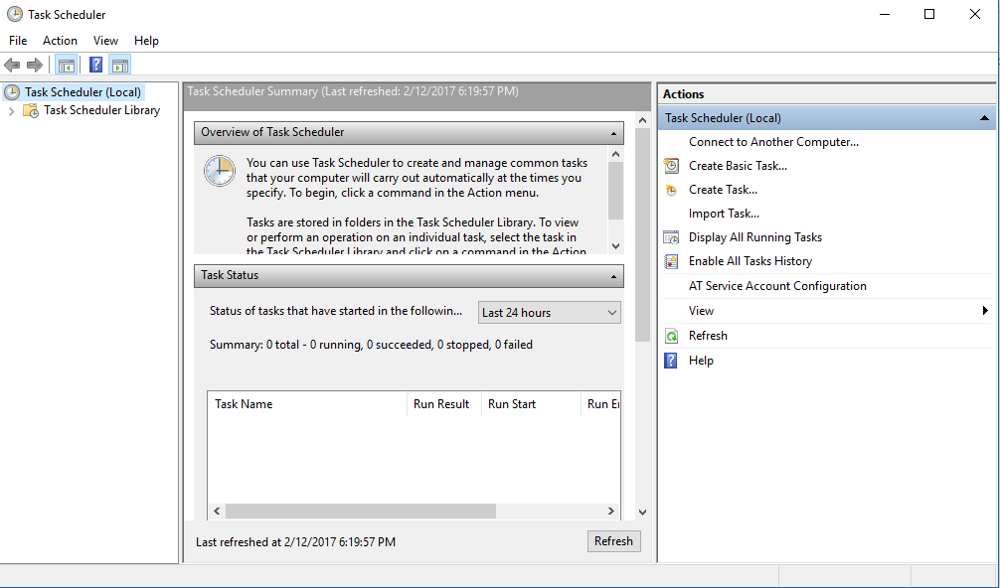
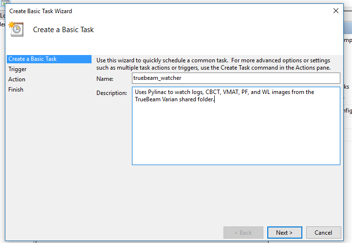
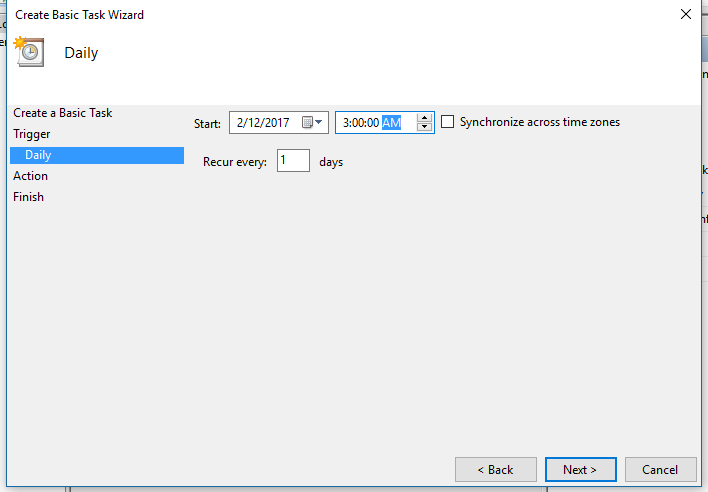
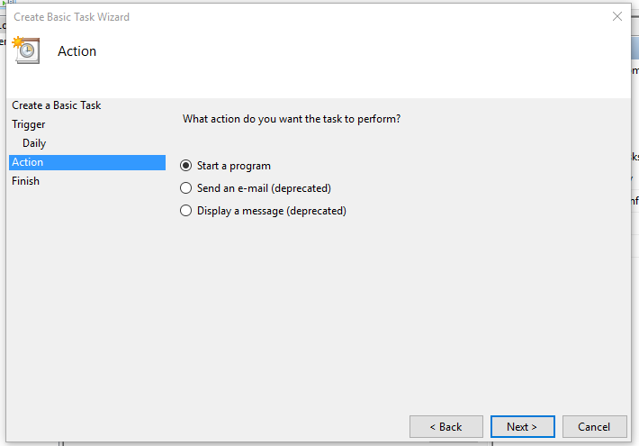
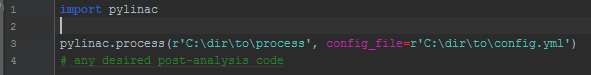
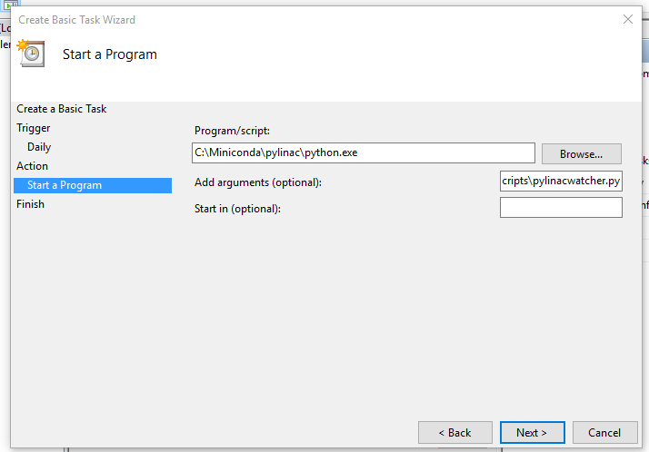
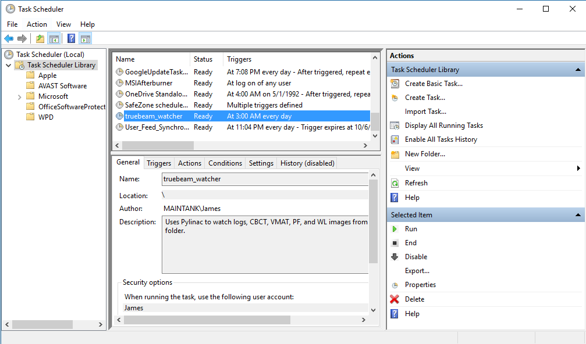

.. _dir_watching:

==================
Directory Watching
==================

The directory watcher service allows one to "set it and forget it" and let pylinac analyze files that
are moved to an appointed directory. Results can be emailed upon analysis.
The service allows for configurable analysis settings and email settings. Configure with
Windows Task Scheduler to run analysis regularly.

Getting Started
---------------

There are two ways to use the directory watching service: through normal Python functions & directly from the
command line. In addition there are two modes of watching: continual watching and one-time run-through.
Continual watching is appropriate for watching machine logs coming from a Clinac or TrueBeam. This
watcher would continually query for new logs, copy them to the analysis folder, and then analyze them.
The one-time analysis is best suited for processing ad-hoc data, e.g. monthly CBCT datasets.

To use the watcher via Python, make a script that uses the :func:`~pylinac.watcher.watch` or
:func:`~pylinac.watcher.process` function, depending on your need.

The recommended way to use pylinac's watcher is the one-time run function ``process``. This can be combined with Windows task schedule to regularly monitor folders:

.. code-block:: python

    from pylinac import process

    analysis_dir = "C:/path/to/analysis/directory"
    process(analysis_dir)  # will process and then return

You can also run the watcher to continually monitor forever with ``watch``:

.. code-block:: python

    from pylinac import watch

    analysis_dir = "C:/path/to/analysis/directory"
    watch(analysis_dir)  # will monitor forever!

.. warning::

    ``watch`` is not recommended for log monitoring as memory leaks can accumulate.

Analysis is also available via the command line and is similar in behavior.

.. code-block:: bash

    $ pylinac watch "dir/to/watch"  # watch forever

.. code-block:: bash

    $ pylinac process "dir/to/process"  # analyze and return

The ``watch`` and ``process`` calls initiate a thread that runs in the terminal. The directory to start watching is also
required. A logger will notify when the script has started, when a file gets added, and what the analysis status is. If a file
gets analyzed successfully, a .png and .txt file with the same name as the originals plus a suffix (default is ``_analysis``) will be generated in the directory.
You can also set up an email service when analysis runs, described below.

How it works
------------

The watcher/process functions query files in the analysis directory. Existing files as well as files that are moved
into the directory are processed immediately to see if pylinac can analyze it. Because many files use the
same format (e.g. DICOM), keywords and/or image classifiers are used to filter which type of analysis should be done. When a file is
deemed analysis-worthy, pylinac will then run the analysis automatically and generate a PDF file with
the analysis summary image and quantitative results. If the email service is setup, an email
can be sent either on any analysis done or only on failing analyses.

Configuration
-------------

The watcher/process service runs using default values for keywords and tolerance. These values are in a YAML
configuration file. Pylinac comes with a default file and settings; if not config file is passed to the functions the default one is used.
You can make your own YAML config file and pass that into the service initialization call:

.. code-block:: bash

    $ pylinac watch "dir/to/watch" --config="my/config.yaml"

Or

.. code-block:: python

    import pylinac

    pylinac.watch("dir/to/watch", config_file="my/config.yaml")

The YAML configuration file is the way to change keywords, set up a default analysis directory,
change analysis settings, and set up email service.
The recommended way of customizing the config file is to copy the `pylinac default YAML <https://github.com/jrkerns/pylinac/blob/master/pylinac/watcher_config.yml>`_
file as a starting template and edit it as desired. Also see below for a copy of the file contents.

Setting up Email
----------------

The pylinac watcher service allows the user to set up an email trigger. The user must supply a
gmail account (...@gmail.com). The gmail account name and password must be supplied in the YAML
configuration file.

.. warning::
    It is strongly recommended to create an *ad hoc* email account for the watcher service. To
    use the pylinac email service requires that the account have lower-than-normal security by nature of
    the non-gmail origin (i.e. you didn't log in and send it yourself).

To allow gmail to send the emails, log into the gmail account and go to account settings. Go to the
sign in & security section. At the very bottom in the section "Connected apps & sites" will be an
option to "Allow less secure apps". Turn this **ON**. This account will now allow the watcher service to
send emails.

.. warning::
    I'll say it again: don't use your personal account for this. Create a new account for the
    sole purpose of sending pylinac analysis emails.

You can set emails to be sent after every analysis or only when an analysis
fails. The emails will contain a simple message, let you know when it was analyzed, and where to find
the results. All the emails also have the results attached in many cases, so no need to dig for the files.

Default YAML Configuration
--------------------------

The default configuration is reproduced here. All options are listed. You may remove or add keywords at will.
The analysis options must match the parameter names exaclty (e.g. ``hu_tolerance``, ``doseTA``).

.. literalinclude:: ../../pylinac/watcher_config.yml

.. _task_scheduler:

Using the watcher with Windows Task Scheduler
---------------------------------------------

You can easily set up the pylinac ``process`` function with Windows task scheduler in order to regularly process
new files.

.. note::
    If you have 2+ machines you will be monitoring it is recommended to make two separate "schedules" and folders for analysis
    along with two YAML config files. Specifically, set the "unit" in the "general" section of the YAML file for each machine.

On the Windows computer you plan on using for analysis, open or search for the "Task Scheduler":

Click on "Create Basic Task..." in the right panel and fill in the name/description with whatever you want:

After that, the trigger is asked for. For the time being, say daily; you can change this later if you like:

.. image:: images/trigger.PNG

Set the start date and time; I run mine in the middle of the night so as not to eat resources during clinic hours:

For the action, select "Start a program":

Now we get to the critical part, starting the pylinac process function. There are several ways to do this. You can create a batch file that calls
pylinac through the command line, you can create a batch file that calls a python file, or you can call python to run a python file. We will do the last option
as it allows you to do any post-analysis stuff you may want (like a daily "I ran today" email) while staying in our favorite language. There are two pieces needed:

    - The python.exe location (I'm assuming Miniconda/Anaconda)
    - The custom python file that runs the process function

If you're using Miniconda or Anaconda you will find your environments in the main conda folder. In the root env folder is the python.exe file.
The default is something like C:\Anaconda\envs\<your env name>\python.exe. As a last resort you can find the location of the python interpreter you're using by doing

.. code-block:: python

    import sys

    print(sys.executable)

Now, create a new python file that will run the process function along with the analysis directory and config file:

Once that's made, save the file to a known location. We're ready to set the task program now. In the "Program/script" line
enter the full path to the python.exe file. In the "Add arguments" section, copy the location of the python file we just made:

Proceed through the summary and you're done. Back at the main Task Scheduler page click on the "Task Scheduler Library" on the left panel to list the current task schedules.
You should now find your new task listed. Highlight the task and you can now edit or run the task via the right panel:

If you have multiple machines, create individualized YAML config files and python files and schedules for each of them.