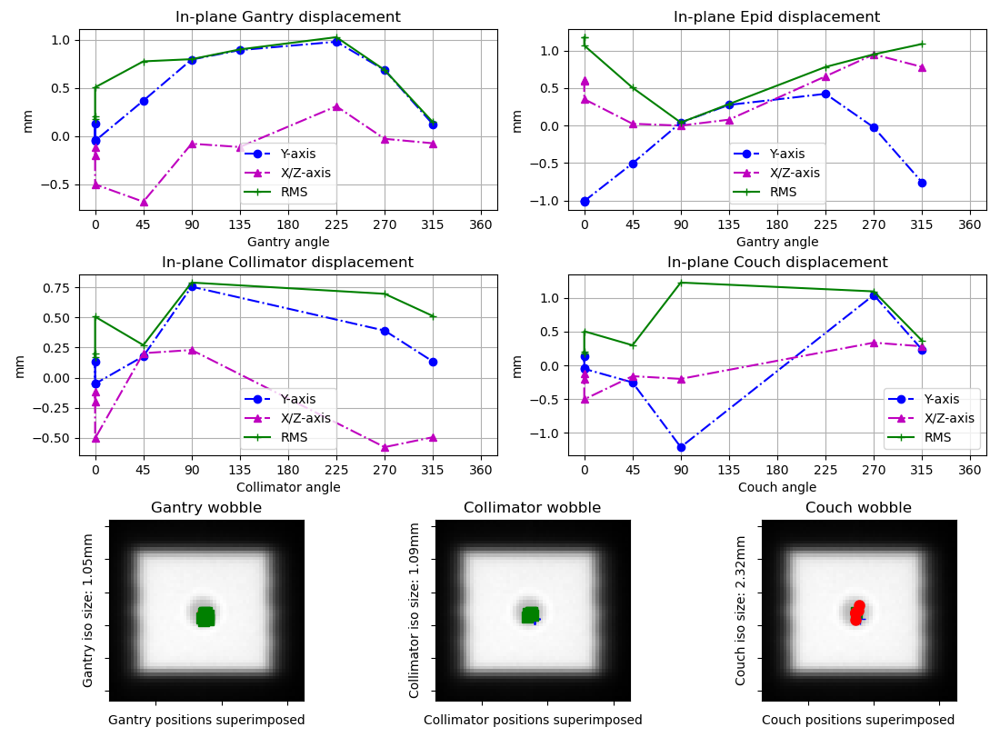

=================================
Winston-Lutz module documentation
=================================

Overview
--------

.. automodule:: pylinac.winston_lutz
    :no-members:

Running the Demo
----------------

To run the Winston-Lutz demo, create a script or start an interpreter session and input::

    from pylinac import WinstonLutz
    WinstonLutz.run_demo()

Results will be printed to the console and a figure showing the zoomed-in images will be generated::

    Winston-Lutz Analysis

    Number of images: 17
    Maximum 2D CAX->BB distance: 1.25mm
    Median 2D CAX->BB distance: 0.62mm
    Gantry 3D isocenter radius: 0.67mm
    Gantry iso->BB vector: Vector(x=0.22, y=0.10, z=0.38)
    Gantry sag in the z-direction: 1.01mm
    Collimator 2D isocenter radius: 0.51mm
    Collimator 2D iso->BB vector: Vector(x=0.17, y=0.38, z=0.00)
    Couch 2D isocenter radius: 1.20mm
    Couch 2D iso->BB vector: Vector(x=-0.94, y=-0.35, z=0.00)

Image Acquisition
-----------------

The Winston-Lutz module will only load EPID images. The images can be from any EPID however, and any SID. To ensure
the most accurate results, a few simple tips should be followed. Note that these are not unique to pylinac; most
Winston-Lutz analyses require these steps:

* The BB should be fully within the field of view.
* The MLC field should be symmetric.

.. _coordinate_space:

Coordinate Space
----------------

When interpreting results from a Winston-Lutz test, it's important to know the coordinates, origin, etc. Pylinac uses
the same coordinate space as `Winkler et al`_. All coordinates are looking from the foot of the table toward the gantry:

* **X-axis** - Lateral, or left-right, with right being positive.
* **Y-axis** - Anterior-Posterior, or up-down, with up being positive.
* **Z-axis** - Gun-Target, or in-out, with out/Target being positive.

Typical Use
-----------

Analyzing a Winston-Lutz test is as simple as loading in your images. So, let's import the class::

    from pylinac import WinstonLutz

From here, you can load a directory::

    my_directory = 'path/to/wl_images'
    wl = WinstonLutz(my_directory)

You can also load a ZIP archive with the images in it::

    wl = WinstonLutz.from_zip('path/to/wl.zip')

And that's it! Once loaded you can view images, gantry sag, or print the results::

    wl.plot_images()
    wl.plot_gantry_sag()
    # plot an individual image
    wl.images[3].plot()
    # save a figure of the image plots
    wl.save_plots('wltest.png')
    # return the gantry isocenter relative to the BB
    wl.gantry_iso2bb_vector
    # print to PDF
    wl.publish_pdf('mywl.pdf')

.. _using_file_names_wl:

Using File Names
----------------

If your linac EPID images do not include axis information (such as Elekta) you can specify it in the file name.
Any and all of the three axes can be defined. If one is not defined and is not in the DICOM tags, it will default to 0.
The syntax to define the axes: "*gantry0*coll0*couch0*". There can be any text before, after, or in between each axis definition.
However, the axes numerical value *must* immediately follow the axis name. Axis names are also fixed. The following examples
are valid:

* MyWL-gantry0-coll90-couch315.dcm
* gantry90_stuff_coll45-couch0.dcm
* abc-couch45-gantry315-coll0.dcm
* 01-gantry0-abcd-coll30couch10abc.dcm
* abc-gantry30.dcm
* coll45abc.dcm

The following are invalid:

* mywl-gantry=0-coll=90-couch=315.dcm
* gan45_collimator30-table270.dcm

Algorithm
---------

The Winston-Lutz algorithm is based on the works of `Winkler et al`_ and `Du et al`_.
Winkler found that the collimator and couch iso could be found using a minimum optimization
of the field CAX points. They also found that the gantry isocenter could by found by "backprojecting"
the field CAX as a line in 3D coordinate space, with the BB being the reference point.
The algorithm works like such:

**Allowances**

* The images can be acquired with any EPID (aS500, aS1000, aS1200) at any SID.
* The BB does not need to be near the real isocenter to determine isocenter sizes or gantry isocenter,
  but does affect the 2D image analysis.

**Restrictions**

    .. warning:: Analysis can fail or give unreliable results if any Restriction is violated.

* The BB must be fully within the field of view.
* The BB must be within 2.5cm of the real isocenter.
* The images must be acquired with the EPID.

**Analysis**

* **Find the field CAX** -- The spread in pixel values (max - min) is divided by 2, and any pixels above
  the threshold is associated with the open field. The pixels are converted to black & white and
  the center of mass of the pixels is assumed to be the field CAX.

* **Find the BB** -- The image is converted to binary based on pixel values *both* above the 50% threshold as above,
  and below the upper threshold. The upper threshold is an iterative value, starting at the image maximum value,
  that is lowered slightly when the BB is not found. If the binary image has a reasonably circular ROI, the BB is
  considered found and the pixel-weighted center of mass of the BB is considered the BB location.

.. note:: Strictly speaking, the following aren't required analyses, but are explained for fullness and clarity.

* **Backproject the CAX for gantry images** -- Based on the vector of the BB to the field CAX and the gantry angle,
  a 3D line projection of the CAX is constructed. The BB is considered at the origin. Only images where the
  couch was at 0 are used for CAX projection lines.

* **Determine gantry isocenter size and location** - Using the backprojection lines, an optimization function is run
  to minimize the maximum distance to any line. The optimized distance is the isocenter radius, and the point
  of maximum minimization is the isocenter location.

* **Determine collimator isocenter size** - The same optimization is run for all collimator images using the field CAX,
  but is only run in 2D, since the collimator only widens the isocenter size in the plane normal to the gantry angle.

* **Determine couch isocenter size** - Instead of using the BB as the non-moving reference point, which is now
  moving with the couch, the Reference image (gantry = collimator = couch = 0) CAX location is the reference. The
  movement of the BB relative to the Reference image CAX will form a semicircle (assuming the BB cannot be placed
  *exactly* at isocenter). The optimization is run to minimize the distance of each point to the edge of a circle.
  The optimum radius will determine the isocenter size.

.. note::
    Collimator iso size is always in the plane normal to the gantry, while couch iso size is always in
    the x-z plane.

.. _Winkler et al: http://iopscience.iop.org/article/10.1088/0031-9155/48/9/303/meta;jsessionid=269700F201744D2EAB897C14D1F4E7B3.c2.iopscience.cld.iop.org
.. _Du et al: http://scitation.aip.org/content/aapm/journal/medphys/37/5/10.1118/1.3397452

API Documentation
-----------------

.. autoclass:: pylinac.winston_lutz.WinstonLutz

.. autoclass:: pylinac.winston_lutz.ImageManager

.. autoclass:: pylinac.winston_lutz.WLImage
