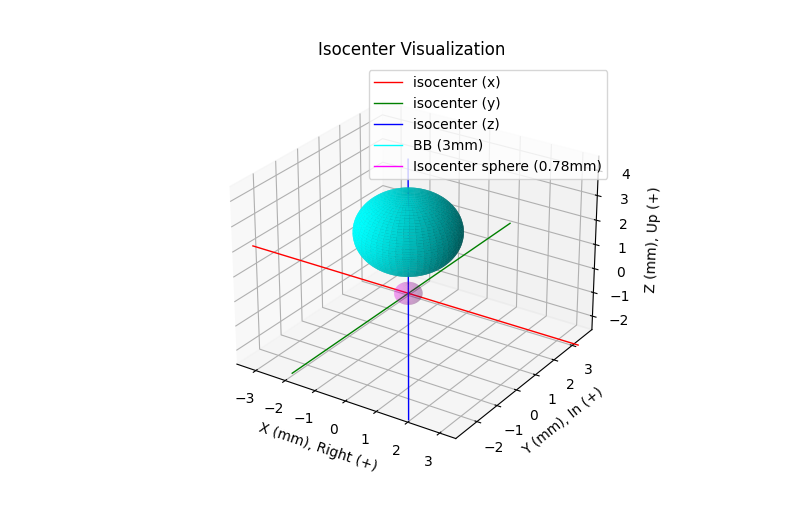
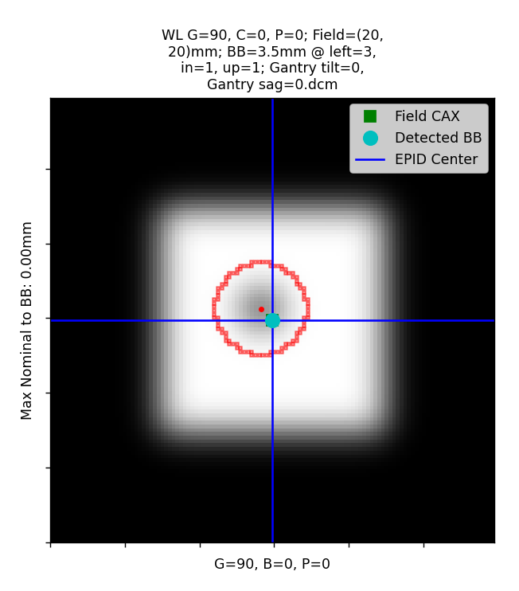

============
Winston-Lutz
============

Overview
--------

.. automodule:: pylinac.winston_lutz
    :no-members:

.. warning::

    Documentation often uses the term "field CAX" or "CAX" to refer to the **center of the radiation field**. This is something of a misnomer and
    we apologize in advance. Due to backwards-compatibility reasons, the term continues to be used in the code and documentation.

Running the Demo
----------------

To run the Winston-Lutz demo, create a script or start an interpreter session and input:

.. code-block:: python

    from pylinac import WinstonLutz

    WinstonLutz.run_demo()

Results will be printed to the console and a figure showing the zoomed-in images will be generated::

    Winston-Lutz Analysis
    =================================
    Number of images: 17
    Maximum 2D CAX->BB distance: 1.23mm
    Median 2D CAX->BB distance: 0.69mm
    Shift to iso: facing gantry, move BB: RIGHT 0.36mm; OUT 0.36mm; DOWN 0.20mm
    Gantry 3D isocenter diameter: 1.05mm (9/17 images considered)
    Maximum Gantry RMS deviation (mm): 1.03mm
    Maximum EPID RMS deviation (mm): 1.31mm
    Gantry+Collimator 3D isocenter diameter: 1.11mm (13/17 images considered)
    Collimator 2D isocenter diameter: 1.09mm (7/17 images considered)
    Maximum Collimator RMS deviation (mm): 0.79
    Couch 2D isocenter diameter: 2.32mm (7/17 images considered)
    Maximum Couch RMS deviation (mm): 1.23

.. plot::
    :include-source: false

    from pylinac import WinstonLutz

    WinstonLutz.run_demo()

Image Acquisition
-----------------

The Winston-Lutz module will only load EPID images. The images can be from any EPID however, and any SID. To ensure
the most accurate results, a few simple tips should be followed. Note that these are not unique to pylinac; most
Winston-Lutz analyses require these steps:

* The BB should be fully within the field of view.
* The MLC field should be symmetric.

Prefabricated plans are available at :ref:`prefab-rt-plans` for download. See also the
:ref:`plan-generator` module for creating your own plans.

Axis Values
^^^^^^^^^^^

Pylinac uses the :ref:`wl_image_types` definition to bin images. Regardless of the axis values, pylinac will calculate some
values like max/median BB->CAX distance. Other values such as gantry iso size will only use Reference and Gantry image types
as defined in the linked section. We recommend reviewing the analysis definitions and acquiring images according to the
values you are interested in. Some examples are below. Note that these are not mutually exclusive:

* Simple max distance to BB: Any axis values; any combination of axis values are allowed.
* Gantry iso size: Gantry value can be any; all other axes must be 0.
* Collimator iso size: Collimator value can be any; all other axes must be 0.

If, e.g., all axis values are combinations of axes then gantry iso size will not be calculated. Further, the ``plot_analyzed_image``
method assumes Gantry, Collimator, and/or Couch image sets. If only combinations are passed, this image will be empty.
A good practice is also to acquire a reference image if possible, meaning all axes at 0.

.. _coordinate_space:

Coordinate Space
----------------

.. note::

   In pylinac 2.3, the coordinates changed to be compliant with IEC 61217. Compared to previous versions,
   the Y and Z axis have been swapped. The new Z axis has also flipped which way is positive.

When interpreting results from a Winston-Lutz test, it's important to know the coordinates, origin, etc. Pylinac uses
IEC 61217 `(FIXED) coordinate space <https://dicom.nema.org/medical/dicom/current/output/chtml/part03/sect_c.8.8.25.6.html>`__
 for Cartesian shifts. Colloquial descriptions are as if standing at the foot of the couch looking at the gantry.

.. image:: images/IEC61217.svg

* **X-axis** - Lateral, or left-right, with right being positive.
* **Y-axis** - Superior-Inferior, or in-out, with sup/in being positive.
* **Z-axis** - Anterior-Posterior, or up-down, with up/anterior being positive.

.. _passing-a-coordinate-system:

Passing a coordinate system
^^^^^^^^^^^^^^^^^^^^^^^^^^^

.. versionadded:: 3.6

.. warning::

    If using DICOM images that include the gantry (300A,011E), collimator (300A,0120), and couch (300A,0122) tags,
    they will be in IEC61217, regardless of what coordinate system is set up locally. I.e. if you use Varian IEC,
    the machine values locally will follow this convention, but when saved to DICOM, they will be converted to IEC61217
    under the hood for you.

    You should only need to change the coordinate system when also using the ``axis_mapping`` parameter in ``analyze``.

It is possible to pass in your machine's coordinate scale/system to the analyze parameter like so:

.. code-block:: python

    from pylinac.winston_lutz import WinstonLutz, MachineScale

    wl = WinstonLutz(...)
    wl.analyze(..., machine_scale=MachineScale.VARIAN_IEC)
    ...

This will change the BB shift vector and shift instructions accordingly. If you don't use the shift vector or instructions
then you won't need to worry about this parameter.

Typical Use
-----------

Analyzing a Winston-Lutz test is simple. First, let's import the class:

.. code-block:: python

    from pylinac import WinstonLutz

From here, you can load a directory:

.. code-block:: python

    my_directory = "path/to/wl_images"
    wl = WinstonLutz(my_directory)

You can also load a ZIP archive with the images in it:

.. code-block:: python

    wl = WinstonLutz.from_zip("path/to/wl.zip")

Now, analyze it:

.. code-block:: python

    wl.analyze(bb_size_mm=5)

And that's it! You can now view images, print the results, or publish a PDF report:

.. code-block:: python

    # plot all the images
    wl.plot_images()
    # plot an individual image
    wl.images[3].plot()
    # save a figure of the image plots
    wl.save_plots("wltest.png")
    # print to PDF
    wl.publish_pdf("mywl.pdf")

If you want to shift the BB based on the results and perform the test again there is a method for that:

.. code-block:: python

    print(wl.bb_shift_instructions())
    # LEFT: 0.1mm, DOWN: 0.22mm, ...

You can also pass in your couch coordinates and the new values will be generated:

.. code-block:: python

    print(wl.bb_shift_instructions(couch_vrt=0.41, couch_lng=96.23, couch_lat=0.12))
    # New couch coordinates (mm): VRT: 0.32; LNG: 96.11; LAT: 0.11

.. _wl_visualizing_bb:

Visualizing the Isocenter-to-BB
-------------------------------

.. versionadded:: 3.17

The isocenter and BB can be visualized together after analysis by calling ``plot_location``:

.. code-block:: python

    wl = WinstonLutz(...)
    wl.analyze(...)
    wl.plot_location()

This will result in a 3D plot visualizing the BB (true physical size) and the isocenter (true physical size) in the room coordinates
like so:

Accessing data
--------------

.. versionchanged:: 3.0

Using the WL module in your own scripts? While the analysis results can be printed out,
if you intend on using them elsewhere (e.g. in an API), they can be accessed the easiest by using the :meth:`~pylinac.winston_lutz.WinstonLutz.results_data` method
which returns a :class:`~pylinac.winston_lutz.WinstonLutzResult` instance.

.. note::
    While the pylinac tooling may change under the hood, this object should remain largely the same and/or expand.
    Thus, using this is more stable than accessing attrs directly.

Continuing from above:

.. code-block:: python

    data = wl.results_data()
    data.num_total_images
    data.max_2d_cax_to_bb_mm
    # and more

    # return as a dict
    data_dict = wl.results_data(as_dict=True)
    data_dict["num_total_images"]
    ...

Accessing individual images
---------------------------

Each image can be plotted and otherwise accessed easily:

.. code-block:: python

    wl = WinstonLutz(...)
    # access first image
    wl.images[
        0
    ]  # these are subclasses of the pylinac.core.image.DicomImage class, with a few special props
    # plot 3rd image
    wl.images[
        0
    ].plot()  # the plot method is special to the WL module and shows the BB, EPID, and Field CAX.
    # get 2D x/y vector of an image
    wl.images[
        4
    ].cax2bb_vector  # this is a Vector with a .x and .y attribute. Note that x and y are in respect to the image, not the fixed room coordinates.

Analyzing a single image
------------------------

You may optionally analyze a single image if that is your preference. Obviously, no 3D computations are performed.

.. note::

   This is the same class used under the hood for the ``WinstonLutz`` images, so any attribute you currently use with something
   like ``wl.images[2].cax2bb_vector`` will work for the below with a direct call: ``wl2d.cax2bb_vector``.

.. code-block:: python

    from pylinac import WinstonLutz2D

    wl2d = WinstonLutz2D("my/path/...")
    wl2d.analyze(bb_size_mm=4)  # same as WinstonLutz class
    wl2d.plot()
    ...

This class does not have all the methods that ``WinstonLutz`` has for mostly obvious reasons and lower likelihood of being used directly.

.. _using_file_names_wl:

.. _passing-in-axis-values:

Passing in Axis values
----------------------

.. important::

    When passing in axis values manually, you can also use ``machine_scale`` in conjunction to specify the
    coordinate system you are stating the axes to be in. See :ref:`passing-a-coordinate-system`.

If your linac EPID images do not include axis information (such as Elekta) there are two ways to pass the data in.

via filenames
^^^^^^^^^^^^^

First, you can specify it in the file name.
Any and all of the three axes can be defined. If one is not defined and is not in the DICOM tags, it will default to 0.
The syntax to define the axes: "<*>gantry0<*>coll0<*>couch0<*>". There can be any text before, after, or in between each axis definition.
However, the axes numerical value **must** immediately follow the axis name. Axis names are also fixed. The following examples
are valid:

* MyWL-gantry0-coll90-couch315.dcm
* gantry90_stuff_coll45-couch0.dcm
* abc-couch45-gantry315-coll0.dcm
* 01-gantry0-abcd-coll30couch10abc.dcm
* abc-gantry30.dcm
* coll45abc.dcm

The following are invalid:

* mywl-gantry=0-coll=90-couch=315.dcm
* gan45_collimator30-table270.dcm

Using the filenames within the code is done by passing the ``use_filenames=True`` flag to the init method:

.. code-block:: python

    my_directory = "path/to/wl_images"
    wl = WinstonLutz(my_directory, use_filenames=True)

.. note:: If using filenames any relevant axes must be defined, otherwise they will default to zero. For example,
          if the acquisition was at gantry=45, coll=15, couch=0 then the filename must include both the gantry and collimator
          in the name (<...gantry45...coll15....dcm>). For this example, the couch need not be defined since it is 0.

via ``axis_mapping``
^^^^^^^^^^^^^^^^^^^^

The other way of inputting axis information is passing the ``axis_mapping`` parameter to the constructor. This is a
dictionary with the filenames as keys and a tuple of ints for the gantry, coll, and couch:

.. code-block:: python

    directory = "path/to/wl/dir"
    mapping = {
        "file1.dcm": (0, 0, 0),
        "file2.dcm": (90, 315, 45),
    }  # add more as needed
    wl = WinstonLutz(directory=directory, axis_mapping=mapping)
    # analyze as normal
    wl.analyze(...)

.. note::

    The filenames should be local to the directory. In the above example the full paths would be ``path/to/wl/dir/file1.dcm``, and ``path/to/wl/dir/file2.dcm``.

.. _setting-wl-reference-values:

Setting Reference Axis Values
------------------------------

It is possible to set reference axis values to angles other than zero. E.g. if the intended collimator angle
of reference is 45 degrees to average the collimator rotation of a VMAT plan.
In addition to changing reference values, the "snap" tolerance can also be passed which will allow axis angles to "snap"
if the axis value is within the snap tolerance. See :ref:`wl_image_types`. This can be helpful for scenarios
where you forgot to set the couch axes to 0 from a previous CBCT shift.

To change the reference values and set a snap tolerance of 5 degrees:

.. code-block:: python

    wl = WinstonLutz(...)
    wl.analyze(
        ...,
        snap_tolerance=5,
        gantry_reference=45,
        collimator_reference=10,
        couch_reference=0,
    )

In the above scenario, images with gantry ranges of 40-50 degrees, collimator 5-15, and couch 355-5 will
be considered "Reference" images.

This can also be helpful if you have a very old linac and or use a coordinate space such as Varian Standard where
gantry 180 is pointing to the floor, in which case you can set the gantry reference to 180.

.. note::

  The snap tolerance does not actually change the axis values, just the variable Axis type.

Changing BB detection size
--------------------------

To change the size of BB pylinac is expecting you can pass the size to the analyze method:

.. code-block:: python

    import pylinac

    wl = WinstonLutz(...)
    wl.analyze(bb_size_mm=3)
    ...

Low-density BBs
---------------

If using a phantom with a BB that has a lower density that than the surrounding material, pass the ``low_density_bb`` parameter:

.. code-block:: python

    import pylinac

    wl = WinstonLutz(...)
    wl.analyze(..., low_density_bb=True)
    ...

.. _kv_wl_analysis:

kV Analysis/Imaging-only iso evaluation
---------------------------------------

It is possible to analyze kV WL images and/or analyze a WL set and only focus on the imaging iso.
In this case there are two parameters you likely need to adjust:
``open_field`` and ``low_density_bb``. The first will set the field center to the image center. It is assumed
the field is not of interest or the field cannot be measured, such as a fully-open kV image. Use this anytime
the radiation iso is not of interest. For large-field WL images, you may need to set the ``low_density_bb``
parameter to True. This is because the automatic inversion of the WL module assumes a small field is being delivered.
For large field deliveries, kV or MV, see about flipping this parameter if the analysis fails.

.. _wl_cbct:

CBCT Analysis
-------------

.. versionadded:: 3.16

.. warning::

  This feature is still experimental. Use with caution.

It's possible to take and load a CBCT dataset of a BB using the ``from_cbct`` and ``from_cbct_zip`` class methods.
The CBCT dataset is
loaded as a 3D numpy array. Projections at the 4 faces
of the array (top, left, bottom, right) are created into pseudo-cardinal angle DICOMs. These DICOMs are then
loaded as normal images and analyzed.

.. code-block:: python
  :emphasize-lines: 1,3
  :caption: Example of loading and analyzing a CBCT dataset of a WL BB

  wl = WinstonLutz.from_cbct("my/cbct/dir")
  # OR
  wl = WinstonLutz.from_cbct_zip("my/cbct.zip")
  # ensure to set low density and open field to True
  wl.analyze(low_density_bb=True, open_field=True, bb_size_mm=3)
  # use as normal
  print(wl.results())
  print(wl.results_data())
  print(wl.bb_shift_instructions())
  wl.plot_images()

.. warning::

  The CBCT analysis comes with a few caveats:

  * Analyzing the image will override the ``low_density_bb`` and ``open_field`` flags to always be True; it does
    not matter what is passed in ``analyze``.
  * No axis deviation information is available, i.e. couch/coll/gantry walkout.
  * There are always 4 images generated.
  * The generated images are not true DICOMs and thus do not have all the DICOM tags.

.. _wl_virtual_shift:

Virtual Shifting
----------------

.. versionadded:: 3.22

It is possible to virtually shift the BB for regular WL images to see what the 2D errors of the images would be
if the BB were shifted to the optimal position. This can help avoid iterating on the nominal BB position by physically
moving the BB.

To virtually move the BB, pass ``apply_virtual_shift`` to the ``analyze`` method:

.. code-block:: python

    wl = WinstonLutz(...)
    wl.analyze(..., apply_virtual_shift=True)
    ...

This will result in images where the detected BB plotted does not overlap with the apparent BB location for obvious reasons.

The results will be the same as if the BB were physically moved to the optimal position. The results will be slightly
different and report what the virtual shift was. This is simply the original BB shift instructions before the shift.

.. note::

   This only affects the 2D error results. One of the benefits of pylinac is that the iso size for gantry, couch, and collimator
   are done independent of the BB position.

.. _wl_tiff:

Using TIFF images
-----------------

.. versionadded:: 3.12

The WL module can handle TIFF images on a provisional basis.

.. warning::

    This is still experimental and caution is warranted. Even though
    there is an automatic noise/edge cleaner, cropping images to remove
    markers and/or film scan artifacts is encouraged.

To load TIFF images, extra parameters must be passed. Specifically,
the ``sid`` and potentially the ``dpi`` parameters must be added. Additionally,
``axis_mapping`` must be populated. This is how pylinac can convert
the images into rudimentary dicom images. The ``dpi``
parameter is only needed if the TIFF images do not have a resolution tag.
Pylinac will give a specific error if ``dpi`` wasn't passed and also wasn't
in the TIFF tags.

.. note::

    Although it is technically possible to load both DICOM and TIFF together
    in one dataset it is not encouraged.

.. code-block:: python

    from pylinac import WinstonLutz

    my_tiff_images = list(Path(...), Path(...))
    wl_tiff = WinstonLutz(
        my_tiff_images,
        sid=1000,
        dpi=212,
        axis_mapping={"g0.tiff": (0, 0, 0), "g270.tiff": (270, 0, 0)},
    )
    # now analyze as normal
    wl_tiff.analyze(...)
    print(wl_tiff.results())

Note that other ``.from...`` methods are available such as ``.from_zip``:

.. code-block:: python

    from pylinac import WinstonLutz

    my_tiff_zip = "../files/tiffs.zip"
    # same inputs as above
    wl_tiff = WinstonLutz.from_zip(my_tiff_zip, dpi=...)

.. _wl_image_types:

Image types & output definitions
--------------------------------

The following terms are used in pylinac's WL module and are worth defining.

**Image axis definitions/Image types**
Images are classified into 1 of 6 image types, depending on the position of the axes. The image type is then
used for determining whether to use the image for the given calculation. Image types allow the module to isolate the
analysis to a given axis if needed. E.g. for gantry iso size, as opposed to overall iso size, only the gantry should be moving
so that no other variables influence it's calculation.

.. note::

    Reference value defaults are 0, but this can be changed. See :ref:`setting-wl-reference-values`.

* **Reference**: This is when all axes are at the reference value (default 0; e.g. gantry=coll=couch=0).
* **Gantry**: This is when all axes but gantry are at the reference value; e.g. gantry=45, coll=0, couch=0.
* **Collimator**: This is when all axes but collimator are at the reference value.
* **Couch**: This is when all axes but the couch are at the reference value.
* **GB Combo**: This is when either the gantry or collimator are non-zero but the couch is at the reference value.
* **GBP Combo**: This is where the couch is kicked and the gantry and/or collimator are rotated away from reference.

**Analysis definitions**
Given the above terms, the following calculations are performed.

* **Maximum 2D CAX->BB distance (scalar, mm)**: Analyzes all images individually for the maximum 2D distance from rad field center to the BB.
* **Median 2D CAX->BB distance (scalar, mm)**: Same as above but the median.
* **Shift of BB to isocenter (vector, mm)**: The instructions of how to move the BB/couch in order to place the BB at the determined isocenter.
* **Gantry 3D isocenter diameter (scalar, mm)**: Analyzes only the gantry axis images (see above image types). Applies backprojection of the
  CAX in 3D and then minimizes a sphere that touches all the 3D backprojection lines.
* **Gantry+Collimator 3D isocenter diameter (scalar, mm)**: Same as above but also considers Collimator and GB Combo images.
* **[Couch, Collimator] 2D isocenter diameter (scalar, mm)**: Analyzes only the collimator or couch images to determine
  the size of the isocenter according to the axis in question. The maximum distance between any of the points is the isocenter size.
  The couch and collimator are treated separately for obvious reasons. If no
  images are given that rotate about the axis in question (e.g. cardinal gantry angles only) the isocenter size will default to 0.
* **[Maximum, All][Gantry, Collimator, Couch, GB Combo, GBP Combo, EPID] RMS deviation (array of scalars, mm)**: Analyzes the images for the axis in question to determine the overall RMS
  inclusive of all 3 coordinate axes (vert, long, lat). I.e. this is the overall displacement as a function of the axis in question.
  For EPID, the displacement is calculated as the distance from image center to BB for all images with couch=0. If no
  images are given that rotate about the axis in question (e.g. cardinal gantry angles only) the isocenter size will default to 0.

.. _interpreting-winston-lutz-results:

Interpreting Results
--------------------

This explains the :class:`~pylinac.winston_lutz.WinstonLutzResult` class that is returned from the ``results_data`` method.
This is also what is given in RadMachine image analysis results and is explained further here.

* ``num_gantry_images``: The number of images that were taken at different gantry angles and all other axes were at reference.
* ``num_gantry_coll_images``: The number of images that were taken at different gantry and collimator angles and the couch was at reference.
* ``num_coll_images``: The number of images that were taken at different collimator angles and all other axes were at reference.
* ``num_couch_images``: The number of images that were taken at different couch angles and all other axes were at reference.
* ``num_total_images``: The total number of images analyzed.
* ``max_2d_cax_to_bb_mm``: The maximum 2D distance from the field CAX to the BB across all images analyzed in mm.
* ``median_2d_cax_to_bb_mm``: The median 2D distance from the field CAX to the BB across all images analyzed in mm.
* ``mean_2d_cax_to_bb_mm``: The mean 2D distance from the field CAX to the BB across all images analyzed in mm.
* ``max_2d_cax_to_epid_mm``: The maximum 2D distance from the field CAX to the EPID center across all images analyzed in mm.
* ``median_2d_cax_to_epid_mm``: The median 2D distance from the field CAX to the EPID center across all images analyzed in mm.
* ``mean_2d_cax_to_epid_mm``: The mean 2D distance from the field CAX to the EPID center across all images analyzed in mm.
* ``gantry_3d_iso_diameter_mm``: The 3D isocenter diameter **of the gantry axis only** as determined by the gantry images in mm.
  This uses backprojection lines of the field center to the source and minimizes a sphere that touches all the backprojection lines.

  .. note::

      This value is independent of the BB position.

* ``max_gantry_rms_deviation_mm``: The maximum RMS value of the field CAX to BB for the gantry axis images in mm. This is an alternative to the max/mean/median calculations.
* ``max_epid_rms_deviation_mm``: The maximum RMS value of the field CAX to EPID center for the EPID images in mm. This is an alternative to the max/mean/median calculations.
* ``gantry_coll_3d_iso_diameter_mm``: The 3D isocenter diameter **of the gantry and collimator axes** as determined by the gantry and collimator images in mm.
* ``coll_2d_iso_diameter_mm``: The 2D isocenter diameter **of the collimator axis only** as determined by the collimator images in mm.
* ``max_coll_rms_deviation_mm``: The maximum RMS deviation of the field CAX to BB for the collimator axis images in mm. This is an alternative to the max/mean/median calculations.
* ``max_couch_rms_deviation_mm``: The maximum RMS value of the field CAX to BB for the couch axis images in mm. This is an alternative to the max/mean/median calculations.
  This uses backprojection lines of the field center to the source and minimizes a sphere that touches all the backprojection lines.

  .. note::

      This value is independent of the BB position.

* ``couch_2d_iso_diameter_mm``: The 2D isocenter diameter **of the couch axis only** as determined by the couch images in mm.
* ``bb_shift_vector``: The Cartesian vector that would move the BB to the radiation isocenter. Each value is in mm. See also :ref:`wl_virtual_shift`, :ref:`winston-lutz-couch-shift-algorithm`
* ``image_details``: A list of the individual image results. Each item has the following:

  * ``variable_axis``: The axis that varied in the image. See :ref:`wl_image_types`.
  * ``bb_location``: The location of the BB in the image as a Point in pixels.
  * ``cax2epid_vector``: The vector (in Cartesian coordinates) from the field CAX to the EPID center in mm.
  * ``cax2epid_distance``: The distance from the field CAX to the EPID center in mm.
  * ``cax2bb_vector``: The vector (in Cartesian coordinates) from the field CAX to the BB in mm.
  * ``cax2bb_distance``: The scalar distance from the field CAX to the BB in mm.
  * ``field_cax``: The location of the field CAX in the image as a Point in pixels.
* ``keyed_image_details``: A **dictionary** of the individual image results. This is the same as ``image_details`` but keyed by the images
  using the axes values as the key. E.g. ``G0B45P0``. This can be used to identify individual
  images vs those in ``image_details``.

Interpreting specific publications
^^^^^^^^^^^^^^^^^^^^^^^^^^^^^^^^^^

A common question is how the algorithm is to be matched to existing QA publications. Some
publications only specify the test and tolerance and say nothing about implementation.
We list the publications and also our interpretation of what they mean. We do not make
recommendations about how something should be done, but given the number of questions
on the subject we provide this information.

* **AAPM TG-142 Table III, Mechanical**:. "Coincidence of radiation and mechanical isocenter".
  We interpret this to mean: 1) set up a BB at what you believe is the mechanical isocenter (e.g. light field, lasers, etc).
  2) Perform a typical WL image dataset. 3) The ``bb_shift_vector`` is the value of interest as it's the
  vector from BB to the overall radiation isocenter.
* **AAPM TG-198: 2.D.2.5**: TG-198 is an implementation guide of TG-142 and gives explicit guidance. We
  do not recommend using starshots for iso size analysis, but it can be done. The WL procedure describes
  placing the BB at the mechanical isocenter via the surrogate of the lasers. The displacement from the determined
  radiation iso from the images to the BB/mechanical isocenter is the value of interest, that is ``bb_shift_vector``.
* **MPPG 9.a Table I - Monthly**: Fortunately, the guidance is very clear here and is the maximum of any
  planar image from BB to field center. This is the ``max_2d_cax_to_bb_mm`` value.
* **MPPG 9.a Table I - Annual**: This one is less clear but we interpret it as the ``bb_shift_vector``. See also :ref:`winston-lutz-couch-shift-algorithm`.
* **MPPG 8.b Table 5 - M11, Table 8 MLC4**: This is very vague and does not provide any details on implementation other than
  that it should be jaw-based and MLC-based respectively and should involve the gantry, couch, and collimator.
  However, they do add a footnote to reference MPPG 9.a (above).

Finally, it is worth nothing that physicists often have strong feelings about how WL should be done and interpreted.
While we agree that providing the best possible treatment to patients is paramount, there are many ways that this can be improved,
beyond just WL. It is one piece of many to provide high-quality care. Spending inordinate amounts of time squabbling over a pixel
or two is time poorly spent. Finally, we argue for an empirical approach, which is why the image generator was created. See: :ref:`benchmarking-wl`

Analysis Parameters
-------------------

.. tab-set::
   :sync-group: usage

   .. tab-item:: pylinac
      :sync: pylinac

      See :meth:`~pylinac.winston_lutz.WinstonLutz.analyze` for details.

   .. tab-item:: RadMachine
      :sync: radmachine

      * **BB size**: The size of the BB in mm.
      * **Use Filenames**: Whether to use the filenames to determine the axis values. See :ref:`passing-in-axis-values`.
      * **Low-Density BB**: Whether the BB is lower density than the surrounding material. E.g. an air pocket vs a tungsten BB.
      * **Omit field determination**: If checked, sets the field center to the EPID center under the assumption the field is not the focus of interest or is too wide to be calculated.
        This is often helpful for kV WL analysis where the blades are wide open and even then the blade edge is of less interest than simply the imaging iso vs the BB.

        .. note::

          For kV WL, you will generally need to check this and also check the low-density BB flag.

      * **Coordinate system**: The coordinate system of the machine. This is used to determine the shift instructions. See :ref:`passing-a-coordinate-system`.
        This should only be changed if the axis values (gantry, collimator, couch) are being changed or entered manually.
      * **Pixels/inch**: The resolution of the images in pixels per inch. This is used to convert the pixel distances to mm.

        .. note::

          Only needed for TIFF/non-DICOM images and only if the resolution is not in the TIFF tags.

      * **Source-to-image distance**: The source-to-image distance in mm.

        .. note::

          Only needed for TIFF/non-DICOM images.

      * **Is a CBCT scan?**: Whether the images are from a CBCT scan. If checked, will create 4 DRRs at gantry 0, 90, 180, 270.
      * **Apply virtual shift of BB to optimal isocenter**: If checked, will virtually shift the BB to the optimal isocenter position and reanalyze the images. See :ref:`wl_virtual_shift`.

.. _wl-algorithm:

Algorithm
---------

The Winston-Lutz algorithm is based on the works of `Winkler et al`_, `Du et al`_, and `Low et al`_.
Winkler found that the collimator and couch iso could be found using a minimum optimization
of the field CAX points. They also found that the gantry isocenter could by found by "backprojecting"
the field CAX as a line in 3D coordinate space, with the BB being the reference point. This method is used to find the
gantry isocenter size.

.. _winston-lutz-couch-shift-algorithm:

Couch shift
^^^^^^^^^^^

`Low et al`_ determined the geometric transformations to apply to 2D planar images to calculate the shift to apply to the BB.
This method is used to determine the shift instructions. Specifically, equations 6, 7, and 9.

.. note::

    If doing research, it is very important to note that Low implicitly used the "Varian" coordinate system.
    This is an old coordinate system and any new Varian linac actually uses IEC 61217. However, because the
    gantry and couch definitions are different, the matrix definitions are technically incorrect when using
    IEC 61217. By default, Pylinac assumes the images are in IEC 61217 scale and will internally convert it to varian scale
    to be able to use Low's equations.
    To use a different scale use the ``machine_scale`` parameter, shown here :ref:`passing-a-coordinate-system`.
    Also see :ref:`scale`.

As a prologue, we should explain the differences in our coordinate system vs Low's. In the paper
the gantry coordinate system is defined as such:

"Let :math:`(X_{G},Y_{G},Z_{G})` represent a gantry coordinate system defined as follows: the :math:`X_{G}` axis
corresponds to the gantry rotation axis, with its positive direction pointing away from the gantry (toward the couch); the :math:`Z_{G}`
axis coincides with the central axis of the radiation beam, pointing into the collimator, and the :math:`Y_{G}`
axis is assigned such that :math:`(X_{G},Y_{G},Z_{G})` forms a right-handed coordinate system."

Later in equation 2 they defined a couch coordinate system as:

.. math::

    X_{c} = VERT

    Y_{c} = LAT

    Z_{c} = -AP

but this is inconsistent because AP is the same as VERT in normal conventions.
Using the sentence after eqn 2 as a guide: "A couch angle of :math:`\phi` degrees corresponds
to a signed rotation around the :math:`Z_{C}` axis of the couch coordinate system."

Just from this sentence it would appear :math:`Z_{C}` should be VERT. The only way this makes
sense is if the couch coordinate system is from a HFS patient perspective; i.e. VERT=>In/Out, LAT=>Left/Right, -AP=>Up/Down.
If this is true, everything falls into place.

Finally, it is worth nothing that in the Varian "Standard" coordinate system (the one assumed by Low), couch vertical
*increases* as the couch is lowered. This may explain the negative sign in the Z axis of equation 2, whereas
for the IEC 61217 scale, vertical increases as the couch is raised.

We thus can generate the following table for transforming the equations from Low to IEC 61217/pylinac coordinates:

+-----------------------+---+----------------+---+------------------------+---+-----------------+---+----------------------------+
| Low Couch coordinates |   | Low Couch Axes |   | Low Gantry coordinates |   | Low Gantry axes |   | Pylinac Gantry coordinates |
+=======================+===+================+===+========================+===+=================+===+============================+
| Xc                    | = | VERT           | = | Xg                     | = | LONG            | = | -Y (In/Out)                |
+-----------------------+---+----------------+---+------------------------+---+-----------------+---+----------------------------+
| Yc                    | = | LAT            | = | Yg                     | = | LAT             | = | X (Left/Right)             |
+-----------------------+---+----------------+---+------------------------+---+-----------------+---+----------------------------+
| Zc                    | = | -AP            | = | Zg                     | = | VERT            | = | Z (Up/Down)                |
+-----------------------+---+----------------+---+------------------------+---+-----------------+---+----------------------------+

See :ref:`coordinate_space`.

We can now address the implementation for the couch shift as follows:

For each image we determine (equation 6a):

.. math::

    \textbf{A}(\phi, \theta) = \begin{pmatrix} -\cos(\phi) & -\sin(\phi) & 0 \\ -\cos(\theta)\sin(\phi) & \cos(\theta)\cos(\phi) & -\sin(\theta) \end{pmatrix}

where :math:`\theta` is the gantry angle and :math:`\phi` is the couch angle (Remember, these must be in Varian Standard axes values).

The :math:`\xi` matrix is then calculated with an altered equation 7:

.. math::

    \xi = (y_{1},-x_{1}, ..., y_{i},-x_{i},..., y_{n},-x_{n})^{T}

where :math:`x_{i}` and :math:`y_{i}` are the scalar shifts from the field CAX to the BB for :math:`n` images *in our coordinate system*.

.. note::

   Equation 7 has :math:`(x_{i},y_{i})` convention, but we use :math:`(y_{i},-x_{i})`. Using Figure 1
   as a guide, it says the x-axis is pointing toward the gantry (and points to the right in the figure).
   Both the x and y axes appear inverted here. In the figure both :math:`x_{i}` and :math:`y_{i}`
   values are presumably positive in the example, but are both negative when using the right-hand rule of Low's gantry coordinate
   definition ("...with [:math:`X_{G}`] positive direction pointing away from the gantry").
   Thus :math:`x_{i}` becomes :math:`-x_{i}` when using Low's own coordinate convention. Using the above table conversion this becomes :math:`y_{i}`. A similar conversion is true for the y-axis.

   .. math::

         +x_{Fig1} = -x_{Low} = y_{Pylinac}

         +y_{Fig1} = -y_{Low} = -x_{Pylinac}

From equation 9 we can calculate :math:`\textbf{B}(\phi_{1},\theta_{1},..., \phi_{n},\theta_{n})`:

.. math::

    \textbf{B} = \begin{pmatrix} \textbf{A}(\phi_{1},\theta_{1}) \\ \vdots \\ \textbf{A}(\phi_{i},\theta_{i}) \\ \vdots \\ \textbf{A}(\phi_{n},\theta_{n}) \end{pmatrix}

using the above definitions.

We can then solve for the shift vector :math:`\boldsymbol{\Delta}`:

.. math::

    \boldsymbol{\Delta} = \textbf{B}(\phi_{1},\theta_{1},..., \phi_{n},\theta_{n}) \cdot \xi

Using our conversion table above, :math:`\boldsymbol{\Delta}` resolves to:

.. math::

    \boldsymbol{\Delta} = \begin{pmatrix} \Delta \text{VERT} \\ \Delta \text{LAT} \\ \Delta \text{-AP} \end{pmatrix}_{Low} = \begin{pmatrix} \Delta \text{-LONG} \\ \Delta \text{LAT} \\ \Delta \text{VERT} \end{pmatrix}_{Pylinac}

where :math:`(...)_{Low}` and :math:`(...)_{Pylinac}` are in their respective coordinate systems.

Implementation
^^^^^^^^^^^^^^

The algorithm works like such:

**Allowances**

* The images can be acquired with any EPID (aS500, aS1000, aS1200) at any SID.
* The BB does not need to be near the real isocenter to determine isocenter sizes,
  but does affect the 2D image analysis.

**Restrictions**

.. warning:: Analysis can fail or give unreliable results if any Restriction is violated.

* The BB must be fully within the field of view.
* The BB must be within 2.0cm of the real isocenter.
* The images must be acquired with the EPID.

**Analysis**

* **Find the field CAX** -- The spread in pixel values (max - min) is divided by 2, and any pixels above
  the threshold is associated with the open field. The pixels are converted to black & white and
  the center of mass of the pixels is assumed to be the field CAX.

* **Find the BB** -- The algorithm for finding the BB can be found here: :ref:`image_metric_algorithm`.

.. note:: Strictly speaking, the following aren't required analyses, but are explained for fullness and clarity.

* **Backproject the CAX for gantry images** -- Based on the vector of the BB to the field CAX and the gantry angle,
  a 3D line projection of the CAX is constructed. The BB is considered at the origin. Only images where the
  couch was at 0 are used for CAX projection lines.

* **Determine gantry isocenter size** - Using the backprojection lines, an optimization function is run
  to minimize the maximum distance to any line. The optimized distance is the isocenter radius.

* **Determine collimator isocenter size** - The maximum distance between any two field CAX locations
  is calculated for all collimator images.

* **Determine couch isocenter size** - Instead of using the BB as the non-moving reference point, which is now
  moving with the couch, the Reference image (gantry = collimator = couch = 0) CAX location is the reference. The
  maximum distance between any two BB points is calculated and taken as the isocenter size.

.. note::
    Collimator iso size is always in the plane normal to the gantry, while couch iso size is always in
    the x-z plane.

.. _Winkler et al: http://iopscience.iop.org/article/10.1088/0031-9155/48/9/303/meta;jsessionid=269700F201744D2EAB897C14D1F4E7B3.c2.iopscience.cld.iop.org
.. _Du et al: http://scitation.aip.org/content/aapm/journal/medphys/37/5/10.1118/1.3397452
.. _Low et al: https://aapm.onlinelibrary.wiley.com/doi/abs/10.1118/1.597475

.. _benchmarking-wl:

Benchmarking the Algorithm
--------------------------

With the image generator module we can create test images to test the WL algorithm on known results. This is useful to isolate what is or isn't working
if the algorithm doesn't work on a given image and when commissioning pylinac. It is common, especially with the WL module,
to question the accuracy of the algorithm. Since no linac is perfect and the results are sub-millimeter, discerning what
is true error vs algorithmic error can be difficult. The image generator module is a perfect solution since it can remove or reproduce the former error.

See the :ref:`image_generator_module` module for more information and specifically the :func:`~pylinac.core.image_generator.utils.generate_winstonlutz` function.

Perfect Delivery
^^^^^^^^^^^^^^^^

Let's deliver a set of perfect images. This should result in near-0 deviations and isocenter size. The utility
function used here will produce 4 images at the 4 cardinal gantry angles with all other axes at 0, with a BB of 4mm diameter,
and a field size of 4x4cm:

.. plot::

    import pylinac
    from pylinac.winston_lutz import Axis
    from pylinac.core.image_generator import (
        GaussianFilterLayer,
        FilteredFieldLayer,
        AS1200Image,
        RandomNoiseLayer,
        generate_winstonlutz,
    )

    wl_dir = 'wl_dir'
    generate_winstonlutz(
        AS1200Image(1000),
        FilteredFieldLayer,
        dir_out=wl_dir,
        final_layers=[GaussianFilterLayer(),],
        bb_size_mm=4,
        field_size_mm=(25, 25),
    )

    wl = pylinac.WinstonLutz(wl_dir)
    wl.analyze(bb_size_mm=4)
    wl.plot_images(axis=Axis.GBP_COMBO)

which has an output of::

    Winston-Lutz Analysis
    =================================
    Number of images: 4
    Maximum 2D CAX->BB distance: 0.00mm
    Median 2D CAX->BB distance: 0.00mm
    Mean 2D CAX->BB distance: 0.00mm
    Shift to iso: facing gantry, move BB: RIGHT 0.00mm; OUT 0.00mm; DOWN 0.00mm
    Gantry 3D isocenter diameter: 0.00mm (4/4 images considered)
    Maximum Gantry RMS deviation (mm): 0.00mm
    Maximum EPID RMS deviation (mm): 0.00mm
    Gantry+Collimator 3D isocenter diameter: 0.00mm (4/4 images considered)
    Collimator 2D isocenter diameter: 0.00mm (1/4 images considered)
    Maximum Collimator RMS deviation (mm): 0.00
    Couch 2D isocenter diameter: 0.00mm (1/4 images considered)
    Maximum Couch RMS deviation (mm): 0.00

As shown, we have perfect results.

Offset BB
^^^^^^^^^

Let's now offset the BB by 1mm to the left:

.. plot::

    import pylinac
    from pylinac.winston_lutz import Axis
    from pylinac.core.image_generator import (
        GaussianFilterLayer,
        FilteredFieldLayer,
        AS1200Image,
        RandomNoiseLayer,
        generate_winstonlutz,
    )

    wl_dir = 'wl_dir_offset'
    generate_winstonlutz(
        AS1200Image(1000),
        FilteredFieldLayer,
        dir_out=wl_dir,
        final_layers=[GaussianFilterLayer(),],
        bb_size_mm=4,
        field_size_mm=(25, 25),
        offset_mm_left=1,
    )

    wl = pylinac.WinstonLutz(wl_dir)
    wl.analyze(bb_size_mm=4)
    wl.plot_images(axis=Axis.GBP_COMBO)

with an output of::

    Winston-Lutz Analysis
    =================================
    Number of images: 4
    Maximum 2D CAX->BB distance: 1.01mm
    Median 2D CAX->BB distance: 0.50mm
    Mean 2D CAX->BB distance: 0.50mm
    Shift to iso: facing gantry, move BB: RIGHT 1.01mm; OUT 0.00mm; DOWN 0.00mm
    Gantry 3D isocenter diameter: 0.00mm (4/4 images considered)
    Maximum Gantry RMS deviation (mm): 1.01mm
    Maximum EPID RMS deviation (mm): 0.00mm
    Gantry+Collimator 3D isocenter diameter: 0.00mm (4/4 images considered)
    Collimator 2D isocenter diameter: 0.00mm (1/4 images considered)
    Maximum Collimator RMS deviation (mm): 0.00
    Couch 2D isocenter diameter: 0.00mm (1/4 images considered)
    Maximum Couch RMS deviation (mm): 0.00

We have correctly found that the max distance is 1mm and the required shift to iso is 1mm to the right (since we placed the bb to the left).

Gantry Tilt
^^^^^^^^^^^

.. note::

    The term tilt (vs sag) here represents movement in the Y-axis :ref:`coordinate space <coordinate_space>`.

We can simulate gantry tilt, where at 0 and 180 the gantry tilts forward and backward respectively. We use a realistic value of
1mm. Note that everything else is perfect:

.. plot::

    import pylinac
    from pylinac.winston_lutz import Axis
    from pylinac.core.image_generator import (
        GaussianFilterLayer,
        FilteredFieldLayer,
        AS1200Image,
        RandomNoiseLayer,
        generate_winstonlutz,
    )

    wl_dir = 'wl_dir_tilt'
    generate_winstonlutz(
        AS1200Image(1000),
        FilteredFieldLayer,
        dir_out=wl_dir,
        final_layers=[GaussianFilterLayer(),],
        bb_size_mm=4,
        field_size_mm=(25, 25),
        gantry_tilt=1,
    )

    wl = pylinac.WinstonLutz(wl_dir)
    wl.analyze(bb_size_mm=4)
    wl.plot_images(axis=Axis.GBP_COMBO)

with output of::

    Winston-Lutz Analysis
    =================================
    Number of images: 4
    Maximum 2D CAX->BB distance: 1.01mm
    Median 2D CAX->BB distance: 0.50mm
    Mean 2D CAX->BB distance: 0.50mm
    Shift to iso: facing gantry, move BB: RIGHT 0.00mm; OUT 0.00mm; DOWN 0.00mm
    Gantry 3D isocenter diameter: 2.02mm (4/4 images considered)
    Maximum Gantry RMS deviation (mm): 1.01mm
    Maximum EPID RMS deviation (mm): 1.01mm
    Gantry+Collimator 3D isocenter diameter: 2.02mm (4/4 images considered)
    Collimator 2D isocenter diameter: 0.00mm (1/4 images considered)
    Maximum Collimator RMS deviation (mm): 0.00
    Couch 2D isocenter diameter: 0.00mm (1/4 images considered)
    Maximum Couch RMS deviation (mm): 0.00

Note that since the tilt is symmetric the shift to iso is 0 despite our non-zero median distance.
I.e. we are at iso, the iso just isn't perfect and we are thus at the best possible position.

Gantry Sag
^^^^^^^^^^

.. note::

    The term sag (vs tilt) here represents movement in the Z-axis at 90/270 :ref:`coordinate space <coordinate_space>`.

We can simulate gantry sag, where at 90 and 270 the gantry tilts towards the floor. We use a realistic value of
1mm. Note that everything else is perfect:

.. plot::

    import pylinac
    from pylinac.winston_lutz import Axis
    from pylinac.core.image_generator import (
        GaussianFilterLayer,
        FilteredFieldLayer,
        AS1200Image,
        RandomNoiseLayer,
        generate_winstonlutz,
    )

    wl_dir = 'wldir_sag'
    generate_winstonlutz(
        AS1200Image(1000),
        FilteredFieldLayer,
        dir_out=wl_dir,
        final_layers=[GaussianFilterLayer(),],
        bb_size_mm=4,
        field_size_mm=(25, 25),
        gantry_sag=1,
    )

    wl = pylinac.WinstonLutz(wl_dir)
    wl.analyze(bb_size_mm=4)
    wl.plot_images(axis=Axis.GBP_COMBO)

with output of::

    Winston-Lutz Analysis
    =================================
    Number of images: 4
    Maximum 2D CAX->BB distance: 1.01mm
    Median 2D CAX->BB distance: 0.50mm
    Mean 2D CAX->BB distance: 0.50mm
    Shift to iso: facing gantry, move BB: LEFT 0.00mm; IN 0.00mm; DOWN 1.01mm
    Gantry 3D isocenter diameter: 0.00mm (4/4 images considered)
    Maximum Gantry RMS deviation (mm): 1.01mm
    Maximum EPID RMS deviation (mm): 1.01mm
    Gantry+Collimator 3D isocenter diameter: 0.00mm (4/4 images considered)
    Collimator 2D isocenter diameter: 0.00mm (1/4 images considered)
    Maximum Collimator RMS deviation (mm): 0.00
    Couch 2D isocenter diameter: 0.00mm (1/4 images considered)
    Maximum Couch RMS deviation (mm): 0.00

Sag will not realistically vary smoothly with gantry angle but for the purposes of the test it is a good approximation.
This appears as an offset of the BB in the Z-axis.

Offset Multi-Axis
^^^^^^^^^^^^^^^^^^

We can also vary the axis data for the images produced. Below we create a typical multi-axis WL with varying gantry, collimator, and couch
values. We offset the BB to the left by 2mm for visualization purposes:

.. plot::

    import pylinac
    from pylinac.winston_lutz import Axis
    from pylinac.core.image_generator import (
        GaussianFilterLayer,
        FilteredFieldLayer,
        AS1200Image,
        RandomNoiseLayer,
        generate_winstonlutz,
    )

    wl_dir = 'wl_dir_offset_multi'
    generate_winstonlutz(
        AS1200Image(1000),
        FilteredFieldLayer,
        dir_out=wl_dir,
        final_layers=[GaussianFilterLayer(sigma_mm=1), ],
        bb_size_mm=5,
        field_size_mm=(20, 20),
        offset_mm_left=2,
        image_axes=[(0, 0, 0), (0, 45, 0), (0, 270, 0),
                    (90, 0, 0), (180, 0, 0), (270, 0, 0),
                    (0, 0, 90), (0, 0, 315)]
    )

    wl = pylinac.WinstonLutz(wl_dir)
    wl.analyze(bb_size_mm=5)
    print(wl.results())
    wl.plot_images(axis=Axis.GBP_COMBO)

with output of::

    Winston-Lutz Analysis
    =================================
    Number of images: 8
    Maximum 2D CAX->BB distance: 2.01mm
    Median 2D CAX->BB distance: 2.01mm
    Mean 2D CAX->BB distance: 1.51mm
    Shift to iso: facing gantry, move BB: RIGHT 2.01mm; OUT 0.00mm; DOWN 0.00mm
    Gantry 3D isocenter diameter: 0.00mm (4/8 images considered)
    Maximum Gantry RMS deviation (mm): 2.01mm
    Maximum EPID RMS deviation (mm): 0.00mm
    Gantry+Collimator 3D isocenter diameter: 0.00mm (6/8 images considered)
    Collimator 2D isocenter diameter: 0.00mm (3/8 images considered)
    Maximum Collimator RMS deviation (mm): 2.01
    Couch 2D isocenter diameter: 3.72mm (3/8 images considered)
    Maximum Couch RMS deviation (mm): 2.01

Note the shift to iso is 2mm to the right, as we offset the BB to the left by 2mm, even with our
couch kicks and collimator rotations.

Perfect Cone
^^^^^^^^^^^^

We can also look at simulated cone WL images. Here we use the 17.5mm cone:

.. plot::

    import pylinac
    from pylinac.winston_lutz import Axis
    from pylinac.core.image_generator import (
        GaussianFilterLayer,
        FilteredFieldLayer,
        AS1200Image,
        RandomNoiseLayer,
        generate_winstonlutz, generate_winstonlutz_cone, FilterFreeConeLayer,
    )

    wl_dir = 'wl_dir_cone'
    generate_winstonlutz_cone(
        AS1200Image(1000),
        FilterFreeConeLayer,
        dir_out=wl_dir,
        final_layers=[GaussianFilterLayer(), ],
        bb_size_mm=4,
        cone_size_mm=17.5,
    )

    wl = pylinac.WinstonLutz(wl_dir)
    wl.analyze(bb_size_mm=4)
    print(wl.results())
    wl.plot_images(axis=Axis.GBP_COMBO)

Low-density BB
^^^^^^^^^^^^^^

Simulate a low-density BB surrounded by higher-density material:

.. plot::

    import pylinac
    from pylinac.winston_lutz import Axis
    from pylinac.core.image_generator import (
        GaussianFilterLayer,
        FilteredFieldLayer,
        AS1200Image,
        RandomNoiseLayer,
        generate_winstonlutz,
    )

    wl_dir = 'wl_dir_low'
    generate_winstonlutz(
        AS1200Image(1000),
        FilteredFieldLayer,
        dir_out=wl_dir,
        final_layers=[GaussianFilterLayer(), ],
        bb_size_mm=4,
        field_size_mm=(25, 25),
        field_alpha=0.6,  # set the field to not max out
        bb_alpha=0.3  # normally this is negative to attenuate the beam, but here we increase the signal
    )

    wl = pylinac.WinstonLutz(wl_dir)
    wl.analyze(bb_size_mm=4, low_density_bb=True)
    print(wl.results())
    wl.plot_images(axis=Axis.GBP_COMBO)

API Documentation
-----------------

.. autoclass:: pylinac.winston_lutz.WinstonLutz
    :members:

.. autopydantic_model:: pylinac.winston_lutz.WinstonLutzResult

.. autoclass:: pylinac.winston_lutz.WinstonLutz2D
    :members:

.. autopydantic_model:: pylinac.winston_lutz.WinstonLutz2DResult
